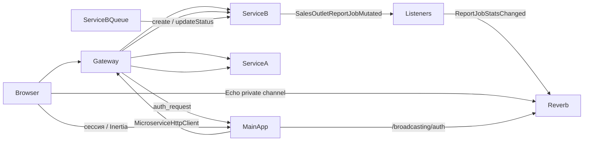

# exampleProjectSail

Монорепозиторий с несколькими Laravel-сервисами и единым Nginx/OpenResty gateway. Основной сценарий запуска — через корневой `docker-compose.yml`.

## Состав проекта

| Каталог / файл | Назначение |
|---|---|
| `main-app` | Основное Laravel-приложение: Laravel 13, Breeze, Inertia/Vue, Tailwind CSS, Passport, Laravel Reverb (Echo), веб-авторизация и проверка токенов для gateway |
| `service-a` | Laravel API: торговые точки (`/api/sales-outlets`), ping-эндпоинты |
| `service-b` | Laravel API: единый Report API (Strategy: `csv_download`, `html_email`, `max_message`), очередь `BuildSalesOutletsReportJob`, REST-статистика и live-updates в Reverb через domain events + listeners |
| `service-b-queue` | Worker очереди `service-b` (`queue:work`) для фоновых отчётов |
| `reverb` | WebSocket-сервер Laravel Reverb (образ `main-app`), порт `8090` |
| `shared/sales-outlets-domain` | Локальный Composer-пакет с общей доменной частью торговых точек |
| `nginx-gateway` | Единая точка входа: проксирование, `auth_request`, CORS для `/api/a/` и `/api/b/` |
| `docker-compose.yml` | Основной compose-файл для локального запуска |
| `docker-compose.ci.yml` | Overlay для CI: внутренний MySQL и `depends_on` с healthcheck |
| `scripts/test-services.sh` | Единый сценарий подготовки тестовой БД и запуска тестов всех сервисов |
| `scripts/e2e-verify-report-stats.cjs` | E2E-проверка: два WebSocket-клиента + REST статистики отчётов |
| `.github/workflows/ci.yml` | CI: Pint, сборка frontend, Docker-тесты |
| `.github/workflows/deploy.yml` | CD: деплой на VPS по SSH |
| `main-app/compose.yaml` | Отдельный Laravel Sail compose для изолированного запуска `main-app`; для общего запуска обычно не используется |

## Архитектура запросов



- **Торговые точки (CRUD, фильтры):** браузер → `VITE_GATEWAY_ORIGIN` → `service-a` (Bearer + CORS на gateway).
- **Экспорт, почта, MAX, статистика отчётов:** браузер → `main-app` (web-сессия, `auth.passport`) → gateway → `service-b` (`MicroserviceHttpClient`).
- **Live-статистика отчётов:** после мутации задачи `service-b` диспатчит `SalesOutletReportJobMutated` → listener `BroadcastReportJobStatsOnJobMutation` → broadcast `ReportJobStatsChanged` в Reverb; `main-app` подписывается через Laravel Echo на private-канал `report-jobs.stats` (авторизация — `POST /broadcasting/auth`).

## Требования

- Docker и Docker Compose.
- PHP **8.3+** в контейнерах (CI — PHP 8.4).
- WSL/Linux shell или PowerShell с доступом к Docker.
- Внешний MySQL, доступный контейнерам (для локальной разработки).

Локальный PowerShell может не видеть `php`, поэтому PHP/Artisan/Composer/npm-команды выполняйте внутри контейнеров через `docker compose exec` или через WSL.

## Первый запуск

### 1. Настройка MySQL

В корневом `docker-compose.yml` для `main-app` уже задано подключение к MySQL на хосте:

```env
DB_CONNECTION=mysql
DB_HOST=host.docker.internal
DB_PORT=3306
```

Для `service-b` и `service-b-queue` подключение задаётся через переменные окружения с дефолтами:

```env
SERVICE_B_DB_HOST=host.docker.internal
SERVICE_B_DB_PORT=3306
SERVICE_B_DB_DATABASE=sail_db
SERVICE_B_DB_USERNAME=root
SERVICE_B_DB_PASSWORD=<your-local-password>
```

Для `service-a` задайте `DB_*` через `environment` в `docker-compose.yml` или через `.env` сервиса. Если сервисы используют разные базы, создайте их заранее во внешнем MySQL.

Стандартные `.env.example` у сервисов по умолчанию настроены на SQLite — для Docker-запуска через корневой compose их нужно перевести на MySQL.

### 2. Сборка и запуск

```bash
docker compose up -d --build
```

Поднимаются `main-app`, `service-a`, `service-b`, `service-b-queue`, `reverb`, `redis`, `mailhog`, `gateway`.

### 3. Ключи приложений

`main-app` создаёт `.env` из `.env.example` при сборке образа; при старте `entrypoint.sh` генерирует `APP_KEY` и Passport-ключи, если они отсутствуют.

Для `service-a` и `service-b` при пустом `.env`:

```bash
docker compose exec service-a php artisan key:generate
docker compose exec service-b php artisan key:generate
```

### 4. Миграции

Миграции затрагивают базы сервисов. Перед запуском проверьте `.env` / `environment` и убедитесь, что команда выполняется для нужной БД.

```bash
docker compose exec main-app php artisan migrate
docker compose exec service-a php artisan migrate
docker compose exec service-b php artisan migrate
```

Для отчётов `service-b` нужны worker и Reverb (в compose уже описаны):

```bash
docker compose up -d service-b-queue reverb
```

Письма `html_email` в dev перехватывает MailHog (`http://localhost:8025`). Отчёты `max_message` уходят в [MAX Bot API](https://dev.max.ru/docs-api) — токен и получатели только в `.env` `service-b` (см. [service-b/README.md](service-b/README.md)).

## Запуск и обслуживание

Обычный запуск после первичной настройки:

```bash
docker compose up -d
```

Запуск с пересборкой образов:

```bash
docker compose up -d --build
```

Просмотр логов:

```bash
docker compose logs -f
docker compose logs -f main-app
docker compose logs -f service-a
docker compose logs -f service-b
docker compose logs -f service-b-queue
docker compose logs -f reverb
docker compose logs -f gateway
```

Остановка:

```bash
docker compose down
```

Пересборка одного сервиса:

```bash
docker compose build main-app
docker compose up -d main-app
```

## Адреса

| Сервис | URL |
|---|---|
| Gateway | `http://localhost:8080` |
| `main-app` напрямую | `http://localhost` (порт `MAIN_APP_PORT`, по умолчанию `80`) |
| `service-a` напрямую | `http://localhost:8081` |
| `service-b` напрямую | `http://localhost:8082` |
| Laravel Reverb (WebSocket) | `ws://localhost:8090` (порт `REVERB_EXTERNAL_PORT`) |
| Vite dev server | `http://localhost:5173` |
| MailHog | `http://localhost:8025` |
| Redis | `localhost:6379` |

Через gateway:

- `main-app`: `http://localhost:8080/`
- `service-a`: `http://localhost:8080/api/a/...`
- `service-b`: `http://localhost:8080/api/b/...`

Gateway переписывает префиксы `/api/a/` и `/api/b/` в `/api/` перед проксированием в соответствующий сервис.

Для `/api/a/...` и `/api/b/...` в gateway настроен CORS:

- `OPTIONS` preflight обрабатывается на стороне `nginx-gateway` и возвращает `204`.
- Разрешены методы `GET, POST, PUT, PATCH, DELETE, OPTIONS`.
- Разрешены заголовки `Authorization, Content-Type, Accept`.
- `Access-Control-Allow-Origin` берётся из `$http_origin`, заголовок `Vary: Origin` добавляется всегда.
- CORS-заголовки от backend-сервисов скрываются через `proxy_hide_header`, чтобы gateway был единственной точкой управления CORS.

Браузерные запросы к `service-a` из Vue идут напрямую через gateway, например:

```text
PATCH ${VITE_GATEWAY_ORIGIN}/api/a/sales-outlets/{rowId}
POST  ${VITE_GATEWAY_ORIGIN}/api/a/sales-outlets/{rowId}/head-organization
```

Эти вызовы не проходят через Laravel-контроллеры `main-app`: браузер обращается к `service-a` через `nginx-gateway`, поэтому preflight и заголовок `Authorization` должны корректно обрабатываться gateway.

## Основные маршруты

### `main-app`

Web (Inertia):

| Метод | Путь | Описание |
|---|---|---|
| `GET` | `/` | Стартовая страница |
| `GET` | `/dashboard` | Dashboard после web-авторизации |
| `GET` | `/objects-sales-outlets` | Страница объектов торговых точек |
| `GET` | `/objects-sales-outlets-2` | Альтернативная тёмная страница (экспорт, почта, MAX, live-статистика) |
| `POST` | `/objects-sales-outlets-2/export` | Создание CSV-экспорта (прокси в `service-b`) |
| `GET` | `/objects-sales-outlets-2/export/{uuid}` | Статус экспорта |
| `GET` | `/objects-sales-outlets-2/export/{uuid}/download` | Скачивание экспорта |
| `POST` | `/objects-sales-outlets-2/mail` | Создание отчёта на email |
| `GET` | `/objects-sales-outlets-2/mail/{uuid}` | Статус email-отчёта |
| `POST` | `/objects-sales-outlets-2/max` | Создание отчёта в MAX (`report_type=max_message`) |
| `GET` | `/objects-sales-outlets-2/max/{uuid}` | Статус отчёта в MAX |
| `GET` | `/objects-sales-outlets-2/reports/stats` | Агрегированная статистика задач отчётов |
| `GET` | `/get-api-token` | Passport-токен из сессии |
| `GET/PATCH/DELETE` | `/profile` | Профиль пользователя (Breeze) |

Страницы объектов и профиля защищены middleware `auth.passport`: для web-запросов токен берётся из сессии, при отсутствии — редирект на login.

API:

| Метод | Путь | Описание |
|---|---|---|
| `GET\|POST` | `/api/auth/verify` | Проверка Bearer-токена для gateway (`X-User-Id`) |
| `POST` | `/api/auth/check` | Внутренняя проверка токена (исключена из CSRF) |

Broadcasting (web + `AuthenticateBroadcastingPassport`):

| Метод | Путь | Описание |
|---|---|---|
| `POST` | `/broadcasting/auth` | Авторизация подписки Echo на `private-report-jobs.stats` |

### `service-a`

Напрямую (`/api/...`):

| Метод | Путь | Auth |
|---|---|---|
| `GET` | `/pingS` | — |
| `POST` | `/ping` | — |
| `GET` | `/sales-outlets` | `trust.gateway` |
| `PATCH` | `/sales-outlets/{salesOutlet}` | `trust.gateway` |
| `POST` | `/sales-outlets/{salesOutlet}/head-organization` | `trust.gateway` |
| `DELETE` | `/sales-outlets/{salesOutlet}` | `trust.gateway` |

Через gateway — те же маршруты с префиксом `/api/a`, например `GET /api/a/sales-outlets`.

### `service-b`

Напрямую (`/api/...`):

| Метод | Путь | Auth |
|---|---|---|
| `GET` | `/data` | `trust.gateway` (только `local` / `testing`) |
| `GET` | `/sales-outlets/reports/stats` | `trust.gateway` |
| `POST` | `/sales-outlets/reports` | `trust.gateway` |
| `GET` | `/sales-outlets/reports/{uuid}` | `trust.gateway` |
| `GET` | `/sales-outlets/reports/{uuid}/download` | `trust.gateway` |

Через gateway — префикс `/api/b`, например `POST /api/b/sales-outlets/reports`.

Тело `POST /sales-outlets/reports` включает `report_type`:

- `csv_download` — CSV-файл для скачивания;
- `html_email` — HTML-отчёт на email (в dev — MailHog);
- `max_message` — HTML-таблица в мессенджер MAX ([POST /messages](https://dev.max.ru/docs-api/methods/POST/messages), лимит текста 4000 символов).

Ответ `GET /sales-outlets/reports/stats` — JSON с полями `by_type` (счётчики `pending`, `processing`, `completed`, `failed`, `total` по каждому типу, включая `max_message`) и `generated_at`.

### Live-статистика отчётов: термины и поток

| Термин | Значение |
|---|---|
| **snapshot** | Начальный REST-снимок статистики (`by_type`, `generated_at`) |
| **broadcast** | Публикация в Reverb после мутации задачи: `SalesOutletReportJobMutated` → listener → `ReportJobStatsChanged` |
| **channel** | Private-канал `report-jobs.stats` (`Echo.private('report-jobs.stats')`, wire-имя `private-report-jobs.stats`) |
| **event** | Broadcast-событие `ReportJobStatsChanged` (в Echo слушается как `.ReportJobStatsChanged`) |
| **payload** | JSON с полями `by_type` и `generated_at` — одинаковый формат для snapshot и event |

**Backend (`service-b`):**

Цепочка из трёх уровней (persistence не вызывает Reverb напрямую):

```text
EloquentSalesOutletsReportJobRepository (create / updateStatus)
    → SalesOutletReportJobMutated
        → BroadcastReportJobStatsOnJobMutation → ReportJobStatsChanged → Reverb
        → LogSalesOutletReportJobMutation → PSR-3 log (audit)
```

- после `create()` / `updateStatus()` репозиторий диспатчит domain event `SalesOutletReportJobMutated` через `EventDispatcherInterface`;
- `BroadcastReportJobStatsOnJobMutation` вызывает `SalesOutletsReportStatsBroadcaster::broadcastCurrentStats()`;
- broadcaster собирает payload через `SalesOutletsReportStatsRepositoryInterface::aggregate()` и диспатчит `ReportJobStatsChanged` в `PrivateChannel('report-jobs.stats')`;
- `findByUuid()` событие **не** диспатчит — только мутации.

Ключевые файлы: `service-b/app/Events/SalesOutletReportJobMutated.php`, `app/Listeners/BroadcastReportJobStatsOnJobMutation.php`, `app/Repositories/SalesOutlets/EloquentSalesOutletsReportStatsRepository.php`.

Подробнее (Strategy, контракты, расширение через listeners): [service-b/README.md](service-b/README.md).

**Frontend (`main-app`, страница `/objects-sales-outlets-2`):**

1. Загружается **snapshot**: `GET /objects-sales-outlets-2/reports/stats` → прокси в `service-b` (`/api/b/sales-outlets/reports/stats`).
2. Подписка на **channel** через Laravel Echo: `Echo.private('report-jobs.stats')`, авторизация — `POST /broadcasting/auth`.
3. При создании/смене статуса задачи `service-b` отправляет **broadcast** **event** `ReportJobStatsChanged`.
4. Composable `useReportJobStats` (`resources/js/Composables/useReportJobStats.js`) получает **event** и применяет **payload** к UI без перезагрузки страницы (типы: CSV, Почта, MAX).
5. Кнопка **«Отправить в MAX»** в `DarkSalesOutletsToolbar` → `POST /objects-sales-outlets-2/max` с теми же фильтрами/колонками, что у экспорта и почты; статус — polling `GET /objects-sales-outlets-2/max/{uuid}` каждые 2 с; при `failed` показывается `error_message` из API (без технических деталей токена).

## Авторизация через gateway

`nginx-gateway` использует `auth_request /auth-internal` и проверяет Bearer-токен через endpoint `main-app`:

```text
/api/auth/verify
```

`main-app` разбирает JWT Passport-токен, ищет его по `jti` в таблице Passport-токенов и возвращает заголовок `X-User-Id` при успешной проверке. Gateway передаёт этот заголовок дальше в сервисы.

Результаты успешной проверки кэшируются в nginx на 60 секунд (`proxy_cache auth_cache`). Заголовок ответа `X-Auth-Cache` показывает статус кэша (`HIT`, `MISS`, `BYPASS`).

Открытые маршруты gateway (без `auth_request`):

- `/login`
- `/register`
- `/oauth/token`

Остальные маршруты через gateway, включая `/`, `/api/a/...` и `/api/b/...`, требуют:

```http
Authorization: Bearer <token>
```

В `main-app` после web-login создаётся Passport-токен и сохраняется в сессии. Текущий токен:

```text
GET /get-api-token
```

`service-a` и `service-b` доверяют gateway через middleware `trust.gateway`: сервисы ожидают заголовок `X-User-Id`, который gateway получает от `main-app` после проверки токена.

Серверные вызовы из `main-app` в микросервисы идут на `http://gateway/api/a` и `http://gateway/api/b` (см. `config/services.php`), с Bearer-токеном и при необходимости `X-User-Id`.

## Frontend `main-app`

`main-app` использует Breeze UI на Inertia/Vue, Vite, Tailwind CSS и Laravel Echo (Reverb).

Команды frontend запускайте внутри контейнера `main-app`:

```bash
docker compose exec main-app npm install
docker compose exec main-app npm run dev
```

Production-сборка:

```bash
docker compose exec main-app npm install
docker compose exec main-app npm run build
```

Порт Vite `5173` проброшен в `docker-compose.yml`. В `main-app/.env.example`:

```env
VITE_DEV_SERVER_URL=http://localhost:5173
VITE_GATEWAY_ORIGIN=http://localhost:8080
VITE_REVERB_APP_KEY=local-app-key
VITE_REVERB_HOST=localhost
VITE_REVERB_PORT=8090
VITE_REVERB_SCHEME=http
```

HTTP-вызовы к `service-a` из Vue идут через `VITE_GATEWAY_ORIGIN` (см. `main-app/resources/js/Services/salesOutlets.js`).

Live-статистика на странице `/objects-sales-outlets-2` реализована в `useReportJobStats` (см. раздел **Live-статистика отчётов** выше и [service-b/README.md](service-b/README.md)).

### Диагностика live-статистики

| Симптом | Что проверить |
|---|---|
| Snapshot не загружается | Авторизация в `main-app`; `service-b` доступен; `GET /objects-sales-outlets-2/reports/stats` возвращает `200` |
| Snapshot есть, live-обновлений нет | Контейнеры `reverb` и `service-b-queue` запущены; в `service-b` — `BROADCAST_CONNECTION=reverb` |
| Echo не инициализируется | В `main-app/.env` задан `VITE_REVERB_APP_KEY`; после изменения `.env` — пересборка frontend (`npm run dev` / `npm run build`) |
| WebSocket не подключается | `VITE_REVERB_HOST=localhost`, `VITE_REVERB_PORT=8090`; порт `8090` проброшен (`REVERB_EXTERNAL_PORT`) |
| Подписка на channel отклоняется | `POST /broadcasting/auth` возвращает `200`; пользователь авторизован (web-сессия + Passport) |
| Event не приходит после экспорта | Работает `service-b-queue`; статус задачи меняется (`pending` → `processing` → `completed` / `failed`) |

Быстрая проверка инфраструктуры:

```bash
docker compose up -d reverb service-b service-b-queue
docker compose logs -f reverb service-b service-b-queue
```

E2E-проверка двух WebSocket-клиентов: раздел **E2E: статистика отчётов и WebSocket** ниже.

## Shared domain package

`shared/sales-outlets-domain` — локальный Composer-пакет `example/sales-outlets-domain` с namespace `Shared\SalesOutletsDomain\`. Содержит общие для `service-a` и `service-b` примитивы:

- enum `SalesOutletStatus`, `HeadOrganizationType`;
- DTO `SalesOutletRowDto`, `SalesOutletFilterDto`;
- метаданные колонок `SalesOutletColumns`;
- composable query-filters (`AbstractFilter/QueryFilters/*`);
- `SalesOutletQueryFilter`, `SalesOutletFilterFactory`, `FilterQuerySalesOutletComposite`.

Пакет подключён в `service-a/composer.json` и `service-b/composer.json` через Composer `path` repository. В Docker каталог `shared` монтируется в `/var/www/shared`.

```json
{
  "type": "path",
  "url": "../shared/sales-outlets-domain",
  "options": {
    "symlink": true
  }
}
```

После изменений в пакете:

```bash
docker compose exec service-a composer dump-autoload
docker compose exec service-b composer dump-autoload
```

При изменении версии или зависимостей:

```bash
docker compose exec service-a composer update example/sales-outlets-domain
docker compose exec service-b composer update example/sales-outlets-domain
```

Eloquent-модели, контроллеры, FormRequest, Report API (Strategy, jobs, domain/broadcast events) и миграции остаются внутри конкретных Laravel-сервисов.

## Полезные команды

Список маршрутов:

```bash
docker compose exec main-app php artisan route:list
docker compose exec service-a php artisan route:list
docker compose exec service-b php artisan route:list
```

Очистка кеша Laravel:

```bash
docker compose exec main-app php artisan optimize:clear
docker compose exec service-a php artisan optimize:clear
docker compose exec service-b php artisan optimize:clear
docker compose exec service-b-queue php artisan optimize:clear
docker compose up -d --force-recreate service-b-queue
```

Запуск тестов одного сервиса:

```bash
docker compose exec main-app php artisan test
docker compose exec service-a php artisan test
docker compose exec service-b php artisan test
```

## E2E: статистика отчётов и WebSocket

Скрипт `scripts/e2e-verify-report-stats.cjs` проверяет, что два независимых WebSocket-клиента получают одинаковые события `ReportJobStatsChanged`, пока `service-b-queue` обрабатывает CSV- и email-отчёты.

Предварительно: запущен compose, есть пользователь с Passport-токеном, работают `reverb` и `service-b-queue`.

```bash
# из корня репозитория; pusher-js берётся из main-app/node_modules
export TOKEN="<passport-bearer-token>"
export AUTH_BASE_URL=http://localhost
export MAIN_APP_URL=http://localhost
export SERVICE_B_URL=http://localhost:8082
export REVERB_HOST=localhost
export REVERB_PORT=8090

node scripts/e2e-verify-report-stats.cjs
```

## CI

Workflow `.github/workflows/ci.yml` запускается на `push` и `pull_request`.

| Job | Что проверяет |
|---|---|
| `php-style` | Laravel Pint (`--test`) для `main-app`, `service-a`, `service-b` (PHP 8.4) |
| `frontend-build` | `npm ci` + `npm run build` в `main-app` (Node 22) |
| `backend-tests` | Docker Compose с overlay `docker-compose.ci.yml`, внутренний MySQL, `composer install` в `service-a`/`service-b`, затем `./scripts/test-services.sh all` |

Локально воспроизвести CI-контур тестов:

```bash
export COMPOSE_FILE=docker-compose.yml:docker-compose.ci.yml
export TEST_DB_PASSWORD=12345678
export TEST_DB_HOST=mysql
export SERVICE_B_DB_HOST=mysql
export SERVICE_B_DB_DATABASE=sail_db_testing
export SERVICE_B_DB_PASSWORD=12345678

docker compose build main-app service-a service-b
docker compose run --rm --no-deps service-a composer install --no-interaction --prefer-dist --no-progress
docker compose run --rm --no-deps service-b composer install --no-interaction --prefer-dist --no-progress
docker compose up -d mysql redis main-app service-a service-b
./scripts/test-services.sh all
```

## CD (деплой на VPS)

Workflow `.github/workflows/deploy.yml` — ручной запуск `workflow_dispatch`.

| Параметр | Описание |
|---|---|
| `deploy_ref` | Ветка или тег для деплоя (по умолчанию `main`) |
| `run_migrations` | Запускать миграции после деплоя (`false` по умолчанию) |

Этапы:

1. **`deploy-via-ssh`** (окружение GitHub `production`) — `git checkout`, `docker compose build`, `docker compose up -d --remove-orphans`. При ошибке выполняется откат к предыдущему коммиту.
2. **`run-migrations`** (окружение `production-migrations`, только если `run_migrations=true`) — миграции во всех трёх сервисах через SSH.

### Обязательные GitHub Secrets

| Secret | Назначение |
|---|---|
| `DEPLOY_HOST` | Хост VPS |
| `DEPLOY_USER` | SSH-пользователь |
| `DEPLOY_PATH` | Путь к проекту на сервере |
| `DEPLOY_SSH_KEY` | Приватный SSH-ключ |

Опционально: `DEPLOY_PORT` (по умолчанию `22`).

Рекомендуется защитить окружения `production` и `production-migrations` правилами approval в GitHub.

## Единый тестовый контур

Скрипт `scripts/test-services.sh` работает через Docker Compose, пересоздаёт чистую БД `sail_db_testing`, затем применяет миграции в порядке `main-app` → `service-a` → `service-b`. В режиме `all` подготовка выполняется перед тестами каждого сервиса, потому что `RefreshDatabase` внутри тестов может менять схему общей тестовой БД.

Подготовить только тестовую БД:

```bash
./scripts/test-services.sh prepare
```

Подготовить БД и запустить все тесты:

```bash
./scripts/test-services.sh all
```

Подготовить БД и запустить тесты одного сервиса:

```bash
./scripts/test-services.sh main-app
./scripts/test-services.sh service-a
./scripts/test-services.sh service-b
```

Быстрый повторный запуск без пересоздания БД:

```bash
./scripts/test-services.sh service-a --no-prepare
```

Пароль задаётся в `.env.testing.local` (не коммитится в git):

```bash
TEST_DB_PASSWORD=<your-local-password>
```

Переопределение через переменные окружения:

```bash
TEST_DATABASE=sail_db_testing \
TEST_DB_HOST=host.docker.internal \
TEST_DB_PORT=3306 \
TEST_DB_USERNAME=root \
TEST_DB_PASSWORD=<your-local-password> \
./scripts/test-services.sh all
```

Для тестов используйте только базу `sail_db_testing` и убедитесь, что тестовое окружение не указывает на рабочую БД.

Миграции изменяют состояние базы данных — запускайте `prepare` и режимы без `--no-prepare` только после явного согласия на выполнение миграций.

## База данных

Внутренний MySQL-контейнер в `docker-compose.yml` закомментирован: локально проект использует внешний MySQL на хосте.

Для доступа с контейнеров используется `host.docker.internal` (пробрасывается через `extra_hosts: host-gateway` у `main-app`, `service-a`, `service-b`, `service-b-queue`).

В CI overlay `docker-compose.ci.yml` поднимает контейнер `mysql:8.0` внутри compose-сети.

## Примечания

- `main-app` — Nginx + PHP-FPM 8.4 Alpine + Supervisor, внутренний порт `8000`; для hot-reload смонтированы `app`, `routes`, `config`, `database`, `resources`, `tests`, `public`, `storage`.
- `service-a` — `php artisan serve` на порту `8000`, полный bind-mount каталога сервиса и `shared`.
- `service-b` — selective bind-mount (без перезаписи `vendor`); `service-b-queue` использует тот же образ; live-stats идут через domain event `SalesOutletReportJobMutated` и listeners; broadcast и очередь зависят от `reverb`, `redis`, `mailhog`.
- `reverb` — отдельный контейнер на базе образа `main-app`, порт `8090`; для браузера в `.env` указывайте `VITE_REVERB_HOST=localhost`, внутри сети Docker — `REVERB_HOST=reverb`.
- `nginx-gateway/auth.lua` не используется: `access_by_lua_file` в `nginx.conf` закомментирован.
- `PASSPORT_CLIENT_SECRET` в gateway нужен только при схеме OAuth client credentials на стороне gateway; для текущего `auth_request` secret не обязателен при первом запуске.
- Redis используется сервисами и Reverb; MailHog — для перехвата почты в dev (`html_email`); MAX — исходящий HTTPS из `service-b` к `platform-api.max.ru` (`max_message`).
