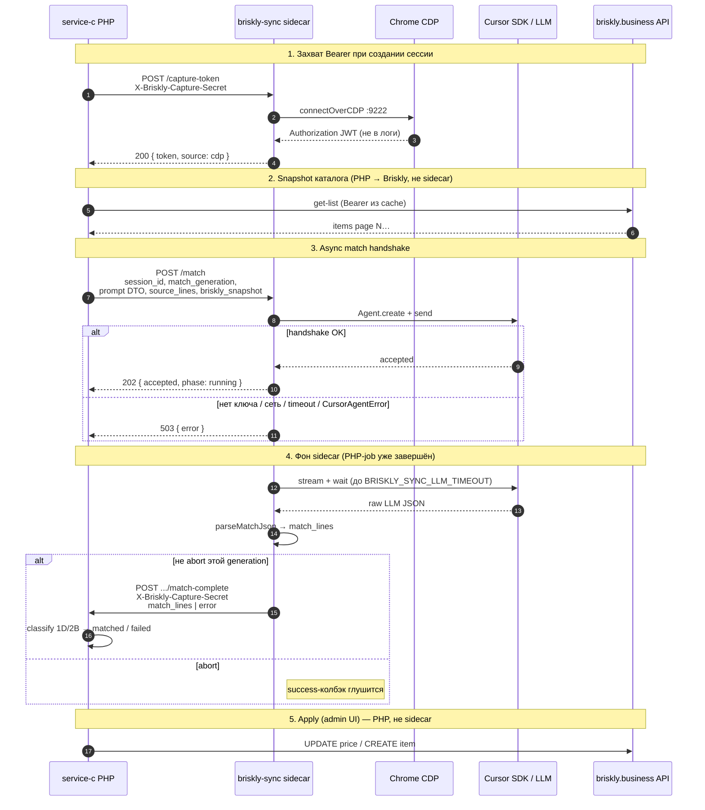
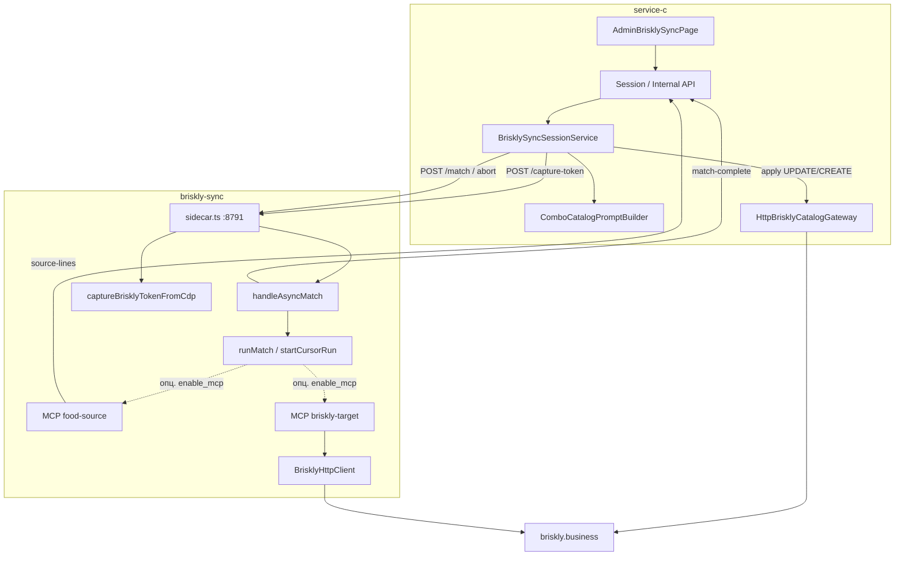

# briskly-sync

Node/TS пакет (Node ≥ 22.13): HTTP-клиент Briskly Business + MCP `food-source` / `briskly-target` + HTTP sidecar для PHP (`service-c`) с Cursor SDK match orchestrator.

См. также домен и UI: [service-c README → Синхронизация Briskly](../service-c/README.md#синхронизация-briskly).

## Возможности

- **HTTP sidecar** (`npm run sidecar`, порт `8791`): `POST /match`, `POST /match/abort`, `POST /capture-token`, `GET /health`
- **MCP `food-source`**: `list_source_lines` → HTTP к service-c admin source-lines
- **MCP `briskly-target`**: `list_items` / `get_item` / `update_item_price` / `list_categories` / `create_item`
- **Match**: `Agent.create` + `send` с промптом **только** из PHP `ComboCatalogPromptDto` (ENUM + PromptBuilder); Node не дублирует system-текст
- **Async handshake**: `POST /match` ждёт `create`+`send`, отвечает **202** `{ accepted, phase: "running" }`; `stream`/`wait` в фоне → `POST` колбэк PHP `match-complete`. `POST /match/abort` глушит success-колбэк (SDK cancel нет — агент может доработать)
- **Классификация 1D/2B**: в admin-потоке — на PHP после колбэка (`match_lines`); CLI `runMatch` классифицирует локально (`PriceDiffBuilder` + `VpsOnlyCreateBuilder`, cap 25, drop briskly-only)
- **Apply**: детерминированный CLI по approvals (без LLM); в admin UI apply делает PHP напрямую в Briskly API
- **CDP capture-token**: JWT из уже запущенного Chrome (`playwright-core` `connectOverCDP`)

## Схема взаимодействия с service-c



Компоненты пакета относительно PHP:



> Admin apply — только PHP gateway. `BrisklyHttpClient` в Node — CLI / MCP / `applyCli`.
## Структура пакета

```
briskly-sync/
├── src/
│   ├── http/                 # sidecar, handleAsyncMatch, postMatchComplete, abort registry
│   ├── orchestrator/         # runMatch, classify, prompt assert, parseMatchJson, MCP config
│   ├── tokenCapture/         # CDP capture + normalize/validate JWT
│   ├── client/               # BrisklyHttpClient, buildUpdate/CreatePayload, query
│   ├── mcp/                  # foodSource/, brisklyTarget/
│   └── cli/                  # match, apply, capture-token, brisklyClient
├── scripts/
│   ├── run-with-node22.sh    # обёртка engines.node
│   ├── start-chrome-cdp.ps1  # Windows: Chrome с --remote-debugging-port=9222
│   └── start-cdp-proxy.ps1   # Windows→WSL прокси CDP (порт 9223)
├── fixtures/                 # match-run.json, prompt-from-php.json
└── tests/                    # vitest (handshake, classify, client, MCP, token)
```

## Команды

```bash
npm test
npm run match -- --fixture fixtures/match-run.json
npm run apply -- …          # CLI apply по approvals
npm run mcp:food-source
npm run mcp:briskly-target
npm run sidecar
npm run capture-token
npm run capture-token -- --write-env
npm run cli                 # BrisklyHttpClient CLI
```

## Env

См. `.env.example`. Секреты не коммитить.

| Переменная | Назначение |
|---|---|
| `CURSOR_API_KEY` | Live match (Node ≥ 22.13 через `scripts/run-with-node22.sh` / `.nvmrc`; без `node:sqlite` — fallback `JsonlLocalAgentStore`) |
| `CURSOR_MODEL` | Модель Cursor (default `composer-2.5`) |
| `FOOD_SOURCE_BASE_URL` / `FOOD_SOURCE_AUTH_TOKEN` | MCP food-source → service-c |
| `BRISKLY_TOKEN` / `BRISKLY_BASE_URL` | CLI/MCP/apply (admin UI токен берёт через CDP, не из этого env) |
| `BRISKLY_SYNC_PORT` / `BRISKLY_SYNC_HOST` | Sidecar (default `8791` / `127.0.0.1`; для Docker PHP — `HOST=0.0.0.0`) |
| `BRISKLY_SYNC_ORCHESTRATOR_HANDSHAKE_TIMEOUT` | Handshake create+send → 202/503 (сек, default `60`) |
| `BRISKLY_SYNC_LLM_TIMEOUT` | Watchdog фона `wait` + PHP expire (сек, default `900`). **Не** на сокете PHP→sidecar после 202 |
| `BRISKLY_SYNC_CALLBACK_URL` | URL PHP `.../api/food/internal/briskly-sync/match-complete` **с хоста sidecar** (часто `http://127.0.0.1:8083/...`; не `host.docker.internal`) |
| `BRISKLY_CDP_URL` | CDP endpoint (default `http://127.0.0.1:9222`) |
| `BRISKLY_CDP_CAPTURE_TIMEOUT_MS` | Timeout наблюдения JWT (default `20000`) |
| `BRISKLY_SYNC_CAPTURE_SECRET` | Обязателен для `POST /capture-token` и колбэка match-complete |

PHP смотрит на sidecar через `BRISKLY_SYNC_ORCHESTRATOR_URL` (в Docker: `http://host.docker.internal:8791`). Feature-тесты PHP — БД `sail_db_testing`.

### Sidecar HTTP

| Метод | Путь | Поведение |
|---|---|---|
| `POST` | `/match` | Тело: `session_id`, `match_generation` (uuid), `prompt`, `source_lines`, `briskly_snapshot`; опц. `llm_response` (fixture), `enable_mcp`. После успешного `create`+`send` (или сразу для fixture) → **202** `{ accepted: true, phase: "running" }`. Нет ключа/сети/`CursorAgentError` / handshake timeout / нет callback URL или secret → **503**. Невалидное тело → **400**. Фон: stream+wait+parse → колбэк `match_lines` или `error`. |
| `POST` | `/match/abort` | `{ session_id, match_generation }` — глушит success-колбэк этой generation |
| `POST` | `/capture-token` | Header `X-Briskly-Capture-Secret` → JWT из CDP |
| `GET` | `/health` | `{ ok: true, service: "briskly-sync" }` |

Тесты handshake: `npm test -- --run tests/handleAsyncMatch.test.ts` (202 после mock `send`, 503 на throw/timeout, abort глушит callback).

## CDP capture-token

Захват Bearer JWT из **уже запущенного** Chrome через `playwright-core` (`chromium.connectOverCDP`). JWT в логи не пишется (только `token_len` / `captured`).

### 1. Chrome с remote debugging

**Windows (рекомендуется скрипт):**

```powershell
powershell -File briskly-sync\scripts\start-chrome-cdp.ps1
```

Скрипт останавливает текущий Chrome и поднимает профиль с `--remote-debugging-port=9222`. Дальше не стартовать Chrome обычным ярлыком. Открыть/восстановить вкладку Briskly `/items`, войти при необходимости.

Проверка: `http://127.0.0.1:9222/json/version`. CDP endpoint: `http://127.0.0.1:9222`.

**Вручную (отдельный user-data):**

```bat
"%ProgramFiles%\Google\Chrome\Application\chrome.exe" --remote-debugging-port=9222 --user-data-dir="%TEMP%\chrome-briskly-cdp" --no-first-run https://briskly.business/items
```

**WSL:** если Chrome на Windows, порт `9222` должен быть доступен из WSL. Иначе:

```powershell
powershell -File briskly-sync\scripts\start-cdp-proxy.ps1
```

В `.env`: `BRISKLY_CDP_URL=http://<IP-Windows>:9223`.

**Linux Chrome:**

```bash
google-chrome --remote-debugging-port=9222 --user-data-dir=/tmp/chrome-briskly-cdp
```

### 2. Sidecar endpoint

```bash
# в .env: BRISKLY_SYNC_CAPTURE_SECRET=...  (+ при необходимости BRISKLY_CDP_URL)
npm run sidecar
```

```bash
curl -sS -X POST "http://127.0.0.1:8791/capture-token" \
  -H "X-Briskly-Capture-Secret: $BRISKLY_SYNC_CAPTURE_SECRET"
```

Ответы:

- `200` `{ "token": "<jwt>", "source": "cdp" }`
- `503` `{ "error": "capture_disabled" }` — секрет не задан в env sidecar
- `401` `{ "error": "unauthorized" }` — нет / неверный заголовок
- `503`/`422` `{ "error": "cdp_unavailable" | "no_briskly_tab" | "not_logged_in" | "no_token_observed" | "timeout" }`

### 3. CLI (для CLI/MCP, не для admin UI)

```bash
npm run capture-token                 # JWT в stdout
npm run capture-token -- --write-env  # записать BRISKLY_TOKEN в .env пакета
```

## Fixture match

`fixtures/match-run.json` содержит `prompt` как из PHP PromptBuilder + `llm_response`.
Прогон без Cursor: `npm run match -- --fixture fixtures/match-run.json`.
