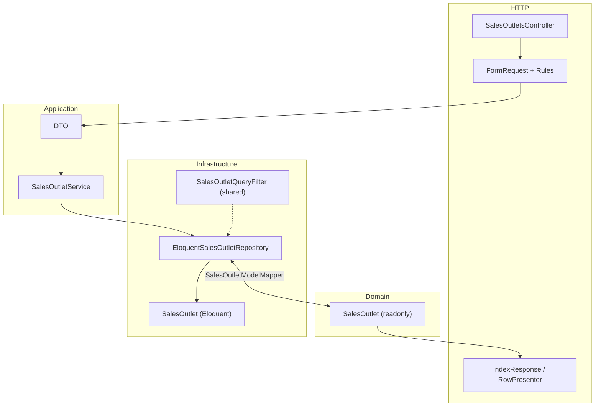
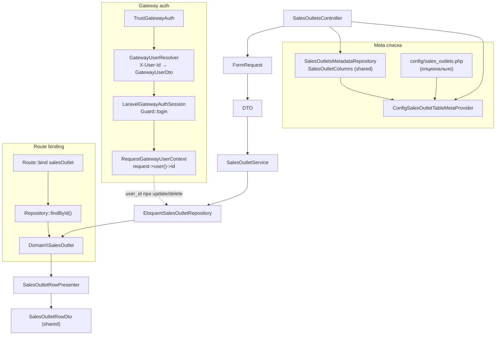

# service-a

Микросервис REST API для управления объектами продаж (торговые точки, Sales Outlets): список с фильтрацией и пагинацией, обновление строки, изменение головной организации, мягкое удаление.

**Связанные документы**

| Документ | Назначение |
|---|---|
| [корневой README](../README.md) | Docker Compose, gateway, авторизация Passport, CORS, общий тестовый контур |
| [service-b/README.md](../service-b/README.md) | Асинхронные отчёты (CSV, email, MAX) по тем же данным |
| [shared/sales-outlets-domain](../shared/sales-outlets-domain) | Общие enum, DTO строки, query-filters, метаданные колонок |

## Стек

| Компонент | Версия / примечание |
|---|---|
| PHP | ^8.3 (образ Docker — PHP 8.4-FPM) |
| Laravel | ^13 |
| БД (prod/dev через compose) | MySQL на `host.docker.internal` |
| БД (тесты) | `sail_db_testing` |
| Shared-пакет | `example/sales-outlets-domain` (Composer path) |

## Структура (ключевые каталоги)

```
service-a/
├── app/
│   ├── Contracts/
│   │   ├── Auth/                           # GatewayUserResolverInterface, GatewayAuthSessionInterface, GatewayUserContextInterface
│   │   ├── Repositories/SalesOutlets/      # SalesOutletRepositoryInterface, SalesOutletsMetadataRepositoryInterface
│   │   └── SalesOutlets/                   # SalesOutletServiceInterface, SalesOutletTableMetaProviderInterface
│   ├── Domain/SalesOutlets/                # SalesOutlet (readonly domain object)
│   ├── Presentation/SalesOutlets/            # SalesOutletRowPresenter (domain → shared SalesOutletRowDto)
│   ├── DTO/
│   │   ├── Auth/                           # GatewayUserDto
│   │   └── SalesOutlets/                   # IndexQuery, Update, HeadOrganization, Pagination, IndexResult
│   ├── Http/
│   │   ├── Controllers/Api/                # SalesOutletsController
│   │   ├── Middleware/                       # TrustGatewayAuth (alias trust.gateway)
│   │   ├── Requests/SalesOutlets/          # Index, Update, UpdateHeadOrganization (FormRequest → DTO)
│   │   └── Responses/                      # SalesOutletIndexResponse, GatewayUnauthorizedResponse
│   ├── Rules/SalesOutlets/                 # ValidRussianInn, ValidHeadOrganizationType, InAllowedSalesOutletColumn
│   ├── Models/                             # SalesOutlet (SoftDeletes), User
│   ├── Repositories/SalesOutlets/          # EloquentSalesOutletRepository, SalesOutletsMetadataRepository, SalesOutletModelMapper
│   └── Services/
│       ├── Auth/                           # EloquentGatewayUserResolver, LaravelGatewayAuthSession, RequestGatewayUserContext
│       └── SalesOutlets/                   # SalesOutletService, ConfigSalesOutletTableMetaProvider
├── config/
│   └── sales_outlets.php                   # опционально: UI-meta таблицы (width, align, cellType)
├── database/
│   ├── migrations/                         # sales_outlets (+ user_id, soft deletes)
│   └── seeders/SalesOutletSeeder.php
├── routes/api.php
├── Dockerfile                              # php artisan serve :8000
└── tests/
    ├── Feature/SalesOutletsApiTest.php
    └── Unit/Shared/SalesOutletsDomain/...
```

### Слои



- На границе service↔repository и в route binding используется `App\Domain\SalesOutlets\SalesOutlet`; Eloquent-модель остаётся только в репозитории.
- Контракты в `app/Contracts/` не импортируют `App\Models\*`.
- Валидация HTTP — в `FormRequest` и `Rules`; бизнес-данные передаются через DTO.
- Метаданные колонок — shared `SalesOutletColumns` через `SalesOutletsMetadataRepository`; UI-meta и `status_options` — через `SalesOutletTableMetaProviderInterface` и опциональный `config/sales_outlets.php`.

### Конфигурация (`config/sales_outlets.php`)

Файл **не обязателен**: при отсутствии `ConfigSalesOutletTableMetaProvider` использует значения по умолчанию (`columns_ui` — пустой массив, подпись «Все статусы»).

| Ключ | Описание |
|---|---|
| `columns_ui` | UI-настройки по `key` колонки: `width`, `align`, `cellType` (merge поверх shared `SalesOutletColumns`) |
| `status_options_all_label` | Подпись пункта «все статусы» в фильтре; env `SALES_OUTLETS_STATUS_OPTIONS_ALL_LABEL` (по умолчанию «Все статусы») |

Пример минимального конфига:

```php
<?php

return [
    'columns_ui' => [
        'shop' => ['width' => 150],
        'status_label' => ['cellType' => 'badge'],
    ],
    'status_options_all_label' => env('SALES_OUTLETS_STATUS_OPTIONS_ALL_LABEL', 'Все статусы'),
];
```

Контракты сервисов и репозиториев — только в `app/Contracts/` (не рядом с реализациями).

### DI (`AppServiceProvider`)

| Контракт | Реализация |
|---|---|
| `GatewayUserResolverInterface` | `EloquentGatewayUserResolver` |
| `GatewayAuthSessionInterface` | `LaravelGatewayAuthSession` |
| `GatewayUserContextInterface` | `RequestGatewayUserContext` |
| `SalesOutletsMetadataRepositoryInterface` | `SalesOutletsMetadataRepository` |
| `SalesOutletTableMetaProviderInterface` | `ConfigSalesOutletTableMetaProvider` |
| `SalesOutletServiceInterface` | `SalesOutletService` |
| `SalesOutletRepositoryInterface` | `EloquentSalesOutletRepository` |
| `SalesOutletQueryFilter` (shared) | singleton |

### Поток данных



## API

Маршруты объявлены в `routes/api.php` с префиксом `/api`.

Через **nginx-gateway** используется префикс `/api/a` (gateway переписывает в `/api`), например:

```text
GET  http://localhost:8080/api/a/sales-outlets
PATCH http://localhost:8080/api/a/sales-outlets/1001
```

Напрямую (порт `SERVICE_A_PORT`, по умолчанию `8081`):

```text
http://localhost:8081/api/...
```

### Sales Outlets (`middleware: trust.gateway`)

| Метод | Путь | Описание |
|---|---|---|
| `GET` | `/sales-outlets` | Список с meta (колонки, фильтры, пагинация, status_options) |
| `PATCH` | `/sales-outlets/{salesOutlet}` | Полное обновление строки |
| `POST` | `/sales-outlets/{salesOutlet}/head-organization` | Обновление головной организации и типа |
| `DELETE` | `/sales-outlets/{salesOutlet}` | Soft delete (`204 No Content`) |

`{salesOutlet}` — числовой `id`; custom route binding в `AppServiceProvider` загружает `Domain\SalesOutlet` через `SalesOutletRepositoryInterface::findById()` (404 для несуществующего или soft-deleted id).

### Авторизация

Сервис **не** проверяет JWT сам. Ожидается, что **nginx-gateway** уже выполнил `auth_request` к `main-app` (`/api/auth/verify`) и передал заголовок:

```http
X-User-Id: <numeric user id>
```

Middleware `TrustGatewayAuth` читает заголовок `X-User-Id`, находит пользователя через `GatewayUserResolverInterface` и выполняет `Guard::login` через `GatewayAuthSessionInterface`. При отсутствии или невалидном заголовке — `401` с телом `{"message": "Unauthorized gateway user."}` (`GatewayUnauthorizedResponse`).

Контекст для бизнес-логики читается через `GatewayUserContextInterface` (`RequestGatewayUserContext` → `$request->user()->id`); репозиторий при update и soft delete записывает `user_id` из этого контекста. Модель `SalesOutlet` не обращается к HTTP-запросу напрямую.

Для вызовов через gateway браузер передаёт `Authorization: Bearer <passport-token>`; gateway добавляет `X-User-Id`.
В тестах заголовок задаётся явно: `->withHeader('X-User-Id', '12345')`.

### CORS

**В самом `service-a` CORS для браузера не настраивается.** Laravel отдаёт только JSON API; заголовки `Access-Control-*` для фронтенда выставляет **nginx-gateway** в блоке `location /api/a/` (`nginx-gateway/nginx.conf`).

| Аспект | Поведение |
|---|---|
| Где работает CORS | Только при вызове через gateway: `http://localhost:8080/api/a/...` (или `VITE_GATEWAY_ORIGIN` в `main-app`) |
| Прямой доступ | `http://localhost:8081/api/...` — без CORS-заголовков gateway; для curl/Postman/PHPUnit это нормально |
| Preflight `OPTIONS` | Обрабатывается nginx, ответ **`204`**, до `service-a` запрос не доходит |
| `Access-Control-Allow-Origin` | Значение из заголовка `Origin` запроса (`$http_origin`) |
| `Vary` | `Origin` — для корректного кэширования ответов с разным origin |
| Разрешённые методы | `GET`, `POST`, `PUT`, `PATCH`, `DELETE`, `OPTIONS` |
| Разрешённые заголовки | `Authorization`, `Content-Type`, `Accept` |
| Preflight cache | `Access-Control-Max-Age: 86400` (сутки) |
| Ответы backend | Заголовки CORS от `service-a` снимаются (`proxy_hide_header`), чтобы не дублировать политику gateway |

Типичный сценарий из `main-app`: SPA на `http://localhost:8080` (или другой origin dev-сервера) шлёт `PATCH` / `POST` / `DELETE` на `${VITE_GATEWAY_ORIGIN}/api/a/sales-outlets/...` с `Authorization: Bearer <token>`. Браузер сначала может отправить preflight `OPTIONS` на тот же URL — его закрывает gateway, затем идёт основной запрос с проверкой токена (`auth_request` → `main-app` `/api/auth/verify`) и проксированием в `service-a` с `X-User-Id`.

Если при разработке фронтенда видны ошибки CORS:

1. Убедитесь, что API вызывается через **`/api/a/`**, а не напрямую на порт `8081`.
2. Проверьте, что `VITE_GATEWAY_ORIGIN` совпадает с origin страницы (схема + хост + порт).
3. Не добавляйте CORS в `service-a` без изменения gateway — иначе возможны конфликтующие заголовки (gateway их скрывает).

Подробнее о gateway и общей схеме: [корневой README — CORS](../README.md).

### `GET /sales-outlets` — query-параметры

Валидация — `IndexSalesOutletsRequest`; допустимые колонки для `sort`, `columns[]` и `column_filters` берутся из `SalesOutletsMetadataRepository` (shared `SalesOutletColumns`).

| Параметр | По умолчанию | Описание |
|---|---|---|
| `search` | `''` | Поиск по текстовым полям (shared filter) |
| `status` | `''` | Фильтр: `approved`, `review`, `blocked` или пусто (все) |
| `column_filters[column]` | — | Точечные фильтры по разрешённым колонкам |
| `sort` | `id` | Поле сортировки из whitelist колонок |
| `direction` | `asc` | `asc` или `desc` |
| `page` | `1` | Номер страницы (мин. 1) |
| `per_page` | `10` | Размер страницы (ограничение 5–50) |
| `columns[]` | все колонки | Подмножество колонок для выборки meta |

Пример:

```http
GET /api/sales-outlets?status=approved&search=Фермер&sort=shop&direction=desc&per_page=5&page=1
```

### Ответ списка

```json
{
  "data": [
    {
      "id": 1001,
      "shop": "Белгород",
      "status": "blocked",
      "status_label": "Есть изменения",
      "row_tone": "danger",
      "head_organization_type": "ip",
      "head_organization_type_label": "ИП",
      "user_id": 12345
    }
  ],
  "meta": {
    "columns": [ { "key": "shop", "label": "...", "width": 150 } ],
    "filters": { "search": "", "status": "", "column_filters": {}, "sort": "id", "direction": "asc", "page": 1, "per_page": 10, "columns": ["id", "shop", "..."] },
    "pagination": { "current_page": 1, "last_page": 1, "per_page": 10, "total": 8, "from": 1, "to": 8 },
    "status_options": [ { "value": "", "label": "Все статусы" }, { "value": "approved", "label": "Одобрено" } ]
  }
}
```

Строки таблицы формируются в presentation-слое: `SalesOutletRowPresenter::fromDomain()` → `Shared\SalesOutletsDomain\DTO\SalesOutletRowDto::toArray()` (в `SalesOutletIndexResponse` и контроллере мутаций). Meta колонок и `status_options` — через `ConfigSalesOutletTableMetaProvider` (данные колонок из shared `SalesOutletColumns`, UI-настройки — из `config/sales_outlets.php`).

### `PATCH /sales-outlets/{id}`

Валидация — `UpdateSalesOutletRequest` → `UpdateSalesOutletDto`.

Тело JSON (все поля обязательны):

| Поле | Правила |
|---|---|
| `shop`, `manager`, `curator`, `name`, `head_organization`, `organization_name` | `required`, `string`, `max:255` |
| `inn` | `required`, `ValidRussianInn` (10 или 12 цифр) |
| `head_organization_type` | `ValidHeadOrganizationType` — label (`ИП`, `ООО`, `АО`, `СПК`) или value (`ip`, `ooo`, `ao`, `spk`) |
| `status` | `approved`, `review`, `blocked` |

Ответ — объект строки (как элемент `data`), HTTP `200`.

### `POST /sales-outlets/{id}/head-organization`

Валидация — `UpdateHeadOrganizationRequest` → `UpdateHeadOrganizationDto`.

| Поле | Правила |
|---|---|
| `head_organization` | `required`, `string`, `max:255` |
| `head_organization_type` | `ValidHeadOrganizationType` (см. PATCH) |

### Статусы и типы головной организации (shared enum)

**Статус:** `approved` (Одобрено), `review` (На проверке), `blocked` (Есть изменения).

**Тип головной организации:** `ip`, `ooo`, `ao`, `spk`.

## База данных

Таблица `sales_outlets`:

- поля объекта: `shop`, `manager`, `curator`, `name`, `inn`, `head_organization`, `head_organization_type`, `organization_name`, `status`, `approved`;
- `user_id` — последний пользователь gateway, изменивший запись (записывается репозиторием при update и soft delete);
- `deleted_at` — soft delete.

Миграции:

1. `2026_05_20_000000_create_sales_outlets_table.php`
2. `2026_05_21_000000_add_user_id_and_soft_deletes_to_sales_outlets_table.php`

Сидер `SalesOutletSeeder` — 8 демо-записей с фиксированными `id` (1001–1008) для тестов и локальной разработки.

> Миграции в общем репозитории выполняются только после явного согласия (см. правило проекта). Команда из корневого README: `docker compose exec service-a php artisan migrate`.

## Shared-пакет `example/sales-outlets-domain`

Подключение в `composer.json`:

```json
{
  "type": "path",
  "url": "../shared/sales-outlets-domain",
  "options": { "symlink": true }
}
```

В Docker каталог `shared` монтируется в `/var/www/shared` (см. `docker-compose.yml`).

Используется в `service-a`:

- `Shared\SalesOutletsDomain\Enums\SalesOutletStatus`, `HeadOrganizationType`;
- `Shared\SalesOutletsDomain\DTO\SalesOutletRowDto`, `SalesOutletFilterDto`;
- `Shared\SalesOutletsDomain\Metadata\SalesOutletColumns`;
- `Shared\SalesOutletsDomain\Query\SalesOutletQueryFilter` (singleton в DI).

Enum и DTO строки — единый источник в shared-пакете; presentation-слой маппит domain object в shared `SalesOutletRowDto`.

После изменений в пакете:

```bash
docker compose exec service-a composer dump-autoload
# при изменении зависимостей:
docker compose exec service-a composer update example/sales-outlets-domain
```

## Запуск

### В составе монорепозитория (рекомендуется)

Из корня репозитория:

```bash
docker compose up -d --build
docker compose exec service-a php artisan key:generate   # если .env пустой
```

Переменные `DB_*` задайте в `service-a/.env` или раскомментируйте блок `environment` для `service-a` в `docker-compose.yml`. По умолчанию в `.env.example` указан SQLite — для Docker-стека нужен MySQL, как в [корневом README](../README.md).

| Параметр | Значение по умолчанию |
|---|---|
| Контейнер | `service-a` |
| Внутренний порт | `8000` (`php artisan serve`) |
| Публикация | `8081:8000` (`SERVICE_A_PORT`) |
| Gateway | `http://localhost:8080/api/a/...` |
| Xdebug | `xdebug.ini`, `PHP_IDE_CONFIG=serverName=service-a` |

### Локально (без Docker)

```bash
cd service-a
composer install
cp .env.example .env
php artisan key:generate
# настроить DB_* на MySQL
php artisan migrate
php artisan serve
```

Composer-скрипт `composer run dev` поднимает serve, queue, pail и Vite (для API обычно достаточно `php artisan serve`).

## Интеграция с `main-app`

Страницы `/objects-sales-outlets` и `/objects-sales-outlets-2` работают с `service-a` двумя способами:

| Сценарий | Кто вызывает | Маршрут |
|---|---|---|
| SSR-список при загрузке страницы | `main-app` → `SalesOutletsApiClient` → gateway → `service-a` | `GET /api/a/sales-outlets` |
| Inline-редактирование в браузере | Vue → `resources/js/Services/salesOutlets.js` → gateway | `PATCH`, `POST .../head-organization` |

Клиентские мутации (`updateSalesOutlet`, `updateHeadOrganization`) идут **только через gateway** (см. [CORS](#cors)) — `VITE_GATEWAY_ORIGIN` в `salesOutlets.js`:

```text
GET    ${VITE_GATEWAY_ORIGIN}/api/a/sales-outlets          # SSR через SalesOutletsApiClient
PATCH  ${VITE_GATEWAY_ORIGIN}/api/a/sales-outlets/{rowId}
POST   ${VITE_GATEWAY_ORIGIN}/api/a/sales-outlets/{rowId}/head-organization
```

Токен для gateway: `GET /get-api-token` в `main-app` после web-login (Passport).

Экспорт, почта, MAX и live-статистика отчётов идут через `service-b`, не через `service-a`.

## Тесты

PHPUnit настроен на MySQL `sail_db_testing` (`phpunit.xml`, `.env.testing`). Пароль — в `.env.testing` или `.env.testing.local` (не коммитится).

Из корня репозитория (подготовка БД + тесты):

```bash
./scripts/test-services.sh service-a
```

Только тесты без пересоздания БД:

```bash
./scripts/test-services.sh service-a --no-prepare
```

Внутри контейнера:

```bash
docker compose exec service-a php artisan test
```

Покрытие:

| Файл | Слой |
|---|---|
| `tests/Feature/SalesOutletsApiTest.php` | HTTP: 401 без `X-User-Id`, список, фильтры, сортировка, пагинация, update, head-organization, валидация, 404, soft delete, `user_id` |
| `tests/Unit/Shared/SalesOutletsDomain/` | Shared query-filters |

## Полезные команды

```bash
docker compose exec service-a php artisan route:list
docker compose exec service-a php artisan optimize:clear
docker compose logs -f service-a
```

## Лицензия

Код сервиса — MIT (как Laravel skeleton). Framework: [Laravel](https://laravel.com).
