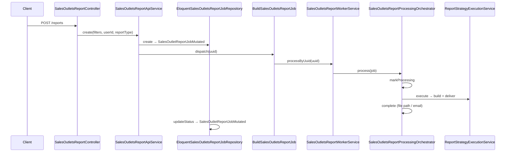

# service-b

Микросервис асинхронной генерации отчётов по объектам продаж (Sales Outlets). Поддерживает два типа отчётов:

- `csv_download` — формирует CSV-файл для скачивания;
- `html_email` — отправляет отчёт HTML-таблицей на email.

Связанные документы: [корневой README](../README.md) (Docker, gateway, Reverb, E2E), [service-b-reports-strategy](../.cursor/rules/service-b-reports-strategy.mdc) (зафиксированные решения Strategy).

## API

Все маршруты доступны под префиксом `/api` и защищены middleware `trust.gateway` (ожидается `X-User-Id` от `nginx-gateway`).

Через gateway используется префикс `/api/b`, например: `POST /api/b/sales-outlets/reports`.

| Метод | Путь | Контроллер | Описание |
|---|---|---|---|
| `GET` | `/data` | closure | Проверка gateway-авторизации (только `local` / `testing`) |
| `GET` | `/sales-outlets/reports/stats` | `SalesOutletsReportStatsController` | Агрегированная статистика задач по типам |
| `POST` | `/sales-outlets/reports` | `SalesOutletsReportController` | Создать асинхронную задачу (`202 Accepted`) |
| `GET` | `/sales-outlets/reports/{uuid}` | `SalesOutletsReportController` | Статус задачи |
| `GET` | `/sales-outlets/reports/{uuid}/download` | `SalesOutletsReportController` | Скачать CSV (`csv_download` только) |

`GET .../download`: `404` — задача не найдена или тип без download; `409` — файл ещё не готов (`status` не `completed`); `200` — streamed-ответ.

## Создание отчёта

```http
POST /api/sales-outlets/reports
X-User-Id: 123
Content-Type: application/json

{
  "report_type": "csv_download",
  "search": "Курск",
  "status": "approved",
  "column_filters": { "shop": "Курск" },
  "sort": "shop",
  "direction": "desc",
  "columns": ["id", "shop"]
}
```

`report_type`:

| Значение | Поведение |
|---|---|
| `csv_download` | Сохраняет CSV в файловом хранилище и делает доступным через `/download` |
| `html_email` | Отправляет HTML-таблицу по email получателям из конфигурации |

Ответ `202 Accepted`:

```json
{
  "uuid": "8d6e6f8c-2f5c-4eb9-9f46-f3f3fe28c500",
  "status": "pending",
  "report_type": "csv_download",
  "error_message": null
}
```

Возможные статусы задачи: `pending`, `processing`, `completed`, `failed`.

### Фильтры

| Поле | Описание |
|---|---|
| `search` | Поиск по строковым полям |
| `status` | Статус объекта (`approved`, `pending`, `rejected`) |
| `column_filters` | Фильтры по конкретным колонкам |
| `sort` / `direction` | Сортировка (`asc` / `desc`) |
| `columns` | Явный список колонок для отчёта |

## Статистика задач

Запрос:

```http
GET /api/sales-outlets/reports/stats
X-User-Id: 123
```

Ответ:

```json
{
  "by_type": {
    "csv_download": {
      "pending": 1,
      "processing": 0,
      "completed": 10,
      "failed": 2,
      "total": 13
    },
    "html_email": {
      "pending": 0,
      "processing": 1,
      "completed": 7,
      "failed": 0,
      "total": 8
    }
  },
  "generated_at": "2026-06-01T09:10:15+00:00"
}
```

### Live-статистика: термины, broadcast и фронтенд

| Термин | Значение |
|---|---|
| **snapshot** | Начальный REST-снимок статистики (`by_type`, `generated_at`) |
| **broadcast** | Reverb после мутации: `SalesOutletReportJobMutated` → listener → `ReportJobStatsChanged` |
| **channel** | Private-канал `report-jobs.stats` (`Echo.private('report-jobs.stats')`) |
| **event** | Broadcast-событие `ReportJobStatsChanged` (в Echo: `.ReportJobStatsChanged`) |
| **payload** | JSON с полями `by_type` и `generated_at` — одинаковый формат для snapshot и event |

Помимо REST (`GET /api/sales-outlets/reports/stats`), сервис публикует изменение агрегатов через broadcaster:

- `EloquentSalesOutletsReportJobRepository` после `create()` / `updateStatus()` диспатчит domain event `SalesOutletReportJobMutated`;
- listeners на `SalesOutletReportJobMutated`: `BroadcastReportJobStatsOnJobMutation` (live stats), `LogSalesOutletReportJobMutation` (audit log);
- broadcaster диспатчит **event** `ReportJobStatsChanged` через `EventDispatcherInterface` с **payload** из `SalesOutletsReportStatsRepositoryInterface::aggregate()`;
- событие публикуется в **channel** `PrivateChannel('report-jobs.stats')`.

Реализация в `service-b`:

- `app/Events/SalesOutletReportJobMutated.php`
- `app/Listeners/BroadcastReportJobStatsOnJobMutation.php`
- `app/Listeners/LogSalesOutletReportJobMutation.php`
- `app/Repositories/SalesOutlets/EloquentSalesOutletsReportJobRepository.php`
- `app/Repositories/SalesOutlets/EloquentSalesOutletsReportStatsRepository.php`
- `app/Services/SalesOutlets/SalesOutletsReportStatsBroadcaster.php`
- `app/Events/ReportJobStatsChanged.php`

**Как статистика доходит до фронтенда** (через `main-app`):

1. Загружается **snapshot**: `GET /objects-sales-outlets-2/reports/stats` → прокси в `/api/sales-outlets/reports/stats`.
2. Подписка на **channel** `report-jobs.stats` через Laravel Echo/Reverb; авторизация — `POST /broadcasting/auth`.
3. При `create` / `updateStatus` `service-b` отправляет **broadcast** **event** `ReportJobStatsChanged`.
4. `useReportJobStats` (`resources/js/Composables/useReportJobStats.js`) применяет **payload** к UI без перезагрузки страницы.

Файлы `main-app`: `resources/js/bootstrap.js`, `app/Http/Controllers/ObjectsSalesOutletsController.php`.

Диагностика live-статистики — в [корневом README.md](../README.md) (раздел **Диагностика live-статистики**).

### Domain events и listeners

Live-stats обновляются через domain event: persistence не вызывает broadcast напрямую, а диспатчит событие; реакции подключаются listener'ами. Цепочка из трёх уровней:

```
EloquentSalesOutletsReportJobRepository
    → SalesOutletReportJobMutated          (domain event: «job изменился»)
        → BroadcastReportJobStatsOnJobMutation   → ReportJobStatsChanged → Reverb
        → LogSalesOutletReportJobMutation          → PSR-3 log (audit)
```

| Уровень | Класс | Ответственность |
|---|---|---|
| Persistence | `EloquentSalesOutletsReportJobRepository` | Запись в БД + dispatch `SalesOutletReportJobMutated` |
| Реакция | `app/Listeners/*` | Побочные эффекты **без** правки репозитория и processor |
| Transport | `ReportJobStatsChanged` | Готовый snapshot для WebSocket (Echo/Reverb) |

**Почему так (SOLID):**

- **SRP** — репозиторий только сохраняет; broadcast и лог — отдельные listener'ы.
- **OCP** — новая реакция на мутацию = новый listener + `Event::listen`, без изменения API-сервиса, orchestrator, strategies и worker.
- **DIP** — репозиторий зависит от `EventDispatcherInterface`; listener broadcast — от `SalesOutletsReportStatsBroadcasterInterface`; audit log — от `Psr\Log\LoggerInterface`.

**Что не менялось для клиентов:** формат REST snapshot, канал `report-jobs.stats`, событие `.ReportJobStatsChanged`, payload `by_type` + `generated_at`.

**Важно при регистрации:** несколько listener'ов на одно событие регистрируются **отдельными** вызовами `Event::listen` (не массивом классов — иначе Laravel ожидает один invokable-listener):

```php
Event::listen(SalesOutletReportJobMutated::class, BroadcastReportJobStatsOnJobMutation::class);
Event::listen(SalesOutletReportJobMutated::class, LogSalesOutletReportJobMutation::class);
```

`findByUuid()` событие **не** диспатчит — только мутации (`create`, `updateStatus`).

#### Активные listeners

| Listener | Триггер | Действие |
|---|---|---|
| `BroadcastReportJobStatsOnJobMutation` | `SalesOutletReportJobMutated` | `aggregate()` из БД → broadcast `ReportJobStatsChanged` |
| `LogSalesOutletReportJobMutation` | то же | `LoggerInterface::info` с `uuid` (audit trail в логах) |

На один успешный CSV-job типично **3–4** mutation event (create → processing → completed) и столько же broadcast snapshot — осознанный компромисс «полный срез на каждое изменение».

#### Перспективы: куда наращивать через listeners

Тот же `SalesOutletReportJobMutated` — **единая точка расширения** для любых побочных эффектов после изменения задачи. Репозиторий и report pipeline трогать не нужно.

| Направление | Идея listener'а | Зависимости / примечания |
|---|---|---|
| **Debounce broadcast** | Coalesce нескольких мутаций одного job в один Reverb-push (500 ms / per-request) | Внутренний cache/queue; снижает нагрузку на Reverb и SQL `aggregate()` |
| **Метрики** | Счётчики Prometheus/OpenTelemetry: `report_jobs_mutated_total{status=...}` | `uuid` + повторный read status из репозитория или расширение payload события |
| **Audit в БД** | Запись в `report_job_audit_log` (who/when/uuid) | Отдельный repository; не смешивать с application log |
| **Уведомления** | Slack/Telegram при `failed` | Listener фильтрует по статусу после read job или слушает отдельное событие `SalesOutletReportJobFailed` (узче domain event) |
| **Cache invalidation** | Сброс Redis-ключа stats snapshot | Если REST stats начнут кешироваться |
| **Аналитика** | Отправка в очередь analytics (Segment, internal bus) | Async listener `ShouldQueue` |
| **Rate limiting / алерты** | Алерт при всплеске `failed` за минуту | Агрегация в listener + threshold |

**Когда выделять отдельное domain event** (вместо общего `SalesOutletReportJobMutated`):

- нужны **разные** listener'ы только на `failed` или только на `create` — например `SalesOutletReportJobFailed`, `SalesOutletReportJobCreated`;
- payload события должен нести `fromStatus` / `toStatus`, чтобы listener не ходил в БД повторно.

**Когда оставить один `SalesOutletReportJobMutated`:**

- все реакции одинаково актуальны на любую мутацию (как сейчас: full stats snapshot + log);
- минимум классов событий, один контракт «строка job изменилась».

#### Как добавить новый listener

1. Создать класс в `app/Listeners/` с методом `handle(SalesOutletReportJobMutated $event): void`.
2. Зависимости — только через constructor (контракты / `LoggerInterface`, не фасады в domain).
3. Зарегистрировать **отдельным** `Event::listen` в `AppServiceProvider::boot()`.
4. Unit-тест: mock зависимостей, один вызов `handle()`.
5. При необходимости — feature-тест с `Event::fake()` / проверкой побочного эффекта.

Пример каркаса:

```php
final class NotifyOnReportJobFailure
{
    public function __construct(
        private readonly SalesOutletsAsyncJobRepositoryInterface $jobs,
        private readonly NotificationSenderInterface $notifications,
    ) {}

    public function handle(SalesOutletReportJobMutated $event): void
    {
        $job = $this->jobs->findByUuid($event->uuid);

        if ($job?->status !== AsyncJobStatus::Failed) {
            return;
        }

        $this->notifications->sendReportFailed($job);
    }
}
```

Для тяжёлых операций реализуйте `Illuminate\Contracts\Queue\ShouldQueue` на listener'е — мутация в БД останется синхронной, реакция уйдёт в очередь `service-b-queue`.

См. также [.cursor/rules/service-b-reports-strategy.mdc](../.cursor/rules/service-b-reports-strategy.mdc) — зафиксированные решения по Strategy.

## Архитектура

Единый Report API построен на Strategy + узких контрактах (ISP/DIP). Legacy-слой Export/Mail удалён; все отчёты идут через `SalesOutletsReportController` и `BuildSalesOutletsReportJob`.

- Strategy-обработчики: `CsvDownloadReportStrategy`, `HtmlEmailReportStrategy`;
- Очередь: `BuildSalesOutletsReportJob` (контейнер `service-b-queue`, `php artisan queue:work`);
- Shared domain: `shared/sales-outlets-domain` (CSV writer, query filters);
- Хранилище задач: таблица `sales_outlet_report_jobs`, domain-модель `SalesOutletAsyncJob`;
- Live-stats: domain event `SalesOutletReportJobMutated` → listeners → `ReportJobStatsChanged` (см. раздел выше).

### Поток обработки задачи



При ошибке в очереди `SalesOutletsReportJobFailureHandler` помечает задачу `failed` (тоже мутация → broadcast stats).

### Слои и ключевые контракты

| Слой | Примеры | Контракты |
|---|---|---|
| HTTP | `SalesOutletsReportController`, `SalesOutletsReportStatsController`, `StoreSalesOutletReportRequest` | `SalesOutletsReportApiServiceInterface`, `SalesOutletsReportStatsRepositoryInterface` |
| Application | `SalesOutletsReportApiService`, `SalesOutletsReportDownloadService`, `SalesOutletsReportProcessingOrchestrator`, `ReportStrategyExecutionService`, `ReportJobLifecycleService` | `SalesOutletsReport*Interface`, `ReportJobLifecycleInterface`, `ReportStrategyExecutionInterface` |
| Worker | `BuildSalesOutletsReportJob`, `SalesOutletsReportWorkerService` | `SalesOutletsReportProcessorWorkerInterface`, `SalesOutletsReportJobFailureHandlerInterface` |
| Domain | `SalesOutletAsyncJob`, DTO, `AsyncJobStatus`, `SalesOutletsReportType` | — |
| Infra | `EloquentSalesOutletsReportJobRepository`, `EloquentSalesOutletsReportStatsRepository`, `LocalReportFileStorage`, listeners | `SalesOutletsAsyncJobRepositoryInterface`, `EventDispatcherInterface` |
| Integration | `ReportJobStatsChanged`, Reverb, Mailhog | Laravel broadcasting |

`SalesOutletsReportJobProcessor` — тонкая обёртка над orchestrator (точка входа для worker).

Ключевые контракты Strategy:

- `SalesOutletsReportProcessingStrategyInterface` — `build()` + `deliver()` → `ReportDeliveryResult`;
- `SalesOutletsDownloadableReportStrategyInterface` — marker для типов с `/download`;
- `SalesOutletsReportStrategyResolverInterface` — выбор стратегии по `report_type`;
- `SalesOutletsReportDownloadCapabilityInterface` — `supportsDownload()` для download-сервиса.

`SalesOutletsReportStrategyRegistry` — singleton с alias на resolver, capability и presentation (ISP: download-сервис не видит `resolve()`).

### Зафиксированные архитектурные решения

| Решение | Зачем |
|---|---|
| Orchestrator (lifecycle → strategy → completion) | SRP: processor/worker не содержат шагов pipeline |
| Strategy marker `SalesOutletsDownloadableReportStrategyInterface` | Download capability на уровне типа; orchestrator не ветвится по форматам |
| Triple-alias registry (resolver / capability / presentation) | ISP: download-сервис не видит `resolve()` |
| `ReportDeliveryResult` из `deliver()` | OCP доставки: file vs email без правок orchestrator |
| `SalesOutletReportJobMutated` + listeners | OCP побочных эффектов stats/log; persistence отделён от реакций |
| `EventDispatcherInterface` вместо `event()` в application | DIP для тестов и подмены bus |
| `SalesOutletsReportStatsRepositoryInterface` | REST stats и broadcast читают агрегаты через один контракт |
| Gateway auth через `GatewayUserResolverInterface` + DTO | `$request->user()` — реальный Eloquent `User` |

Не «упрощать» без явного запроса: объединять registry-интерфейсы, переносить `supportsDownload()` в orchestrator/processor, вшивать broadcast stats в репозиторий вместо listeners.

## Конфигурация

Основной файл: `config/sales_outlets_reports.php`.

| Секция | Ключ | Назначение |
|---|---|---|
| корень | `storage_disk` | Диск хранения CSV (`FILESYSTEM_DISK` / `SALES_OUTLETS_REPORTS_STORAGE_DISK`) |
| корень | `apply_fake_delay_environments` | Окружения с искусственной задержкой (`local`, `testing`) |
| `types.csv_download` | `fake_delay_seconds` | Задержка перед завершением CSV в dev |
| `types.html_email` | `recipients`, `subject`, `fake_delay_seconds` | Email-получатели, тема и задержка |

Переменные окружения:

| Переменная | Назначение |
|---|---|
| `SALES_OUTLETS_REPORTS_STORAGE_DISK` | Диск для CSV-файлов |
| `SALES_OUTLETS_EXPORT_STORAGE_DISK` | Legacy fallback для `storage_disk` |
| `SALES_OUTLETS_EXPORT_FAKE_DELAY_SECONDS` | Задержка `csv_download` |
| `SALES_OUTLETS_MAIL_RECIPIENTS` | Список через запятую |
| `SALES_OUTLETS_MAIL_SUBJECT` | Тема письма |
| `SALES_OUTLETS_MAIL_FAKE_DELAY_SECONDS` | Задержка `html_email` |
| `BROADCAST_CONNECTION=reverb` | Live-stats (обязательно в Docker) |
| `REVERB_HOST=reverb` | Внутри compose-сети (см. корневой `docker-compose.yml`) |
| `MAIL_HOST=mailhog` | SMTP для `html_email` в dev |

Для `html_email` в локальной среде используется Mailhog: `http://localhost:8025`.

## Пример: стратегия `xls_email` (XLS во вложении)

> **Важно:** это архитектурный пример расширения (roadmap/blueprint), а не описание текущего обязательного production-флоу.  
> Текущие рабочие типы отчётов в сервисе: `csv_download` и `html_email`.

Цель: новый тип отчёта без правок `SalesOutletsReportJobProcessor` (OCP) — только enum, стратегия, DI и узкие расширения mail-слоя.

| Отличие от `html_email` | `html_email` | `xls_email` |
|---|---|---|
| Тело письма | HTML-таблица с данными | Фиксированный сопроводительный текст |
| Данные отчёта | В теле | Во вложении `.xls` |
| Получатели / тема | `MailReportConfigProviderInterface` | **Тот же** провайдер (`types.html_email`) |
| Download API | Нет | Нет (без marker `SalesOutletsDownloadableReportStrategyInterface`) |

### 1. Тип отчёта

`app/Enums/SalesOutletsReportType.php`:

```php
case XlsEmail = 'xls_email';
```

Валидация `StoreSalesOutletReportRequest` подхватит значение через `Rule::enum` автоматически.

### 2. Генерация XLS

Контракт (например `app/Contracts/SalesOutlets/XlsReportWriterInterface.php`):

```php
interface XlsReportWriterInterface
{
    /**
     * @param  array<int, array{key: string, label: string}>  $columns
     * @param  iterable<int, array<string, mixed>>  $rows
     */
    public function writeToTempFile(array $columns, iterable $rows): string;
}
```

Реализация пишет файл в `storage/app/tmp/` и возвращает абсолютный путь. `build()` стратегии возвращает этот путь как `string` (соглашение для email-стратегий с вложением).

### 3. Стратегия

`app/Services/SalesOutlets/Reports/Strategies/XlsEmailReportStrategy.php` — по образцу `HtmlEmailReportStrategy`: trait `ResolvesSalesOutletsReportData`, те же зависимости для данных и почты:

```php
class XlsEmailReportStrategy implements SalesOutletsReportProcessingStrategyInterface
{
    use ResolvesSalesOutletsReportData;

    public function __construct(
        SalesOutletsDataRepositoryInterface $dataRepository,
        SalesOutletColumnSelector $columnSelector,
        private readonly XlsReportWriterInterface $xlsWriter,
        private readonly ReportMailSenderInterface $mailSender,
        private readonly MailReportConfigProviderInterface $mailReportConfig,
    ) {
        $this->dataRepository = $dataRepository;
        $this->columnSelector = $columnSelector;
    }

    public function reportType(): SalesOutletsReportType
    {
        return SalesOutletsReportType::XlsEmail;
    }

    public function build(SalesOutletReportContextDto $context): string
    {
        $columns = $this->resolveColumns($context);

        return $this->xlsWriter->writeToTempFile(
            $columns,
            $this->resolveRows($context, $columns),
        );
    }

    public function deliver(SalesOutletAsyncJob $job, string $content): ReportDeliveryResult
    {
        $config = $this->mailReportConfig->config(); // recipients + subject из types.html_email

        $this->mailSender->sendWithXlsAttachment(
            recipients: $config->recipients,
            subject: $config->subject,
            xlsPath: $content,
            attachmentName: 'objects-sales-outlets-'.$job->uuid.'.xls',
        );

        @unlink($content);

        return ReportDeliveryResult::none();
    }
}
```

Получатели и тема — через уже существующий `ConfigMailReportConfigProvider` (`SALES_OUTLETS_MAIL_RECIPIENTS`, `SALES_OUTLETS_MAIL_SUBJECT`). Отдельная секция конфига для адресов не нужна.

Опционально — задержка в local/testing:

```php
// config/sales_outlets_reports.php
'xls_email' => [
    'fake_delay_seconds' => (int) env('SALES_OUTLETS_MAIL_FAKE_DELAY_SECONDS', 10),
],
```

### 4. Письмо: сопроводительный текст + вложение

View `resources/views/mail/sales-outlets-xls-cover.blade.php`:

```blade
<p>Здравствуйте!</p>
<p>Во вложении отчёт по объектам продаж. Параметры выборки соответствуют запросу в системе.</p>
<p>С уважением,<br>{{ config('app.name') }}</p>
```

Mailable `app/Mail/SalesOutletsXlsReportMailable.php`:

```php
public function attachments(): array
{
    return [
        Attachment::fromPath($this->xlsPath)
            ->as($this->attachmentName)
            ->withMime('application/vnd.ms-excel'),
    ];
}

public function content(): Content
{
    return new Content(view: 'mail.sales-outlets-xls-cover');
}
```

Расширение sender (`ReportMailSenderInterface` + `LaravelReportMailSender`):

```php
public function sendWithXlsAttachment(
    array $recipients,
    string $subject,
    string $xlsPath,
    string $attachmentName,
): void {
    $this->mailer->to($recipients)->send(new SalesOutletsXlsReportMailable(
        subjectLine: $subject,
        xlsPath: $xlsPath,
        attachmentName: $attachmentName,
    ));
}
```

`HtmlEmailReportStrategy` и `SalesOutletsReportMailable` при этом **не меняются**.

### 5. Регистрация в DI

`AppServiceProvider`:

```php
$this->app->bind(XlsReportWriterInterface::class, PhpSpreadsheetXlsReportWriter::class);

$this->app->tag([
    CsvDownloadReportStrategy::class,
    HtmlEmailReportStrategy::class,
    XlsEmailReportStrategy::class,
], 'sales-outlets.report-strategies');
```

Processor, registry и download-сервис трогать не нужно — registry подхватит стратегию по `reportType()`.

### 6. Запрос API

```http
POST /api/sales-outlets/reports
X-User-Id: 123
Content-Type: application/json

{
  "report_type": "xls_email",
  "search": "Курск",
  "status": "approved",
  "columns": ["id", "shop"]
}
```

Проверка в Mailhog: `docker compose up -d mailhog` → UI http://localhost:8025 — письмо с коротким текстом и вложением `.xls`.

## Локальный запуск

Из корня репозитория (минимум для отчётов и live-stats):

```bash
docker compose up -d service-b service-b-queue reverb redis mailhog
```

| Сервис | Порт / URL |
|---|---|
| `service-b` API | `http://localhost:8082` (`SERVICE_B_PORT`) |
| Gateway → API | `http://localhost:8080/api/b/...` |
| Mailhog | `http://localhost:8025` |

Пароль и хост MySQL для `service-b` задаются в корневом `docker-compose.yml` (`SERVICE_B_DB_*`). После первого запуска: `php artisan key:generate`, миграции (с согласия), `composer install` при изменении `composer.lock`.

Полный стек и первичная настройка — в [корневом README](../README.md).

## Тесты

```bash
# из корня репозитория
docker compose exec -T service-b php artisan test

# или через общий скрипт (пересоздаёт sail_db_testing)
./scripts/test-services.sh service-b
```

Тестовая БД: **`sail_db_testing`** (см. `phpunit.xml`, `.env.testing`). Не указывайте рабочую БД в тестовом окружении.

Покрытие по областям: Report API (`SalesOutletsReportTest`), stats + domain events (`SalesOutletsReportStatsTest`), Strategy/registry/download, listeners broadcast/log, gateway auth.
