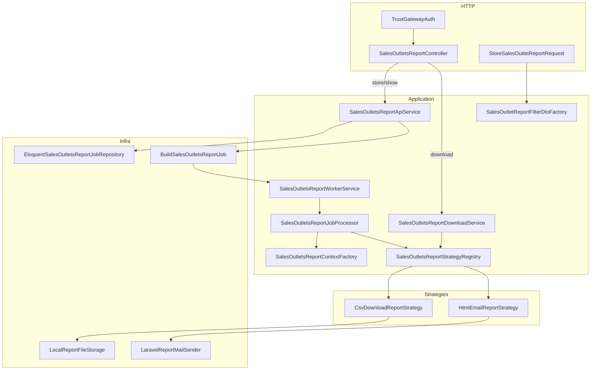

# Окончательный SOLID-аудит service-b

**Дата:** 2026-05-30  
**Статус:** финальный отчёт  
**Источник:** только реальный код на WSL `/home/ddd/exampleProjectSail/service-b`  
**Не использовать:** индекс Cursor по UNC — может показывать удалённый legacy Export/Mail и устаревшие тесты.

---

## Методология (факты с диска)

| Критерий | Результат проверки |
|----------|-------------------|
| Точки входа | `routes/api.php`, `AppServiceProvider`, `BuildSalesOutletsReportJob`, `config/sales_outlets_reports.php` |
| Контроллер API | `SalesOutletsReportController` — **единственный** |
| Job | `BuildSalesOutletsReportJob` — **единственный** |
| Legacy Export/Mail | `grep` по `app routes config tests` — **0 совпадений** |
| PHP в `app/` | **75** файлов |
| Контракты SalesOutlets | **22** файла в `app/Contracts/SalesOutlets/` |
| Активный контракт стратегии | `SalesOutletsReportProcessingStrategyInterface` (+ marker `SalesOutletsDownloadableReportStrategyInterface`) |
| Устаревший `SalesOutletsReportStrategyInterface.php` | **отсутствует** |
| Тесты на диске | **13** файлов (2 legacy-заглушки, см. § Покрытие) |
| Прогон тестов в этой сессии | **не выполнен** (shell недоступен); ранее: 48 passed, БД `sail_db_testing` |

```bash
cd /home/ddd/exampleProjectSail/service-b
find app -name '*.php' | wc -l                    # 75
grep -rE 'SalesOutletsExport|SalesOutletsMail' app routes config tests || echo OK
test -f app/Contracts/SalesOutlets/SalesOutletsReportStrategyInterface.php && echo EXISTS || echo NOT_EXISTS
```

---

## Сводная оценка

| Принцип | Оценка | Кратко |
|---------|--------|--------|
| **S** — Single Responsibility | **8.5/10** | Чёткие слои; worker совмещает process + failure (разнесено по интерфейсам) |
| **O** — Open/Closed | **9/10** | Strategy registry + marker downloadable; новый тип = enum + стратегия + tag |
| **L** — Liskov Substitution | **9/10** | Стратегии подставляемы; gateway login через Eloquent `User` |
| **I** — Interface Segregation | **9/10** | Узкие контракты; processing + downloadable marker + resolver |
| **D** — Dependency Inversion | **9/10** | Контракты + DI; injectable context/DTO factories; ValidationRule с DI |

**Итого: ~9/10**

---

## Архитектура (активный граф)



**Маршруты (`routes/api.php`):**

- `POST /api/sales-outlets/reports` → `store`
- `GET /api/sales-outlets/reports/{uuid}` → `show`
- `GET /api/sales-outlets/reports/{uuid}/download` → `download`
- middleware: `trust.gateway`

---

## S — Single Responsibility

### Соответствует (подтверждено в коде)

| Компонент | Ответственность |
|-----------|-----------------|
| `SalesOutletsReportController` | HTTP: FormRequest → DTO → JSON / stream |
| `SalesOutletsReportApiService` | Создание job + dispatch + `findByUuid` |
| `SalesOutletsReportDownloadService` | Downloadable, готовность, отдача файла |
| `SalesOutletsReportJobProcessor` | Цикл: processing → build → deliver → completed |
| `SalesOutletsReportContextFactory` | Маппинг filter/job → `SalesOutletReportContextDto` |
| `SalesOutletReportFilterDtoFactory` | Сборка `SalesOutletReportFilterDto` из validated |
| `InAllowedSalesOutletColumn` | Валидация колонок по metadata |
| `CsvDownloadReportStrategy` / `HtmlEmailReportStrategy` | Формат + доставка |
| `TrustGatewayAuth` | Резолв `X-User-Id` + login в guard |
| `BuildSalesOutletsReportJob` | Делегирование worker / failure handler |

Контроллер не содержит бизнес-логики — только делегирование:

```16:59:service-b/app/Http/Controllers/Api/SalesOutletsReportController.php
    public function __construct(
        private readonly SalesOutletsReportApiServiceInterface $reportService,
        private readonly SalesOutletsReportDownloadServiceInterface $downloadService,
    ) {}

    public function store(StoreSalesOutletReportRequest $request): JsonResponse
    {
        $reportJob = $this->reportService->create(
            filters: $request->toDto(),
            userId: $request->user()?->id,
            reportType: $request->toReportType(),
        );
        // ...
    }
```

Processor — единый оркестратор без ветвления по типу отчёта:

```22:38:service-b/app/Services/SalesOutlets/SalesOutletsReportJobProcessor.php
    public function process(SalesOutletAsyncJob $job): void
    {
        $job = $this->reportRepository->updateStatus($job, AsyncJobStatus::Processing);
        $this->processingDelay->apply($job->reportType);
        $strategy = $this->strategyResolver->resolve($job->reportType);
        $context = $this->contextFactory->fromJob($job);
        $content = $strategy->build($context);
        $delivery = $strategy->deliver($job, $content);
        $this->reportRepository->updateStatus($job, AsyncJobStatus::Completed, filePath: $delivery->filePath);
    }
```

### Компромиссы (допустимые)

- **`SalesOutletsReportWorkerService`** — реализует `SalesOutletsReportProcessorWorkerInterface` и `SalesOutletsReportJobFailureServiceInterface`; для Job — разные контракты, ISP достаточен.
- **`SalesOutletsReportJobFailureHandler`** — тонкий прокси для `Job::failed()`.
- **`ConfigSalesOutletsReportsConfig`** — storage + delay; наружу — `ReportStorageConfigInterface` / `ReportProcessingDelayConfigInterface`.
- **`ResolvesSalesOutletsReportData`** (trait) — общая логика колонок/строк для CSV/HTML стратегий; не нарушает SRP стратегий.

### Замечания

- Дублирующих Export/Mail сервисов **нет** (grep = 0).
- Welcome/Vite (`routes/web.php`) вне API-графа — не нарушение SRP прикладного слоя.

---

## O — Open/Closed

### Соответствует

1. **Новый тип отчёта** без правки processor/worker/download-сервиса:
   - `case` в `SalesOutletsReportType`
   - класс `implements SalesOutletsReportProcessingStrategyInterface`
   - `AppServiceProvider` → `tag('sales-outlets.report-strategies')`

2. **`SalesOutletsReportStrategyRegistry`** — `resolve()`, `supportsDownload()` через `instanceof SalesOutletsDownloadableReportStrategyInterface`.

3. **Marker interface** — email-стратегия не implements downloadable; download-сервис не знает про email:

```16:52:service-b/app/Services/SalesOutlets/Reports/Strategies/HtmlEmailReportStrategy.php
class HtmlEmailReportStrategy extends AbstractSalesOutletsHtmlReportStrategy
{
    // ...
    public function deliver(SalesOutletAsyncJob $job, string $content): ReportDeliveryResult
    {
        $this->mailSender->send(/* ... */);
        return ReportDeliveryResult::none();
    }
}
```

4. **`ReportDeliveryResult`** — processor не различает file vs email; путь из `deliver()`.

5. **Shared `sales-outlets-domain`** — `AbstractStrategyReport`, writers; service-b — адаптеры (`AbstractSalesOutletsCsvReportStrategy`, `AbstractSalesOutletsHtmlReportStrategy`).

### Ограничения при расширении

| Место | При новом формате |
|-------|-------------------|
| `SalesOutletsReportType` | новый `case` |
| `AppServiceProvider` | добавить класс в tag |
| `config/sales_outlets_reports.php` | секция `types.*` (delay, mail) |

XLSX как downloadable: новая стратегия с marker — **без** правок `SalesOutletsReportDownloadService`.

### Прочее

- `ConfigReportProcessingDelay` — `sleep()` по env в local/testing; для production OCP не критично.
- Config сохраняет legacy env-ключи (`SALES_OUTLETS_EXPORT_*`, `SALES_OUTLETS_MAIL_*`) для обратной совместимости — не SOLID-проблема.

---

## L — Liskov Substitution

### Соответствует

- Любая tagged-стратегия подставляется в processor через `SalesOutletsReportProcessingStrategyInterface`.
- `HtmlEmailReportStrategy` **не** downloadable → `supportsDownload()` = false → download → 404.
- `CsvDownloadReportStrategy` implements marker → download доступен.
- `SalesOutletAsyncJob` — единая доменная модель для всех типов; репозиторий всегда возвращает domain object.
- `LaravelGatewayAuthSession::login(GatewayUserDto)` → `Guard::login($user->user)` с Eloquent `User`.

### Компромиссы

- `EloquentGatewayUserResolver` при отсутствии user в БД → `null` (анонимный запрос); контракт resolver не нарушен.
- `SalesOutletAsyncJob::fromReportJob()` принимает Eloquent-модель — граница adapter → domain, допустимо.

---

## I — Interface Segregation

### Соответствует (сильная сторона)

| Интерфейс | Кто использует |
|-----------|----------------|
| `SalesOutletsReportApiServiceInterface` | Controller store/show |
| `SalesOutletsReportDownloadServiceInterface` | Controller download |
| `SalesOutletsReportStrategyResolverInterface` | JobProcessor |
| `SalesOutletsReportDownloadCapabilityInterface` | DownloadService |
| `SalesOutletsReportDownloadPresentationInterface` | DownloadService |
| `SalesOutletsReportProcessorWorkerInterface` | Job::handle |
| `SalesOutletsReportJobFailureHandlerInterface` | Job::failed |
| `SalesOutletsReportJobFailureServiceInterface` | FailureHandler, Worker |
| `SalesOutletsAsyncJobRepositoryInterface` | Api, Processor, Worker |
| `SalesOutletsReportContextFactoryInterface` | JobProcessor |
| `SalesOutletReportFilterDtoFactoryInterface` | FormRequest `toDto()` |
| `ReportStorageConfigInterface` / `ReportProcessingDelayConfigInterface` | Storage, Delay |

**Паттерн:** один `SalesOutletsReportStrategyRegistry` — **три** alias в DI (resolver, download capability, presentation):

```115:127:service-b/app/Providers/AppServiceProvider.php
        $this->app->alias(SalesOutletsReportStrategyRegistry::class, SalesOutletsReportStrategyResolverInterface::class);
        $this->app->alias(SalesOutletsReportStrategyRegistry::class, SalesOutletsReportDownloadCapabilityInterface::class);
        $this->app->alias(SalesOutletsReportStrategyRegistry::class, SalesOutletsReportDownloadPresentationInterface::class);
```

**Контракты стратегий:**

- `SalesOutletsReportProcessingStrategyInterface` — `reportType()`, `build()`, `deliver()`
- `SalesOutletsDownloadableReportStrategyInterface` extends processing — path, MIME, имя файла

Job зависит только от worker/failure handler, не от processor напрямую:

```21:32:service-b/app/Jobs/BuildSalesOutletsReportJob.php
    public function handle(SalesOutletsReportProcessorWorkerInterface $reportWorker): void
    {
        $reportWorker->processByUuid($this->uuid);
    }

    public function failed(?Throwable $exception, SalesOutletsReportJobFailureHandlerInterface $failureHandler): void
    {
        $failureHandler->handle($this->uuid, $exception?->getMessage());
    }
```

### Замечаний по «толстым» контрактам в активном коде нет

---

## D — Dependency Inversion

### Соответствует (подтверждено в коде)

- Сервисы/контроллеры/processor → `App\Contracts\*`, bindings в `AppServiceProvider`.
- Инфра: `LocalReportFileStorage`, `LaravelReportMailSender`, `LaravelJobDispatcher`, `LaravelSalesOutletsJobQueue`.
- Middleware → `GatewayUserResolverInterface`, `GatewayAuthSessionInterface`.
- `CsvReportWriterInterface` → bind `CsvReportWriter`; service-b передаёт writer явно в `AbstractSalesOutletsCsvReportStrategy`.
- Eloquent только в `Eloquent*` adapters; домен — `SalesOutletAsyncJob`.

### DIP-рефакторинг (в коде)

1. **`SalesOutletsReportContextFactory`** — `implements SalesOutletsReportContextFactoryInterface`, DI в processor.
2. **`SalesOutletReportFilterDtoFactory`** — `SalesOutletReportFilterDtoFactoryInterface`, вызов из `StoreSalesOutletFilterRequest::toDto()`.
3. **`InAllowedSalesOutletColumn`** — `ValidationRule` с DI `SalesOutletsMetadataRepositoryInterface`; FormRequest без constructor DI metadata.

```38:43:service-b/app/Http/Requests/SalesOutlets/StoreSalesOutletFilterRequest.php
    public function toDto(): SalesOutletReportFilterDto
    {
        return $this->container
            ->make(SalesOutletReportFilterDtoFactoryInterface::class)
            ->fromValidated($this->validated());
    }
```

### Слабые места

| Место | Серьёзность |
|-------|-------------|
| `EloquentGatewayUserResolver` → Eloquent `User` | Приемлемо для adapter |
| `StoreSalesOutletFilterRequest` → `$this->container->make(...)` | Laravel-идиома для Rule/Factory |
| Shared `AbstractStrategyReport` | дефолт `new CsvReportWriter()` в shared; service-b передаёт writer явно — риск только при прямом наследовании без DI |

---

## Матрица: ключевые классы → SOLID

| Класс | S | O | L | I | D |
|-------|---|---|---|---|---|
| `SalesOutletsReportController` | ✅ | ✅ | ✅ | ✅ | ✅ |
| `SalesOutletsReportApiService` | ✅ | ✅ | ✅ | ✅ | ✅ |
| `SalesOutletsReportDownloadService` | ✅ | ✅ | ✅ | ✅ | ✅ |
| `SalesOutletsReportJobProcessor` | ✅ | ✅ | ✅ | ✅ | ✅ |
| `SalesOutletsReportStrategyRegistry` | ✅ | ✅ | ✅ | ✅ | ✅ |
| `CsvDownloadReportStrategy` | ✅ | ✅ | ✅ | ✅ | ✅ |
| `HtmlEmailReportStrategy` | ✅ | ✅ | ✅ | ✅ | ✅ |
| `SalesOutletsReportContextFactory` | ✅ | — | ✅ | ✅ | ✅ |
| `SalesOutletReportFilterDtoFactory` | ✅ | — | ✅ | ✅ | ✅ |
| `TrustGatewayAuth` | ✅ | ✅ | ✅ | ✅ | ✅ |
| `EloquentSalesOutletsReportJobRepository` | ✅ | — | ✅ | ✅ | ⚠️ Eloquent |

Легенда: ✅ хорошо, ⚠️ осознанный компромисс adapter-слоя.

---

## Рекомендации

### Не требуется (рефакторинг завершён)

- Унификация Export/Mail → единый Report API — **выполнена**.
- Injectable context factory — **в коде**.
- Разделение `SalesOutletsReportWorkerService` на два класса — **опционально**, ISP достаточен.

### Опционально (не влияет на SOLID)

| Действие | Зачем |
|----------|-------|
| Удалить заглушки `SalesOutletsExportTest.php`, `SalesOutletsMailTest.php` | Чистота tests/ (содержат только `// Consolidated into SalesOutletsReportTest.php`) |
| Переименовать env-ключи в config | Косметика; fallback уже есть |
| Прогнать `php artisan test` в Docker | Подтвердить 48 passed на PHP 8.4 |

---

## Покрытие тестами (файлы на диске)

| Файл | Слой |
|------|------|
| `tests/Feature/SalesOutletsReportTest.php` | HTTP, queue, storage, mail, download |
| `tests/Unit/CsvDownloadReportStrategyTest.php` | Downloadable presentation |
| `tests/Unit/HtmlEmailReportStrategyTest.php` | Email strategy |
| `tests/Unit/SalesOutletsReportJobProcessorTest.php` | Processor |
| `tests/Unit/SalesOutletsReportStrategyRegistryTest.php` | Registry |
| `tests/Unit/EloquentGatewayUserResolverTest.php` | Auth resolver |
| `tests/Unit/TrustGatewayAuthTest.php` | Middleware |
| `tests/Unit/HtmlTableRendererTest.php` | HTML render |
| `tests/Unit/ConfigReportProcessingDelayTest.php` | Delay config |
| `tests/Feature/DebugMailRenderTest.php` | Mail debug |
| `tests/Feature/SalesOutletsExportTest.php` | **заглушка** → consolidated |
| `tests/Feature/SalesOutletsMailTest.php` | **заглушка** → consolidated |
| `tests/Feature/ExampleTest.php`, `tests/Unit/ExampleTest.php` | Scaffold |

**Прогон в этой проверке:** не выполнен (shell недоступен). Перепроверить:

```bash
docker compose exec -T service-b php artisan test
```

---

## Итог

**service-b — единый Report API с Strategy, сегрегированными интерфейсами и DI (~9/10).**

Сильные стороны:
- **OCP** — registry + tagged strategies, processor закрыт для модификации
- **ISP** — три alias на registry; processing vs downloadable marker
- **DIP** — injectable factories, ValidationRule с DI, domain отделён от Eloquent

Legacy Export/Mail и устаревший `SalesOutletsReportStrategyInterface` **отсутствуют** на диске. Архитектура готова к добавлению новых типов отчётов без правки оркестратора.

---

## Связанные документы

- [ORPHAN-FILES.md](./ORPHAN-FILES.md) — граф файлов
- [REFACTORING-CHECKLIST.md](./REFACTORING-CHECKLIST.md) — история фаз
