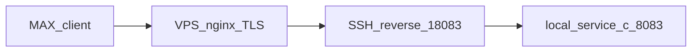

# service-c — MAX mini-app «Заказ еды»

Backend (Laravel 13, PHP 8.4) и Vue 3 SPA для MAX mini-app: сеть ресторанов → меню → корзина → заявка (`pending_review` → проверка адреса и состава администраторами). Расчёт доставки по категории клиента и порогам суммы заказа. Также webhook MAX, UI Stand (приветствие + inline-кнопки) и Artisan-команды `max:bot:info`, `max:webhook:*`, `max:ui-stand:send`, `max:food-admin:assign`.

| Документ | Назначение |
|---|---|
| [корневой README](../README.md) | Docker, gateway, общая инфраструктура |
| [shared/max-messenger](../shared/max-messenger/) | Общий HTTP-клиент MAX Bot API |

Порт по умолчанию: **8083** (`SERVICE_C_PORT` в `docker-compose.yml`). Vite dev: **5174** (`SERVICE_C_VITE_PORT`).

## Маршрутизация

| Путь | Куда | Авторизация |
|---|---|---|
| `http://localhost:8083/` | Welcome-страница Laravel | Публичный |
| `http://localhost:8083/max-app` | Vue SPA (прямой доступ) | Публичный |
| `http://localhost:8083/up` | Health check | Публичный |
| `http://localhost:8083/api/webhooks/max` | Webhook MAX | `X-Max-Bot-Api-Secret` |
| `http://localhost:8083/api/max/auth` | Валидация `initData` → Bearer token | Публичный |
| `http://localhost:8083/api/food/*` | Food API | Bearer (`max.miniapp.auth`) |
| `http://localhost:8080/api/c/...` | Через nginx-gateway (префикс `/api/c`) | Gateway auth (`X-User-Id`) |
| `http://localhost:8080/api/c/webhooks/max` | Webhook через gateway | **Без** gateway auth |

**Важно:** MAX на **том же домене**, что и `main-app` (`94-228-117-27.sslip.io`), идёт через `nginx-gateway` → `service-c` по путям **без** префикса `/api/c`: `/max-app`, `/max-build/`, `/api/webhooks/max`, `/api/max/`, `/api/food/`. Ассеты mini-app в каталоге **`/max-build/`** (не `/build/`), чтобы не пересекаться с Vite `main-app`.

Префикс `/api/c/` остаётся для отладки gateway auth и единообразия с `service-a` / `service-b`.

**Важно (отдельный туннель):** MAX (webhook и mini-app в dev) может обращаться по **публичному HTTPS URL** на порт **8083** через туннель, а не через gateway `:8080`. Gateway location `/api/c/webhooks/max` без `auth_request` нужен для локальной отладки и единообразия префиксов.

## Домен Food (кратко)

- **Корзина** — одна черновая (`draft`) на пользователя MAX; позиции только из одного ресторана (иначе `422` с кодом `cart_restaurant_mismatch`).
- **Адрес доставки** — обязателен перед оформлением; сохраняется в корзине и профиле `max_users` (подставляется при следующем заказе).
- **Категория клиента** (`max_customer_categories`) — влияет на тарифы доставки. Seeder создаёт **Стандарт** и **VIP** с демо-пользователями `max_user_id` 1001 / 1002.
- **Администраторы** (`max_food_order_admins`) — роли проверки заказов и управления меню. После `db:seed` демо-админы: `max_user_id` **1003** (`address_reviewer`), **1004** (`composition_reviewer`), **1005** (`menu_manager`). В prod назначайте роли командой `max:food-admin:assign` (см. [Администраторы](#администраторы)).
- **Тарифы доставки** (`max_restaurant_category_delivery_tiers`) — для пары «ресторан + категория» задаются пороги `min_items_total` → `delivery_cost`; выбирается максимальный подходящий порог.
- Если у пользователя нет категории — `delivery_applicable: false`, `delivery_cost: null`, `total` = сумма позиций.
- **Оформление заявки** (`POST /api/food/orders/submit`) — после сохранения заказа в БД отправляется текстовое уведомление во все MAX-чаты и пользователей из `MAX_REPORT_CHAT_IDS` / `MAX_REPORT_USER_IDS` (см. [Уведомления о заказах в MAX](#уведомления-о-заказах-в-max)).

Демо-тарифы после `db:seed` (для каждого активного ресторана):

| Категория | Бесплатная доставка от | Платная доставка |
|---|---|---|
| Стандарт | 1000 ₽ | 200 ₽ |
| VIP | 500 ₽ | 100 ₽ |

## Уведомления о заказах в MAX

После успешного `POST /api/food/orders/submit` (commit в `max_food_orders`) service-c отправляет **текстовое** сообщение с кнопкой **«Заказ еды»** (`open_app`) во **все** чаты и пользователей из `MAX_REPORT_CHAT_IDS` и `MAX_REPORT_USER_IDS` — те же переменные, что у **service-b** для отчётов по торговым точкам.

Кнопка открывает mini-app (`MAX_MINI_APP_URL` или URL из `MAX_WEBHOOK_URL` / `max.bot_username`). Если URL mini-app не настроен, уходит только текст без кнопки.

Отправка **синхронная** (в том же HTTP-запросе, после транзакции). Очередь не используется.

**Сбой MAX не отменяет заказ:** заявка остаётся в БД; ошибка логируется в канал `messMax` (`storage/logs/messMax.log`).

### Формат сообщения

```
Новая заявка №42
Ресторан: Пиццерия
Клиент: Иван (@ivan, id 1002)
Адрес: ул. Ленина, 1

• Маргарита × 2 — 800 ₽
• Кола × 1 — 150 ₽

Сумма блюд: 950 ₽
Доставка: 200 ₽
Итого: 1150 ₽
```

Если доставка не применима — строка «Доставка» опускается. Лимит текста — **4000** символов; при длинном списке позиции обрезаются с пометкой «…и ещё N позиций».

### Настройка

| Переменная | Назначение |
|---|---|
| `MAX_REPORT_CHAT_IDS` | Chat ID получателей (через запятую) |
| `MAX_REPORT_USER_IDS` | User ID получателей (через запятую) |
| `MAX_BOT_ACCESS_TOKEN` | Токен бота; **тот же бот**, что добавлен в целевой чат |
| `MAX_MINI_APP_URL` | URL mini-app для кнопки «Заказ еды» (или выводится из `MAX_WEBHOOK_URL`) |
| `MAX_UI_STAND_MINI_APP_BUTTON_TEXT` | Текст кнопки (по умолчанию «Заказ еды») |

На prod/VPS продублируйте значения из `service-b/.env`. Хотя бы один из списков (`chat_ids` или `user_ids`) должен быть непустым — иначе при submit notifier выбросит исключение конфигурации.

### Реализация (слои)

| Компонент | Файл |
|---|---|
| Конфиг | `config/max.php` → `order_notifications` |
| Сборка текста | `app/Services/Food/FoodOrderMaxMessageBuilder.php` |
| Отправка | `app/Services/Food/LaravelFoodOrderMaxNotifier.php` |
| Интеграция | `app/Services/Food/OrderSubmissionService.php` (вызов после `DB::transaction`) |
| HTTP-клиент | `shared/max-messenger` (`MaxMessengerClientInterface`) |

## Структура (ключевые каталоги)

```
service-c/
├── app/
│   ├── Contracts/                  # Auth, Max, Food (DI-контракты)
│   ├── DTO/                        # Food, Max, Auth
│   ├── Enums/Food/                 # CartStatus, OrderStatus, CustomerCategoryName, FoodErrorCode
│   ├── Exceptions/Food/            # FoodDomainException
│   ├── Http/Controllers/Api/       # Food, MaxAuth, MaxWebhook
│   ├── Http/Middleware/            # AuthenticateMaxMiniApp, TrustGatewayAuth, VerifyMaxWebhookSecret
│   ├── Http/Requests/              # Валидация входа (Food, Max)
│   ├── Models/                     # Restaurant, Dish, Cart, MaxUser, CustomerCategory, …
│   ├── Repositories/Food/          # EloquentDeliveryTierRepository, EloquentCustomerCategoryRepository
│   ├── Services/
│   │   ├── Auth/                   # Gateway auth (Eloquent user resolver)
│   │   ├── Food/                   # CartService, MenuQueryService, OrderSubmissionService,
│   │   │                           # DeliveryCostResolver, CartTotalsCalculator, DishImage*,
│   │   │                           # DishAdminService, DishImageUploadService,
│   │   │                           # FoodOrderMaxMessageBuilder, LaravelFoodOrderMaxNotifier
│   │   └── Max/                    # initData validator, mini-app auth, UiStand,
│   │                               # ConfigMaxOrderNotificationConfigProvider
│   ├── Support/                    # MaxAppRequestContext, MaxOpenAppTargetResolver, MaxMiniAppAccessLogger
│   └── Console/Commands/           # max:bot:info, max:webhook:*, max:ui-stand:send, max:miniapp:verify, max:food-admin:assign
├── config/max.php                  # webhook, miniapp, ui_stand, order_notifications, retry
├── database/
│   ├── migrations/                 # max_users, food domain (префикс max_*)
│   └── seeders/                    # RestaurantSeeder, CustomerCategorySeeder, FoodOrderAdminSeeder
├── resources/
│   ├── js/max-app/                 # Vue 3 SPA + MAX Bridge
│   │   ├── api/foodClient.js
│   │   ├── bridge/maxBridge.js
│   │   ├── components/DishImage.vue
│   │   └── pages/                  # RestaurantList, MenuPage, CartPage, OrderConfirmationPage
│   ├── css/max-app.css             # Tailwind CSS
│   └── views/max-app.blade.php
├── routes/api.php, web.php
├── docker-entrypoint.sh            # auto `npm run build` при отсутствии manifest
└── tests/                          # Feature + Unit (БД: sail_db_testing)
```

Shared-пакет: `../shared/max-messenger` (`example/max-messenger` в `composer.json`) — HTTP-клиент MAX Bot API, DTO сообщений, retry-конфиг.

## Быстрый старт

```bash
cp service-c/.env.example service-c/.env
# Заполните MAX_BOT_ACCESS_TOKEN, MAX_WEBHOOK_SECRET (≥5 символов)
docker compose build service-c
docker compose up -d service-c
```

При первом запуске контейнер сам соберёт фронтенд, если нет `public/max-build/manifest.json` (см. `docker-entrypoint.sh`).

### База данных

Таблицы service-c с префиксом `max_*`:

| Таблица | Назначение |
|---|---|
| `max_users` | Пользователи MAX; `customer_category_id`, `delivery_address` |
| `max_customer_categories` | Категории клиентов (Стандарт, VIP, …); soft delete |
| `max_restaurants` | Рестораны; soft delete |
| `max_menu_categories` | Категории меню; soft delete |
| `max_dishes` | Блюда (`name`, `description`, `weight`, `weight_unit`, `vat_rate`, `image_url`, …); soft delete |
| `max_restaurant_category_delivery_tiers` | Тарифы доставки |
| `max_carts`, `max_cart_items` | Корзины и позиции |
| `max_food_orders` | Заявки (`items_total`, `delivery_cost`, `delivery_address`, поля review) |
| `max_food_order_admins` | Роли администраторов (`address_reviewer`, `composition_reviewer`, `menu_manager`) |

Общая MySQL с остальными сервисами (`sail_db`).

```bash
docker compose exec -T service-c php artisan migrate
docker compose exec -T service-c php artisan db:seed   # рестораны, категории, тарифы, demo users и admins
```

`DatabaseSeeder` вызывает `RestaurantSeeder` → `CustomerCategorySeeder` → `FoodOrderAdminSeeder`.

`RestaurantSeeder` копирует placeholder JPG из `database/seeders/assets/dishes/` в `storage/app/public/dishes/seed/` и записывает в `max_dishes.image_url` **относительный путь** (например `dishes/seed/pizza.jpg`).

> **VPS:** после deploy убедитесь, что `storage/app/public` доступен (`php artisan storage:link` при необходимости). В `service-c/.env` на VPS: `APP_URL=https://94-228-117-27.sslip.io`.

> **Android/iOS MAX:** WebView не загружает внешние URL напрямую. API отдаёт `image_url` вида `/api/food/dishes/{id}/image`; сервер читает файл только из локального `public` disk. Внешние URL (`http://`, `https://`) в `image_url` не поддерживаются — endpoint вернёт `404`.

> Миграции затрагивают только схему service-c. Перед выполнением в shared-окружении согласуйте с командой (в проекте три сервиса с отдельными migration paths).

### Изображения блюд (только локальные файлы)

Колонка `max_dishes.image_url` хранит **относительный путь** внутри `Storage::disk('public')` (например `dishes/42/a1b2c3.jpg`). Загрузка внешних URL через API запрещена.

| Этап | Поведение |
|---|---|
| Сиды | `RestaurantSeeder` → `storage/app/public/dishes/seed/…` |
| Админ (create/update) | `multipart/form-data`, поле `photo` → `DishImageUploadService` → `dishes/{dishId}/{uuid}.{ext}` |
| Клиентское меню | JSON содержит same-origin URL `/api/food/dishes/{id}/image` |
| Отдача | `GET /api/food/dishes/{id}/image` → `DishImageDeliveryService` читает файл с `public` disk |

**Допустимые форматы загрузки** (PNG/JPEG и варианты расширений): `.png`, `.jpg`, `.jpeg`, `.jpe`, `.pjp`, `.pjpeg`, `.jfif`. Фактический MIME проверяется через `finfo` (`image/png`, `image/jpeg`). GIF, WebP, HEIC — **не принимаются**.

**Ограничения:**

| Параметр | Значение |
|---|---|
| Максимальный размер файла | 25 МБ (`max:25600` в валидации) |
| Минимальное разрешение | ширина ≥ **800** px **и** высота ≥ **600** px одновременно |
| Примеры | 800×600 ✓; 1920×1080 ✓; 799×600 ✗; 800×599 ✗; 600×800 ✗ (ширина < 800) |

При нарушении разрешения API возвращает `422` с сообщением «Изображение должно быть не менее 800×600 пикселей».

Единый whitelist на backend: `App\Support\DishPhotoAllowedExtensions` (используется в FormRequest, `DishImageUploadService` и правиле `MinImageDimensions`).

### Фронтенд (Vite, порт 5174)

```bash
docker compose exec service-c npm run build   # для мобильных и туннеля (обязательно)
docker compose exec service-c npm run dev     # только локальная разработка на ПК
```

> **Мобильные (iOS/Android):** mini-app открывается через HTTPS-туннель. Используйте **`npm run build`**, не `npm run dev`.
> Dev-сервер Vite отдаёт ассеты с `localhost:5174` — с телефона этот адрес недоступен (белый экран).
> Маршрут `/max-app` при запросе не с `localhost`/`127.0.0.1` принудительно отключает Vite hot-file (`web.php` + `MaxAppRequestContext`).
> Если ранее запускали `npm run dev`, удалите `public/hot` в контейнере или пересоберите: `npm run build`.

### Тесты

```bash
./scripts/test-services.sh service-c
# или только service-c:
docker compose exec -T service-c php artisan test
```

Скрипт пересоздаёт `sail_db_testing`, прогоняет миграции всех сервисов и запускает PHPUnit. Тестовая БД: **`sail_db_testing`** (см. `phpunit.xml`, `.env.testing`).

## Переменные окружения

### MAX

| Переменная | Назначение |
|---|---|
| `MAX_BOT_ACCESS_TOKEN` | Токен бота MAX (Bot API + валидация `initData`) |
| `MAX_BOT_USERNAME` | Username бота (`max:bot:info`) |
| `MAX_BOT_USER_ID` | `user_id` бота из `max:bot:info` — `contact_id` для кнопки `open_app` |
| `MAX_WEBHOOK_URL` | Публичный HTTPS URL webhook, напр. `https://exampleprojectsail.fxtun.dev/api/webhooks/max` |
| `MAX_WEBHOOK_SECRET` | Секрет webhook (минимум 5 символов), заголовок `X-Max-Bot-Api-Secret` |
| `APP_URL` | Корень сайта **без** `/max-app`, напр. `https://exampleprojectsail.fxtun.dev` |
| `MAX_PUBLIC_APP_URL` | Явный публичный origin для asset/API при `APP_URL=localhost` (по умолчанию — из `MAX_WEBHOOK_URL`) |
| `MAX_MINI_APP_URL` | URL для кнопки `open_app` в сообщениях (если пуст — `MAX_PUBLIC_APP_URL` + `/max-app` или `https://max.ru/{username}`) |
| `MAX_UI_STAND_GREETING` | Текст приветствия UI Stand |
| `MAX_UI_STAND_MINI_APP_BUTTON_TEXT` | Подпись кнопки mini-app в UI Stand (по умолчанию «Заказ еды») |
| `MAX_UI_STAND_CHAT_IDS` | Chat ID для тестовой рассылки (через запятую) |
| `MAX_UI_STAND_USER_IDS` | User ID для тестовой рассылки (через запятую) |
| `MAX_REPORT_CHAT_IDS` | Chat ID для уведомлений о заказах (те же ID, что в service-b; через запятую) |
| `MAX_REPORT_USER_IDS` | User ID для уведомлений о заказах (те же ID, что в service-b; через запятую) |
| `MAX_MINIAPP_AUTH_DATE_MAX_AGE_SECONDS` | Допустимый возраст `auth_date` в initData (по умолчанию 86400) |
| `MAX_MINIAPP_TOKEN_TTL_SECONDS` | TTL Bearer-токена Sanctum (по умолчанию 86400) |
| `MAX_RATE_LIMIT_RETRY_MAX` | Повторы при 429 Bot API |
| `MAX_RATE_LIMIT_RETRY_DELAY_MS` | Задержка между повторами при 429 |
| `MAX_ATTACHMENT_NOT_READY_RETRY_MAX` | Повторы при «attachment not ready» |
| `MAX_ATTACHMENT_NOT_READY_RETRY_DELAY_MS` | Задержка между такими повторами |
| `MAX_REPORT_CHAT_IDS` | Chat ID для уведомлений о заказах (через запятую; **те же значения, что в service-b**) |
| `MAX_REPORT_USER_IDS` | User ID для уведомлений о заказах (через запятую; **те же значения, что в service-b**) |

### Прочие

| Переменная | Назначение |
|---|---|
| `DB_*` | MySQL (`host.docker.internal`, БД `sail_db`) |
| `LOG_STACK` | По умолчанию `single,messMax` — события MAX в `storage/logs/messMax.log` |
| `REDIS_HOST` | `redis` (кэш/очереди в compose) |

## HTTPS-туннель на порт 8083

MAX требует **HTTPS:443** для webhook и mini-app. В dev нужен публичный туннель на `SERVICE_C_PORT` (по умолчанию **8083**).

### Рекомендуется: VPS hybrid (локальная отладка)

Код и Docker остаются на **вашем ПК**; VPS даёт только стабильный HTTPS без interstitial fxTunnel.



| Шаг | Команда |
|---|---|
| Первичная настройка | `cp scripts/vps-tunnel.env.example scripts/vps-tunnel.env` — заполнить `VPS_HOST`, `VPS_USER`, `VPS_DOMAIN` |
| Подготовка | `./scripts/setup-max-vps.sh` |
| nginx на VPS (один раз) | `./scripts/vps-tunnel.sh apply-nginx-remote` → на VPS: `sudo certbot --nginx -d <VPS_DOMAIN>` |
| Туннель (держать открытым) | `./scripts/vps-tunnel-watch.sh` |
| После правок Vue | `./scripts/build-max-app.sh` |
| Диагностика | `./scripts/diag-max-vps.sh` |

**`.env` на локальной машине** (публичный dev-домен, не `localhost`):

```env
APP_URL=https://max-dev.94-228-117-27.sslip.io
MAX_WEBHOOK_URL=https://max-dev.94-228-117-27.sslip.io/api/webhooks/max
# MAX_MINI_APP_URL можно не задавать
```

**Кабинет MAX** → URL мини-приложения: `https://max-dev.94-228-117-27.sslip.io/max-app` (должен совпадать с origin в `.env`).

> **Не используйте prod-домен** (`94-228-117-27.sslip.io` с `docker-compose.prod.yml`), если nginx на нём уже проксирует в gateway `:8080` — для hybrid нужен **отдельный dev-поддомен** или отдельный VPS. Рекомендуется **отдельный тестовый бот MAX** для dev.

SSH на VPS: `./scripts/vps-tunnel.sh ssh-server-hint` (`AllowTcpForwarding yes`).

> **fxTunnel и mini-app:** `/max-app` всегда отдаётся как `text/html` — иначе web.max.ru показывает сырой HTML вместо страницы. Если в MAX появляется «Dev Tunnel Warning», используйте VPS-туннель (`./scripts/vps-tunnel.sh`) или cloudflared (`./scripts/cloudflared-tunnel.sh`). Webhook (POST) interstitial fxTunnel не затрагивает.

> **APP_URL:** только корень домена (`https://sub.fxtun.dev`), **не** `.../max-app`. Иначе CSS/JS будут по пути `/max-build/...` с неверным origin и не загрузятся.

При запросах с хоста туннеля `AppServiceProvider` форсирует HTTPS и корневой URL из `APP_URL` или `MAX_PUBLIC_APP_URL` / origin `MAX_WEBHOOK_URL`.

## Особенности MAX PC (desktop)

Проверено на Max PC (QtWebEngine, `WebApp.platform === 'desktop'`):

| Сценарий | Поведение |
|---|---|
| Первое открытие mini-app | Работает после `WebApp.ready()` (вызывается из inline-boot в `max-app.blade.php`, когда `document.visibilityState === 'visible'`) |
| Закрытие через **кнопку «Назад»** в шапке Max → повторное открытие | Работает: вызывается `WebApp.close()`, host корректно создаёт новую сессию |
| Закрытие через **нижний трей** Max → повторное открытие из трея | **Не работает** без перезапуска Max: host не вызывает `WebApp.close()`, webview не перезагружается, JS не получает lifecycle-событий (`visibilitychange`, `pagehide`, смена размеров окна) |

**Причина:** ограничение клиента Max PC, а не mini-app или backend. Из JavaScript нельзя надёжно детектировать «свернули в трей» и принудительно восстановить сессию.

**Рекомендации для QA и пользователей desktop:**

- Закрывать mini-app кнопкой **«Назад»** в шапке Max (на экране ресторанов BackButton привязан к `WebApp.close()`).
- Если после закрытия через трей повторное открытие «зависло» — перезапустить Max PC или открыть mini-app из чата с ботом заново.
- Для багрепорта в Max: desktop не шлёт bridge-события при сворачивании в трей и не перезагружает webview при повторном клике по иконке в трее.

Реализация boot и закрытия: `resources/views/max-app.blade.php` (inline), `resources/js/max-app/bridge/maxBridge.js` (`closeMaxApp`).

В РФ **ngrok**, **VK Tunnel** и **cloudflared Quick Tunnel** (`trycloudflare.com`) часто недоступны. Рекомендуется **fxTunnel** на **fxtun.dev**:

```bash
curl -fsSL https://fxtun.dev/install.sh | sh
export FXTUN_TOKEN=sk_...   # https://fxtun.dev → личный кабинет
./scripts/fxtun-exampleprojectsail.sh run
```

Зарезервированный субдомен проекта: **`exampleprojectsail.fxtun.dev`** (скрипт `scripts/fxtun-exampleprojectsail.sh`).
Полный цикл подготовки: `./scripts/setup-max-fxtun.sh`.

Запасной вариант — **cloudflared** (если `api.trycloudflare.com` открывается, или через VPN):

```bash
./scripts/cloudflared-tunnel.sh install
./scripts/cloudflared-tunnel.sh service-c
```

После запуска туннеля укажите в `service-c/.env`:

```env
APP_URL=https://exampleprojectsail.fxtun.dev
MAX_WEBHOOK_URL=https://exampleprojectsail.fxtun.dev/api/webhooks/max
MAX_BOT_USERNAME=<username из max:bot:info>
# MAX_MINI_APP_URL можно не задавать — см. MaxOpenAppTargetResolver
```

Получить `MAX_BOT_USERNAME` и `MAX_BOT_USER_ID`:

```bash
docker compose exec -T service-c php artisan max:bot:info
```

**Кабинет MAX** → Чат-боты → ваш бот → **Чат-бот и мини-приложение** → URL мини-приложения:

`https://exampleprojectsail.fxtun.dev/max-app`

Кнопка «Заказ еды» (`open_app`) в сообщении использует `web_app` = `MAX_MINI_APP_URL` (или URL из туннеля) и `contact_id` = `MAX_BOT_USER_ID`. **После смены .env отправьте сообщение заново** — `php artisan max:ui-stand:send`; старые кнопки в чате не обновляются.

Проверка:

```bash
docker compose exec -T service-c php artisan max:miniapp:verify
```

> **При перезапуске туннеля** URL меняется — обновите значения в `.env` и в **кабинете MAX**, затем снова выполните `max:webhook:subscribe`.

## nginx-gateway

В `nginx-gateway/nginx.conf` маршруты service-c разделены на два уровня.

**Публичные пути на общем домене** (без gateway Bearer — для MAX mini-app и webhook на VPS):

```nginx
location = /api/webhooks/max { proxy_pass http://service-c:8000/api/webhooks/max; }
location ^~ /api/food/       { proxy_pass http://service-c:8000; }
location ^~ /api/max/        { proxy_pass http://service-c:8000; }
location ^~ /max-build/      { proxy_pass http://service-c:8000; }
location ^~ /max-app         { proxy_pass http://service-c:8000; }
```

**Префикс `/api/c/`** — для отладки с gateway auth; webhook вынесен отдельно **без** `auth_request`:

```nginx
location = /api/c/webhooks/max {
    proxy_pass http://service-c:8000/api/webhooks/max;
    # без auth_request
}
location /api/c/ {
    auth_request /auth-internal;
    rewrite ^/api/c/(.*) /api/$1 break;
    proxy_pass http://service-c:8000;
}
```

Для prod/dev с туннелем на `:8083` webhook и mini-app идут напрямую в service-c; gateway locations нужны для единого домена с `main-app` и локальной проверки через `:8080`.

## API (кратко)

### Публичные

| Метод | Путь | Описание |
|---|---|---|
| `POST` | `/api/webhooks/max` | Входящие события MAX (`message_callback`, `bot_started`) |
| `POST` | `/api/max/auth` | `{ "init_data": "..." }` → `{ token, token_type, expires_in, user }` |
| `GET` | `/api/food/dishes/{id}/image` | Изображение блюда с локального `public` disk (**без** Bearer — для `` в WebView MAX) |

### Food API (`Authorization: Bearer <token>`)

| Метод | Путь | Описание |
|---|---|---|
| `GET` | `/api/food/restaurants` | Список активных ресторанов |
| `GET` | `/api/food/restaurants/{id}/menu` | Категории и блюда (с `image_url`) |
| `GET` | `/api/food/cart` | Текущая корзина (`draft`); поля `items_total`, `delivery_applicable`, `delivery_cost`, `total`, `delivery_address`, `customer_category` |
| `DELETE` | `/api/food/cart` | Очистить черновую корзину → `{ cart: null }` |
| `PATCH` | `/api/food/cart` | Сохранить адрес доставки `{ delivery_address }` (string, max 1000) |
| `POST` | `/api/food/cart/items` | Добавить позицию `{ dish_id, quantity }` |
| `PATCH` | `/api/food/cart/items/{id}` | Изменить количество `{ quantity }` |
| `DELETE` | `/api/food/cart/items/{id}` | Удалить позицию |
| `POST` | `/api/food/orders/submit` | Оформить заявку (`draft` → `submitted`); адрес обязателен, иначе 422; после commit — уведомление в MAX-чаты отчётов |

Ответ `POST /api/food/orders/submit` — `{ order: { id, status, items_total, delivery_applicable, delivery_cost, total, delivery_address, items_snapshot, … } }`. Успешный ответ не зависит от доставки сообщения в MAX (см. [Уведомления о заказах в MAX](#уведомления-о-заказах-в-max)).

Ошибки домена Food: JSON `{ message, code? }`, например `code: "cart_restaurant_mismatch"` при попытке добавить блюдо из другого ресторана.

### Food Admin API (`Authorization: Bearer <token>`, роль `menu_manager`)

Префикс: `/api/food/admin`. Middleware: `max.miniapp.auth` + `food.order.admin:menu_manager`. Загрузка фото — `multipart/form-data` (поле `photo`); для update без замены фото поле `photo` можно не отправлять.

| Метод | Путь | Описание |
|---|---|---|
| `GET` | `/api/food/admin/menu-categories` | Категории меню для select (опционально `?restaurant_id=`) |
| `GET` | `/api/food/admin/dishes` | Список блюд (`?restaurant_id=`, `?category_id=`) |
| `GET` | `/api/food/admin/dishes/{id}` | Карточка блюда для формы |
| `POST` | `/api/food/admin/dishes` | Создание (`photo` обязателен) |
| `POST` | `/api/food/admin/dishes/{id}` | Обновление (`_method=PUT` или прямой POST; `photo` опционален) |
| `DELETE` | `/api/food/admin/dishes/{id}` | Мягкое удаление (`deleted_at`); файл изображения сохраняется для истории заказов; при использовании в активных корзинах — `409` |

Поля create/update: `name`, `menu_category_id`, `description` (nullable), `weight`, `weight_unit` (`g`, `kg`, `ml`, `l`), `price`, `vat_rate` (nullable = «Не облагается НДС»; иначе `5`, `7`, `10`, `20`, `22`), `is_available`, `photo` (см. [Изображения блюд](#изображения-блюд-только-локальные-файлы)).

В MAX mini-app пользователь с ролью `menu_manager` попадает в раздел «Меню» (CRUD блюд). Если есть и роли проверки заказов, и `menu_manager` — переключатель «Заказы» / «Меню».

Через gateway: префикс `/api/c`, например `GET /api/c/food/restaurants` (требует gateway auth; для mini-app используйте прямой `:8083` или туннель).

### Только local/testing

| Метод | Путь | Middleware | Описание |
|---|---|---|---|
| `GET` | `/api/max/me` | `max.miniapp.auth` | `{ max_user_id }` — отладка mini-app auth |
| `GET` | `/api/data` | `trust.gateway` | `{ user: { id } }` — отладка gateway auth |

## Artisan-команды MAX

```bash
docker compose exec -T service-c php artisan max:bot:info            # профиль бота (username, user_id)
docker compose exec -T service-c php artisan max:webhook:subscribe   # подписка webhook
docker compose exec -T service-c php artisan max:webhook:status      # статус подписок
docker compose exec -T service-c php artisan max:webhook:clean       # очистка dev-туннелей (.trycloudflare.com)
docker compose exec -T service-c php artisan max:miniapp:verify      # проверка URL mini-app
docker compose exec -T service-c php artisan max:ui-stand:send         # приветствие + кнопки
docker compose exec -T service-c php artisan max:food-admin:assign 1003 address_reviewer   # назначить админа адреса
docker compose exec -T service-c php artisan max:food-admin:assign 1004 composition_reviewer  # назначить админа состава
docker compose exec -T service-c php artisan max:food-admin:assign 1005 menu_manager       # назначить админа меню
```

## Администраторы

Роли привязаны к `max_user_id` (тот же контур auth, что у клиентов MAX mini-app):

| Роль | Значение `role` | Задача |
|---|---|---|
| Админ адреса | `address_reviewer` | Подтвердить или отклонить адрес доставки |
| Админ состава | `composition_reviewer` | Подтвердить или отклонить состав заказа |
| Админ меню | `menu_manager` | CRUD блюд в разделе «Меню» MAX mini-app |

Один пользователь может иметь несколько ролей (отдельная строка в `max_food_order_admins` на каждую роль).

### Демо после `db:seed`

| `max_user_id` | Роль | Username |
|---|---|---|
| 1003 | `address_reviewer` | `demo_address_admin` |
| 1004 | `composition_reviewer` | `demo_composition_admin` |
| 1005 | `menu_manager` | `demo_menu_admin` |

Пользователи 1001 / 1002 остаются демо-клиентами (Стандарт / VIP). Админы 1003–1005 создаются в `FoodOrderAdminSeeder` и вызываются из `DatabaseSeeder` после `CustomerCategorySeeder`.

### Назначение в prod

Пользователь MAX должен уже существовать в `max_users` (обычно после первого входа в mini-app). Затем:

```bash
docker compose exec -T service-c php artisan max:food-admin:assign <max_user_id> address_reviewer
docker compose exec -T service-c php artisan max:food-admin:assign <max_user_id> composition_reviewer
docker compose exec -T service-c php artisan max:food-admin:assign <max_user_id> menu_manager
```

Команда идемпотентна: повторный вызов с теми же аргументами реактивирует роль (`is_active = 1`). При неизвестном `max_user_id` или неверной роли команда завершится с ошибкой.

На VPS (без префикса `docker compose exec`):

```bash
php artisan max:food-admin:assign 123456789 address_reviewer
```

Роли возвращаются в ответе `POST /api/max/auth` в поле `user.admin_roles` — фронт mini-app переключается в админ-режим без отдельного запроса.

```
Лог MAX: `storage/logs/messMax.log` (канал `messMax`, без токена бота в записи). Дополнительно логируются запросы к `/max-app` и `/api/max/auth` (`MaxMiniAppAccessLogger`).

## Чеклист Manual QA (кабинет MAX)

Пошаговая ручная проверка перед демо или при смене dev-туннеля.

| Шаг | Действие | Ожидаемый результат |
|---|---|---|
| 1 | `docker compose up -d service-c` | Контейнер healthy, `http://localhost:8083` отвечает |
| 2 | `php artisan migrate` + `db:seed` (если БД пустая) | Демо-рестораны «Пицца Макс», «Суши Бар»; тарифы доставки |
| 3 | `./scripts/fxtun-exampleprojectsail.sh run` | Туннель на `exampleprojectsail.fxtun.dev` |
| 4 | В `service-c/.env`: токен, секрет, `APP_URL`, `MAX_WEBHOOK_URL`, `MAX_BOT_USERNAME` | `max:bot:info` для username и `MAX_BOT_USER_ID` |
| 5 | **Кабинет MAX** → URL мини-приложения = `https://exampleprojectsail.fxtun.dev/max-app` | Сохранено |
| 6 | `docker compose exec -T service-c php artisan max:webhook:subscribe` | Подписка на `message_callback`, `bot_started`; проба URL OK |
| 7 | Открыть mini-app в MAX (чат с ботом → mini-app) | Загружается SPA «Заказ еды», список ресторанов |
| 8 | Меню → «В корзину» → корзина → ввести адрес → «Оформить заявку» | Стоимость доставки по категории; заявка создана, экран подтверждения; в MAX-чате отчётов — текстовое уведомление (если заданы `MAX_REPORT_*`) |
| 9 | `docker compose exec -T service-c php artisan max:ui-stand:send` (опционально) | В MAX: приветствие + кнопки «да» / «нет» / «Заказ еды» |
| 10 | Нажать кнопку в MAX (UI Stand) | В `messMax.log`: событие callback, ответ «да» или «нет» |
| 11 | `docker compose exec -T service-c tail -f storage/logs/messMax.log` | События webhook/стенда без утечки токена |

### Пример команд (полный цикл)

```bash
# Подготовка (сборка, проверка .env)
./scripts/setup-max-fxtun.sh

# Терминал 1 — туннель (service-c должен быть запущен)
export FXTUN_TOKEN=sk_...
./scripts/fxtun-exampleprojectsail.sh run

# Терминал 2 — после настройки .env и кабинета MAX
docker compose exec -T service-c php artisan migrate --force
docker compose exec -T service-c php artisan db:seed
docker compose exec -T service-c php artisan max:webhook:subscribe
docker compose exec -T service-c php artisan max:ui-stand:send

# Лог стенда
docker compose exec -T service-c tail -f storage/logs/messMax.log
```

### Что не проверяется вручную в MVP

- Онлайн-оплата и доставка с трекингом
- Интеграция food API через gateway BFF (`main-app`)
- Стабильный URL при выключенном ПК (dev-only; prod — VPS 24/7)

## Покрытие тестами

| Область | Тесты |
|---|---|
| initData validator | `tests/Unit/MaxWebAppInitDataValidatorTest.php` |
| mini-app auth | `tests/Feature/MaxAuthControllerTest.php`, `tests/Unit/AuthenticateMaxMiniAppTest.php` |
| Food API / cart / orders | `tests/Feature/FoodRestaurantApiTest.php`, `FoodCartApiTest.php`, `FoodOrderApiTest.php` |
| Food domain (unit) | `tests/Unit/CartServiceTest.php`, `CartTotalsCalculatorTest.php`, `DeliveryCostResolverTest.php` |
| MAX-уведомления о заказах | `tests/Unit/FoodOrderMaxMessageBuilderTest.php`, `LaravelFoodOrderMaxNotifierTest.php` |
| Delivery tiers / categories | `tests/Unit/EloquentDeliveryTierRepositoryTest.php`, `EloquentCustomerCategoryRepositoryTest.php` |
| Dish image delivery / upload | `tests/Feature/DishImageApiTest.php`, `tests/Unit/DishImageUrlResolverTest.php`, `DishImageUploadServiceTest.php`, `MinImageDimensionsTest.php` |
| Admin dishes CRUD | `tests/Feature/AdminDishApiTest.php` |
| MAX webhook / UI Stand | `tests/Feature/MaxWebhookControllerTest.php`, `tests/Unit/MaxCallbackHandlerTest.php`, `MaxUiStandGreetingSenderTest.php`, `MaxUiStandSendCommandTest.php`, `MaxWebhookUpdateRouterTest.php`, `MaxWebhookSubscriberTest.php`, `MaxWebhookSubscribeCommandTest.php`, `MaxCallbackUpdateDtoTest.php` |
| open_app / tunnel context | `tests/Unit/MaxOpenAppTargetResolverTest.php`, `MaxAppRequestContextTest.php`, `MaxMiniAppAccessLoggerTest.php` |
| `/max-app` route | `tests/Feature/MaxAppRouteTest.php` |
| Gateway auth | `tests/Unit/TrustGatewayAuthTest.php`, `EloquentGatewayUserResolverTest.php` |
| Webhook secret | `tests/Unit/VerifyMaxWebhookSecretTest.php` |

Вспомогательные фикстуры: `tests/Support/FoodTestDataBuilder.php`, `ResetsFoodDomainTables.php`, `AuthenticatesMaxMiniAppUser.php`, `MaxInitDataFixtureBuilder.php`.
