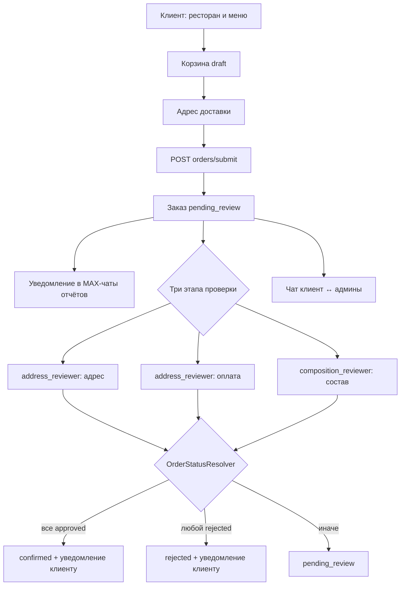
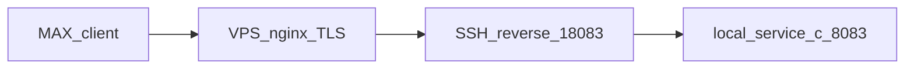

# service-c — MAX mini-app «Заказ еды»

Backend (Laravel 13, PHP 8.4) и Vue 3 SPA для MAX mini-app: сеть ресторанов → меню → корзина → заявка → проверка администраторами (адрес, оплата, состав) → подтверждение или отклонение. Клиент видит «Мои заказы», чат по заказу и уведомления в MAX. Расчёт доставки по категории клиента и порогам суммы заказа. Админ меню: CRUD блюд, график доступности по датам и импорт из XLS/XLSX. Также webhook MAX, UI Stand (приветствие + inline-кнопки), локальная отладка в браузере (`MAX_LOCAL_DEV_INIT_DATA`) и Artisan-команды `max:bot:info`, `max:webhook:*`, `max:ui-stand:send`, `max:food-admin:assign`, `food:sync-dish-availability`.

| Документ | Назначение |
|---|---|
| [корневой README](../README.md) | Docker, gateway, общая инфраструктура |
| [docs/scripts.md](../docs/scripts.md) | Каталог скриптов: туннели MAX, тесты, VPS |
| [shared/max-messenger](../shared/max-messenger/) | Общий HTTP-клиент MAX Bot API |
| [Бизнес-логика](#бизнес-логика) | Правила домена Food, статусы, сервисный слой |

Порт по умолчанию: **8083** (`SERVICE_C_PORT` в `docker-compose.yml`). Vite dev: **5174** (`SERVICE_C_VITE_PORT`).

## Маршрутизация

| Путь | Куда | Авторизация |
|---|---|---|
| `http://localhost:8083/` | Welcome-страница Laravel | Публичный |
| `http://localhost:8083/max-app` | Vue SPA (прямой доступ) | Публичный |
| `http://localhost:8083/up` | Health check | Публичный |
| `http://localhost:8083/api/webhooks/max` | Webhook MAX | `X-Max-Bot-Api-Secret` |
| `http://localhost:8083/api/max/auth` | Валидация `initData` → Bearer token | Публичный |
| `http://localhost:8083/api/food/*` | Food API | Bearer (`max.miniapp.auth`) |
| `http://localhost:8080/api/c/...` | Через nginx-gateway (префикс `/api/c`) | Gateway auth (`X-User-Id`) |
| `http://localhost:8080/api/c/webhooks/max` | Webhook через gateway | **Без** gateway auth |

**Важно:** MAX на **том же домене**, что и `main-app` (`94-228-117-27.sslip.io`), идёт через `nginx-gateway` → `service-c` по путям **без** префикса `/api/c`: `/max-app`, `/max-build/`, `/api/webhooks/max`, `/api/max/`, `/api/food/`. Ассеты mini-app в каталоге **`/max-build/`** (не `/build/`), чтобы не пересекаться с Vite `main-app`.

Префикс `/api/c/` остаётся для отладки gateway auth и единообразия с `service-a` / `service-b`.

**Важно (отдельный туннель):** MAX (webhook и mini-app в dev) может обращаться по **публичному HTTPS URL** на порт **8083** через туннель, а не через gateway `:8080`. Gateway location `/api/c/webhooks/max` без `auth_request` нужен для локальной отладки и единообразия префиксов.

## Бизнес-логика

Mini-app реализует цепочку **рестораны → меню → корзина → заявка → проверка администраторами → подтверждение или отклонение**. Доменная логика сосредоточена в `app/Services/Food/`; контроллеры принимают только валидированные запросы и делегируют сервисам.

### Участники

| Участник | Идентификация | Возможности |
|---|---|---|
| Клиент | `max_user_id` из MAX `initData` | Меню, корзина, оформление, «Мои заказы», чат по своим заказам |
| Админ адреса и оплаты | `address_reviewer` в `max_food_order_admins` | Очередь заказов (`scope=address`), approve/reject адреса и оплаты |
| Админ состава | `composition_reviewer` | Очередь (`scope=composition`), approve/reject состава |
| Админ меню | `menu_manager` | CRUD блюд, график доступности по датам, импорт из XLS/XLSX |

Один `max_user_id` может иметь несколько ролей (отдельная строка в `max_food_order_admins` на роль). Роли возвращаются в `POST /api/max/auth` → `user.admin_roles`; фронт переключает клиентский и админский режим без отдельного запроса.

Демо после `db:seed`: клиенты **1001** (Стандарт), **1002** (VIP); админы **1003**–**1005** (см. [Администраторы](#администраторы)). В prod — `max:food-admin:assign`.

### Сквозной сценарий



### Корзина

Реализация: `CartService`, `CartTotalsCalculator`, `CartDtoFactory`.

| Правило | Поведение |
|---|---|
| Одна корзина на пользователя | Статус `draft`; при оформлении → `submitted` |
| Один ресторан | Позиции только из одного ресторана; иначе `422` — очистите корзину |
| Добавление | Блюдо должно быть `is_available`, ресторан — `is_active`; дубликат `dish_id` увеличивает `quantity` |
| `is_available` | Флаг в `max_dishes`; ежедневно в **07:00 MSK** команда `food:sync-dish-availability` выставляет `true`, если в графике (`max_dish_availability_dates`) есть запись на сегодня, иначе `false`. Ручное изменение в CRUD действует до следующего запуска |
| Пустая корзина | Удаление последней позиции удаляет корзину; `GET /cart` → `{ cart: null }` |
| Редактирование | Только `draft`; иначе `Cart is no longer editable` |

### Адрес доставки

Реализация: `CartDeliveryAddressService` (`app/Services/Food/`), `MaxUserDeliveryAddressService` (`app/Services/Max/`).

- При создании корзины подставляется сохранённый адрес из `max_users.delivery_address` (если есть).
- `PATCH /api/food/cart` сохраняет адрес в корзине и профиле пользователя.
- Перед `POST /api/food/orders/submit` адрес обязателен (непустая строка после `trim`); иначе `422` «Укажите адрес доставки».
- При успешном оформлении адрес снова сохраняется в профиль (идемпотентно).

### Категории клиентов и доставка

Реализация: `DeliveryCostResolver`, `CartTotalsCalculator`, `EloquentDeliveryTierRepository`.

- Категория клиента (`max_customer_categories`) задаёт набор тарифов для пары **ресторан + категория** (`max_restaurant_category_delivery_tiers`).
- Тарифы сортируются по `min_items_total` по убыванию; выбирается **первый** порог, где `items_total >= min_items_total` → `delivery_cost`.
- Если у пользователя нет категории — `delivery_applicable: false`, `delivery_cost: null`, `total` = сумма позиций.
- Суммы фиксируются в заказе (`items_total`, `delivery_cost`, `total`) и в `items_snapshot` (снимок позиций на момент оформления).

Демо-тарифы после `db:seed` (для каждого активного ресторана):

| Категория | Бесплатная доставка от | Платная доставка |
|---|---|---|
| Стандарт | 1000 ₽ | 200 ₽ |
| VIP | 500 ₽ | 100 ₽ |

### Оформление заявки

Реализация: `OrderSubmissionService`.

1. В транзакции с `lockForUpdate` читается черновая корзина (непустая, с адресом).
2. Строится `items_snapshot` через `OrderItemsSnapshotBuilder` (название, цена, количество, `image_url`; суммы форматирует `FoodMoneyFormatter`).
3. Рассчитываются итоги через `CartTotalsCalculator`.
4. Создаётся заказ: `status = pending_review`, все три `*_review_status = pending`.
5. Корзина переводится в `submitted`.
6. **После commit** (вне транзакции) — синхронное уведомление в MAX-чаты отчётов (`LaravelFoodOrderMaxNotifier`). Сбой MAX не отменяет заказ.

Подробности формата сообщения — [Уведомления о заказах в MAX](#уведомления-о-заказах-в-max).

### Проверка заказа (три этапа)

Реализация: `OrderAddressReviewService`, `OrderPaymentReviewService`, `OrderCompositionReviewService`, `OrderReviewAuthorizationService`, `OrderStatusResolver`, `OrderReviewCompletionService`.

| Этап | Поле | Кто проверяет | Approve / Reject |
|---|---|---|---|
| Адрес | `address_review_status` | `address_reviewer` | `POST .../address/approve`, `.../address/reject` |
| Оплата | `payment_review_status` | `address_reviewer` | `POST .../payment/approve`, `.../payment/reject` |
| Состав | `composition_review_status` | `composition_reviewer` | `POST .../composition/approve`, `.../composition/reject` |

Правила переходов (`OrderReviewAuthorizationService`):

- Этап можно завершить только в статусе `pending`; повторное действие → `422`.
- Для заказов в `confirmed` или `rejected` проверка адреса/оплаты запрещена.
- Очередь состава учитывает legacy-значение `not_applicable` (`FoodOrder::isInCompositionReviewQueue`).
- При отклонении обязателен непустой `comment` → `422`.

Итоговый `status` (`OrderStatusResolver`):

| Условие | `status` |
|---|---|
| Любой этап → `rejected` | `rejected` |
| Все три → `approved` | `confirmed` |
| Иначе | `pending_review` |

При отклонении — личное сообщение клиенту с указанием scope (адрес / оплата / состав). При **первом** переходе в `confirmed` — уведомление о принятии заказа. Сбой MAX не откатывает решение.

Онлайн-оплаты нет: этап «оплата» — ручная проверка админом (перевод, наличные и т.п.).

### Мои заказы и чат

Реализация: `CustomerOrderQueryService`, `OrderChatService`, `OrderChatAuthorizationService`, `LaravelOrderChatNotifier`.

- Клиент видит только свои заказы (`GET /api/food/orders`, `GET /api/food/orders/{id}`).
- Чат доступен владельцу заказа и любому активному админу (`max_food_order_admins.is_active = 1`).
- `GET .../messages` помечает сообщения прочитанными (`max_food_order_chat_reads`); поддерживает `?after_id=`, `?limit=` (до 100).
- `POST .../messages` — тело до 2000 символов.
- Новое сообщение → push в MAX контрагенту (клиенту — все активные админы; админу — клиент заказа).

### Управление меню

Реализация: `DishAdminService`, `DishImageUploadService`, `DishSpreadsheetImportService`, `DishSpreadsheetRowParser`, `DishDefaultImageProvider`.

| Операция | Поведение |
|---|---|
| Список | Фильтры `?restaurant_id=`, `?category_id=`, `?name=` (поиск по названию, до 255 символов) |
| Создание | `photo` обязателен; загрузка в `dishes/{id}/{uuid}.{ext}` |
| Обновление | `photo` опционален; при замене старый файл удаляется |
| Удаление | Soft delete; файл изображения сохраняется; если блюдо в активных корзинах — `409` |
| Импорт XLS/XLSX | `POST /api/food/admin/dishes/import`; колонка A — «Название. 100г», B — цена; при совпадении имени в категории обновляется только цена, иначе создаётся блюдо с placeholder-фото |
| График доступности | `GET`/`PUT /api/food/admin/dish-availability-schedule`; редактирование только **будущих** дат (с завтра по Москве); сегодня и прошлое — read-only; без записи на сегодня блюдо недоступно после cron |

Клиентское меню (`MenuQueryService`) отдаёт только активные рестораны и доступные блюда; удалённые (soft delete) скрыты.

### Карта сервисов (Food)

| Область | Сервисы |
|---|---|
| Каталог | `MenuQueryService` |
| Корзина | `CartService`, `CartDeliveryAddressService`, `CartTotalsCalculator`, `CartDtoFactory` |
| Доставка | `DeliveryCostResolver` |
| Заказ | `OrderSubmissionService`, `OrderItemsSnapshotBuilder`, `FoodMoneyFormatter`, `CustomerOrderQueryService`, `AdminOrderQueryService` |
| Проверка | `OrderAddressReviewService`, `OrderPaymentReviewService`, `OrderCompositionReviewService`, `OrderReviewAuthorizationService`, `OrderStatusResolver`, `OrderReviewCompletionService` |
| Чат | `OrderChatService`, `OrderChatAuthorizationService` |
| Меню (админ) | `DishAdminService`, `DishAvailabilityScheduleService`, `DishSpreadsheetImportService`, `DishImageUploadService`, `DishImageDeliveryService`, `DishImageUrlResolver` |
| MAX-уведомления | `LaravelFoodOrderMaxNotifier`, `LaravelFoodOrderCustomerNotifier`, `LaravelOrderChatNotifier`, `FoodOrderMaxMessageBuilder` |
| Профиль | `MaxUserDeliveryAddressService` |

Контракты — `app/Contracts/Food/` (в т.ч. раздельные read/write: `FoodOrderWriteRepositoryInterface`, `FoodOrderCustomerReadRepositoryInterface`, `FoodOrderAdminReadRepositoryInterface`; `DishAdminRepositoryInterface` / `DishCatalogRepositoryInterface` → один `EloquentDishRepository`). Eloquent-реализации — `app/Repositories/Food/`. Ошибки домена — `FoodDomainException` → JSON `{ message }` с HTTP 4xx.

## Уведомления о заказах в MAX

После успешного `POST /api/food/orders/submit` (commit в `max_food_orders`) service-c отправляет **текстовое** сообщение с кнопкой **«Заказ еды»** (`open_app`) во **все** чаты и пользователей из `MAX_REPORT_CHAT_IDS` и `MAX_REPORT_USER_IDS` — те же переменные, что у **service-b** для отчётов по торговым точкам.

Кнопка открывает mini-app (`MAX_MINI_APP_URL` или URL из `MAX_WEBHOOK_URL` / `max.bot_username`). Если URL mini-app не настроен, уходит только текст без кнопки.

Отправка **синхронная** (в том же HTTP-запросе, после транзакции). Очередь не используется.

**Сбой MAX не отменяет заказ:** заявка остаётся в БД; ошибка логируется в канал `messMax` (`storage/logs/messMax.log`).

### Формат сообщения

```
Новая заявка №42
Ресторан: Пиццерия
Клиент: Иван (@ivan, id 1002)
Адрес: ул. Ленина, 1

• Маргарита × 2 — 800 ₽
• Кола × 1 — 150 ₽

Сумма блюд: 950 ₽
Доставка: 200 ₽
Итого: 1150 ₽
```

Если доставка не применима — строка «Доставка» опускается. Лимит текста — **4000** символов; при длинном списке позиции обрезаются с пометкой «…и ещё N позиций».

### Настройка

| Переменная | Назначение |
|---|---|
| `MAX_REPORT_CHAT_IDS` | Chat ID получателей (через запятую) |
| `MAX_REPORT_USER_IDS` | User ID получателей (через запятую) |
| `MAX_BOT_ACCESS_TOKEN` | Токен бота; **тот же бот**, что добавлен в целевой чат |
| `MAX_MINI_APP_URL` | URL mini-app для кнопки «Заказ еды» (или выводится из `MAX_WEBHOOK_URL`) |
| `MAX_UI_STAND_MINI_APP_BUTTON_TEXT` | Текст кнопки (по умолчанию «Заказ еды») |

На prod/VPS продублируйте значения из `service-b/.env`. Хотя бы один из списков (`chat_ids` или `user_ids`) должен быть непустым — иначе при submit notifier выбросит исключение конфигурации.

### Реализация (слои)

| Компонент | Файл |
|---|---|
| Конфиг | `config/max.php` → `order_notifications` |
| Сборка текста | `app/Services/Food/FoodOrderMaxMessageBuilder.php` |
| Отправка | `app/Services/Food/LaravelFoodOrderMaxNotifier.php` |
| Интеграция (отчёты) | `app/Services/Food/OrderSubmissionService.php` (вызов после `DB::transaction`) |
| Уведомление клиенту | `app/Services/Food/LaravelFoodOrderCustomerNotifier.php`, `OrderReviewCompletionService.php` |
| HTTP-клиент | `shared/max-messenger` (`MaxMessengerClientInterface`) |

## Уведомления клиенту о результате проверки

После завершения проверки заказа service-c отправляет **личное** текстовое сообщение клиенту (`max_user_id` из заказа) через MAX Bot API.

| Событие | Когда | Сервис |
|---|---|---|
| Подтверждение | Все три этапа (`address`, `payment`, `composition`) → `approved`, заказ впервые переходит в `confirmed` | `OrderReviewCompletionService` → `LaravelFoodOrderCustomerNotifier::notifyConfirmed` |
| Отклонение | Любой этап → `rejected` | `LaravelFoodOrderCustomerNotifier::notifyRejected` (с указанием scope: адрес / оплата / состав) |

Сборка текста — `FoodOrderMaxMessageBuilder` (`buildCustomerConfirmed`, `buildCustomerRejected`). Сбой MAX **не откатывает** решение по заказу; ошибка логируется в `messMax`.

## Структура (ключевые каталоги)

```
service-c/
├── app/
│   ├── Console/Commands/           # max:bot:info, max:webhook:*, max:ui-stand:send,
│   │                               # max:miniapp:verify, max:food-admin:assign,
│   │                               # food:sync-dish-availability (SyncDishAvailabilityCommand)
│   ├── Contracts/
│   │   ├── Auth/                   # GatewayUserResolver, GatewayAuthSession, GatewayUserContext
│   │   ├── Food/                   # Cart*, Dish*, FoodOrder* (read/write/admin), Menu*, Restaurant*,
│   │   │                           # DeliveryTier*, OrderChat*, notifiers, DishAvailability*
│   │   └── Max/                    # initData validator, webhook router, order notification config
│   ├── DTO/
│   │   ├── Food/                   # Cart*, Order*, Admin*, DishAvailability*, ImportDishRowDto,
│   │   │                           # DishImportResultDto, OrderItemsSnapshotDto, Create/UpdateDishDto
│   │   ├── Max/                    # MaxWebAppInitDataDto, MaxCallbackUpdateDto, MaxOrderNotificationConfig
│   │   └── Auth/                   # GatewayUserDto
│   ├── Enums/Food/                 # CartStatus, OrderStatus, OrderReviewStatus, OrderRejectionScope,
│   │                               # FoodOrderAdminRole, DishVatRate, DishWeightUnit,
│   │                               # CustomerCategoryName, OrderMessageAuthorType
│   ├── Exceptions/Food/            # FoodDomainException
│   ├── Exceptions/Max/             # MaxWebAppInitDataException
│   ├── Http/
│   │   ├── Controllers/Api/        # MaxAuth, MaxWebhook
│   │   ├── Controllers/Api/Food/   # Restaurant, Cart, Order, OrderChat, DishImage,
│   │   │                           # AdminDish, AdminDishAvailability, AdminOrderReview
│   │   ├── Middleware/             # AuthenticateMaxMiniApp, EnsureFoodOrderAdmin,
│   │   │                           # TrustGatewayAuth, VerifyMaxWebhookSecret
│   │   ├── Requests/Food/          # cart, order chat, reject review
│   │   │   └── Admin/              # dishes CRUD/import, dish-availability-schedule
│   │   └── Responses/              # GatewayUnauthorizedResponse
│   ├── Models/                     # Restaurant, Dish, DishAvailabilityDate, Cart, FoodOrder,
│   │                               # FoodOrderMessage, FoodOrderChatRead, MaxUser, CustomerCategory, …
│   ├── Repositories/Food/          # EloquentCart, EloquentDish, EloquentDishAvailability,
│   │                               # EloquentFoodOrder, EloquentRestaurant, EloquentDeliveryTier, …
│   ├── Rules/                      # MinImageDimensions, ValidDishPhotoMime
│   ├── Services/
│   │   ├── Auth/                   # EloquentGatewayUserResolver, LaravelGatewayAuthSession,
│   │   │                           # RequestGatewayUserContext
│   │   ├── Food/                   # Cart*, Menu*, OrderSubmission*, OrderItemsSnapshotBuilder,
│   │   │                           # FoodMoneyFormatter, DeliveryCost*, Order*Review*,
│   │   │                           # OrderChat*, AdminOrderQuery*, CustomerOrderQuery*,
│   │   │                           # DishAdmin*, DishAvailabilitySchedule*, DishSpreadsheetImport*,
│   │   │                           # DishSpreadsheetRowParser, DishDefaultImageProvider, DishImage*,
│   │   │                           # FoodOrderMaxMessageBuilder, LaravelFoodOrder*Notifier,
│   │   │                           # LaravelOrderChatNotifier, OrderStatusResolver, CartDeliveryAddressService
│   │   └── Max/                    # MaxWebAppInitDataValidator, MaxMiniAppAuthService,
│   │                               # MaxUserDeliveryAddressService, EnvMaxBotTokenProvider,
│   │                               # ConfigMaxMessengerRetryConfigFactory, ConfigMaxOrderNotificationConfigProvider,
│   │                               # UiStand/* (MaxCallbackHandler, MaxWebhookUpdateRouter, …)
│   └── Support/                    # MaxAppRequestContext, MaxLocalDevInitData,
│                                   # MaxOpenAppTargetResolver, MaxMiniAppAccessLogger,
│                                   # MaxWebAppInitDataSigner, DishPhotoAllowedExtensions
├── config/max.php                  # webhook, miniapp, local_dev_*, ui_stand, order_notifications
├── database/
│   ├── factories/                  # Restaurant, MenuCategory, Dish
│   ├── migrations/                 # max_users, food domain, review/chat/payment, soft deletes,
│   │                               # max_dish_availability_dates
│   └── seeders/                    # Restaurant, CustomerCategory, FoodOrderAdmin
│                                   # + assets/dishes/ (placeholder JPG)
├── resources/
│   ├── js/max-app/                 # Vue 3 SPA + MAX Bridge
│   │   ├── api/foodClient.js
│   │   ├── bridge/maxBridge.js
│   │   ├── components/             # DishImage, OrderChat*, OrderStatusBadge, OrderReviewStageBadges,
│   │   │                           # MyOrdersButton, AppSelect
│   │   ├── composables/            # useAuth, useCart, useAdminFlow, useMyOrders, useDishAdmin,
│   │   │                           # useDishAvailabilitySchedule, useClientNavigation, useRestaurantsMenu,
│   │   │                           # useMaxBackButton
│   │   ├── constants/              # views.js (VIEWS, ADMIN_*, ROLE_*), dishPhoto.js
│   │   ├── pages/                  # RestaurantList, MenuPage, CartPage, OrderConfirmationPage,
│   │   │                           # OrderListPage, OrderDetailPage
│   │   ├── pages/admin/            # AdminHomePage, AdminOrderList/DetailPage, AdminDishList/FormPage,
│   │   │                           # AdminDishAvailabilityPage, RejectOrderModal
│   │   └── utils/                  # orderStatus.js
│   ├── css/max-app.css             # Tailwind CSS
│   └── views/max-app.blade.php     # inline boot WebApp.ready + localDevInitData
├── routes/api.php, web.php
├── docker-entrypoint.sh            # auto `npm run build`; фоновый `php artisan schedule:work`
└── tests/                          # Feature + Unit (БД: sail_db_testing)
    └── Support/                    # FoodTestDataBuilder, MaxInitDataFixtureBuilder, ResolvesDishImageUrl,
                                    # DishSpreadsheetTestFileFactory, DishImportSpreadsheetFactory, …
```

Shared-пакет: `../shared/max-messenger` (`example/max-messenger` в `composer.json`) — HTTP-клиент MAX Bot API, DTO сообщений, retry-конфиг. Импорт XLS/XLSX: `phpoffice/phpspreadsheet` (^3.9).

## Быстрый старт

```bash
cp service-c/.env.example service-c/.env
# Заполните MAX_BOT_ACCESS_TOKEN, MAX_WEBHOOK_SECRET (≥5 символов)
docker compose build service-c
docker compose up -d service-c
```

При первом запуске контейнер сам соберёт фронтенд, если нет `public/max-build/manifest.json` (см. `docker-entrypoint.sh`).

### База данных

Таблицы service-c с префиксом `max_*`:

| Таблица | Назначение |
|---|---|
| `max_users` | Пользователи MAX; `customer_category_id`, `delivery_address` |
| `max_customer_categories` | Категории клиентов (Стандарт, VIP, …); soft delete |
| `max_restaurants` | Рестораны; soft delete |
| `max_menu_categories` | Категории меню; soft delete |
| `max_dishes` | Блюда (`name`, `description`, `weight`, `weight_unit`, `vat_rate`, `image_url`, `is_available`, …); soft delete |
| `max_dish_availability_dates` | График доступности: пара `(dish_id, available_date)`; unique constraint |
| `max_restaurant_category_delivery_tiers` | Тарифы доставки |
| `max_carts`, `max_cart_items` | Корзины и позиции |
| `max_food_orders` | Заявки (`items_total`, `delivery_cost`, `delivery_address`, поля review: address / payment / composition) |
| `max_food_order_admins` | Роли администраторов (`address_reviewer`, `composition_reviewer`, `menu_manager`) |
| `max_food_order_messages` | Сообщения чата по заказу |
| `max_food_order_chat_reads` | Отметки прочтения чата (`reader_max_user_id`, `last_read_message_id`) |

Общая MySQL с остальными сервисами (`sail_db`).

```bash
docker compose exec -T service-c php artisan migrate
docker compose exec -T service-c php artisan db:seed   # рестораны, категории, тарифы, demo users и admins
```

`DatabaseSeeder` вызывает `RestaurantSeeder` → `CustomerCategorySeeder` → `FoodOrderAdminSeeder`.

Миграции (хронология):

| Файл | Содержание |
|---|---|
| `2026_06_08_000001` | `max_users` |
| `2026_06_08_000002` | `personal_access_tokens` (Sanctum) |
| `2026_06_08_000003` | food domain (рестораны, меню, корзины, заказы) |
| `2026_06_09_000001` | `image_url` у блюд |
| `2026_06_13_000001` | категории клиентов, тарифы доставки |
| `2026_06_13_000002` | `delivery_address` у `max_users` |
| `2026_06_23_000001` | `max_food_order_admins` |
| `2026_06_23_000002` | поля review (address, composition) |
| `2026_06_24_000000` | `max_food_order_messages` |
| `2026_06_24_000001` | `max_food_order_chat_reads` |
| `2026_06_25_000000` | поля review оплаты |
| `2026_06_28_000000` | admin-поля блюд (`description`, `weight`, `vat_rate`, …) |
| `2026_06_29_000000` | soft deletes каталога |
| `2026_07_06_000000` | `max_dish_availability_dates` (график доступности блюд) |

`RestaurantSeeder` копирует placeholder JPG из `database/seeders/assets/dishes/` в `storage/app/public/dishes/seed/` и записывает в `max_dishes.image_url` **относительный путь** (например `dishes/seed/pizza.jpg`).

> **VPS:** после deploy убедитесь, что `storage/app/public` доступен (`php artisan storage:link` при необходимости). В `service-c/.env` на VPS: `APP_URL=https://94-228-117-27.sslip.io`.

> **Android/iOS MAX:** WebView не загружает внешние URL напрямую. API отдаёт `image_url` вида `/api/food/dishes/{id}/image`; сервер читает файл только из локального `public` disk. Внешние URL (`http://`, `https://`) в `image_url` не поддерживаются — endpoint вернёт `404`.

> Миграции затрагивают только схему service-c. Перед выполнением в shared-окружении согласуйте с командой (в проекте три сервиса с отдельными migration paths).

### Изображения блюд (только локальные файлы)

Колонка `max_dishes.image_url` хранит **относительный путь** внутри `Storage::disk('public')` (например `dishes/42/a1b2c3.jpg`). Загрузка внешних URL через API запрещена.

| Этап | Поведение |
|---|---|
| Сиды | `RestaurantSeeder` → `storage/app/public/dishes/seed/…` |
| Админ (create/update) | `multipart/form-data`, поле `photo` → `DishImageUploadService` → `dishes/{dishId}/{uuid}.{ext}` |
| Клиентское меню | JSON содержит same-origin URL `/api/food/dishes/{id}/image` |
| Отдача | `GET /api/food/dishes/{id}/image` → `DishImageDeliveryService` читает файл с `public` disk |

**Допустимые форматы загрузки** (PNG/JPEG и варианты расширений): `.png`, `.jpg`, `.jpeg`, `.jpe`, `.pjp`, `.pjpeg`, `.jfif`. Фактический MIME проверяется через `finfo` (`image/png`, `image/jpeg`). GIF, WebP, HEIC — **не принимаются**.

**Ограничения:**

| Параметр | Значение |
|---|---|
| Максимальный размер файла | 25 МБ (`max:25600` в валидации) |
| Минимальное разрешение | ширина ≥ **800** px **и** высота ≥ **600** px одновременно |
| Примеры | 800×600 ✓; 1920×1080 ✓; 799×600 ✗; 800×599 ✗; 600×800 ✗ (ширина < 800) |

При нарушении разрешения API возвращает `422` с сообщением «Изображение должно быть не менее 800×600 пикселей».

Единый whitelist на backend: `App\Support\DishPhotoAllowedExtensions` (используется в FormRequest, `DishImageUploadService` и правиле `MinImageDimensions`).

### Фронтенд (Vite, порт 5174)

```bash
docker compose exec service-c npm run build   # для мобильных и туннеля (обязательно)
docker compose exec service-c npm run dev     # только локальная разработка на ПК
```

> **Мобильные (iOS/Android):** mini-app открывается через HTTPS-туннель. Используйте **`npm run build`**, не `npm run dev`.
> Dev-сервер Vite отдаёт ассеты с `localhost:5174` — с телефона этот адрес недоступен (белый экран).
> Маршрут `/max-app` при запросе не с `localhost`/`127.0.0.1` принудительно отключает Vite hot-file (`web.php` + `MaxAppRequestContext`).
> Если ранее запускали `npm run dev`, удалите `public/hot` в контейнере или пересоберите: `npm run build`.

### Локальная отладка в браузере (без MAX WebView)

На `http://localhost:8083/max-app` можно открыть mini-app в обычном браузере с подписанной заглушкой `initData` (без реального MAX Bridge).

| Переменная | Назначение |
|---|---|
| `MAX_LOCAL_DEV_INIT_DATA` | `true` — включить заглушку (только `APP_ENV=local\|testing`, только запросы с `localhost`/`127.0.0.1`, не через публичный туннель) |
| `MAX_LOCAL_DEV_USER_ID` | Демо-пользователь: `1001` (Стандарт), `1002` (VIP), `1003` (админ адреса), `1004` (админ состава), `1005` (админ меню); профили — `config/max.php` → `local_dev_demo_users` |
| `MAX_BOT_ACCESS_TOKEN` | Обязателен для подписи заглушки |

Реализация: `app/Support/MaxLocalDevInitData.php`, `MaxWebAppInitDataSigner.php`; значение передаётся в Blade (`localDevInitData`) и подставляется фронтом при отсутствии `window.WebApp.initData`.

> Для `menu_manager` (1005) используйте MAX WebView или назначьте роль своему `max_user_id` после входа через туннель.

### Тесты

```bash
./scripts/test-services.sh service-c
# или только service-c:
docker compose exec -T service-c php artisan test
```

Скрипт пересоздаёт `sail_db_testing`, прогоняет миграции всех сервисов и запускает PHPUnit. Тестовая БД: **`sail_db_testing`** (см. `phpunit.xml`, `.env.testing`).

## Переменные окружения

### MAX

| Переменная | Назначение |
|---|---|
| `MAX_BOT_ACCESS_TOKEN` | Токен бота MAX (Bot API + валидация `initData`) |
| `MAX_BOT_USERNAME` | Username бота (`max:bot:info`) |
| `MAX_BOT_USER_ID` | `user_id` бота из `max:bot:info` — `contact_id` для кнопки `open_app` |
| `MAX_WEBHOOK_URL` | Публичный HTTPS URL webhook, напр. `https://exampleprojectsail.fxtun.dev/api/webhooks/max` |
| `MAX_WEBHOOK_SECRET` | Секрет webhook (минимум 5 символов), заголовок `X-Max-Bot-Api-Secret` |
| `APP_URL` | Корень сайта **без** `/max-app`, напр. `https://exampleprojectsail.fxtun.dev` |
| `MAX_PUBLIC_APP_URL` | Явный публичный origin для asset/API при `APP_URL=localhost` (по умолчанию — из `MAX_WEBHOOK_URL`) |
| `MAX_MINI_APP_URL` | URL для кнопки `open_app` в сообщениях (если пуст — `MAX_PUBLIC_APP_URL` + `/max-app` или `https://max.ru/{username}`) |
| `MAX_UI_STAND_GREETING` | Текст приветствия UI Stand |
| `MAX_UI_STAND_MINI_APP_BUTTON_TEXT` | Подпись кнопки mini-app в UI Stand (по умолчанию «Заказ еды») |
| `MAX_UI_STAND_CHAT_IDS` | Chat ID для тестовой рассылки (через запятую) |
| `MAX_UI_STAND_USER_IDS` | User ID для тестовой рассылки (через запятую) |
| `MAX_REPORT_CHAT_IDS` | Chat ID для уведомлений о заказах (те же ID, что в service-b; через запятую) |
| `MAX_REPORT_USER_IDS` | User ID для уведомлений о заказах (те же ID, что в service-b; через запятую) |
| `MAX_MINIAPP_AUTH_DATE_MAX_AGE_SECONDS` | Допустимый возраст `auth_date` в initData (по умолчанию 86400) |
| `MAX_MINIAPP_TOKEN_TTL_SECONDS` | TTL Bearer-токена Sanctum (по умолчанию 86400) |
| `MAX_RATE_LIMIT_RETRY_MAX` | Повторы при 429 Bot API |
| `MAX_RATE_LIMIT_RETRY_DELAY_MS` | Задержка между повторами при 429 |
| `MAX_ATTACHMENT_NOT_READY_RETRY_MAX` | Повторы при «attachment not ready» |
| `MAX_ATTACHMENT_NOT_READY_RETRY_DELAY_MS` | Задержка между такими повторами |
| `MAX_LOCAL_DEV_INIT_DATA` | Подписанная заглушка initData на `localhost:8083/max-app` (см. [Локальная отладка](#локальная-отладка-в-браузере-без-max-webview)) |
| `MAX_LOCAL_DEV_USER_ID` | Каким демо-пользователем открывать mini-app в браузере (по умолчанию `1002`) |

### Прочие

| Переменная | Назначение |
|---|---|
| `DB_*` | MySQL (`host.docker.internal`, БД `sail_db`) |
| `LOG_STACK` | По умолчанию `single,messMax` — события MAX в `storage/logs/messMax.log` |
| `REDIS_HOST` | `redis` (кэш/очереди в compose) |

## HTTPS-туннель на порт 8083

MAX требует **HTTPS:443** для webhook и mini-app. В dev нужен публичный туннель на `SERVICE_C_PORT` (по умолчанию **8083**).

### Рекомендуется: VPS hybrid (локальная отладка)

Код и Docker остаются на **вашем ПК**; VPS даёт только стабильный HTTPS без interstitial fxTunnel.



| Шаг | Команда |
|---|---|
| Первичная настройка | `cp scripts/vps-tunnel.env.example scripts/vps-tunnel.env` — заполнить `VPS_HOST`, `VPS_USER`, `VPS_DOMAIN` |
| Подготовка | `./scripts/setup-max-vps.sh` |
| nginx на VPS (один раз) | `./scripts/vps-tunnel.sh apply-nginx-remote` → на VPS: `sudo certbot --nginx -d <VPS_DOMAIN>` |
| Туннель (держать открытым) | `./scripts/vps-tunnel-watch.sh` |
| После правок Vue | `./scripts/build-max-app.sh` |
| Диагностика | `./scripts/diag-max-vps.sh` |

**`.env` на локальной машине** (публичный dev-домен, не `localhost`):

```env
APP_URL=https://max-dev.94-228-117-27.sslip.io
MAX_WEBHOOK_URL=https://max-dev.94-228-117-27.sslip.io/api/webhooks/max
# MAX_MINI_APP_URL можно не задавать
```

**Кабинет MAX** → URL мини-приложения: `https://max-dev.94-228-117-27.sslip.io/max-app` (должен совпадать с origin в `.env`).

> **Не используйте prod-домен** (`94-228-117-27.sslip.io` с `docker-compose.prod.yml`), если nginx на нём уже проксирует в gateway `:8080` — для hybrid нужен **отдельный dev-поддомен** или отдельный VPS. Рекомендуется **отдельный тестовый бот MAX** для dev.

SSH на VPS: `./scripts/vps-tunnel.sh ssh-server-hint` (`AllowTcpForwarding yes`).

> **fxTunnel и mini-app:** `/max-app` всегда отдаётся как `text/html` — иначе web.max.ru показывает сырой HTML вместо страницы. Если в MAX появляется «Dev Tunnel Warning», используйте VPS-туннель (`./scripts/vps-tunnel.sh`) или cloudflared (`./scripts/cloudflared-tunnel.sh`). Webhook (POST) interstitial fxTunnel не затрагивает.

> **APP_URL:** только корень домена (`https://sub.fxtun.dev`), **не** `.../max-app`. Иначе CSS/JS будут по пути `/max-build/...` с неверным origin и не загрузятся.

При запросах с хоста туннеля `AppServiceProvider` форсирует HTTPS и корневой URL из `APP_URL` или `MAX_PUBLIC_APP_URL` / origin `MAX_WEBHOOK_URL`.

## Особенности MAX PC (desktop)

Проверено на Max PC (QtWebEngine, `WebApp.platform === 'desktop'`):

| Сценарий | Поведение |
|---|---|
| Первое открытие mini-app | Работает после `WebApp.ready()` (вызывается из inline-boot в `max-app.blade.php`, когда `document.visibilityState === 'visible'`) |
| Закрытие через **кнопку «Назад»** в шапке Max → повторное открытие | Работает: вызывается `WebApp.close()`, host корректно создаёт новую сессию |
| Закрытие через **нижний трей** Max → повторное открытие из трея | **Не работает** без перезапуска Max: host не вызывает `WebApp.close()`, webview не перезагружается, JS не получает lifecycle-событий (`visibilitychange`, `pagehide`, смена размеров окна) |

**Причина:** ограничение клиента Max PC, а не mini-app или backend. Из JavaScript нельзя надёжно детектировать «свернули в трей» и принудительно восстановить сессию.

**Рекомендации для QA и пользователей desktop:**

- Закрывать mini-app кнопкой **«Назад»** в шапке Max (на экране ресторанов BackButton привязан к `WebApp.close()`).
- Если после закрытия через трей повторное открытие «зависло» — перезапустить Max PC или открыть mini-app из чата с ботом заново.
- Для багрепорта в Max: desktop не шлёт bridge-события при сворачивании в трей и не перезагружает webview при повторном клике по иконке в трее.

Реализация boot и закрытия: `resources/views/max-app.blade.php` (inline), `resources/js/max-app/bridge/maxBridge.js` (`closeMaxApp`).

В РФ **ngrok**, **VK Tunnel** и **cloudflared Quick Tunnel** (`trycloudflare.com`) часто недоступны. Рекомендуется **fxTunnel** на **fxtun.dev**:

```bash
curl -fsSL https://fxtun.dev/install.sh | sh
export FXTUN_TOKEN=sk_...   # https://fxtun.dev → личный кабинет
./scripts/fxtun-exampleprojectsail.sh run
```

Зарезервированный субдомен проекта: **`exampleprojectsail.fxtun.dev`** (скрипт `scripts/fxtun-exampleprojectsail.sh`).
Полный цикл подготовки: `./scripts/setup-max-fxtun.sh`.

Запасной вариант — **cloudflared** (если `api.trycloudflare.com` открывается, или через VPN):

```bash
./scripts/cloudflared-tunnel.sh install
./scripts/cloudflared-tunnel.sh service-c
```

После запуска туннеля укажите в `service-c/.env`:

```env
APP_URL=https://exampleprojectsail.fxtun.dev
MAX_WEBHOOK_URL=https://exampleprojectsail.fxtun.dev/api/webhooks/max
MAX_BOT_USERNAME=<username из max:bot:info>
# MAX_MINI_APP_URL можно не задавать — см. MaxOpenAppTargetResolver
```

Получить `MAX_BOT_USERNAME` и `MAX_BOT_USER_ID`:

```bash
docker compose exec -T service-c php artisan max:bot:info
```

**Кабинет MAX** → Чат-боты → ваш бот → **Чат-бот и мини-приложение** → URL мини-приложения:

`https://exampleprojectsail.fxtun.dev/max-app`

Кнопка «Заказ еды» (`open_app`) в сообщении использует `web_app` = `MAX_MINI_APP_URL` (или URL из туннеля) и `contact_id` = `MAX_BOT_USER_ID`. **После смены .env отправьте сообщение заново** — `php artisan max:ui-stand:send`; старые кнопки в чате не обновляются.

Проверка:

```bash
docker compose exec -T service-c php artisan max:miniapp:verify
```

> **При перезапуске туннеля** URL меняется — обновите значения в `.env` и в **кабинете MAX**, затем снова выполните `max:webhook:subscribe`.

## nginx-gateway

В `nginx-gateway/nginx.conf` маршруты service-c разделены на два уровня.

**Публичные пути на общем домене** (без gateway Bearer — для MAX mini-app и webhook на VPS):

```nginx
location = /api/webhooks/max { proxy_pass http://service-c:8000/api/webhooks/max; }
location ^~ /api/food/       { proxy_pass http://service-c:8000; }
location ^~ /api/max/        { proxy_pass http://service-c:8000; }
location ^~ /max-build/      { proxy_pass http://service-c:8000; }
location ^~ /max-app         { proxy_pass http://service-c:8000; }
```

**Префикс `/api/c/`** — для отладки с gateway auth; webhook вынесен отдельно **без** `auth_request`:

```nginx
location = /api/c/webhooks/max {
    proxy_pass http://service-c:8000/api/webhooks/max;
    # без auth_request
}
location /api/c/ {
    auth_request /auth-internal;
    rewrite ^/api/c/(.*) /api/$1 break;
    proxy_pass http://service-c:8000;
}
```

Для prod/dev с туннелем на `:8083` webhook и mini-app идут напрямую в service-c; gateway locations нужны для единого домена с `main-app` и локальной проверки через `:8080`.

## API (кратко)

### Публичные

| Метод | Путь | Описание |
|---|---|---|
| `POST` | `/api/webhooks/max` | Входящие события MAX (`message_callback`, `bot_started`) |
| `POST` | `/api/max/auth` | `{ "init_data": "..." }` → `{ token, token_type, expires_in, user }` |
| `GET` | `/api/food/dishes/{id}/image` | Изображение блюда с локального `public` disk (**без** Bearer — для `` в WebView MAX) |

### Food API (`Authorization: Bearer <token>`)

| Метод | Путь | Описание |
|---|---|---|
| `GET` | `/api/food/restaurants` | Список активных ресторанов |
| `GET` | `/api/food/restaurants/{id}/menu` | Категории и блюда (с `image_url`) |
| `GET` | `/api/food/cart` | Текущая корзина (`draft`); поля `items_total`, `delivery_applicable`, `delivery_cost`, `total`, `delivery_address`, `customer_category` |
| `DELETE` | `/api/food/cart` | Очистить черновую корзину → `{ cart: null }` |
| `PATCH` | `/api/food/cart` | Сохранить адрес доставки `{ delivery_address }` (string, max 1000) |
| `POST` | `/api/food/cart/items` | Добавить позицию `{ dish_id, quantity }` |
| `PATCH` | `/api/food/cart/items/{id}` | Изменить количество `{ quantity }` |
| `DELETE` | `/api/food/cart/items/{id}` | Удалить позицию |
| `POST` | `/api/food/orders/submit` | Оформить заявку (`draft` → `pending_review`); адрес обязателен, иначе 422; после commit — уведомление в MAX-чаты отчётов |
| `GET` | `/api/food/orders` | Список заказов текущего клиента |
| `GET` | `/api/food/orders/{id}` | Детали заказа клиента (статусы review, snapshot позиций) |
| `GET` | `/api/food/orders/{id}/messages` | История чата (`?after_id=`, `?limit=` до 100); помечает прочитанным |
| `POST` | `/api/food/orders/{id}/messages` | Отправить сообщение `{ "body": "..." }` (max 2000 символов) |

Ответ `POST /api/food/orders/submit` — `{ order: { id, status, items_total, delivery_applicable, delivery_cost, total, delivery_address, items_snapshot, … } }`. Успешный ответ не зависит от доставки сообщения в MAX (см. [Уведомления о заказах в MAX](#уведомления-о-заказах-в-max)).

Ошибки домена Food: JSON `{ message }` с HTTP-кодом 4xx (например, пустая корзина, несовпадение ресторана в корзине).

### Food Admin API — проверка заказов (`Authorization: Bearer <token>`)

Префикс: `/api/food/admin`. Middleware: `max.miniapp.auth` + `food.order.admin:<role>`.

| Метод | Путь | Роль | Описание |
|---|---|---|---|
| `GET` | `/api/food/admin/me` | любая активная admin-роль | `{ admin_roles: [...] }` |
| `GET` | `/api/food/admin/orders` | `address_reviewer` или `composition_reviewer` | Очередь: `?scope=address\|composition&status=pending\|all` |
| `GET` | `/api/food/admin/orders/{id}` | как выше | Детали заказа: `?scope=address\|composition` (обязателен) |
| `POST` | `/api/food/admin/orders/{id}/address/approve` | `address_reviewer` | Подтвердить адрес |
| `POST` | `/api/food/admin/orders/{id}/address/reject` | `address_reviewer` | Отклонить адрес `{ "comment": "..." }` |
| `POST` | `/api/food/admin/orders/{id}/payment/approve` | `address_reviewer` | Подтвердить оплату |
| `POST` | `/api/food/admin/orders/{id}/payment/reject` | `address_reviewer` | Отклонить оплату `{ "comment": "..." }` |
| `POST` | `/api/food/admin/orders/{id}/composition/approve` | `composition_reviewer` | Подтвердить состав |
| `POST` | `/api/food/admin/orders/{id}/composition/reject` | `composition_reviewer` | Отклонить состав `{ "comment": "..." }` |

Админы с ролью проверки заказов и клиент видят чат на экране деталей заказа (те же endpoints `/api/food/orders/{id}/messages`).

В MAX mini-app: `address_reviewer` — раздел «Заказы» (адрес + оплата); `composition_reviewer` — очередь по составу; при нескольких ролях — переключатель «Заказы» / «Меню».

### Food Admin API — меню (`menu_manager`)

Префикс: `/api/food/admin`. Middleware: `max.miniapp.auth` + `food.order.admin:menu_manager`. Загрузка фото — `multipart/form-data` (поле `photo`); для update без замены фото поле `photo` можно не отправлять.

| Метод | Путь | Описание |
|---|---|---|
| `GET` | `/api/food/admin/menu-categories` | Категории меню для select (опционально `?restaurant_id=`) |
| `GET` | `/api/food/admin/dishes` | Список блюд (`?restaurant_id=`, `?category_id=`, `?name=` — поиск по названию) |
| `GET` | `/api/food/admin/dishes/{id}` | Карточка блюда для формы |
| `POST` | `/api/food/admin/dishes/import` | Импорт из XLS/XLSX: `file`, `menu_category_id` (см. [Управление меню](#управление-меню)) |
| `POST` | `/api/food/admin/dishes` | Создание (`photo` обязателен) |
| `POST` | `/api/food/admin/dishes/{id}` | Обновление (`_method=PUT` или прямой POST; `photo` опционален) |
| `DELETE` | `/api/food/admin/dishes/{id}` | Мягкое удаление (`deleted_at`); файл изображения сохраняется для истории заказов; при использовании в активных корзинах — `409` |
| `GET` | `/api/food/admin/dish-availability-schedule` | График доступности (`?restaurant_id=`, `?category_id=` обязательны; опционально `?date_from=`, `?date_to=` в формате `Y-m-d`) |
| `PUT` | `/api/food/admin/dish-availability-schedule` | Пакетное сохранение графика (тело ниже) |

**График доступности** (`GET /api/food/admin/dish-availability-schedule`):

| Поле ответа | Описание |
|---|---|
| `dishes` | Список блюд категории: `{ id, name, is_available }` |
| `dates` | Массив дат диапазона (`Y-m-d`); по умолчанию 7 дней назад + 30 вперёд от сегодня (MSK) |
| `schedule` | Объект `{ "<dish_id>": ["2026-07-10", …] }` — даты, когда блюдо доступно |
| `editable_from` | Первая редактируемая дата (завтра по `Europe/Moscow`) |

**Сохранение графика** (`PUT /api/food/admin/dish-availability-schedule`, JSON):

```json
{
  "restaurant_id": 1,
  "category_id": 2,
  "date_from": "2026-07-01",
  "date_to": "2026-07-31",
  "changes": [
    { "dish_id": 1, "dates": ["2026-07-10", "2026-07-12"] }
  ]
}
```

Семантика `dates`: полный список **доступных** будущих дат блюда в запрошенном диапазоне (upsert новых, удаление снятых). Попытка изменить сегодня или прошлое → `422`.

Поля create/update: `name`, `menu_category_id`, `description` (nullable), `weight`, `weight_unit` (`g`, `kg`, `ml`, `l`), `price`, `vat_rate` (nullable = «Не облагается НДС»; иначе `5`, `7`, `10`, `20`, `22`), `is_available`, `photo` (см. [Изображения блюд](#изображения-блюд-только-локальные-файлы)).

**Импорт из таблицы** (`POST /api/food/admin/dishes/import`, `multipart/form-data`):

| Поле | Ограничение |
|---|---|
| `file` | `.xls` / `.xlsx`, до 5 МБ |
| `menu_category_id` | Целевая категория меню |

Формат строк (первая строка — заголовок, пропускается):

| Колонка | Формат | Пример |
|---|---|---|
| A | `Название. {вес}г` | `Маргарита. 300г` |
| B | Цена в рублях | `450` или `450,00` |

При точном совпадении `name` в категории обновляется только `price`; иначе создаётся блюдо с placeholder-изображением (`database/seeders/assets/dishes/placeholder-1.jpg`). Ответ: `{ imported_count, errors: [{ row, message }] }`; при ошибках парсинга — `422`.

В MAX mini-app пользователь с ролью `menu_manager` попадает в раздел «Меню» (CRUD блюд, переключатель «Список» / «График», кнопка «Загрузить» для импорта). Если есть и роли проверки заказов, и `menu_manager` — переключатель «Заказы» / «Меню».

### Только local/testing

| Метод | Путь | Middleware | Описание |
|---|---|---|---|
| `GET` | `/api/max/me` | `max.miniapp.auth` | `{ max_user_id }` — отладка mini-app auth |
| `GET` | `/api/data` | `trust.gateway` | `{ user: { id } }` — отладка gateway auth |

Через gateway: префикс `/api/c`, например `GET /api/c/food/restaurants` (требует gateway auth; для mini-app используйте прямой `:8083` или туннель).

## Artisan-команды MAX

```bash
docker compose exec -T service-c php artisan max:bot:info            # профиль бота (username, user_id)
docker compose exec -T service-c php artisan max:webhook:subscribe   # подписка webhook
docker compose exec -T service-c php artisan max:webhook:status      # статус подписок
docker compose exec -T service-c php artisan max:webhook:clean       # очистка dev-туннелей (.trycloudflare.com)
docker compose exec -T service-c php artisan max:miniapp:verify      # проверка URL mini-app
docker compose exec -T service-c php artisan max:ui-stand:send         # приветствие + кнопки
docker compose exec -T service-c php artisan max:food-admin:assign 1003 address_reviewer   # назначить админа адреса
docker compose exec -T service-c php artisan max:food-admin:assign 1004 composition_reviewer  # назначить админа состава
docker compose exec -T service-c php artisan max:food-admin:assign 1005 menu_manager       # назначить админа меню
docker compose exec -T service-c php artisan food:sync-dish-availability                 # синхронизация is_available по графику на сегодня (MSK)
```

### Планировщик и `is_available`

В `bootstrap/app.php` зарегистрирована ежедневная задача `food:sync-dish-availability` в **07:00** (`Europe/Moscow`). Контейнер запускает `php artisan schedule:work` в фоне (`docker-entrypoint.sh`).

Команда для каждого активного блюда (без `deleted_at`) выставляет `is_available = true`, если в `max_dish_availability_dates` есть запись на сегодняшнюю дату по Москве, иначе `false`. Первый запуск без заполненного графика сделает все блюда недоступными — это ожидаемое поведение; график нужно заполнить заранее.

Часовой пояс приложения в `config/app.php` остаётся `UTC`; все операции графика и cron явно используют `Europe/Moscow`.

## Администраторы

Роли привязаны к `max_user_id` (тот же контур auth, что у клиентов MAX mini-app):

| Роль | Значение `role` | Задача |
|---|---|---|
| Админ адреса и оплаты | `address_reviewer` | Подтвердить или отклонить адрес доставки и оплату |
| Админ состава | `composition_reviewer` | Подтвердить или отклонить состав заказа |
| Админ меню | `menu_manager` | CRUD блюд в разделе «Меню» MAX mini-app |

Один пользователь может иметь несколько ролей (отдельная строка в `max_food_order_admins` на каждую роль).

### Демо после `db:seed`

| `max_user_id` | Роль | Username |
|---|---|---|
| 1003 | `address_reviewer` | `demo_address_admin` |
| 1004 | `composition_reviewer` | `demo_composition_admin` |
| 1005 | `menu_manager` | `demo_menu_admin` |

Пользователи 1001 / 1002 остаются демо-клиентами (Стандарт / VIP). Админы 1003–1005 создаются в `FoodOrderAdminSeeder` и вызываются из `DatabaseSeeder` после `CustomerCategorySeeder`.

### Назначение в prod

Пользователь MAX должен уже существовать в `max_users` (обычно после первого входа в mini-app). Затем:

```bash
docker compose exec -T service-c php artisan max:food-admin:assign <max_user_id> address_reviewer
docker compose exec -T service-c php artisan max:food-admin:assign <max_user_id> composition_reviewer
docker compose exec -T service-c php artisan max:food-admin:assign <max_user_id> menu_manager
```

Команда идемпотентна: повторный вызов с теми же аргументами реактивирует роль (`is_active = 1`). При неизвестном `max_user_id` или неверной роли команда завершится с ошибкой.

На VPS (без префикса `docker compose exec`):

```bash
php artisan max:food-admin:assign 123456789 address_reviewer
```

Роли возвращаются в ответе `POST /api/max/auth` в поле `user.admin_roles` — фронт mini-app переключается в админ-режим без отдельного запроса.

Лог MAX: `storage/logs/messMax.log` (канал `messMax`, без токена бота в записи). Дополнительно логируются запросы к `/max-app` и `/api/max/auth` (`MaxMiniAppAccessLogger`).

## Чеклист Manual QA (кабинет MAX)

Пошаговая ручная проверка перед демо или при смене dev-туннеля.

| Шаг | Действие | Ожидаемый результат |
|---|---|---|
| 1 | `docker compose up -d service-c` | Контейнер healthy, `http://localhost:8083` отвечает |
| 2 | `php artisan migrate` + `db:seed` (если БД пустая) | Демо-рестораны «Пицца Макс», «Суши Бар»; тарифы доставки |
| 3 | `./scripts/fxtun-exampleprojectsail.sh run` | Туннель на `exampleprojectsail.fxtun.dev` |
| 4 | В `service-c/.env`: токен, секрет, `APP_URL`, `MAX_WEBHOOK_URL`, `MAX_BOT_USERNAME` | `max:bot:info` для username и `MAX_BOT_USER_ID` |
| 5 | **Кабинет MAX** → URL мини-приложения = `https://exampleprojectsail.fxtun.dev/max-app` | Сохранено |
| 6 | `docker compose exec -T service-c php artisan max:webhook:subscribe` | Подписка на `message_callback`, `bot_started`; проба URL OK |
| 7 | Открыть mini-app в MAX (чат с ботом → mini-app) | Загружается SPA «Заказ еды», список ресторанов |
| 8 | Меню → «В корзину» → корзина → ввести адрес → «Оформить заявку» | Стоимость доставки по категории; заявка `pending_review`; экран подтверждения; в MAX-чате отчётов — уведомление (если заданы `MAX_REPORT_*`) |
| 8a | «Мои заказы» → детали заказа → чат | Список заказов, статусы review, отправка сообщения |
| 8b | Войти как админ (1003/1004) → «Заказы» → approve/reject | Этапы address/payment/composition; клиент получает личное сообщение в MAX |
| 8c | Войти как `menu_manager` (1005) → «Меню» → импорт XLS/XLSX (опционально) | Блюда создаются/обновляются по правилам импорта |
| 9 | `docker compose exec -T service-c php artisan max:ui-stand:send` (опционально) | В MAX: приветствие + кнопки «да» / «нет» / «Заказ еды» |
| 10 | Нажать кнопку в MAX (UI Stand) | В `messMax.log`: событие callback, ответ «да» или «нет» |
| 11 | `docker compose exec -T service-c tail -f storage/logs/messMax.log` | События webhook/стенда без утечки токена |

### Пример команд (полный цикл)

```bash
# Подготовка (сборка, проверка .env)
./scripts/setup-max-fxtun.sh

# Терминал 1 — туннель (service-c должен быть запущен)
export FXTUN_TOKEN=sk_...
./scripts/fxtun-exampleprojectsail.sh run

# Терминал 2 — после настройки .env и кабинета MAX
docker compose exec -T service-c php artisan migrate --force
docker compose exec -T service-c php artisan db:seed
docker compose exec -T service-c php artisan max:webhook:subscribe
docker compose exec -T service-c php artisan max:ui-stand:send

# Лог стенда
docker compose exec -T service-c tail -f storage/logs/messMax.log
```

### Что не проверяется вручную в MVP

- Онлайн-оплата (проверка оплаты — ручной этап админа `address_reviewer`, без платёжного шлюза)
- Доставка с трекингом курьера
- Интеграция food API через gateway BFF (`main-app`)
- Стабильный URL при выключенном ПК (dev-only; prod — VPS 24/7)

## Покрытие тестами

| Область | Тесты |
|---|---|
| initData validator | `tests/Unit/MaxWebAppInitDataValidatorTest.php` |
| local dev initData | `tests/Unit/MaxLocalDevInitDataTest.php` |
| mini-app auth | `tests/Feature/MaxAuthControllerTest.php`, `tests/Unit/AuthenticateMaxMiniAppTest.php` |
| Food API / cart / orders | `tests/Feature/FoodRestaurantApiTest.php`, `FoodCartApiTest.php`, `FoodOrderApiTest.php` |
| Клиентские заказы | `tests/Feature/CustomerOrderListApiTest.php` |
| Admin order review | `tests/Feature/AdminOrderReviewApiTest.php` |
| Order chat | `tests/Feature/OrderChatApiTest.php`, `tests/Unit/OrderChatNotifierTest.php` |
| Food domain (unit) | `tests/Unit/CartServiceTest.php`, `CartTotalsCalculatorTest.php`, `DeliveryCostResolverTest.php`, `OrderStatusResolverTest.php`, `OrderItemsSnapshotBuilderTest.php` |
| MAX-уведомления (отчёты) | `tests/Unit/FoodOrderMaxMessageBuilderTest.php`, `LaravelFoodOrderMaxNotifierTest.php` |
| MAX-уведомления (клиент) | `tests/Unit/FoodOrderCustomerNotifierTest.php` |
| Delivery tiers / categories / restaurants | `tests/Unit/EloquentDeliveryTierRepositoryTest.php`, `EloquentCustomerCategoryRepositoryTest.php`, `EloquentRestaurantRepositoryTest.php` |
| Dish image delivery / upload | `tests/Feature/DishImageApiTest.php`, `tests/Unit/DishImageUrlResolverTest.php`, `DishImageUploadServiceTest.php`, `MinImageDimensionsTest.php`, `DishAdminEnumsTest.php` |
| Admin dishes CRUD / import | `tests/Feature/AdminDishApiTest.php`, `tests/Feature/AdminDishImportApiTest.php`, `tests/Unit/DishSpreadsheetRowParserTest.php` |
| Admin dish availability schedule | `tests/Feature/AdminDishAvailabilityApiTest.php` |
| Sync dish availability (cron) | `tests/Feature/SyncDishAvailabilityCommandTest.php` |
| MAX webhook / UI Stand | `tests/Feature/MaxWebhookControllerTest.php`, `tests/Unit/MaxCallbackHandlerTest.php`, `MaxUiStandGreetingSenderTest.php`, `MaxUiStandSendCommandTest.php`, `MaxWebhookUpdateRouterTest.php`, `MaxWebhookSubscriberTest.php`, `MaxWebhookSubscribeCommandTest.php`, `MaxCallbackUpdateDtoTest.php` |
| open_app / tunnel context | `tests/Unit/MaxOpenAppTargetResolverTest.php`, `MaxAppRequestContextTest.php`, `MaxMiniAppAccessLoggerTest.php` |
| `/max-app` route | `tests/Feature/MaxAppRouteTest.php` |
| Gateway auth | `tests/Unit/TrustGatewayAuthTest.php`, `EloquentGatewayUserResolverTest.php` |
| Webhook secret | `tests/Unit/VerifyMaxWebhookSecretTest.php` |

Вспомогательные фикстуры: `tests/Support/FoodTestDataBuilder.php`, `ResetsFoodDomainTables.php`, `AuthenticatesMaxMiniAppUser.php`, `MaxInitDataFixtureBuilder.php`, `DishPhotoTestImageFactory.php`, `DishSpreadsheetTestFileFactory.php`, `DishImportSpreadsheetFactory.php`, `ResolvesDishImageUrl.php`, `MessMaxLogTestHelper.php`.
