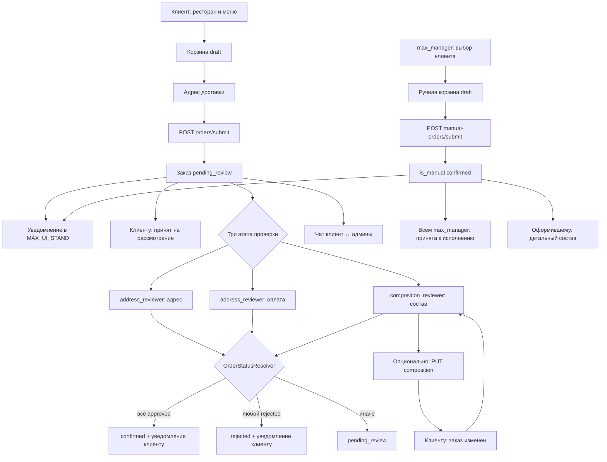
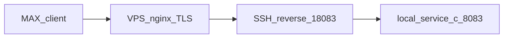

# service-c — MAX mini-app «Заказ еды»

Backend (Laravel 13, PHP 8.4) и Vue 3 SPA (composables, без vue-router) для MAX mini-app: сеть ресторанов → меню (в т.ч. комбо из двух категорий; single-restaurant mode) → корзина с подсказкой тарифа и модалкой подтверждения → заявка → проверка администраторами (адрес, оплата, состав; **редактирование состава** до approve/reject) → подтверждение или отклонение. Роль **`max_manager`** оформляет **ручные заказы** от имени клиента (отдельная корзина, сразу `confirmed`, без очереди проверки). Клиент видит «Мои заказы» (бейдж непрочитанных), чат по заказу и уведомления в MAX (в т.ч. «принят на рассмотрение» и «заказ изменен» после правки состава; для ручных заказов confirm уходит менеджерам, не клиенту). Адрес доставки — в шапке меню и в корзине (autosave). Расчёт доставки по категории клиента и порогам суммы заказа. Админ меню: CRUD категорий и блюд, график доступности по датам, импорт из XLS/XLSX, тестовые кнопки **«тест бот»** / **«тест бот 2»**. Ежедневно в **03:00 MSK** cron `food:sync-dish-availability` синхронизирует `is_available` по графику, шлёт «Доступно для заказов меню на …» в `MAX_REPORT_*` и клиентам с адресом доставки, а активным `max_manager` — два текста ежедневного меню. Также webhook MAX, UI Stand (приветствие + inline-кнопки), локальная отладка в браузере (`MAX_LOCAL_DEV_INIT_DATA`) и Artisan-команды `max:bot:info`, `max:webhook:*`, `max:ui-stand:send`, `max:food-admin:assign`, `food:sync-dish-availability`.

| Документ | Назначение |
|---|---|
| [корневой README](../README.md) | Docker, gateway, общая инфраструктура |
| [docs/scripts.md](../docs/scripts.md) | Каталог скриптов: туннели MAX, тесты, VPS |
| [shared/max-messenger](../shared/max-messenger/) | Общий HTTP-клиент MAX Bot API |
| [Архитектурные принципы](#архитектурные-принципы) | SOLID, DTO/Enum, Service/Repository, DI, валидация, тесты |
| [Frontend mini-app](#frontend-mini-app-vue-3) | Composables, навигация без vue-router, корзина, адрес в меню |
| [Бизнес-логика](#бизнес-логика) | Правила домена Food, статусы, сервисный слой |
| [Ручные заказы (max_manager)](#ручные-заказы-max_manager) | Выбор клиента, изолированная корзина, submit → confirmed |
| [Уведомления о заказах в MAX](#уведомления-о-заказах-в-max) | Новый заказ → `MAX_UI_STAND_*` |
| [Уведомления клиенту о результате проверки](#уведомления-клиенту-о-результате-проверки) | Submitted / confirmed / rejected / состав изменён / ручной заказ |
| [Уведомления о сообщениях в чате](#уведомления-о-сообщениях-в-чате-заказа) | Клиент + `MAX_UI_STAND_*` |
| [UI Stand и тестовые кнопки бота](#ui-stand-и-тестовые-кнопки-бота) | `MAX_UI_STAND_*` vs `MAX_REPORT_*`, получение `chat_id`, «тест бот 2» |
| [Связки PHP ↔ JavaScript](#связки-php--javascript) | Паритет доменной логики backend и mini-app (комбо в `items_snapshot`) |

Порт по умолчанию: **8083** (`SERVICE_C_PORT` в `docker-compose.yml`). Vite dev: **5174** (`SERVICE_C_VITE_PORT`).

## Архитектурные принципы

Слои и соглашения проекта (см. `.cursor/rules`):

| Принцип | Как применяется в service-c |
|---|---|
| SOLID | Тонкие контроллеры; сервисы с одной ответственностью; зависимости через контракты |
| DTO / Enum | `app/DTO/`, `app/Enums/Food/` — ответы API и статусы без «сырых» массивов в сервисах |
| Service + Repository | Домен в `app/Services/`; Eloquent только в `app/Repositories/` |
| DI | Привязки `*Interface` → реализация в `AppServiceProvider` |
| Валидация | Form Request (`app/Http/Requests/Food/`) до контроллера; контроллер работает только с валидными данными |
| Frontend | Vue 3 SPA без vue-router: `App.vue` + composables + Tailwind (`resources/css/max-app.css`) |
| Тесты | Отдельная БД **`sail_db_testing`** (`phpunit.xml`, `.env.testing`) |
| Миграции | Только после согласия; в shared MySQL учитываются migration paths всех сервисов |
| MAX API | [документация MAX](https://dev.max.ru/docs) / [Bot API](https://dev.max.ru/docs-api) |
| Shell | Команды через WSL/Docker (`docker compose exec -T service-c …`); `npm run dev` — внутри контейнера `service-c` |

## Маршрутизация

| Путь | Куда | Авторизация |
|---|---|---|
| `http://localhost:8083/` | Welcome-страница Laravel | Публичный |
| `http://localhost:8083/max-app` | Vue SPA (прямой доступ) | Публичный |
| `http://localhost:8083/up` | Health check | Публичный |
| `http://localhost:8083/api/webhooks/max` | Webhook MAX | `X-Max-Bot-Api-Secret` |
| `http://localhost:8083/api/max/auth` | Валидация `initData` → Bearer token | Публичный |
| `http://localhost:8083/api/food/*` | Food API | Bearer (`max.miniapp.auth`) |
| `http://localhost:8080/api/c/...` | Через nginx-gateway (префикс `/api/c`) | Gateway auth (`X-User-Id`) |
| `http://localhost:8080/api/c/webhooks/max` | Webhook через gateway | **Без** gateway auth |

**Важно:** MAX на **том же домене**, что и `main-app` (`94-228-117-27.sslip.io`), идёт через `nginx-gateway` → `service-c` по путям **без** префикса `/api/c`: `/max-app`, `/max-build/`, `/api/webhooks/max`, `/api/max/`, `/api/food/`. Ассеты mini-app в каталоге **`/max-build/`** (не `/build/`), чтобы не пересекаться с Vite `main-app`.

Префикс `/api/c/` остаётся для отладки gateway auth и единообразия с `service-a` / `service-b`.

**Важно (отдельный туннель):** MAX (webhook и mini-app в dev) может обращаться по **публичному HTTPS URL** на порт **8083** через туннель, а не через gateway `:8080`. Gateway location `/api/c/webhooks/max` без `auth_request` нужен для локальной отладки и единообразия префиксов.

## Frontend mini-app (Vue 3)

SPA без **vue-router**: точка входа `resources/js/max-app/app.js` монтирует `App.vue` как shell. Экраны переключаются через composables и константы `constants/views.js` (`VIEWS`, `ADMIN_*`, `ROLE_*`) — единый источник идентификаторов экранов и ролей.

| Composable | Ответственность |
|---|---|
| `useAuth` | `POST /api/max/auth`, Bearer, `admin_roles`; вкладки «Заказы» / «Ручные заказы» / «Меню» |
| `useCart` | Корзина, debounce адреса (500 ms), submit, бейдж по группам (`countCartGroupsQuantity`); при `getTargetMaxUserId()` — manual-orders API |
| `useRestaurantsMenu` | Рестораны / меню / add / combo; **single-restaurant mode**; в manual mode — `addToManualCart` / `addComboToManualCart` |
| `useManualOrder` | Выбор потребителя (`GET .../manual-orders/users`, debounce 300 ms), `targetMaxUserId`, подпись клиента |
| `useClientNavigation` | «Назад» / «домой» с учётом single-restaurant и manual-flow |
| `useMyOrders` | Список заказов клиента, сумма `unread_count` для бейджа |
| `useAdminFlow` | Очереди address/composition, approve/reject |
| `useCompositionEdit` | Редактирование состава в очереди composition: draft, меню, комбо, `PUT .../composition` |
| `useOrderDetailPaneLayout` | Соотношение зон «детали / чат» на карточке заказа админа (3/5 ↔ 2/5) |
| `useDishAdmin` / `useDishAdminFilters` / `useDishAvailabilitySchedule` | CRUD блюд, поиск, график |
| `useMenuCategoryAdmin` / `useMenuCategoryFilter` | CRUD категорий; клиентский поиск/фильтр вкладок меню |
| `useMaxBackButton` | MAX BackButton ↔ навигация / `WebApp.close()` |
| `useScrollViewport` | Высота viewport в WebView |

### Клиентский UX

| Фича | Поведение |
|---|---|
| Single-restaurant | Если активен один ресторан — список пропускается, «домой» = меню; на desktop Back с меню закрывает mini-app |
| Адрес в шапке меню | `MenuHeader` + `DeliveryAddressInput`; autosave через `useCart` (debounce 500 ms); тот же адрес в корзине |
| Панель корзины | Fixed footer на `MenuPage`: «Корзина · N» (N = число **групп**, не сырых `items`) |
| Поиск в меню | Client-side фильтр категорий/блюд (`useMenuCategoryFilter`, `MenuCategoryTabs`) |
| Комбо в UI | Клик по цене — обычное добавление; «Собрать блюдо» → `MenuComboBuilderSheet` |
| Подтверждение заявки | Модалка `CartOrderConfirmModal` перед `POST /orders/submit`; «Назад» закрывает модалку (`defineExpose`) |
| Подсказка доставки | `CartDeliveryHint` по полям `amount_to_next_tier` / `next_tier_delivery_cost` |
| Непрочитанные | Бейдж на «Мои заказы» и в списках заказов (клиент + админ) из `unread_count` |
| Deep link в чат | `order_{id}_chat` (`start_param`) или `?order_id=&view=chat` (local browser) → `orderChatDeepLink.js` |
| Редактирование состава (админ) | На `AdminOrderDetailPage` при `scope=composition` и статусе `pending`/`not_applicable`: режим правки (`useCompositionEdit`) — количество, удаление; одна кнопка **«Добавить блюдо»** открывает `CompositionMenuPickerSheet` (обычное добавление по цене или комбо через «собрать блюдо» → `MenuComboBuilderSheet`); сохранение через `ConfirmCompositionSaveModal` → `PUT /api/food/admin/orders/{id}/composition` |
| Ручные заказы (`max_manager`) | Вкладка «Ручные заказы» → `ManualOrderUserSelectPage` (`AppSearchSelect`) → те же экраны ресторан/меню/корзина/подтверждение в `manual-order-mode` через `/api/food/admin/manual-orders/*`; после submit — «Назад к списку» клиентов |

Scope экрана корзины зафиксирован в `components/cart/cartScope.js` (`CART_PAGE_SECTIONS` / `CART_PAGE_OUT_OF_SCOPE`): upsell, акции и чат на корзину **не** выносятся (чат — только `OrderDetailPage`).

Стили: Tailwind + токены в `resources/css/max-app.css` (`max-primary`, `max-surface`, `menu-card`, …).

## Бизнес-логика

Mini-app реализует цепочку **рестораны → меню → корзина → заявка → проверка администраторами → подтверждение или отклонение**. Доменная логика сосредоточена в `app/Services/Food/`; контроллеры принимают только данные из Form Request и делегируют сервисам (Eloquent — через repository layer).

### Участники

| Участник | Идентификация | Возможности |
|---|---|---|
| Клиент | `max_user_id` из MAX `initData` | Меню, корзина, оформление, «Мои заказы», чат по своим заказам |
| Админ адреса и оплаты | `address_reviewer` в `max_food_order_admins` | Очередь заказов (`scope=address`), approve/reject адреса и оплаты |
| Админ состава | `composition_reviewer` | Очередь (`scope=composition`), **редактирование состава** (`PUT .../composition`), approve/reject состава |
| Админ меню | `menu_manager` | CRUD категорий меню и блюд, график доступности по датам, импорт из XLS/XLSX |
| MAX-менеджер | `max_manager` | Ручные заказы от имени клиента (`/api/food/admin/manual-orders/*`); ежедневное меню в MAX (cron) |

Один `max_user_id` может иметь несколько ролей (отдельная строка в `max_food_order_admins` на роль). Роли возвращаются в `POST /api/max/auth` → `user.admin_roles`; фронт переключает клиентский и админский режим без отдельного запроса. При нескольких ролях — вкладки **«Заказы» / «Ручные заказы» / «Меню»** (`ADMIN_SECTIONS` в `constants/views.js`).

Демо после `db:seed`: клиенты **1001** (Стандарт), **1002** (VIP); админы **1003**–**1006** (см. [Администраторы](#администраторы)). В prod — `max:food-admin:assign`.

### Сквозной сценарий



### Корзина

Реализация: `CartService`, `CartTotalsCalculator`, `CartDtoFactory`; UI — `CartPage` → `components/cart/*` (`CartHeader`, `CartItemList`, `CartSummaryFooter`, `CartOrderConfirmModal`, `CartDeliveryHint`), scope — `cartScope.js`. Ручная корзина менеджера — `ManualOrderCartService` (см. [Ручные заказы](#ручные-заказы-max_manager)).

| Правило | Поведение |
|---|---|
| Одна **личная** корзина на пользователя | Статус `draft`, `created_by_max_user_id IS NULL`; при оформлении → `submitted` |
| Ручная корзина менеджера | Отдельный draft: `created_by_max_user_id = manager`; у клиента могут параллельно существовать личная и ручная корзины |
| Один ресторан | Позиции только из одного ресторана; иначе `422` — очистите корзину |
| Добавление | Блюдо должно быть `is_available`, ресторан — `is_active`; обычная позиция: дубликат `dish_id` без `combo_ref` увеличивает `quantity` |
| `is_available` | Флаг в `max_dishes`; ежедневно в **03:00 MSK** команда `food:sync-dish-availability` (`DishAvailabilitySyncService`) выставляет `true`, если в графике (`max_dish_availability_dates`) есть запись на сегодня, иначе `false`; затем `MaxMenuAvailabilityNotifier` уведомляет `MAX_REPORT_*` и `max_users` с `delivery_address`, а `MaxManagerDailyMenuNotifier` шлёт два текста меню активным `max_manager`. Ручное изменение в CRUD действует до следующего запуска |
| Пустая корзина | Удаление последней позиции удаляет корзину; `GET /cart` → `{ cart: null }` |
| Редактирование | Только `draft`; иначе `Cart is no longer editable` |
| Бейдж / счётчик | На фронте считается по **группам** (`countCartGroupsQuantity`), комбо = одна группа |
| Оформление | Модалка подтверждения → `POST /orders/submit`; адрес обязателен |
| Подсказка тарифа | При `delivery_applicable` API отдаёт `next_tier_min_total`, `next_tier_delivery_cost`, `amount_to_next_tier` (см. [Категории клиентов и доставка](#категории-клиентов-и-доставка)) |

### Комбо в корзине

Реализация: `ComboPairValidator`, `CartService`, `CartDtoFactory`; на фронте — `foodClient.addComboToCart`, `utils/cartGroups.js`, `components/menu/MenuComboBuilderSheet.vue`.

| Правило | Поведение |
|---|---|
| Условие в меню | Категория с `is_combo_available: true`; клиент собирает пару из **разных** категорий одного ресторана |
| Добавление | Два последовательных `POST /cart/items` с общим `combo_ref` (UUID) и взаимными `combo_partner_dish_id`; при сбое второго запроса фронт откатывает первую позицию |
| Валидация пары | Оба блюда доступны; один ресторан; **разные** `menu_category_id`; партнёр ≠ само блюдо |
| Уникальность | Позиции с `combo_ref` различаются по паре `(cart_id, dish_id, combo_ref)`; без `combo_ref` — обычная позиция |
| Отображение | Позиции с одним `combo_ref` группируются в UI корзины и заказа; в `items_snapshot` сохраняются `combo_ref` и `combo_partner_dish_ids` |

### Адрес доставки

Реализация: `CartDeliveryAddressService` (`app/Services/Food/`), `MaxUserDeliveryAddressService` (`app/Services/Max/`); UI — `DeliveryAddressInput` в `MenuHeader` и `CartHeader`, autosave — `useCart` (debounce **500 ms**).

- При создании корзины подставляется сохранённый адрес из `max_users.delivery_address` (если есть).
- Адрес редактируется в **шапке меню** и в **корзине**; оба пути вызывают `PATCH /api/food/cart` и сохраняют адрес в корзине и профиле.
- Без активной корзины в меню показывается сохранённый адрес профиля (`savedDeliveryAddress` в `useCart`).
- Перед `POST /api/food/orders/submit` адрес обязателен (непустая строка после `trim`); иначе `422` «Укажите адрес доставки».
- При успешном оформлении адрес снова сохраняется в профиль (идемпотентно).

### Категории клиентов и доставка

Реализация: `DeliveryCostResolver`, `CartTotalsCalculator`, `EloquentDeliveryTierRepository`.

- Категория клиента (`max_customer_categories`) задаёт набор тарифов для пары **ресторан + категория** (`max_restaurant_category_delivery_tiers`).
- Тарифы сортируются по `min_items_total` по убыванию; выбирается **первый** порог, где `items_total >= min_items_total` → `delivery_cost`.
- Если у пользователя нет категории — `delivery_applicable: false`, `delivery_cost: null`, `total` = сумма позиций; поля следующего порога — `null`.
- При `delivery_applicable: true` в ответе корзины дополнительно:
  - `next_tier_min_total` / `next_tier_delivery_cost` — ближайший **более выгодный** порог (если есть);
  - `amount_to_next_tier` — сколько ещё набрать до этого порога;
  - UI: `CartDeliveryHint` («Ещё X ₽, и доставим …»).
- Суммы фиксируются в заказе (`items_total`, `delivery_cost`, `total`) и в `items_snapshot` (снимок позиций на момент оформления).

Демо-тарифы после `db:seed` (для каждого активного ресторана):

| Категория | Бесплатная доставка от | Платная доставка |
|---|---|---|
| Стандарт | 1000 ₽ | 200 ₽ |
| VIP | 500 ₽ | 100 ₽ |

### Оформление заявки

Реализация: `OrderSubmissionService`.

1. В транзакции с `lockForUpdate` читается черновая корзина (непустая, с адресом).
2. Строится `items_snapshot` через `OrderItemsSnapshotBuilder` (название, цена, количество, `image_url`; суммы форматирует `FoodMoneyFormatter`).
3. Рассчитываются итоги через `CartTotalsCalculator`.
4. Создаётся заказ: `status = pending_review`, все три `*_review_status = pending`.
5. Корзина переводится в `submitted`.
6. **После commit** (вне транзакции):
   - синхронное уведомление в `MAX_UI_STAND_*` (`LaravelFoodOrderMaxNotifier`);
   - личное сообщение клиенту «Заказ №N принят на рассмотрение…» (`LaravelFoodOrderCustomerNotifier::notifySubmitted`) с кнопкой «Открыть заказ №N» (`open_app` + `order_{id}_chat`).
   Сбой MAX не отменяет заказ.

Подробности формата сообщения — [Уведомления о заказах в MAX](#уведомления-о-заказах-в-max).

### Ручные заказы (`max_manager`)

Реализация: `ManualOrderCartService`, `ManualOrderUserQueryService`, `OrderSubmissionService::submitManual`, `OrderCustomerNotifyRecipientResolver`; Form Request в `app/Http/Requests/Food/Admin/` (`ListManualOrderUsersRequest`, `ShowManualOrderCartRequest`, `ManualAddCartItemRequest`, `ManualUpdateCartItemRequest`, `ManualUpdateCartDeliveryAddressRequest`, `SubmitManualOrderRequest`, базовый `ManualOrderCustomerFormRequest`); контроллер `AdminManualOrderController`. UI — вкладка «Ручные заказы», `useManualOrder`, `ManualOrderUserSelectPage`, `AppSearchSelect`, reuse клиентских страниц в `manual-order-mode` (`App.vue` + `getTargetMaxUserId()`).

| Правило | Поведение |
|---|---|
| Кто | Только активная роль `max_manager` |
| Выбор клиента | `GET /api/food/admin/manual-orders/users?q=&per_page=` (default `per_page=20`, max 100) |
| Корзина | Все cart/submit-запросы требуют `max_user_id` клиента (`exists:max_users,max_user_id`); draft изолирован по `(customer, manager)` через `max_carts.created_by_max_user_id` |
| Изоляция | Личная корзина клиента (`created_by_max_user_id IS NULL`) **не** затрагивается ручной корзиной и наоборот |
| Submit | `POST .../manual-orders/submit` → `201`; `is_manual=true`, `created_by_max_user_id=manager`, все `*_review_status=approved`, `*_reviewed_by=manager`, `status=confirmed` |
| Уведомления после commit | UI Stand (`LaravelFoodOrderMaxNotifier`); **`notifySubmitted` не вызывается**; `notifyConfirmed` → всем активным `max_manager` («Заявка №N принята к исполнению»); доп. детальный состав оформившему (`buildManualOrderCreatorConfirmed`, fallback в `MAX_UI_STAND_*` при ошибке DM) |
| Клиент заказа | **Не** получает ни «принят на рассмотрение», ни «принята к исполнению» (`OrderCustomerNotifyRecipientResolver` для `is_manual` возвращает id менеджеров) |

Сценарий во фронте: выбор потребителя → ресторан/меню/корзина (те же UX-правила, что у клиента) → модалка подтверждения → `submitManualOrder` → экран подтверждения → «Назад к списку».

API — [Food Admin API — ручные заказы](#food-admin-api--ручные-заказы-max_manager).

### Проверка заказа (три этапа)

Реализация: единый `OrderReviewStepHandler` (approve/reject для всех этапов) + `OrderReviewAuthorizationService`, `OrderReviewUpdateFactory`, `OrderStatusResolver`, `OrderReviewCompletionService`. Конфигурация этапа (роль, поля БД, scope отклонения, проверка `pending`) — enum `OrderReviewStep`. Контроллер: `AdminOrderReviewController` (включая `PUT .../composition` → `OrderCompositionUpdateService`).

| Этап | Поле | Кто проверяет | Approve / Reject |
|---|---|---|---|
| Адрес | `address_review_status` | `address_reviewer` | `POST .../address/approve`, `.../address/reject` |
| Оплата | `payment_review_status` | `address_reviewer` | `POST .../payment/approve`, `.../payment/reject` |
| Состав | `composition_review_status` | `composition_reviewer` | `POST .../composition/approve`, `.../composition/reject` |

Правила переходов (`OrderReviewStep` + `OrderReviewAuthorizationService`):

- Этап можно завершить только в статусе `pending`; повторное действие → `422`.
- Для заказов в `confirmed` или `rejected` проверка адреса/оплаты запрещена.
- Очередь состава учитывает legacy-значение `not_applicable` (`FoodOrder::isInCompositionReviewQueue`).
- При отклонении: Form Request `RejectOrderReviewRequest` — `comment` обязателен (string, max 1000); пустой после `trim` → `422` на уровне домена.

Итоговый `status` (`OrderStatusResolver` / `OrderReviewUpdateFactory`):

| Условие | `status` |
|---|---|
| Любой этап → `rejected` | `rejected` |
| Все три → `approved` | `confirmed` |
| Иначе | `pending_review` |

При отклонении — личное сообщение клиенту с указанием scope (адрес / оплата / состав) через `LaravelFoodOrderCustomerNotifier`. При **первом** переходе в `confirmed` — уведомление о принятии заказа (`OrderReviewCompletionService`). Сбой MAX не откатывает решение.

Онлайн-оплаты нет: этап «оплата» — ручная проверка админом (перевод, наличные и т.п.).

### Редактирование состава (до approve/reject)

Реализация: `OrderCompositionUpdateService`, `OrderCompositionSnapshotBuilder`, `OrderReviewAuthorizationService::assertCanEditComposition`; Form Request `UpdateOrderCompositionRequest`; контроллер `AdminOrderReviewController::updateComposition`. UI — `AdminOrderDetailPage` + `useCompositionEdit`, `CompositionEditItemList`, `CompositionMenuPickerSheet`, `ConfirmCompositionSaveModal`, `utils/orderSnapshotGroups.js`.

| Правило | Поведение |
|---|---|
| Кто | Только `composition_reviewer`; заказ в очереди состава (`composition_review_status` = `pending` или legacy `not_applicable`) |
| Когда нельзя | Заказ `confirmed`/`rejected` или этап состава уже завершён → `422` «Composition review already completed» |
| UI | В режиме правки — **«Добавить блюдо»** (`openMenuPicker`); отдельной кнопки «Собрать комбо» нет — комбо собирается внутри picker так же, как в клиентском меню («собрать блюдо» на карточке) |
| Тело | `PUT /api/food/admin/orders/{id}/composition` — `{ items: [{ dish_id, quantity, combo_ref?, combo_partner_dish_id? }] }`; минимум 1 позиция; `quantity` 1–99; поля комбо — оба вместе или оба отсутствуют (`UpdateOrderCompositionRequest`) |
| Пересчёт | Новый `items_snapshot` + `items_total` / `delivery_cost` / `total` по категории **клиента заказа** (`CartTotalsCalculator`) |
| Доступность блюд | Уже бывшие в snapshot можно оставить/менять qty даже если `is_available = false`; **новые** позиции должны быть доступны и из того же ресторана |
| Комбо | Пары валидируются через `ComboPairValidator` (с учётом `existingDishIds` для уже лежащих в заказе) |
| После commit | `LaravelFoodOrderCustomerNotifier::notifyCompositionChanged` — текст «Заказ изменен по вашему согласованию» + состав + итоги + кнопка «Открыть заказ №N»; сбой MAX не откатывает правку |
| Approve после правки | `POST .../composition/approve` по-прежнему доступен, пока этап `pending` |

### Мои заказы и чат

Реализация: `CustomerOrderQueryService`, `OrderChatService`, `OrderChatAuthorizationService`, `LaravelOrderChatNotifier`.

- Клиент видит только свои заказы (`GET /api/food/orders`, `GET /api/food/orders/{id}`).
- В списках (клиент и админ) — `unread_count`, `last_message_at`; фронт суммирует непрочитанные для бейджа «Мои заказы».
- Чат доступен владельцу заказа и любому активному админу (`max_food_order_admins.is_active = 1`).
- `GET .../messages` помечает сообщения прочитанными (`max_food_order_chat_reads`); поддерживает `?after_id=`, `?limit=` (до 100).
- `POST .../messages` — тело до 2000 символов; после сохранения — push в MAX (`LaravelOrderChatNotifier`).
- Deep link из MAX: payload `order_{id}_chat` → `start_param`; в local browser — `?order_id=&view=chat` (`orderChatDeepLink.js`).
- Уведомления чата: см. [Уведомления о сообщениях в чате заказа](#уведомления-о-сообщениях-в-чате-заказа).

### Управление меню

Реализация: `MenuCategoryAdminService`, `DishAdminService`, `DishAvailabilityScheduleService`, `DishImageUploadService`, `DishSpreadsheetImportService`, `DishSpreadsheetRowParser`, `DishDefaultImageProvider`.

**Категории меню** (`menu_manager`):

| Операция | Поведение |
|---|---|
| Список | `GET /api/food/admin/menu-categories`; фильтр `?restaurant_id=` |
| Создание | `POST` — `restaurant_id`, `name`, опционально `sort_order`, `is_combo_available` (по умолчанию `true`) |
| Обновление | `PUT` — те же поля; смена `restaurant_id` запрещена, если в категории есть блюда (`409`) |
| Удаление | `DELETE`; запрещено при наличии блюд в категории (`409`) |

**Блюда:**

| Операция | Поведение |
|---|---|
| Список | Фильтры `?restaurant_id=`, `?category_id=`, `?name=` (поиск по названию, до 255 символов) |
| Создание | `photo` обязателен; загрузка в `dishes/{id}/{uuid}.{ext}` |
| Обновление | `photo` опционален; при замене старый файл удаляется |
| Удаление | Soft delete; файл изображения сохраняется; если блюдо в активных корзинах — `409` |
| Импорт XLS/XLSX | `POST /api/food/admin/dishes/import`; колонка A — «Название. 100г», B — цена; при совпадении имени в категории обновляется только цена, иначе создаётся блюдо с placeholder-фото |
| График доступности | `GET`/`PUT /api/food/admin/dish-availability-schedule`; редактирование только **будущих** дат (с завтра по Москве); сегодня и прошлое — read-only; без записи на сегодня блюдо недоступно после cron |

Клиентское меню (`MenuQueryService`) отдаёт только активные рестораны и доступные блюда; удалённые (soft delete) скрыты. В каждой категории — поле `is_combo_available` для UI сборки комбо. Поиск/фильтр вкладок на клиенте — `useMenuCategoryFilter` (без отдельного API).

### Карта сервисов (Food)

| Область | Сервисы |
|---|---|
| Каталог | `MenuQueryService` |
| Корзина | `CartService`, `ComboPairValidator`, `CartDeliveryAddressService`, `CartTotalsCalculator`, `CartDtoFactory` |
| Ручные заказы | `ManualOrderCartService`, `ManualOrderUserQueryService`, `OrderSubmissionService::submitManual`, `OrderCustomerNotifyRecipientResolver` |
| Доставка | `DeliveryCostResolver` |
| Заказ | `OrderSubmissionService`, `OrderItemsSnapshotBuilder`, `FoodMoneyFormatter`, `CustomerOrderQueryService`, `AdminOrderQueryService` |
| Проверка | `OrderReviewStepHandler`, `OrderReviewAuthorizationService`, `OrderReviewUpdateFactory`, `OrderStatusResolver`, `OrderReviewCompletionService` (+ enum `OrderReviewStep`) |
| Правка состава | `OrderCompositionUpdateService`, `OrderCompositionSnapshotBuilder` (+ DTO `OrderCompositionSnapshotDto`) |
| Чат | `OrderChatService`, `OrderChatAuthorizationService`, `LaravelOrderChatNotifier` |
| Меню (админ) | `MenuCategoryAdminService`, `DishAdminService`, `DishAvailabilityScheduleService`, `DishAvailabilitySyncService`, `DishSpreadsheetImportService`, `DishSpreadsheetRowParser`, `DishDefaultImageProvider`, `DishImageUploadService`, `DishImageDeliveryService`, `DishImageUrlResolver` |
| Ежедневное меню | `DailyMenuLineCollector`, `MaxManagerDailyMenuMessageBuilder`, `MaxManagerDailyMenuNotifier` (`Services/Max/UiStand/`) |
| MAX-уведомления (Food) | `LaravelFoodOrderMaxNotifier`, `LaravelFoodOrderCustomerNotifier`, `LaravelOrderChatNotifier`, `FoodOrderMaxMessageBuilder` |
| MAX (пакет Max) | `MaxMenuAvailabilityNotifier`, `LaravelMaxAdminBotTestSender` |
| Профиль | `MaxUserDeliveryAddressService` |

Контракты — `app/Contracts/Food/` (сервисы: `CartServiceInterface`, `ManualOrderCartServiceInterface`, `ManualOrderUserQueryServiceInterface`, `OrderSubmissionServiceInterface`, `OrderChatServiceInterface`, `CustomerOrderQueryServiceInterface`, `DishAdminServiceInterface`, `MenuCategoryAdminServiceInterface`, `DishAvailabilityScheduleServiceInterface`, `OrderCompositionUpdateServiceInterface`, `OrderCompositionSnapshotBuilderInterface`, `OrderCustomerNotifyRecipientResolverInterface`, `DailyMenuLineCollectorInterface`, `MaxManagerDailyMenuMessageBuilderInterface`, notifiers; репозитории: `CartRepositoryInterface`, раздельные read/write заказов `FoodOrderWriteRepositoryInterface` / `FoodOrderCustomerReadRepositoryInterface` / `FoodOrderAdminReadRepositoryInterface`, `FoodOrderAdminRepositoryInterface`, `DishAdminRepositoryInterface` / `DishCatalogRepositoryInterface` → один `EloquentDishRepository`, `DishAvailabilityRepositoryInterface`, `MenuCategoryRepositoryInterface`, `MenuReadRepositoryInterface`, `RestaurantRepositoryInterface`, `DeliveryTierRepositoryInterface`, `CustomerCategoryRepositoryInterface`, `OrderMessageRepositoryInterface`, `DailyMenuCatalogRepositoryInterface`, image: `DishImageUploadInterface`, `DishImageDeliveryInterface`, `DishImageUrlResolverInterface`) и `app/Contracts/Max/` (`MaxAdminBotTestSenderInterface`, `MaxMenuAvailabilityNotifierInterface`, `MaxManagerDailyMenuNotifierInterface`, `MaxUserRepositoryInterface`, `MaxWebAppInitDataValidatorInterface`, `MaxWebhookUpdateRouterInterface`, `MaxOrderNotificationConfigProviderInterface`). Shared: `Shared\MaxMessenger\Contracts\MaxBotTokenProviderInterface` → `EnvMaxBotTokenProvider`. Eloquent-реализации — `app/Repositories/Food/`, `app/Repositories/Max/`. Привязки DI — `AppServiceProvider`. Ошибки домена — `FoodDomainException` → JSON `{ message }` с HTTP 4xx.

### Связки PHP ↔ JavaScript

Часть доменной логики дублируется на backend (PHP) и во frontend mini-app (JavaScript/Vue). При изменении правил синхронизируйте обе стороны и прогоняйте тесты.

**`OrderSnapshotComboResolver`** (PHP) — аналог **`orderSnapshotCombo.js`**: по полям `combo_ref` и `combo_partner_dish_ids` в `items_snapshot` определяется партнёр комбо (название второго блюда в паре). Используется для подписи «Входит в комбо: …» в UI заказа и в тексте MAX-уведомлений.

Поля `combo_ref` и `combo_partner_dish_ids` попадают в `items_snapshot` при оформлении (`OrderItemsSnapshotBuilder` ← позиции корзины с комбо). Логика поиска партнёра:

1. По каждому `dish_id` из `combo_partner_dish_ids` — строка с тем же `combo_ref` и этим `dish_id`.
2. Если не найдено — любая строка с этим `dish_id`.
3. Fallback — другая строка с тем же `combo_ref` (сосед в комбо).

| PHP | JavaScript / Vue | Назначение |
|---|---|---|
| `app/Support/OrderSnapshotComboResolver.php` | `resources/js/max-app/utils/orderSnapshotCombo.js` | `isComboSnapshotItem`, `getComboPartnerName`; в PHP дополнительно `formatComboLabel` |
| `app/Services/Food/CartDtoFactory.php` (поля `combo_ref`, tier-hint) | `resources/js/max-app/utils/cartGroups.js`, `components/cart/*` | Группировка позиций; бейдж `countCartGroupsQuantity`; подсказка порога доставки |
| `app/Services/Food/OrderCompositionSnapshotBuilder.php` | `resources/js/max-app/utils/orderSnapshotGroups.js`, `useCompositionEdit` | Группировка `items_snapshot` для UI правки состава; пересчёт draft-суммы на фронте |
| `app/Services/Food/FoodOrderMaxMessageBuilder.php` | — | Сборка текста MAX-уведомлений о заказе; DI `OrderSnapshotComboResolver` |
| — | `resources/js/max-app/components/OrderSnapshotItemRow.vue` | Строка состава заказа в клиентском и админском UI |
| — | `resources/js/max-app/api/foodClient.js` (`addComboToCart`, `updateOrderComposition`) | Два `POST /cart/items` с общим `combo_ref`; `PUT .../composition` для админа |
| — | `resources/js/max-app/components/menu/MenuComboBuilderSheet.vue` | UI сборки комбо из двух категорий (`is_combo_available`); также в правке состава |
| — | `resources/js/max-app/components/admin/CompositionEditItemList.vue`, `CompositionMenuPickerSheet.vue` | Список draft-позиций и выбор блюд из меню при правке состава |
| payload `order_{id}_chat` в кнопке `open_app` | `resources/js/max-app/utils/orderChatDeepLink.js` | Deep link в чат: `start_param` или query `?order_id=&view=chat` |
| `weight` / `weight_unit` / `weight_unit_label` в DTO | `resources/js/max-app/utils/dishWeight.js` (`formatDishWeight`) | Подпись веса/объёма в UI (enum `DishWeightUnit` → `weight_unit_label`) |
| `constants/views.js` (PHP N/A) | `App.vue` + composables | Единый источник `VIEWS` / `ADMIN_*` / `ROLE_*` (навигация без vue-router) |

Тесты PHP: `tests/Unit/OrderSnapshotComboResolverTest.php`, `OrderCompositionSnapshotBuilderTest.php`, сценарии submit с комбо и `PUT .../composition` — `tests/Feature/FoodOrderApiTest.php`, `AdminOrderReviewApiTest.php`. При правках JS — ручная проверка в mini-app: детали заказа с позициями комбо, правка состава админом и текст уведомления в MAX.

## Уведомления о заказах в MAX

После успешного `POST /api/food/orders/submit` (commit в `max_food_orders`) service-c отправляет **текстовое** сообщение с кнопкой **«Заказ еды»** (`open_app`) во **все** чаты и пользователей из `MAX_UI_STAND_CHAT_IDS` / `MAX_UI_STAND_USER_IDS` (+ кэш webhook, как у «тест бот 2»).

Кнопка открывает mini-app (`MAX_MINI_APP_URL` или URL из `MAX_WEBHOOK_URL` / `max.bot_username`). Если URL mini-app не настроен, уходит только текст без кнопки.

Отправка **синхронная** (в том же HTTP-запросе, после транзакции). Очередь не используется.

**Сбой MAX не отменяет заказ:** заявка остаётся в БД; ошибка логируется в канал `messMax` (`storage/logs/messMax.log`).

### Формат сообщения

```
Новая заявка №42
Ресторан: Пиццерия
Клиент: Иван (@ivan, id 1002)
Адрес: ул. Ленина, 1

• Маргарита × 2 — 800 ₽
• Кола × 1 — 150 ₽

Сумма блюд: 950 ₽
Доставка: 200 ₽
Итого: 1150 ₽
```

Если доставка не применима — строка «Доставка» опускается. Лимит текста — **4000** символов; при длинном списке позиции обрезаются с пометкой «…и ещё N позиций».

### Настройка

| Переменная | Назначение |
|---|---|
| `MAX_UI_STAND_CHAT_IDS` | Chat ID получателей новых заказов, чата заказа и **«тест бот 2»** (через запятую) |
| `MAX_UI_STAND_USER_IDS` | User ID тех же сценариев (личные диалоги; через запятую) |
| `MAX_BOT_ACCESS_TOKEN` | Токен бота; **тот же бот**, что добавлен в целевой чат |
| `MAX_MINI_APP_URL` | URL mini-app для кнопки «Заказ еды» (или выводится из `MAX_WEBHOOK_URL`) |
| `MAX_UI_STAND_MINI_APP_BUTTON_TEXT` | Текст кнопки (по умолчанию «Заказ еды») |

Хотя бы один из списков (`chat_ids` или `user_ids`, с учётом кэша webhook) должен быть непустым — иначе notifier пропускает отправку и пишет warning в `messMax`.

`MAX_REPORT_*` для новых заказов **не используется** — только для кнопки **«тест бот»** и уведомления о доступности меню. Подробнее — [UI Stand и тестовые кнопки бота](#ui-stand-и-тестовые-кнопки-бота).

### Реализация (слои)

| Компонент | Файл |
|---|---|
| Получатели | `MaxUiStandRecipientResolver` (`MAX_UI_STAND_*` + кэш webhook) |
| Лимит текста | `config/max.php` → `order_notifications.max_text_length` |
| Сборка текста | `app/Services/Food/FoodOrderMaxMessageBuilder.php` |
| Отправка | `app/Services/Food/LaravelFoodOrderMaxNotifier.php` |
| Интеграция | `app/Services/Food/OrderSubmissionService.php` (вызов после `DB::transaction`) |
| Уведомление клиенту (статус) | `app/Services/Food/LaravelFoodOrderCustomerNotifier.php`, `OrderReviewCompletionService.php` |
| HTTP-клиент | `shared/max-messenger` (`MaxMessengerClientInterface`) |

## Уведомления клиенту о результате проверки

После оформления заявки и завершения проверки service-c отправляет **личные** текстовые сообщения клиенту (`max_user_id` из заказа) через MAX Bot API.

| Событие | Когда | Сервис |
|---|---|---|
| Принят на рассмотрение | Сразу после `POST /orders/submit` (после commit); **не** для ручных заказов | `OrderSubmissionService` → `LaravelFoodOrderCustomerNotifier::notifySubmitted` (+ кнопка «Открыть заказ №N») |
| Подтверждение (клиентский заказ) | Все три этапа → `approved`, заказ впервые переходит в `confirmed` | `OrderReviewCompletionService` → `notifyConfirmed` → клиенту (`order.max_user_id`) |
| Подтверждение ручного заказа | Сразу после `POST .../manual-orders/submit` | `submitManual` → `notifyConfirmed`: текст «Заявка №N принята к исполнению» **всем активным `max_manager`** (`OrderCustomerNotifyRecipientResolver`); клиент **не** получает |
| Детальный состав (ручной) | То же, доп. сообщение | `notifyManualOrderCreatorIfNeeded` → `buildManualOrderCreatorConfirmed` на `created_by_max_user_id`; при ошибке MAX — fallback в `MAX_UI_STAND_*` |
| Отклонение | Любой этап → `rejected` (только клиентские заказы в очереди) | `OrderReviewStepHandler::reject` → `notifyRejected` (scope из `OrderReviewStep::rejectionScope`) |
| Состав изменён | После успешного `PUT .../composition` | `OrderCompositionUpdateService` → `notifyCompositionChanged` (+ кнопка «Открыть заказ №N») |

Сборка текста — `FoodOrderMaxMessageBuilder` (`buildCustomerSubmitted`, `buildCustomerConfirmed`, `buildManualOrderCreatorConfirmed`, `buildCustomerRejected`, `buildCustomerCompositionChanged`). Сбой MAX **не откатывает** заказ / решение / правку состава; ошибка логируется в `messMax`.

Пример доп. уведомления оформившему ручной заказ после confirm:

```
Заказ на 21.07. от Иван Петров:
1. Салат "Гнездо глухаря" (курица, картофель пай, яйцо, лук жареный, майонез), 110г – 97р - 2шт.
2. Терпуг запеченный с овощами / Гречка, 130г / 150г – 160р - 1шт.
```

Комбо в одной строке: `<блюдо 1> / <блюдо 2>, <вес1> / <вес2> – <сумма unit_price>р - <qty>шт.` Поля `description` / `weight` / `weight_unit` пишутся в `items_snapshot` при оформлении и правке состава.

Пример текста после правки состава:

```
Заказ изменен по вашему согласованию
Заказ №55
Ресторан: Пиццерия
Адрес: ул. Ленина, 1

• Маргарита × 2 — 800.00 ₽

Сумма блюд: 800.00 ₽
Доставка: 200.00 ₽
Итого: 1000.00 ₽
```

## Уведомления о сообщениях в чате заказа

После успешного `POST /api/food/orders/{id}/messages` service-c вызывает `LaravelOrderChatNotifier` (синхронно, сбой MAX не откатывает сообщение в БД).

| Получатель | Когда | Текст |
|---|---|---|
| Клиент заказа (`order.max_user_id`) | Сообщение написал **админ** | `В чат заказа №N поступило сообщение` (без тела сообщения) |
| Клиент заказа | Сообщение написал **сам клиент** | **Не отправляется** (своё сообщение не дублируется) |
| `MAX_UI_STAND_CHAT_IDS` / `MAX_UI_STAND_USER_IDS` (+ кэш webhook) | Любое новое сообщение | `В чат заказа №N поступило сообщение` + текст сообщения (превью до 200 символов) |

К клиенту и в UI Stand добавляется кнопка **«Открыть заказ №N»** (`open_app` с `payload` = `order_{id}_chat` → `start_param` mini-app), если настроен URL mini-app.

| Компонент | Файл |
|---|---|
| Вызов после сохранения | `OrderChatService::sendMessage` |
| Отправка | `LaravelOrderChatNotifier` |
| Сборка текста | `FoodOrderMaxMessageBuilder::buildOrderChatCustomerNotification`, `buildOrderChatUiStandNotification` |
| Получатели UI Stand | `MaxUiStandRecipientResolver` |

## UI Stand и тестовые кнопки бота

Два независимых контура рассылки в MAX. **Не смешивайте** переменные `MAX_REPORT_*` и `MAX_UI_STAND_*` — они обслуживают разные сценарии.

| Контур | Переменные `.env` | Кто вызывает | Текст сообщения |
|---|---|---|---|
| UI Stand / заказы / чат | `MAX_UI_STAND_CHAT_IDS`, `MAX_UI_STAND_USER_IDS` (+ кэш webhook) | `POST /orders/submit`, `POST .../messages`, `max:ui-stand:send`, **«тест бот 2»** | Новый заказ / сообщение в чате / приветствие / `тест бот 2` |
| Отчёты (меню / тест) | `MAX_REPORT_CHAT_IDS`, `MAX_REPORT_USER_IDS` | кнопка **«тест бот»**, cron `food:sync-dish-availability` | `Тест БОТ` / «Доступно для заказов меню на …» |

Пример разделения чатов (prod/dev):

```env
# Чат отчётов «Обедов» — «тест бот» и уведомление о меню
MAX_REPORT_CHAT_IDS=434832398

# Группа Home_chat — новые заказы, чат заказа, UI Stand и «тест бот 2»
MAX_UI_STAND_CHAT_IDS=-75495934087316
MAX_UI_STAND_USER_IDS=
```

Кнопка **«тест бот 2»** **не читает** `MAX_REPORT_CHAT_IDS` — чат «Обедов» не затрагивается, если его ID указан только в `MAX_REPORT_*`.

### Artisan: приветствие UI Stand

```bash
docker compose exec -T service-c php artisan max:ui-stand:send
```

Отправляет приветствие (`MAX_UI_STAND_GREETING`) с inline-кнопками **«Заказ еды»** (`open_app`), **«да»**, **«нет»** получателям из **`MAX_UI_STAND_CHAT_IDS`** и **`MAX_UI_STAND_USER_IDS`** (только `.env`, без кэша webhook).

Реализация: `MaxUiStandGreetingSender`, `MaxUiStandRecipientResolver::configuredChatIds()` / `configuredUserIds()`.

### Webhook: запоминание чата

При нажатии **«да»** / **«нет»** в групповом чате webhook (`message_callback`) сохраняет `chat_id` из `message.recipient.chat_id` в Redis-кэш (`MaxUiStandRecipientRegistry`, TTL 30 суток). Это нужно, чтобы кнопка **«тест бот 2»** могла слать в чат, где пользователь взаимодействовал с ботом.

В `storage/logs/messMax.log` событие `MAX button clicked` содержит поле `chat_id`.

> **Кэш и «тест бот 2»:** `sendUiStandTestMessage()` объединяет получателей из `.env` **и** из кэша webhook (`MaxUiStandRecipientResolver::chatIds()`). Если ранее нажимали кнопку в другом чате (например, «Обедов»), его `chat_id` мог попасть в кэш — тогда «тест бот 2» уйдёт и туда. Очистка: `docker compose exec -T service-c php artisan cache:clear`.

### Кнопки «тест бот» и «тест бот 2» (админка меню)

Доступны пользователю с ролью `menu_manager` в разделе «Меню» mini-app.

| Кнопка | API | Получатели | Сервис |
|---|---|---|---|
| **тест бот** | `POST /api/food/admin/dishes/test-bot` | `MAX_REPORT_CHAT_IDS`, `MAX_REPORT_USER_IDS` | `LaravelMaxAdminBotTestSender::sendTestMessage()` → текст `Тест БОТ` |
| **тест бот 2** | `POST /api/food/admin/dishes/test-bot-2` | `MAX_UI_STAND_CHAT_IDS`, `MAX_UI_STAND_USER_IDS` + кэш webhook | `LaravelMaxAdminBotTestSender::sendUiStandTestMessage()` → текст `тест бот 2` |

Успешный ответ: `{ "message": "Тестовое сообщение отправлено.", "sent_count": N, "bot_username": "..." }`.

После смены `.env`:

```bash
docker compose exec -T service-c php artisan config:clear
```

### Получение `chat_id` для Bot API

**Отображаемое название чата** (например, `Home_chat` в списке MAX) **не равно** `chat_id` и **не ищется** по имени через API. С июня 2026 метод `GET /chats` (список всех чатов) **не поддерживается** — см. [документацию MAX API](https://dev.max.ru/docs-api).

| Источник | Как получить ID |
|---|---|
| URL веб-клиента MAX | Число в адресе `https://web.max.ru/chats/-75495934087316` — **кандидат** `chat_id`; обязательно проверить через Bot API (см. ниже) |
| Webhook + лог | `max:webhook:subscribe` → нажать «да»/«нет» в целевом чате → `tail -f storage/logs/messMax.log` → поле `chat_id` в `MAX button clicked` |
| Публичный канал | `GET /chats/{chatLink}` (только каналы с публичной ссылкой/username) |
| Личный диалог с ботом | Используйте `user_id` (`MAX_*_USER_IDS`), не `chat_id` |

**Проверка ID** (бот должен быть участником чата):

```bash
curl -s "https://platform-api.max.ru/chats/-75495934087316" \
  -H "Authorization: <MAX_BOT_ACCESS_TOKEN>"
```

Ожидается HTTP `200`, `"title": "Home_chat"`, `"status": "active"`. При `404` / `chat.not.found` — бот **не добавлен** в группу или ID неверен для Bot API.

**Типичные ошибки:**

| Симптом | Причина |
|---|---|
| `chat.not.found` для ID из `web.max.ru` | Бот не состоит в группе; добавьте бота в чат и повторите проверку |
| Сообщение ушло в личку, а не в группу | В `MAX_UI_STAND_USER_IDS` указан `user_id` администратора — для рассылки **только в группу** оставьте переменную пустой |
| «тест бот 2» попал в «Обедов» | В кэше webhook остался старый `chat_id` — `php artisan cache:clear` и проверьте, что `434832398` **не** в `MAX_UI_STAND_CHAT_IDS` |

> **Не путать с чатом по заказу:** внутренний чат клиент ↔ админ в mini-app идентифицируется `order_id` (`/api/food/orders/{id}/messages`), а не MAX `chat_id`. Push о новых сообщениях уходит в `MAX_UI_STAND_*` и клиенту — см. [Уведомления о сообщениях в чате заказа](#уведомления-о-сообщениях-в-чате-заказа).

## Структура (ключевые каталоги)

```
service-c/
├── app/
│   ├── Console/Commands/           # max:bot:info, max:webhook:*, max:ui-stand:send,
│   │                               # max:miniapp:verify, max:food-admin:assign,
│   │                               # food:sync-dish-availability (SyncDishAvailabilityCommand)
│   ├── Contracts/
│   │   ├── Auth/                   # GatewayUserResolver, GatewayAuthSession, GatewayUserContext
│   │   ├── Food/                   # Cart*, ManualOrder*, Dish* (admin/catalog/availability/image),
│   │   │                           # FoodOrder* (read/write/admin), Menu*, Restaurant*, DeliveryTier*,
│   │   │                           # CustomerCategory*, OrderChat*, OrderSubmission*, CustomerOrderQuery*,
│   │   │                           # OrderComposition*, OrderCustomerNotifyRecipientResolver*,
│   │   │                           # DailyMenuLineCollector*, MaxManagerDailyMenuMessageBuilder*,
│   │   │                           # DailyMenuCatalogRepository*, notifiers
│   │   └── Max/                    # MaxAdminBotTestSender, MaxMenuAvailabilityNotifier,
│   │                               # MaxManagerDailyMenuNotifier, MaxUserRepository,
│   │                               # MaxWebAppInitDataValidator, MaxWebhookUpdateRouter,
│   │                               # MaxOrderNotificationConfigProvider
│   ├── DTO/
│   │   ├── Food/                   # Cart*, Order*, Admin*, DishAvailability*, ImportDishRowDto,
│   │   │                           # DishImportResultDto, OrderItemsSnapshotDto, OrderCompositionSnapshotDto,
│   │   │                           # Create/UpdateDishDto, AdminMenuCategoryDto, Create/UpdateMenuCategoryDto,
│   │   │                           # Menu*, CustomerCategoryDto, DeliveryTierDto, RestaurantSummaryDto,
│   │   │                           # ManualOrderUserDto, DailyMenu*Dto, MaxManagerDailyMenuMessagesDto
│   │   ├── Max/                    # MaxWebAppInitDataDto, MaxCallbackUpdateDto, MaxOrderNotificationConfig,
│   │   │                           # MaxAdminBotTestSendResultDto
│   │   └── Auth/                   # GatewayUserDto
│   ├── Enums/Food/                 # CartStatus, OrderStatus, OrderReviewStatus, OrderReviewStep,
│   │                               # OrderRejectionScope, FoodOrderAdminRole (address/composition/
│   │                               # menu_manager/max_manager), DishVatRate, DishWeightUnit,
│   │                               # CustomerCategoryName, OrderMessageAuthorType, DailyMenuLineType
│   ├── Exceptions/Food/            # FoodDomainException
│   ├── Exceptions/Max/             # MaxWebAppInitDataException
│   ├── Http/
│   │   ├── Controllers/Api/        # MaxAuth, MaxWebhook
│   │   ├── Controllers/Api/Food/   # Restaurant, Cart, Order, OrderChat, DishImage,
│   │   │                           # AdminDish, AdminMenuCategory, AdminDishAvailability,
│   │   │                           # AdminOrderReview, AdminManualOrder
│   │   ├── Middleware/             # AuthenticateMaxMiniApp, EnsureFoodOrderAdmin,
│   │   │                           # TrustGatewayAuth, VerifyMaxWebhookSecret
│   │   ├── Requests/Food/          # AddCartItem, UpdateCartItem, UpdateCartDeliveryAddress,
│   │   │                           # List/SendOrderMessage, RejectOrderReview, UpdateOrderComposition
│   │   │   └── Admin/              # Store/UpdateDish, ImportDishesSpreadsheet, Store/UpdateMenuCategory,
│   │   │                           # Show/SyncDishAvailabilitySchedule, BaseDishFormRequest,
│   │   │                           # ManualOrder* (users, cart, items, submit)
│   │   ├── Requests/Max/           # ValidateInitDataRequest
│   │   └── Responses/              # GatewayUnauthorizedResponse
│   ├── Models/                     # Restaurant, MenuCategory, Dish, DishAvailabilityDate, Cart, CartItem,
│   │                               # FoodOrder (is_manual, created_by_max_user_id), FoodOrderMessage,
│   │                               # FoodOrderChatRead, FoodOrderAdmin, MaxUser, CustomerCategory,
│   │                               # RestaurantCategoryDeliveryTier, User
│   ├── Repositories/
│   │   ├── Food/                   # EloquentCart, EloquentDish, EloquentDishAvailability,
│   │   │                           # EloquentFoodOrder, EloquentFoodOrderAdmin, EloquentRestaurant,
│   │   │                           # EloquentMenuCategory, EloquentDeliveryTier, EloquentCustomerCategory,
│   │   │                           # EloquentOrderMessage, EloquentDailyMenuCatalog
│   │   └── Max/                    # EloquentMaxUser
│   ├── Providers/                  # AppServiceProvider (DI-привязки, URL/HTTPS для туннеля)
│   ├── Rules/                      # MinImageDimensions, ValidDishPhotoMime
│   ├── Services/
│   │   ├── Auth/                   # EloquentGatewayUserResolver, LaravelGatewayAuthSession,
│   │   │                           # RequestGatewayUserContext
│   │   ├── Food/                   # Cart*, ComboPairValidator, MenuQueryService, OrderSubmission*,
│   │   │                           # OrderItemsSnapshotBuilder, FoodMoneyFormatter, DeliveryCost*,
│   │   │                           # OrderReviewStepHandler, OrderReviewAuthorizationService,
│   │   │                           # OrderReviewUpdateFactory, OrderReviewCompletionService,
│   │   │                           # OrderStatusResolver, OrderChat*, AdminOrderQuery*, CustomerOrderQuery*,
│   │   │                           # OrderCompositionUpdateService, OrderCompositionSnapshotBuilder,
│   │   │                           # ManualOrderCartService, ManualOrderUserQueryService,
│   │   │                           # OrderCustomerNotifyRecipientResolver,
│   │   │                           # DailyMenuLineCollector, MaxManagerDailyMenuMessageBuilder,
│   │   │                           # MenuCategoryAdmin*, DishAdmin*, DishAvailabilitySchedule*,
│   │   │                           # DishAvailabilitySyncService, DishSpreadsheetImport*, DishSpreadsheetRowParser,
│   │   │                           # DishDefaultImageProvider, DishImage*, FoodOrderMaxMessageBuilder,
│   │   │                           # LaravelFoodOrder*Notifier, LaravelOrderChatNotifier,
│   │   │                           # CartDeliveryAddressService
│   │   └── Max/                    # MaxWebAppInitDataValidator, MaxMiniAppAuthService,
│   │                               # MaxUserDeliveryAddressService, EnvMaxBotTokenProvider,
│   │                               # ConfigMaxMessengerRetryConfigFactory, ConfigMaxOrderNotificationConfigProvider,
│   │                               # LaravelMaxAdminBotTestSender,
│   │                               # UiStand/* (MaxCallbackHandler, MaxWebhookUpdateRouter, MaxUiStandGreetingSender,
│   │                               # MaxMenuAvailabilityNotifier, MaxManagerDailyMenuNotifier, MaxWebhookSubscriber)
│   └── Support/                    # MaxAppRequestContext, MaxLocalDevInitData,
│                                   # MaxOpenAppTargetResolver, MaxMiniAppAccessLogger,
│                                   # MaxWebAppInitDataSigner, MaxUiStandRecipientResolver,
│                                   # MaxUiStandRecipientRegistry, DishPhotoAllowedExtensions,
│                                   # OrderSnapshotComboResolver
├── config/max.php                  # webhook, miniapp, local_dev_*, ui_stand, order_notifications (MAX_REPORT_*)
├── database/
│   ├── factories/                  # Restaurant, MenuCategory, Dish
│   ├── migrations/                 # max_users, food domain, review/chat/payment, soft deletes,
│   │                               # max_dish_availability_dates, combo в max_cart_items,
│   │                               # is_combo_available; created_by_max_user_id / is_manual (2026_07_21)
│   └── seeders/                    # Restaurant, CustomerCategory, FoodOrderAdmin (в т.ч. 1006 max_manager)
│                                   # + assets/dishes/ (placeholder JPG)
├── resources/
│   ├── js/max-app/                 # Vue 3 SPA + MAX Bridge (без vue-router)
│   │   ├── app.js                  # createApp(App).mount('#max-app')
│   │   ├── App.vue                 # shell: composables + переключение экранов
│   │   ├── api/foodClient.js       # в т.ч. manual-orders API
│   │   ├── bridge/maxBridge.js
│   │   ├── components/             # DishImage, DeliveryAddressInput, OrderChat*,
│   │   │                           # OrderStatusBadge, OrderReviewStageBadges,
│   │   │                           # OrderSnapshotItemRow, MyOrdersButton, AppSelect, AppSearchSelect
│   │   │   ├── admin/              # CompositionEditItemList, CompositionMenuPickerSheet
│   │   │   ├── cart/               # cartScope.js, CartHeader, CartItemList,
│   │   │   │                       # CartSummaryFooter, CartOrderConfirmModal,
│   │   │   │                       # CartDeliveryHint
│   │   │   └── menu/               # MenuHeader, MenuCategoryTabs, MenuDishGrid,
│   │   │                           # MenuDishCard, MenuComboBuilderSheet
│   │   ├── composables/            # useAuth, useCart, useAdminFlow, useMyOrders,
│   │   │                           # useManualOrder, useCompositionEdit, useOrderDetailPaneLayout,
│   │   │                           # useDishAdmin, useDishAdminFilters,
│   │   │                           # useDishAvailabilitySchedule, useMenuCategoryAdmin,
│   │   │                           # useMenuCategoryFilter, useClientNavigation,
│   │   │                           # useRestaurantsMenu, useMaxBackButton,
│   │   │                           # useScrollViewport
│   │   ├── constants/              # views.js (VIEWS, ADMIN_SECTIONS, ROLE_* в т.ч. max_manager), dishPhoto.js
│   │   ├── pages/                  # RestaurantList, MenuPage, CartPage,
│   │   │                           # OrderConfirmationPage, OrderListPage, OrderDetailPage
│   │   ├── pages/admin/            # AdminHomePage, AdminOrderList/DetailPage,
│   │   │                           # ManualOrderUserSelectPage, AdminDishList/FormPage,
│   │   │                           # AdminDishAvailabilityPage, AdminMenuCategoryList/FormPage,
│   │   │                           # ConfirmCompositionSaveModal, RejectOrderModal
│   │   └── utils/                  # orderStatus.js, orderSnapshotCombo.js, cartGroups.js,
│   │                               # orderSnapshotGroups.js, orderChatDeepLink.js, dishWeight.js,
│   │                               # formatCustomerName.js
│   ├── css/max-app.css             # Tailwind CSS + токены (max-primary, max-surface, …)
│   └── views/max-app.blade.php     # inline boot WebApp.ready + localDevInitData
├── routes/api.php, web.php
├── docker-entrypoint.sh            # auto `npm run build`; фоновый `php artisan schedule:work`
└── tests/                          # Feature + Unit (БД: sail_db_testing)
    └── Support/                    # FoodTestDataBuilder, MaxInitDataFixtureBuilder, ResolvesDishImageUrl,
                                    # DishSpreadsheetTestFileFactory, DishImportSpreadsheetFactory,
                                    # AuthenticatesMaxMiniAppUser, ResetsFoodDomainTables,
                                    # DishPhotoTestImageFactory, MessMaxLogTestHelper
```

Shared-пакет: `../shared/max-messenger` (`example/max-messenger` в `composer.json`) — HTTP-клиент MAX Bot API, DTO сообщений, retry-конфиг. Импорт XLS/XLSX: `phpoffice/phpspreadsheet` (^3.9).

## Быстрый старт

```bash
cp service-c/.env.example service-c/.env
# Заполните MAX_BOT_ACCESS_TOKEN, MAX_WEBHOOK_SECRET (≥5 символов)
docker compose build service-c
docker compose up -d service-c
```

При первом запуске контейнер сам соберёт фронтенд, если нет `public/max-build/manifest.json` (см. `docker-entrypoint.sh`).

### База данных

Таблицы service-c с префиксом `max_*`:

| Таблица | Назначение |
|---|---|
| `max_users` | Пользователи MAX; `customer_category_id`, `delivery_address` |
| `max_customer_categories` | Категории клиентов (Стандарт, VIP, …); soft delete |
| `max_restaurants` | Рестораны; soft delete |
| `max_menu_categories` | Категории меню (`sort_order`, `is_combo_available`); soft delete |
| `max_dishes` | Блюда (`name`, `description`, `weight`, `weight_unit`, `vat_rate`, `image_url`, `is_available`, …); soft delete |
| `max_dish_availability_dates` | График доступности: пара `(dish_id, available_date)`; unique constraint |
| `max_restaurant_category_delivery_tiers` | Тарифы доставки |
| `max_carts`, `max_cart_items` | Корзины и позиции (`combo_ref`, `combo_partner_dish_id` для комбо); у корзины — `created_by_max_user_id` (null = личная клиента, иначе ручная корзина менеджера) |
| `max_food_orders` | Заявки (`items_total`, `delivery_cost`, `delivery_address`, `is_manual`, `created_by_max_user_id`, поля review: address / payment / composition) |
| `max_food_order_admins` | Роли администраторов (`address_reviewer`, `composition_reviewer`, `menu_manager`, `max_manager`) |
| `max_food_order_messages` | Сообщения чата по заказу |
| `max_food_order_chat_reads` | Отметки прочтения чата (`reader_max_user_id`, `last_read_message_id`) |

Общая MySQL с остальными сервисами (`sail_db`).

```bash
docker compose exec -T service-c php artisan migrate
docker compose exec -T service-c php artisan db:seed   # рестораны, категории, тарифы, demo users и admins
```

`DatabaseSeeder` вызывает `RestaurantSeeder` → `CustomerCategorySeeder` → `FoodOrderAdminSeeder`.

Миграции (хронология):

| Файл | Содержание |
|---|---|
| `2026_06_08_000001` | `max_users` |
| `2026_06_08_000002` | `personal_access_tokens` (Sanctum) |
| `2026_06_08_000003` | food domain (рестораны, меню, корзины, заказы) |
| `2026_06_09_000001` | `image_url` у блюд |
| `2026_06_13_000001` | категории клиентов, тарифы доставки |
| `2026_06_13_000002` | `delivery_address` у `max_users` |
| `2026_06_23_000001` | `max_food_order_admins` |
| `2026_06_23_000002` | поля review (address, composition) |
| `2026_06_24_000000` | `max_food_order_messages` |
| `2026_06_24_000001` | `max_food_order_chat_reads` |
| `2026_06_25_000000` | поля review оплаты |
| `2026_06_28_000000` | admin-поля блюд (`description`, `weight`, `vat_rate`, …) |
| `2026_06_29_000000` | soft deletes каталога |
| `2026_07_06_000000` | `max_dish_availability_dates` (график доступности блюд) |
| `2026_07_07_000000` | `combo_ref`, `combo_partner_dish_id` в `max_cart_items`; снят unique `(cart_id, dish_id)` |
| `2026_07_07_000001_add_is_combo_available_to_max_menu_categories_table` | `is_combo_available` в `max_menu_categories` |
| `2026_07_07_000001_add_combo_cart_item_lookup_indexes` | индексы `(cart_id, dish_id)` и `(cart_id, combo_ref)` в `max_cart_items` |
| `2026_07_21_000000_add_created_by_max_user_id_to_max_carts_table` | `max_carts.created_by_max_user_id` + индекс `(max_user_id, created_by_max_user_id, status)` |
| `2026_07_21_000001_add_manual_order_fields_to_max_food_orders_table` | `max_food_orders.is_manual`, `created_by_max_user_id` + индекс `is_manual` |

`RestaurantSeeder` копирует placeholder JPG из `database/seeders/assets/dishes/` в `storage/app/public/dishes/seed/` и записывает в `max_dishes.image_url` **относительный путь** (например `dishes/seed/pizza.jpg`).

> **VPS:** после deploy убедитесь, что `storage/app/public` доступен (`php artisan storage:link` при необходимости). В `service-c/.env` на VPS: `APP_URL=https://94-228-117-27.sslip.io`.

> **Android/iOS MAX:** WebView не загружает внешние URL напрямую. API отдаёт `image_url` вида `/api/food/dishes/{id}/image`; сервер читает файл только из локального `public` disk. Внешние URL (`http://`, `https://`) в `image_url` не поддерживаются — endpoint вернёт `404`.

> Миграции затрагивают только схему service-c. Перед выполнением в shared-окружении согласуйте с командой (в проекте три сервиса с отдельными migration paths).

### Изображения блюд (только локальные файлы)

Колонка `max_dishes.image_url` хранит **относительный путь** внутри `Storage::disk('public')` (например `dishes/42/a1b2c3.jpg`). Загрузка внешних URL через API запрещена.

| Этап | Поведение |
|---|---|
| Сиды | `RestaurantSeeder` → `storage/app/public/dishes/seed/…` |
| Админ (create/update) | `multipart/form-data`, поле `photo` → `DishImageUploadService` → `dishes/{dishId}/{uuid}.{ext}` |
| Клиентское меню | JSON содержит same-origin URL `/api/food/dishes/{id}/image` |
| Отдача | `GET /api/food/dishes/{id}/image` → `DishImageDeliveryService` читает файл с `public` disk |

**Допустимые форматы загрузки** (PNG/JPEG и варианты расширений): `.png`, `.jpg`, `.jpeg`, `.jpe`, `.pjp`, `.pjpeg`, `.jfif`. Фактический MIME проверяется через `finfo` (`image/png`, `image/jpeg`). GIF, WebP, HEIC — **не принимаются**.

**Ограничения:**

| Параметр | Значение |
|---|---|
| Максимальный размер файла | 25 МБ (`max:25600` в валидации) |
| Минимальное разрешение | ширина ≥ **800** px **и** высота ≥ **600** px одновременно |
| Примеры | 800×600 ✓; 1920×1080 ✓; 799×600 ✗; 800×599 ✗; 600×800 ✗ (ширина < 800) |

При нарушении разрешения API возвращает `422` с сообщением «Изображение должно быть не менее 800×600 пикселей».

Единый whitelist на backend: `App\Support\DishPhotoAllowedExtensions` (используется в FormRequest, `DishImageUploadService` и правиле `MinImageDimensions`).

### Фронтенд (Vite, порт 5174)

```bash
docker compose exec service-c npm run build   # для мобильных и туннеля (обязательно)
docker compose exec service-c npm run dev     # только локальная разработка на ПК
```

> **Мобильные (iOS/Android):** mini-app открывается через HTTPS-туннель. Используйте **`npm run build`**, не `npm run dev`.
> Dev-сервер Vite отдаёт ассеты с `localhost:5174` — с телефона этот адрес недоступен (белый экран).
> Маршрут `/max-app` при запросе не с `localhost`/`127.0.0.1` принудительно отключает Vite hot-file (`web.php` + `MaxAppRequestContext`).
> Если ранее запускали `npm run dev`, удалите `public/hot` в контейнере или пересоберите: `npm run build`.

### Локальная отладка в браузере (без MAX WebView)

На `http://localhost:8083/max-app` можно открыть mini-app в обычном браузере с подписанной заглушкой `initData` (без реального MAX Bridge).

| Переменная | Назначение |
|---|---|
| `MAX_LOCAL_DEV_INIT_DATA` | `true` — включить заглушку (только `APP_ENV=local\|testing`, только запросы с `localhost`/`127.0.0.1`, не через публичный туннель) |
| `MAX_LOCAL_DEV_USER_ID` | Демо-пользователь: `1001` (Стандарт), `1002` (VIP), `1003` (админ адреса), `1004` (админ состава); профили `1001`–`1004` — `config/max.php` → `local_dev_demo_users`. Для `menu_manager` (**1005**) и `max_manager` (**1006**) после `db:seed` — MAX WebView или добавьте профиль в `local_dev_demo_users`. В `.env.example` по умолчанию `1002` |
| `MAX_BOT_ACCESS_TOKEN` | Обязателен для подписи заглушки |

Реализация: `app/Support/MaxLocalDevInitData.php`, `MaxWebAppInitDataSigner.php`; значение передаётся в Blade (`localDevInitData`) и подставляется фронтом при отсутствии `window.WebApp.initData`.

> Для `menu_manager` (демо **1005**) и `max_manager` (демо **1006**) в `local_dev_demo_users` профилей нет — используйте MAX WebView, назначьте роль своему `max_user_id` после входа через туннель или добавьте запись в `config/max.php`.

### Тесты

```bash
./scripts/test-services.sh service-c
# или только service-c:
docker compose exec -T service-c php artisan test
```

Скрипт пересоздаёт `sail_db_testing`, прогоняет миграции всех сервисов и запускает PHPUnit. Тестовая БД: **`sail_db_testing`** (см. `phpunit.xml`, `.env.testing`).

## Переменные окружения

### MAX

| Переменная | Назначение |
|---|---|
| `MAX_BOT_ACCESS_TOKEN` | Токен бота MAX (Bot API + валидация `initData`) |
| `MAX_BOT_USERNAME` | Username бота (`max:bot:info`) |
| `MAX_BOT_USER_ID` | `user_id` бота из `max:bot:info` — `contact_id` для кнопки `open_app` |
| `MAX_WEBHOOK_URL` | Публичный HTTPS URL webhook, напр. `https://exampleprojectsail.fxtun.dev/api/webhooks/max` |
| `MAX_WEBHOOK_SECRET` | Секрет webhook (минимум 5 символов), заголовок `X-Max-Bot-Api-Secret` |
| `APP_URL` | Корень сайта **без** `/max-app`, напр. `https://exampleprojectsail.fxtun.dev` |
| `MAX_PUBLIC_APP_URL` | Явный публичный origin для asset/API при `APP_URL=localhost` (по умолчанию — из `MAX_WEBHOOK_URL`; в `.env.example` можно не указывать) |
| `MAX_MINI_APP_URL` | URL для кнопки `open_app` в сообщениях (если пуст — `MAX_PUBLIC_APP_URL` + `/max-app` или `https://max.ru/{username}`) |
| `MAX_UI_STAND_GREETING` | Текст приветствия UI Stand |
| `MAX_UI_STAND_MINI_APP_BUTTON_TEXT` | Подпись кнопки mini-app в UI Stand (по умолчанию «Заказ еды») |
| `MAX_UI_STAND_CHAT_IDS` | Chat ID для новых заказов, чата заказа, UI Stand и **«тест бот 2»** (через запятую); отдельно от `MAX_REPORT_*` |
| `MAX_UI_STAND_USER_IDS` | User ID для тех же сценариев (личные диалоги; через запятую) |
| `MAX_REPORT_CHAT_IDS` | Chat ID для кнопки **«тест бот»** и уведомления о доступности меню (те же ID, что в service-b; через запятую). **Не** для новых заказов |
| `MAX_REPORT_USER_IDS` | User ID для **«тест бот»** и уведомления о меню (те же ID, что в service-b; через запятую) |
| `MAX_MINIAPP_AUTH_DATE_MAX_AGE_SECONDS` | Допустимый возраст `auth_date` в initData (по умолчанию 86400) |
| `MAX_MINIAPP_TOKEN_TTL_SECONDS` | TTL Bearer-токена Sanctum (по умолчанию 86400) |
| `MAX_RATE_LIMIT_RETRY_MAX` | Повторы при 429 Bot API (default в `config/max.php`; в `.env.example` опционально) |
| `MAX_RATE_LIMIT_RETRY_DELAY_MS` | Задержка между повторами при 429 |
| `MAX_ATTACHMENT_NOT_READY_RETRY_MAX` | Повторы при «attachment not ready» |
| `MAX_ATTACHMENT_NOT_READY_RETRY_DELAY_MS` | Задержка между такими повторами |
| `MAX_LOCAL_DEV_INIT_DATA` | Подписанная заглушка initData на `localhost:8083/max-app` (см. [Локальная отладка](#локальная-отладка-в-браузере-без-max-webview)) |
| `MAX_LOCAL_DEV_USER_ID` | Каким демо-пользователем открывать mini-app в браузере (по умолчанию `1002`) |

### Прочие

| Переменная | Назначение |
|---|---|
| `DB_*` | MySQL (`host.docker.internal`, БД `sail_db`) |
| `LOG_STACK` | По умолчанию `single,messMax` — события MAX в `storage/logs/messMax.log` |
| `REDIS_HOST` | `redis` (кэш/очереди в compose) |

## HTTPS-туннель на порт 8083

MAX требует **HTTPS:443** для webhook и mini-app. В dev нужен публичный туннель на `SERVICE_C_PORT` (по умолчанию **8083**).

### Рекомендуется: VPS hybrid (локальная отладка)

Код и Docker остаются на **вашем ПК**; VPS даёт только стабильный HTTPS без interstitial fxTunnel.



| Шаг | Команда |
|---|---|
| Первичная настройка | `cp scripts/vps-tunnel.env.example scripts/vps-tunnel.env` — заполнить `VPS_HOST`, `VPS_USER`, `VPS_DOMAIN` |
| Подготовка | `./scripts/setup-max-vps.sh` |
| nginx на VPS (один раз) | `./scripts/vps-tunnel.sh apply-nginx-remote` → на VPS: `sudo certbot --nginx -d <VPS_DOMAIN>` |
| Туннель (держать открытым) | `./scripts/vps-tunnel-watch.sh` |
| После правок Vue | `./scripts/build-max-app.sh` |
| Диагностика | `./scripts/diag-max-vps.sh` |

**`.env` на локальной машине** (публичный dev-домен, не `localhost`):

```env
APP_URL=https://max-dev.94-228-117-27.sslip.io
MAX_WEBHOOK_URL=https://max-dev.94-228-117-27.sslip.io/api/webhooks/max
# MAX_MINI_APP_URL можно не задавать
```

**Кабинет MAX** → URL мини-приложения: `https://max-dev.94-228-117-27.sslip.io/max-app` (должен совпадать с origin в `.env`).

> **Не используйте prod-домен** (`94-228-117-27.sslip.io` с `docker-compose.prod.yml`), если nginx на нём уже проксирует в gateway `:8080` — для hybrid нужен **отдельный dev-поддомен** или отдельный VPS. Рекомендуется **отдельный тестовый бот MAX** для dev.

SSH на VPS: `./scripts/vps-tunnel.sh ssh-server-hint` (`AllowTcpForwarding yes`).

> **fxTunnel и mini-app:** `/max-app` всегда отдаётся как `text/html` — иначе web.max.ru показывает сырой HTML вместо страницы. Если в MAX появляется «Dev Tunnel Warning», используйте VPS-туннель (`./scripts/vps-tunnel.sh`) или cloudflared (`./scripts/cloudflared-tunnel.sh`). Webhook (POST) interstitial fxTunnel не затрагивает.

> **APP_URL:** только корень домена (`https://sub.fxtun.dev`), **не** `.../max-app`. Иначе CSS/JS будут по пути `/max-build/...` с неверным origin и не загрузятся.

При запросах с хоста туннеля `AppServiceProvider` форсирует HTTPS и корневой URL из `APP_URL` или `MAX_PUBLIC_APP_URL` / origin `MAX_WEBHOOK_URL`.

## Особенности MAX PC (desktop)

Проверено на Max PC (QtWebEngine, `WebApp.platform === 'desktop'`):

| Сценарий | Поведение |
|---|---|
| Первое открытие mini-app | Работает после `WebApp.ready()` (вызывается из inline-boot в `max-app.blade.php`, когда `document.visibilityState === 'visible'`) |
| Закрытие через **кнопку «Назад»** в шапке Max → повторное открытие | Работает: вызывается `WebApp.close()`, host корректно создаёт новую сессию |
| Закрытие через **нижний трей** Max → повторное открытие из трея | **Не работает** без перезапуска Max: host не вызывает `WebApp.close()`, webview не перезагружается, JS не получает lifecycle-событий (`visibilitychange`, `pagehide`, смена размеров окна) |

**Причина:** ограничение клиента Max PC, а не mini-app или backend. Из JavaScript нельзя надёжно детектировать «свернули в трей» и принудительно восстановить сессию.

**Рекомендации для QA и пользователей desktop:**

- Закрывать mini-app кнопкой **«Назад»** в шапке Max (на экране ресторанов BackButton привязан к `WebApp.close()`).
- Если после закрытия через трей повторное открытие «зависло» — перезапустить Max PC или открыть mini-app из чата с ботом заново.
- Для багрепорта в Max: desktop не шлёт bridge-события при сворачивании в трей и не перезагружает webview при повторном клике по иконке в трее.

Реализация boot и закрытия: `resources/views/max-app.blade.php` (inline), `resources/js/max-app/bridge/maxBridge.js` (`closeMaxApp`).

В РФ **ngrok**, **VK Tunnel** и **cloudflared Quick Tunnel** (`trycloudflare.com`) часто недоступны. Рекомендуется **fxTunnel** на **fxtun.dev**:

```bash
curl -fsSL https://fxtun.dev/install.sh | sh
export FXTUN_TOKEN=sk_...   # https://fxtun.dev → личный кабинет
./scripts/fxtun-exampleprojectsail.sh run
```

Зарезервированный субдомен проекта: **`exampleprojectsail.fxtun.dev`** (скрипт `scripts/fxtun-exampleprojectsail.sh`).
Полный цикл подготовки: `./scripts/setup-max-fxtun.sh`.

Запасной вариант — **cloudflared** (если `api.trycloudflare.com` открывается, или через VPN):

```bash
./scripts/cloudflared-tunnel.sh install
./scripts/cloudflared-tunnel.sh service-c
```

После запуска туннеля укажите в `service-c/.env`:

```env
APP_URL=https://exampleprojectsail.fxtun.dev
MAX_WEBHOOK_URL=https://exampleprojectsail.fxtun.dev/api/webhooks/max
MAX_BOT_USERNAME=<username из max:bot:info>
# MAX_MINI_APP_URL можно не задавать — см. MaxOpenAppTargetResolver
```

Получить `MAX_BOT_USERNAME` и `MAX_BOT_USER_ID`:

```bash
docker compose exec -T service-c php artisan max:bot:info
```

**Кабинет MAX** → Чат-боты → ваш бот → **Чат-бот и мини-приложение** → URL мини-приложения:

`https://exampleprojectsail.fxtun.dev/max-app`

Кнопка «Заказ еды» (`open_app`) в сообщении использует `web_app` = `MAX_MINI_APP_URL` (или URL из туннеля) и `contact_id` = `MAX_BOT_USER_ID`. **После смены .env отправьте сообщение заново** — `php artisan max:ui-stand:send`; старые кнопки в чате не обновляются.

Проверка:

```bash
docker compose exec -T service-c php artisan max:miniapp:verify
```

> **При перезапуске туннеля** URL меняется — обновите значения в `.env` и в **кабинете MAX**, затем снова выполните `max:webhook:subscribe`.

## nginx-gateway

В `nginx-gateway/nginx.conf` маршруты service-c разделены на два уровня.

**Публичные пути на общем домене** (без gateway Bearer — для MAX mini-app и webhook на VPS):

```nginx
location = /api/webhooks/max { proxy_pass http://service-c:8000/api/webhooks/max; }
location ^~ /api/food/       { proxy_pass http://service-c:8000; }
location ^~ /api/max/        { proxy_pass http://service-c:8000; }
location ^~ /max-build/      { proxy_pass http://service-c:8000; }
location ^~ /max-app         { proxy_pass http://service-c:8000; }
```

**Префикс `/api/c/`** — для отладки с gateway auth; webhook вынесен отдельно **без** `auth_request`:

```nginx
location = /api/c/webhooks/max {
    proxy_pass http://service-c:8000/api/webhooks/max;
    # без auth_request
}
location /api/c/ {
    auth_request /auth-internal;
    rewrite ^/api/c/(.*) /api/$1 break;
    proxy_pass http://service-c:8000;
}
```

Для prod/dev с туннелем на `:8083` webhook и mini-app идут напрямую в service-c; gateway locations нужны для единого домена с `main-app` и локальной проверки через `:8080`.

## API (кратко)

### Публичные

| Метод | Путь | Описание |
|---|---|---|
| `POST` | `/api/webhooks/max` | Входящие события MAX (`message_callback`, `bot_started`) |
| `POST` | `/api/max/auth` | `{ "init_data": "..." }` → `{ token, token_type, expires_in, user }` |
| `GET` | `/api/food/dishes/{id}/image` | Изображение блюда с локального `public` disk (**без** Bearer — для `` в WebView MAX) |

### Food API (`Authorization: Bearer <token>`)

| Метод | Путь | Описание |
|---|---|---|
| `GET` | `/api/food/restaurants` | Список активных ресторанов |
| `GET` | `/api/food/restaurants/{id}/menu` | Категории (`is_combo_available`) и блюда (с `image_url`) |
| `GET` | `/api/food/cart` | Текущая корзина (`draft`); поля `items_total`, `delivery_applicable`, `delivery_cost`, `total`, `delivery_address`, `customer_category`; при применимой доставке — `next_tier_min_total`, `next_tier_delivery_cost`, `amount_to_next_tier`; у позиций — `combo_ref`, `combo_partner_dish_id` при комбо |
| `DELETE` | `/api/food/cart` | Очистить черновую корзину → `{ cart: null }` |
| `PATCH` | `/api/food/cart` | Сохранить адрес доставки `{ delivery_address }` (string, max 1000) |
| `POST` | `/api/food/cart/items` | Добавить позицию `{ dish_id, quantity }` или комбо `{ dish_id, quantity, combo_ref, combo_partner_dish_id }` (`AddCartItemRequest`: `combo_ref` UUID, оба поля комбо вместе или оба отсутствуют) |
| `PATCH` | `/api/food/cart/items/{id}` | Изменить количество `{ quantity }` |
| `DELETE` | `/api/food/cart/items/{id}` | Удалить позицию |
| `POST` | `/api/food/orders/submit` | Оформить заявку (`draft` → `pending_review`); адрес обязателен, иначе 422; после commit — уведомление в `MAX_UI_STAND_*` и клиенту `notifySubmitted` |
| `GET` | `/api/food/orders` | Список заказов текущего клиента (`unread_count`, `last_message_at`) |
| `GET` | `/api/food/orders/{id}` | Детали заказа клиента (статусы review, snapshot позиций) |
| `GET` | `/api/food/orders/{id}/messages` | История чата (`?after_id=`, `?limit=` до 100); помечает прочитанным |
| `POST` | `/api/food/orders/{id}/messages` | Отправить сообщение `{ "body": "..." }` (max 2000); push клиенту (если пишет админ) и в `MAX_UI_STAND_*` |

Ответ `POST /api/food/orders/submit` — `{ order: { id, status, items_total, delivery_applicable, delivery_cost, total, delivery_address, items_snapshot, … } }`. Успешный ответ не зависит от доставки сообщения в MAX (см. [Уведомления о заказах в MAX](#уведомления-о-заказах-в-max)).

Ошибки домена Food: JSON `{ message }` с HTTP-кодом 4xx (например, пустая корзина, несовпадение ресторана в корзине).

### Food Admin API — проверка заказов (`Authorization: Bearer <token>`)

Префикс: `/api/food/admin`. Middleware: `max.miniapp.auth` + `food.order.admin:<role>`.

| Метод | Путь | Роль | Описание |
|---|---|---|---|
| `GET` | `/api/food/admin/me` | любая активная admin-роль | `{ admin_roles: [...] }` |
| `GET` | `/api/food/admin/orders` | `address_reviewer` или `composition_reviewer` | Очередь: `?scope=address\|composition&status=pending\|all`; в элементах — `unread_count`, `last_message_at`, `customer_*`, `payment_review_status` |
| `GET` | `/api/food/admin/orders/{id}` | как выше | Детали заказа: `?scope=address\|composition` (обязателен) |
| `POST` | `/api/food/admin/orders/{id}/address/approve` | `address_reviewer` | Подтвердить адрес |
| `POST` | `/api/food/admin/orders/{id}/address/reject` | `address_reviewer` | Отклонить адрес `{ "comment": "..." }` (`RejectOrderReviewRequest`: required, max 1000) |
| `POST` | `/api/food/admin/orders/{id}/payment/approve` | `address_reviewer` | Подтвердить оплату |
| `POST` | `/api/food/admin/orders/{id}/payment/reject` | `address_reviewer` | Отклонить оплату `{ "comment": "..." }` (как выше) |
| `POST` | `/api/food/admin/orders/{id}/composition/approve` | `composition_reviewer` | Подтвердить состав |
| `POST` | `/api/food/admin/orders/{id}/composition/reject` | `composition_reviewer` | Отклонить состав `{ "comment": "..." }` (как выше) |
| `PUT` | `/api/food/admin/orders/{id}/composition` | `composition_reviewer` | Заменить состав: `{ "items": [{ "dish_id", "quantity", "combo_ref?", "combo_partner_dish_id?" }] }` (`UpdateOrderCompositionRequest`); пересчёт totals; уведомление клиенту |

Админы с ролью проверки заказов и клиент видят чат на экране деталей заказа (те же endpoints `/api/food/orders/{id}/messages`).

В MAX mini-app: `address_reviewer` — раздел «Заказы» (адрес + оплата); `composition_reviewer` — очередь по составу с возможностью **редактировать состав** до approve/reject; `max_manager` — вкладка «Ручные заказы»; при нескольких ролях — переключатель «Заказы» / «Ручные заказы» / «Меню».

### Food Admin API — ручные заказы (`max_manager`)

Префикс: `/api/food/admin/manual-orders`. Middleware: `max.miniapp.auth` + `food.order.admin:max_manager`.

Во всех cart/submit-запросах обязателен **`max_user_id`** клиента (`exists:max_users,max_user_id`).

| Метод | Путь | Описание |
|---|---|---|
| `GET` | `/api/food/admin/manual-orders/users` | Список/поиск клиентов: `?q=` (max 255), `?per_page=` (1–100, default 20) → `{ users, meta }` |
| `GET` | `/api/food/admin/manual-orders/cart` | Черновик ручной корзины `?max_user_id=` → `{ cart, delivery_address }` |
| `PATCH` | `/api/food/admin/manual-orders/cart` | Адрес: `{ max_user_id, delivery_address }` (string, max 1000) |
| `DELETE` | `/api/food/admin/manual-orders/cart` | Очистить ручную корзину `{ max_user_id }` / query |
| `POST` | `/api/food/admin/manual-orders/cart/items` | Добавить позицию `{ max_user_id, dish_id, quantity }` или комбо (+ `combo_ref`, `combo_partner_dish_id`) |
| `PATCH` | `/api/food/admin/manual-orders/cart/items/{id}` | Изменить qty `{ max_user_id, quantity }` |
| `DELETE` | `/api/food/admin/manual-orders/cart/items/{id}` | Удалить позицию (`max_user_id` в body/query) |
| `POST` | `/api/food/admin/manual-orders/submit` | Оформить → `201`, заказ сразу `confirmed` / `is_manual=true`; после commit — UI Stand + `notifyConfirmed` менеджерам |

Подробности домена — [Ручные заказы](#ручные-заказы-max_manager).

### Food Admin API — меню (`menu_manager`)

Префикс: `/api/food/admin`. Middleware: `max.miniapp.auth` + `food.order.admin:menu_manager`.

#### Категории меню

| Метод | Путь | Описание |
|---|---|---|
| `GET` | `/api/food/admin/menu-categories` | Список категорий (`?restaurant_id=` опционально) |
| `GET` | `/api/food/admin/menu-categories/{id}` | Карточка категории для формы |
| `POST` | `/api/food/admin/menu-categories` | Создание: `restaurant_id`, `name`, опционально `sort_order`, `is_combo_available` |
| `PUT` | `/api/food/admin/menu-categories/{id}` | Обновление: `restaurant_id`, `name`, `sort_order`, `is_combo_available` |
| `DELETE` | `/api/food/admin/menu-categories/{id}` | Удаление; при наличии блюд в категории — `409` |

#### Блюда

Загрузка фото — `multipart/form-data` (поле `photo`); для update без замены фото поле `photo` можно не отправлять.

| Метод | Путь | Описание |
|---|---|---|
| `GET` | `/api/food/admin/dishes` | Список блюд (`?restaurant_id=`, `?category_id=`, `?name=` — поиск по названию) |
| `POST` | `/api/food/admin/dishes/test-bot` | Тест MAX: текст `Тест БОТ` → `MAX_REPORT_CHAT_IDS` / `MAX_REPORT_USER_IDS` |
| `POST` | `/api/food/admin/dishes/test-bot-2` | Тест MAX: текст `тест бот 2` → `MAX_UI_STAND_CHAT_IDS` / `MAX_UI_STAND_USER_IDS` (+ кэш webhook) |
| `GET` | `/api/food/admin/dishes/{id}` | Карточка блюда для формы |
| `POST` | `/api/food/admin/dishes/import` | Импорт из XLS/XLSX: `file`, `menu_category_id` (см. [Управление меню](#управление-меню)) |
| `POST` | `/api/food/admin/dishes` | Создание (`photo` обязателен) |
| `POST` | `/api/food/admin/dishes/{id}` | Обновление (`_method=PUT` или прямой POST; `photo` опционален) |
| `DELETE` | `/api/food/admin/dishes/{id}` | Мягкое удаление (`deleted_at`); файл изображения сохраняется для истории заказов; при использовании в активных корзинах — `409` |
| `GET` | `/api/food/admin/dish-availability-schedule` | График доступности (`?restaurant_id=`, `?category_id=` обязательны; опционально `?date_from=`, `?date_to=` в формате `Y-m-d`) |
| `PUT` | `/api/food/admin/dish-availability-schedule` | Пакетное сохранение графика (тело ниже) |

**График доступности** (`GET /api/food/admin/dish-availability-schedule`):

| Поле ответа | Описание |
|---|---|
| `dishes` | Список блюд категории: `{ id, name, is_available }` |
| `dates` | Массив дат диапазона (`Y-m-d`); по умолчанию 7 дней назад + 30 вперёд от сегодня (MSK) |
| `schedule` | Объект `{ "<dish_id>": ["2026-07-10", …] }` — даты, когда блюдо доступно |
| `editable_from` | Первая редактируемая дата (завтра по `Europe/Moscow`) |

**Сохранение графика** (`PUT /api/food/admin/dish-availability-schedule`, JSON):

```json
{
  "restaurant_id": 1,
  "category_id": 2,
  "date_from": "2026-07-01",
  "date_to": "2026-07-31",
  "changes": [
    { "dish_id": 1, "dates": ["2026-07-10", "2026-07-12"] }
  ]
}
```

Семантика `dates`: полный список **доступных** будущих дат блюда в запрошенном диапазоне (upsert новых, удаление снятых). Попытка изменить сегодня или прошлое → `422`.

Поля create/update: `name`, `menu_category_id`, `description` (nullable), `weight`, `weight_unit` (`g`, `kg`, `ml`, `l`), `price`, `vat_rate` (nullable = «Не облагается НДС»; иначе `5`, `7`, `10`, `20`, `22`), `is_available`, `photo` (см. [Изображения блюд](#изображения-блюд-только-локальные-файлы)).

**Импорт из таблицы** (`POST /api/food/admin/dishes/import`, `multipart/form-data`):

| Поле | Ограничение |
|---|---|
| `file` | `.xls` / `.xlsx`, до 5 МБ |
| `menu_category_id` | Целевая категория меню |

Формат строк (первая строка — заголовок, пропускается):

| Колонка | Формат | Пример |
|---|---|---|
| A | `Название. {вес}г` | `Маргарита. 300г` |
| B | Цена в рублях | `450` или `450,00` |

При точном совпадении `name` в категории обновляется только `price`; иначе создаётся блюдо с placeholder-изображением (`database/seeders/assets/dishes/placeholder-1.jpg`). Ответ: `{ imported_count, errors: [{ row, message }] }`; при ошибках парсинга — `422`.

В MAX mini-app пользователь с ролью `menu_manager` попадает в раздел «Меню»: переключатель «Список» / «График» / «Категории», CRUD блюд и категорий, кнопка «Загрузить» для импорта. Если есть роли проверки заказов, `max_manager` и/или `menu_manager` — переключатель «Заказы» / «Ручные заказы» / «Меню».

### Только local/testing

| Метод | Путь | Middleware | Описание |
|---|---|---|---|
| `GET` | `/api/max/me` | `max.miniapp.auth` | `{ max_user_id }` — отладка mini-app auth |
| `GET` | `/api/data` | `trust.gateway` | `{ user: { id } }` — отладка gateway auth |

Через gateway: префикс `/api/c`, например `GET /api/c/food/restaurants` (требует gateway auth; для mini-app используйте прямой `:8083` или туннель).

## Artisan-команды MAX

```bash
docker compose exec -T service-c php artisan max:bot:info            # профиль бота (username, user_id)
docker compose exec -T service-c php artisan max:webhook:subscribe   # подписка webhook
docker compose exec -T service-c php artisan max:webhook:status      # статус подписок
docker compose exec -T service-c php artisan max:webhook:clean       # очистка dev-туннелей (.trycloudflare.com)
docker compose exec -T service-c php artisan max:miniapp:verify      # проверка URL mini-app
docker compose exec -T service-c php artisan max:ui-stand:send         # приветствие + кнопки
docker compose exec -T service-c php artisan max:food-admin:assign 1003 address_reviewer   # назначить админа адреса
docker compose exec -T service-c php artisan max:food-admin:assign 1004 composition_reviewer  # назначить админа состава
docker compose exec -T service-c php artisan max:food-admin:assign 1005 menu_manager       # назначить админа меню
docker compose exec -T service-c php artisan max:food-admin:assign 1006 max_manager        # назначить MAX-менеджера (ручные заказы)
docker compose exec -T service-c php artisan food:sync-dish-availability                 # синхронизация is_available + уведомление о доступности меню (MSK)
```

### Планировщик, `is_available` и уведомление о меню

В `bootstrap/app.php` зарегистрирована ежедневная задача `food:sync-dish-availability` в **03:00** (`Europe/Moscow`). Контейнер запускает `php artisan schedule:work` в фоне (`docker-entrypoint.sh`).

Команда `SyncDishAvailabilityCommand` выполняет три шага:

1. **`DishAvailabilitySyncService::syncForToday()`** — для каждого активного блюда (без `deleted_at`) выставляет `is_available = true`, если в `max_dish_availability_dates` есть запись на сегодняшнюю дату по Москве, иначе `false`.
2. **`MaxMenuAvailabilityNotifier::notify()`** — отправляет текст `Доступно для заказов меню на ДД.ММ.ГГГГ` в MAX:
   - чаты и пользователи из `MAX_REPORT_CHAT_IDS` / `MAX_REPORT_USER_IDS` (не путать с `MAX_UI_STAND_*` для заказов и чата);
   - плюс все `max_user_id` с непустым `delivery_address` (`EloquentMaxUserRepository::listMaxUserIdsWithDeliveryAddress`).
3. **`MaxManagerDailyMenuNotifier::notify()`** — двум текстам «Добрый день! / Меню на ДД.ММ.ГГ: …» каждому активному `max_manager` (сначала DM; при ошибке MAX — fallback в `MAX_UI_STAND_*`, как у «Заказ на …»):
   - одиночные блюда из категорий с `is_combo_available = false` (имя, описание, вес, цена);
   - комбо — пары блюд из разных категорий с `is_combo_available = true` одного ресторана: `<блюдо 1> / <блюдо 2>, <вес1> / <вес2> – <сумма>р - <N>шт.`;
   - оба сообщения заканчиваются правилами приёма заказов (ПН–ЧТ до 10:00 MSK и т.д.); второе дополнительно — «Стоимость доставки 100 руб., при заказе на 1 тысячу рублей и больше – доставка бесплатно.»
   - сборка: `DailyMenuLineCollector` + `MaxManagerDailyMenuMessageBuilder`

Сбой отправки в MAX не откатывает синхронизацию `is_available`; ошибки логируются в `messMax`.

Первый запуск без заполненного графика сделает все блюда недоступными — это ожидаемое поведение; график нужно заполнить заранее.

Часовой пояс приложения в `config/app.php` остаётся `UTC`; все операции графика и cron явно используют `Europe/Moscow`.

## Администраторы

Роли привязаны к `max_user_id` (тот же контур auth, что у клиентов MAX mini-app):

| Роль | Значение `role` | Задача |
|---|---|---|
| Админ адреса и оплаты | `address_reviewer` | Подтвердить или отклонить адрес доставки и оплату |
| Админ состава | `composition_reviewer` | Подтвердить, отклонить или **отредактировать** состав заказа |
| Админ меню | `menu_manager` | CRUD категорий меню и блюд в разделе «Меню» MAX mini-app |
| MAX-менеджер | `max_manager` | Ручные заказы от имени клиента; получатель ежедневного меню и confirm ручных заказов |

Один пользователь может иметь несколько ролей (отдельная строка в `max_food_order_admins` на каждую роль).

### Демо после `db:seed`

| `max_user_id` | Роль | Username |
|---|---|---|
| 1003 | `address_reviewer` | `demo_address_admin` |
| 1004 | `composition_reviewer` | `demo_composition_admin` |
| 1005 | `menu_manager` | `demo_menu_admin` |
| 1006 | `max_manager` | `demo_max_manager` |

Пользователи 1001 / 1002 остаются демо-клиентами (Стандарт / VIP). Админы 1003–1006 создаются в `FoodOrderAdminSeeder` и вызываются из `DatabaseSeeder` после `CustomerCategorySeeder`.

### Назначение в prod

Пользователь MAX должен уже существовать в `max_users` (обычно после первого входа в mini-app). Затем:

```bash
docker compose exec -T service-c php artisan max:food-admin:assign <max_user_id> address_reviewer
docker compose exec -T service-c php artisan max:food-admin:assign <max_user_id> composition_reviewer
docker compose exec -T service-c php artisan max:food-admin:assign <max_user_id> menu_manager
docker compose exec -T service-c php artisan max:food-admin:assign <max_user_id> max_manager
```

Команда идемпотентна: повторный вызов с теми же аргументами реактивирует роль (`is_active = 1`). При неизвестном `max_user_id` или неверной роли команда завершится с ошибкой.

На VPS (без префикса `docker compose exec`):

```bash
php artisan max:food-admin:assign 123456789 address_reviewer
```

Роли возвращаются в ответе `POST /api/max/auth` в поле `user.admin_roles` — фронт mini-app переключается в админ-режим без отдельного запроса.

Лог MAX: `storage/logs/messMax.log` (канал `messMax`, без токена бота в записи). Дополнительно логируются запросы к `/max-app` и `/api/max/auth` (`MaxMiniAppAccessLogger`).

## Чеклист Manual QA (кабинет MAX)

Пошаговая ручная проверка перед демо или при смене dev-туннеля.

| Шаг | Действие | Ожидаемый результат |
|---|---|---|
| 1 | `docker compose up -d service-c` | Контейнер healthy, `http://localhost:8083` отвечает |
| 2 | `php artisan migrate` + `db:seed` (если БД пустая) | Демо-рестораны «Пицца Макс», «Суши Бар»; тарифы доставки |
| 3 | `./scripts/fxtun-exampleprojectsail.sh run` | Туннель на `exampleprojectsail.fxtun.dev` |
| 4 | В `service-c/.env`: токен, секрет, `APP_URL`, `MAX_WEBHOOK_URL`, `MAX_BOT_USERNAME` | `max:bot:info` для username и `MAX_BOT_USER_ID` |
| 5 | **Кабинет MAX** → URL мини-приложения = `https://exampleprojectsail.fxtun.dev/max-app` | Сохранено |
| 6 | `docker compose exec -T service-c php artisan max:webhook:subscribe` | Подписка на `message_callback`, `bot_started`; проба URL OK |
| 7 | Открыть mini-app в MAX (чат с ботом → mini-app) | Загружается SPA «Заказ еды», список ресторанов |
| 8 | Меню (адрес в шапке опционально) → «В корзину» → корзина → модалка подтверждения → «Оформить» | Стоимость доставки по категории; подсказка следующего порога (если есть); заявка `pending_review`; экран подтверждения; в `MAX_UI_STAND_*` — уведомление о новой заявке |
| 8a | «Мои заказы» (бейдж непрочитанных) → детали → чат | Список заказов, статусы review, `unread_count`; отправка сообщения; в `MAX_UI_STAND_*` — «поступило сообщение» + текст; клиенту своё сообщение не дублируется |
| 8b | Войти как админ (1003/1004) → «Заказы» → чат → ответ клиенту | Клиент получает «В чат заказа №N поступило сообщение»; UI Stand — то же + текст |
| 8c | Войти как админ → approve/reject; как `composition_reviewer` — правка состава (qty / «Добавить блюдо» / удалить; комбо — через «собрать блюдо» в picker) → сохранить | Этапы address/payment/composition; клиент получает «принят на рассмотрение» при submit, «заказ изменен» при правке состава, личное сообщение о результате проверки |
| 8d | Войти как `menu_manager` (1005) → «Меню» → категории / график / импорт XLS/XLSX (опционально) | Категории и блюда создаются/обновляются; комбо доступно в категориях с `is_combo_available` |
| 8e | Войти как `max_manager` (1006) → «Ручные заказы» → выбрать клиента → меню/корзина → оформить | Заказ `confirmed` / `is_manual`; в `MAX_UI_STAND_*` — новая заявка; менеджерам — «принята к исполнению»; оформившему — детальный состав; клиенту confirm **не** уходит |
| 9 | `docker compose exec -T service-c php artisan max:ui-stand:send` (опционально) | В MAX: приветствие + кнопки «да» / «нет» / «Заказ еды» (только `MAX_UI_STAND_*`) |
| 10 | Нажать кнопку в MAX (UI Stand) | В `messMax.log`: событие callback, ответ «да» или «нет»; `chat_id` группы |
| 10a | Админ меню → **«тест бот 2»** (при `MAX_UI_STAND_CHAT_IDS`) | Сообщение `тест бот 2` в целевой чат; чаты из `MAX_REPORT_*` не затрагиваются |
| 11 | `docker compose exec -T service-c tail -f storage/logs/messMax.log` | События webhook/стенда без утечки токена |

### Пример команд (полный цикл)

```bash
# Подготовка (сборка, проверка .env)
./scripts/setup-max-fxtun.sh

# Терминал 1 — туннель (service-c должен быть запущен)
export FXTUN_TOKEN=sk_...
./scripts/fxtun-exampleprojectsail.sh run

# Терминал 2 — после настройки .env и кабинета MAX
docker compose exec -T service-c php artisan migrate --force
docker compose exec -T service-c php artisan db:seed
docker compose exec -T service-c php artisan max:webhook:subscribe
docker compose exec -T service-c php artisan max:ui-stand:send

# Лог стенда
docker compose exec -T service-c tail -f storage/logs/messMax.log
```

### Что не проверяется вручную в MVP

- Онлайн-оплата (проверка оплаты — ручной этап админа `address_reviewer`, без платёжного шлюза)
- Доставка с трекингом курьера
- Интеграция food API через gateway BFF (`main-app`)
- Стабильный URL при выключенном ПК (dev-only; prod — VPS 24/7)

## Покрытие тестами

| Область | Тесты |
|---|---|
| initData validator | `tests/Unit/MaxWebAppInitDataValidatorTest.php` |
| local dev initData | `tests/Unit/MaxLocalDevInitDataTest.php` |
| mini-app auth | `tests/Feature/MaxAuthControllerTest.php`, `tests/Unit/AuthenticateMaxMiniAppTest.php` |
| Food API / cart / orders | `tests/Feature/FoodRestaurantApiTest.php`, `FoodCartApiTest.php` (в т.ч. `amount_to_next_tier`), `FoodOrderApiTest.php` |
| Комбо в корзине / snapshot | `tests/Feature/FoodCartApiTest.php`, `FoodOrderApiTest.php`, `tests/Unit/OrderSnapshotComboResolverTest.php`, `OrderItemsSnapshotBuilderTest.php` |
| Клиентские заказы | `tests/Feature/CustomerOrderListApiTest.php` (`unread_count`) |
| Admin order review | `tests/Feature/AdminOrderReviewApiTest.php` (approve/reject + `PUT .../composition`) |
| Ручные заказы (`max_manager`) | `tests/Feature/AdminManualOrderApiTest.php` (auth/403, users, cart CRUD, изоляция от личной корзины, submit → confirmed, уведомления) |
| Получатели notify (клиент vs managers) | `tests/Unit/OrderCustomerNotifyRecipientResolverTest.php` |
| Правка состава (unit) | `tests/Unit/OrderCompositionSnapshotBuilderTest.php` |
| Admin menu categories | `tests/Feature/AdminMenuCategoryApiTest.php` |
| Order chat (API) | `tests/Feature/OrderChatApiTest.php` (`unread_count` после сообщений) |
| Food domain (unit) | `tests/Unit/CartServiceTest.php`, `CartTotalsCalculatorTest.php`, `DeliveryCostResolverTest.php`, `OrderStatusResolverTest.php`, `OrderItemsSnapshotBuilderTest.php` |
| MAX-уведомления (заказ → UI Stand) | `tests/Unit/FoodOrderMaxMessageBuilderTest.php`, `LaravelFoodOrderMaxNotifierTest.php` |
| MAX-уведомления (клиент / статус) | `tests/Unit/FoodOrderCustomerNotifierTest.php` (`notifySubmitted`, confirmed/rejected, `notifyCompositionChanged`, manual confirm / `buildManualOrderCreatorConfirmed`) |
| MAX-уведомления (чат заказа) | `tests/Unit/OrderChatNotifierTest.php` |
| Уведомление о доступности меню | `tests/Unit/MaxMenuAvailabilityNotifierTest.php`, `tests/Unit/MaxManagerDailyMenuNotifierTest.php`, `tests/Unit/MaxManagerDailyMenuMessageBuilderTest.php`, `tests/Unit/DailyMenuLineCollectorTest.php`, `tests/Feature/SyncDishAvailabilityCommandTest.php` |
| MAX user repository | `tests/Unit/EloquentMaxUserRepositoryTest.php` |
| Delivery tiers / categories / restaurants | `tests/Unit/EloquentDeliveryTierRepositoryTest.php`, `EloquentCustomerCategoryRepositoryTest.php`, `EloquentRestaurantRepositoryTest.php` |
| Dish image delivery / upload | `tests/Feature/DishImageApiTest.php`, `tests/Unit/DishImageUrlResolverTest.php`, `DishImageUploadServiceTest.php`, `MinImageDimensionsTest.php`, `DishAdminEnumsTest.php` |
| Admin dishes CRUD / import | `tests/Feature/AdminDishApiTest.php`, `tests/Feature/AdminDishImportApiTest.php`, `tests/Unit/DishSpreadsheetRowParserTest.php` |
| Admin dish availability schedule | `tests/Feature/AdminDishAvailabilityApiTest.php` |
| Sync dish availability (cron) | `tests/Feature/SyncDishAvailabilityCommandTest.php` |
| MAX webhook / UI Stand | `tests/Feature/MaxWebhookControllerTest.php`, `tests/Unit/MaxCallbackHandlerTest.php`, `MaxUiStandGreetingSenderTest.php`, `MaxUiStandSendCommandTest.php`, `MaxWebhookUpdateRouterTest.php`, `MaxWebhookSubscriberTest.php`, `MaxWebhookSubscribeCommandTest.php`, `MaxCallbackUpdateDtoTest.php`, `MaxUiStandRecipientResolverTest.php`, `MaxUiStandRecipientRegistryTest.php` |
| Тестовые кнопки бота (админ) | `tests/Feature/AdminDishApiTest.php` (`test-bot`), `tests/Unit/LaravelMaxAdminBotTestSenderTest.php` |
| open_app / tunnel context | `tests/Unit/MaxOpenAppTargetResolverTest.php`, `MaxAppRequestContextTest.php`, `MaxMiniAppAccessLoggerTest.php` |
| `/max-app` route | `tests/Feature/MaxAppRouteTest.php` |
| Gateway auth | `tests/Unit/TrustGatewayAuthTest.php`, `EloquentGatewayUserResolverTest.php` |
| Webhook secret | `tests/Unit/VerifyMaxWebhookSecretTest.php` |

Вспомогательные фикстуры: `tests/Support/FoodTestDataBuilder.php`, `ResetsFoodDomainTables.php`, `AuthenticatesMaxMiniAppUser.php`, `MaxInitDataFixtureBuilder.php`, `DishPhotoTestImageFactory.php`, `DishSpreadsheetTestFileFactory.php`, `DishImportSpreadsheetFactory.php`, `ResolvesDishImageUrl.php`, `MessMaxLogTestHelper.php`.
