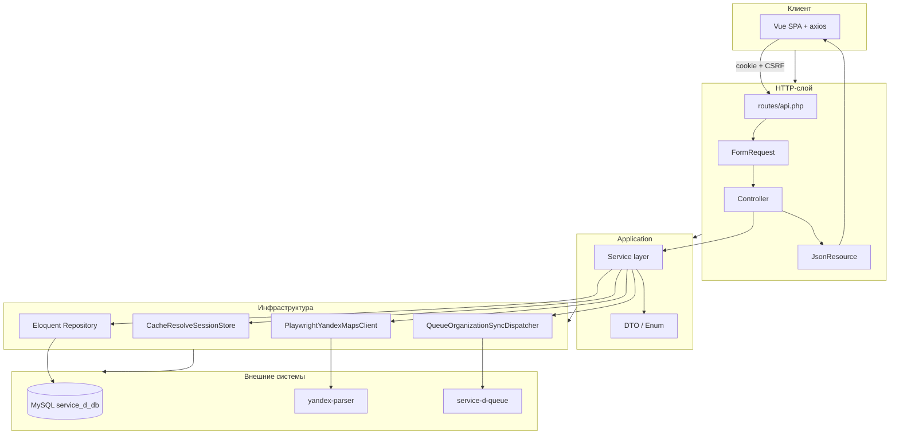

# service-d — Vue SPA + Sanctum: организации и отзывы Яндекс.Карт

Laravel 13 (PHP 8.4) и Vue 3 SPA с авторизацией через **Laravel Sanctum** (cookie + CSRF на том же origin). Пользователь привязывает **одну организацию** с Яндекс.Карт (поиск по URL, ссылке на сайт или тексту с уточнением города), подтверждает кандидата и просматривает **синхронизированные отзывы**. Сбор страницы — в Playwright-сервисе `yandex-parser`; разбор кандидатов и бизнес-логика — в `service-d`. Отдельная MySQL-база `service_d_db`.

| Документ | Назначение |
|---|---|
| [корневой README](../README.md) | Docker, gateway, CI/CD, общая инфраструктура |
| [yandex-parser/README.md](../yandex-parser/README.md) | Playwright-сервис: HTTP API `/resolve`, `/sync-reviews`, переменные окружения |


Порт по умолчанию: **8084** (`SERVICE_D_PORT` в `docker-compose.yml`). Vite dev: **5175** (`SERVICE_D_VITE_PORT`).

## Разделение ответственности: service-d ↔ yandex-parser

Два сервиса разделены по принципу **«браузер vs бизнес»**. `yandex-parser` — stateless-адаптер к Яндекс.Картам (Playwright, только Docker-сеть). `service-d` — единственная точка входа для клиента: авторизация, доменная логика, БД, очередь, SPA.

| Область | `service-d` (Laravel) | `yandex-parser` (Node + Playwright) |
|---|---|---|
| Публичный HTTP API | ✅ `/api/*`, Vue SPA | ❌ только внутренние `POST /resolve`, `POST /sync-reviews` |
| Авторизация / сессии | ✅ Sanctum, cookie, CSRF | ❌ |
| База данных | ✅ `organizations`, `organization_reviews`, `jobs` | ❌ |
| Очередь и статусы sync | ✅ `service-d-queue`, `sync_status`, `sync_error` | ❌ |
| Ввод пользователя | ✅ свободный текст, сайт + город → `resolverUrl` | ❌ принимает только готовый URL Яндекс.Карт |
| Сессия resolve (кандидаты) | ✅ `session_id` в cache, confirm, auto-select | ❌ |
| Фильтр по уточнению города | ✅ `ClarificationCandidateFilter` | ❌ |
| Браузер / антибот | ❌ | ✅ Chromium, `humanMouseJiggle`, таймауты |
| Навигация и скролл страницы | ❌ | ✅ goto, скролл выдачи / отзывов |
| Перехват XHR/fetch JSON | ❌ | ✅ `NetworkJsonCollector` |
| Сырой collect (`/resolve`) | ❌ не открывает браузер | ✅ `network_payloads`, `dom_harvest`, `page_meta` |
| Сборка кандидатов организации | ✅ `OrganizationCandidateBuilder` и parsing-слой | ❌ поле `candidates` **не возвращается** |
| Парсинг org + отзывов (`/sync-reviews`) | ❌ не разбирает DOM | ✅ `sync/syncReviews.ts`, `orgExtract`, `reviewExtract` |
| Сохранение отзывов | ✅ `replaceForOrganization`, пагинация API | ❌ |
| Ошибки для UI | ✅ `502` (парсер), `422` (домен), `sync_error` | ✅ `400`/`422`/`500` с `{ error, message }` |

### Асимметрия по эндпоинтам

| Эндпоинт | `yandex-parser` отдаёт | `service-d` делает дальше |
|---|---|---|
| `POST /resolve` | **Сырьё страницы** — без бизнес-интерпретации | Строит `candidates[]`, считает `match_count`, кладёт сессию в cache |
| `POST /sync-reviews` | **Готовые** `org` + `reviews[]` | Обновляет метаданные организации, заменяет отзывы в БД, выставляет `sync_status` |

Правило: логику **выбора организации пользователем** и **жизненного цикла данных** не переносить в `yandex-parser`. Логику **работы с браузером и DOM/API Яндекса** не переносить в `service-d`.

### Потоки (сквозные)

```text
resolve
───────
Браузер → service-d POST /api/organization/resolve
        → service-d: валидация ввода, построение resolverUrl
        → yandex-parser POST /resolve (сырой collect)
        → service-d: OrganizationCandidateBuilder → session_id + candidates

sync
────
Браузер → service-d POST /api/organization/confirm
        → service-d-queue: SyncYandexOrganizationReviewsJob
        → yandex-parser POST /sync-reviews (org + reviews)
        → service-d: запись в БД, sync_status → completed | failed
```

### Контракты и лимиты

| Параметр | Где задаётся | Смысл |
|---|---|---|
| `RESOLVE_CANDIDATE_LIMIT` | `yandex-parser` | Глубина скролла на странице поиска при collect |
| `YANDEX_PARSER_RESOLVE_CANDIDATE_LIMIT` | `service-d` | Лимит кандидатов **после** merge/dedupe в PHP |
| `YANDEX_PARSER_URL` | `service-d` | Базовый URL парсера (`PlaywrightYandexMapsClient`) |

При изменении JSON-ответа `/resolve` или `/sync-reviews` обновляйте **оба** сервиса в одном деплое: DTO/мапперы в `service-d` (`ParserCollectResultDto`, `ParsedReviewDto`) и типы в `yandex-parser` (`types.ts`).

### Где писать код и тесты

| Задача | Сервис | Тесты |
|---|---|---|
| Новый способ извлечь карточку из выдачи | `service-d` → `Parsing/*` | `tests/Unit/YandexMaps/`, фикстуры `tests/Fixtures/yandex/collect/` |
| Скролл, перехват сети, DOM-harvest | `yandex-parser` → `resolve/` | `yandex-parser/tests/` (vitest) |
| Извлечение отзывов со страницы org | `yandex-parser` → `sync/`, `reviewExtract` | `yandex-parser/tests/reviewExtract.test.ts` |
| API confirm, resync, пагинация | `service-d` | `tests/Feature/OrganizationApiTest.php` + `FakesYandexParser` |

Подробности HTTP-контракта парсера: [`yandex-parser/README.md`](../yandex-parser/README.md). Сквозные потоки HTTP → Service → Repository: раздел [**Архитектура запросов**](#архитектура-запросов).

## Парсинг

Яндекс.Карты не предоставляют публичного API для сторонних интеграций. Данные отдаются через SPA: часть — во встроенном JSON в HTML, часть — через XHR/fetch при скролле. Прямые HTTP-запросы без браузерного контекста быстро блокируются антиботом.

Поэтому сбор страницы выполняет **`yandex-parser`** (Playwright + Chromium), а **интерпретация сырья, бизнес-фильтры и сохранение** — **`service-d`**. Ниже — какие функции где выполняются и какие переменные на них влияют.

### Общая схема источников данных

| Источник | Механизм | `yandex-parser` | `service-d` |
|----------|----------|-----------------|-------------|
| Сетевые ответы | перехват JSON из XHR/fetch | `NetworkJsonCollector`, `walkJson` | `JsonTreeWalker`, `OrganizationRecordMapper` (только `/resolve`) |
| DOM | `page.evaluate()` + CSS-селекторы | `domHarvest`, `orgExtract`, `reviewExtract` | `DomHarvestMapper` (только `/resolve`) |
| Встроенное состояние | `<script type="application/json">` | `pageStateExtract` | — (получает готовые `org` + `reviews`) |

### `yandex-parser` — функции и переменные

| Функция / модуль | Переменные окружения | Назначение |
|------------------|----------------------|------------|
| `browser.ts` → `getBrowser`, `createContext` | `HEADLESS` | Chromium: `--disable-blink-features=AutomationControlled`, locale `ru-RU`, userAgent Chrome 131 |
| `humanMouseJiggle.ts` | `MOUSE_JIGGLE_MIN_PX`, `MOUSE_JIGGLE_MAX_PX` | Случайное движение мыши перед goto, скроллом, чтением DOM |
| `browser.ts` → `gotoWithJiggle`, `scrollWithJiggle` | `NAVIGATION_TIMEOUT_MS` | Навигация и скролл с антибот-паузами |
| `resolve/resolveOrganization.ts` | `RESOLVE_CANDIDATE_LIMIT` | Открытие URL, скролл выдачи `ceil(limit/5)` шагов, collect сырья |
| `resolve/domHarvest.ts` | — | Сырой `dom_harvest`: `href`, `link_text`, `card_text`, `rating_aria_label`, `meta_text` |
| `utils/jsonExtract.ts` → `NetworkJsonCollector`, `walkJson` | — | Перехват и обход JSON-деревьев из сети |
| `sync/syncReviews.ts` | `SYNC_MAX_IDLE_ITERATIONS`, `SYNC_SCROLL_DELAY_MS` | Страница отзывов: скролл панели, merge org/reviews из DOM + JSON |
| `utils/orgExtract.ts`, `reviewExtract.ts` | — | Извлечение полей org и review со страницы карточки |
| `utils/pageStateExtract.ts` | — | Парсинг embedded JSON из HTML |
| `utils/reviewStopAnchors.ts` | — (вход: `stop_anchors[]` в теле запроса) | Остановка скролла при встрече известных `external_id` |
| `index.ts` | `PORT` | HTTP-сервер Express |

Отладка (опционально): `DEBUG_ORG_IDS`, `PARSER_DEBUG_DUMP_DIR`, `DEBUG_LOG_PATH` — см. [`yandex-parser/README.md`](../yandex-parser/README.md#переменные-окружения).

### `service-d` — функции и переменные

| Функция / класс | Переменные / константы | Назначение |
|-----------------|------------------------|------------|
| `OrganizationSearchInputValidator` | — | Разбор ввода «сайт + город», валидация URL Яндекс.Карт |
| `ResolveOrganizationInputFactory::fromUrl` | — | `inputUrl` → `resolverUrl` + `searchText` + `clarification` |
| `PlaywrightYandexMapsClient::collect` | `YANDEX_PARSER_URL` | `POST /resolve` → `ParserCollectResultDto` |
| `OrganizationCandidateBuilder` | `YANDEX_PARSER_RESOLVE_CANDIDATE_LIMIT` | Сборка `candidates[]` из `network_payloads` + `dom_harvest` + `page_meta` |
| `Parsing/JsonTreeWalker` | — | Обход JSON из collect (аналог `walkJson` в Node) |
| `Parsing/DomHarvestMapper` | — | Маппинг сырого `dom_harvest` → `OrganizationCandidateDto` |
| `Parsing/OrganizationRecordMapper` | — | Маппинг JSON-записей → кандидат; `isPlausibleOrgName` |
| `Parsing/OrganizationCandidateMerger` | — | Merge и dedupe кандидатов по `org_id` |
| `ClarificationCandidateFilter` | — | Фильтр кандидатов по уточнению (город, улица) |
| `OrganizationResolveService` | `SESSION_TTL_SECONDS` = 900 | Оркестрация resolve: collect → build → filter → cache |
| `CacheResolveSessionStore` | cache driver из `.env` | `session_id` + список кандидатов до confirm |
| `OrganizationConfirmService` | — | Выбор кандидата, upsert org, постановка sync в очередь |
| `OrganizationSyncService::sync` | — | Формирует `stop_anchors` из БД, вызывает парсер, сохраняет результат |
| `PlaywrightYandexMapsClient::syncReviews` | `YANDEX_PARSER_URL` | `POST /sync-reviews` с `org_id`, `canonical_url`, `stop_anchors` |
| `OrganizationReviewRepository` | — | `replaceForOrganization` / `mergeAndReorderForOrganization`, `findSyncStopAnchors` |
| `OrganizationRepository` | — | `updateFromParsedMeta`, `sync_status`, `sync_error` |

`YANDEX_PARSER_RESOLVE_CANDIDATE_LIMIT` — лимит кандидатов **после** merge/dedupe в PHP. `RESOLVE_CANDIDATE_LIMIT` в `yandex-parser` — только глубина скролла на странице поиска при collect; оба значения обычно совпадают (30), но отвечают за разные этапы.

### Обход защиты Яндекс.Карт

Вся логика антибота — **только в `yandex-parser`**:

- Chromium без признака `navigator.webdriver`, реалистичный user agent, русская локаль.
- `humanMouseJiggle` перед каждым действием (навигация, ожидание селектора, скролл, чтение DOM).
- Паузы между скроллами (`SYNC_SCROLL_DELAY_MS`), таймаут навигации (`NAVIGATION_TIMEOUT_MS`).
- Скролл через `mouse.wheel` и `scroll` event, а не только `scrollTop`.

`service-d` **не открывает браузер** — только HTTP-вызовы с таймаутом 300 с (`PlaywrightYandexMapsClient`).

### Поток `/resolve` — кто что делает

```text
Пользователь: { url: "invitro новокузнецк" }
  │
  ├─ service-d: OrganizationSearchInputValidator → resolverUrl
  │
  ├─ yandex-parser: resolveOrganization(resolverUrl)
  │     gotoWithJiggle → скролл выдачи (RESOLVE_CANDIDATE_LIMIT)
  │     → network_payloads, dom_harvest, page_meta
  │
  ├─ service-d: OrganizationCandidateBuilder.build(collect)
  │     JsonTreeWalker + DomHarvestMapper + OrganizationCandidateMerger
  │     → обрезка по YANDEX_PARSER_RESOLVE_CANDIDATE_LIMIT
  │
  ├─ service-d: ClarificationCandidateFilter.filter(candidates, clarification)
  │
  └─ service-d: CacheResolveSessionStore → session_id + candidates[]
```

Поле `candidates` **намеренно не возвращается** из `yandex-parser` — это контрактное разделение.

### Поток `/sync-reviews` — кто что делает

```text
SyncYandexOrganizationReviewsJob
  │
  ├─ service-d: OrganizationSyncService
  │     stop_anchors = findSyncStopAnchors()  (если отзывы уже в БД)
  │
  ├─ yandex-parser: syncReviews({ org_id, canonical_url, stop_anchors })
  │     gotoWithJiggle → страница отзывов
  │     mergeOrgMeta(DOM, network JSON)
  │     цикл скролла: DOM + pageState + network → dedupe
  │     остановка: SYNC_MAX_IDLE_ITERATIONS | reviews_count | stop_anchors
  │     → готовые org + reviews[]
  │
  └─ service-d: updateFromParsedMeta, replace/merge отзывов, sync_status
```

`stop_anchors` формирует `service-d` (`OrganizationReviewRepository::findSyncStopAnchors`), передаёт в парсер; остановку по якорям проверяет `reviewStopAnchors.ts` в `yandex-parser`.

### Устойчивость к изменениям Яндекса

| Что сломалось | Где править |
|---------------|-------------|
| Селекторы DOM на странице поиска / карточки | `yandex-parser`: `domHarvest.ts`, `orgExtract.ts` |
| Селекторы DOM отзывов | `yandex-parser`: `syncReviews.ts`, `reviewExtract.ts` |
| Формат embedded JSON / сетевых payload | `yandex-parser`: `jsonExtract.ts`, `pageStateExtract.ts`; для resolve также `service-d`: `OrganizationRecordMapper` |
| Логика merge кандидатов, фильтр по городу | `service-d`: `Parsing/*`, `ClarificationCandidateFilter` |
| Маппинг DTO → Eloquent, stop_anchors | `service-d`: `OrganizationSyncService`, репозитории |

JSON-парсинг в обоих сервисах **schema-agnostic**: рекурсивный обход + эвристики по ключам (`name`, `reviewId`, `rating`), без жёсткой привязки к одному API-эндпоинту.

При поломке sync в production: проверить селекторы DOM и сетевые URL в `yandex-parser`; для resolve — unit-тесты `service-d` на фикстурах `tests/Fixtures/yandex/collect/`. Диагностика парсера: `DEBUG_ORG_IDS`, [`scripts/debug-dump-yandex-org.sh`](../scripts/debug-dump-yandex-org.sh).

## Маршрутизация

| Путь | Куда | Авторизация |
|---|---|---|
| `http://localhost:8084/` | Vue SPA (прямой доступ к контейнеру) | Sanctum (cookie) |
| `http://yandexmaps.localhost:8080/` | Через nginx-gateway (host-based routing) | Sanctum |
| `https://yandexmaps.94-228-117-27.sslip.io/` | Production (host nginx → gateway → service-d) | Sanctum |
| `http://localhost:8084/up` | Health check Laravel | Публичный |
| `POST /api/register`, `POST /api/login` | Регистрация и вход | Публичный |
| `POST /api/logout`, `GET /api/user` | Сессия пользователя | `auth:sanctum` |
| `GET/POST /api/organization/*` | Организация и отзывы (`organization_id` для read/sync) | `auth:sanctum` |

**Важно:** service-d обслуживается **целиком на субдомене** `yandexmaps.*` — без префикса `/api/d/` и без `auth_request` gateway. Gateway маршрутизирует по заголовку `Host` (см. `nginx-gateway/nginx.conf`).

### Маршруты SPA (Vue Router)

| Путь | Компонент | Описание |
|---|---|---|
| `/login` | `Login.vue` | Вход / регистрация (`meta.guest`) |
| `/` | `HomeRedirect.vue` | Редирект на `/settings` |
| `/settings/:organizationId?` | `Settings.vue` | Поиск и подтверждение организации, сводка, пересинхронизация |
| `/reviews/:organizationId` | `Reviews.vue` | Список отзывов с пагинацией, опрос `sync-status`, предупреждение при фоновом обновлении |

Guard в `app.js`: перед навигацией вызывается `GET /api/user`; `meta.requiresAuth` — только для авторизованных, `meta.guest` — только для гостей.

## Архитектура запросов

Слои приложения следуют единому шаблону: **HTTP → FormRequest → Controller → Service → Repository / Client → Resource / DTO → JSON**. Зависимости сервисов — через контракты (`app/Contracts/*`), биндинги в `AppServiceProvider`.



### Слои и ответственность

| Слой | Каталог | Роль |
|---|---|---|
| Маршруты | `routes/api.php`, `routes/web.php` | Префикс `/api`, middleware `auth:sanctum`; SPA — catch-all `spa.blade.php` |
| Валидация | `app/Http/Requests/` | Правила входа, `toDto()` / `organizationId()` |
| Контроллеры | `app/Http/Controllers/Api/` | Тонкий оркестратор: DTO → Service → Resource, маппинг исключений в HTTP-коды |
| Сериализация | `app/Http/Resources/` | Стабильный JSON-контракт для клиента |
| Сервисы | `app/Services/Auth/`, `app/Services/YandexMaps/` | Бизнес-логика, оркестрация |
| DTO / Enum | `app/DTO/`, `app/Enums/` | Типизированные данные между слоями |
| Контракты | `app/Contracts/` | Интерфейсы для DI (репозитории, клиент парсера, сессия resolve, диспетчер sync) |
| Репозитории | `app/Repositories/` | Eloquent, без HTTP-зависимостей |
| Клиент | `app/Clients/PlaywrightYandexMapsClient` | HTTP к `yandex-parser` |
| Jobs | `app/Jobs/SyncYandexOrganizationReviewsJob` | Асинхронная синхронизация отзывов |
| SPA | `resources/js/spa-app/` | Composables вызывают `/api/*` через `api/client.js` |

### DI-биндинги (`AppServiceProvider`)

| Контракт | Реализация |
|---|---|
| `UserRepositoryInterface` | `Repositories\User\EloquentUserRepository` |
| `OrganizationRepositoryInterface` | `Repositories\Organization\EloquentOrganizationRepository` |
| `OrganizationReviewRepositoryInterface` | `Repositories\Organization\EloquentOrganizationReviewRepository` |
| `YandexMapsClientInterface` | `Clients\PlaywrightYandexMapsClient` (factory из `config/services.php`) |
| `OrganizationCandidateBuilderInterface` | `Services\YandexMaps\Parsing\OrganizationCandidateBuilder` |
| `ResolveSessionStoreInterface` | `Services\YandexMaps\CacheResolveSessionStore` |
| `OrganizationSyncDispatcherInterface` | `Services\YandexMaps\QueueOrganizationSyncDispatcher` |

### Потоки по эндпоинтам

#### Auth

```text
POST /api/register | /api/login
  → RegisterRequest / LoginRequest (валидация, toDto)
  → AuthController
  → AuthService (UserRepository, LoginRateLimiter)
  → сессия Sanctum + JSON { user }

POST /api/logout | GET /api/user
  → auth:sanctum
  → AuthController → AuthService
```

#### Resolve (поиск кандидатов)

```text
POST /api/organization/resolve  { url }
  → ResolveOrganizationRequest
  → OrganizationController::resolve
  → ResolveOrganizationInputFactory::fromUrl()  → ResolveOrganizationDto
  → OrganizationResolveService
      → PlaywrightYandexMapsClient::collect()  →  POST yandex-parser/resolve
      → OrganizationCandidateBuilder (Parsing/*)
      → ClarificationCandidateFilter
      → CacheResolveSessionStore::put()
  → ResolveOrganizationResultDto::toArray()
```

#### Confirm (привязка + постановка sync в очередь)

```text
POST /api/organization/confirm  { session_id, org_id }
  → ConfirmOrganizationRequest → ConfirmOrganizationDto
  → OrganizationConfirmService
      → CacheResolveSessionStore::get()
      → OrganizationRepository::upsertForUser()
      → QueueOrganizationSyncDispatcher::dispatch()
  → OrganizationResource, 202
```

#### Sync (фоновый воркер)

```text
SyncYandexOrganizationReviewsJob (service-d-queue)
  → OrganizationSyncService::sync()
      → PlaywrightYandexMapsClient::syncReviews()  →  POST yandex-parser/sync-reviews
      → OrganizationRepository (метаданные org)
      → OrganizationReviewRepository::replaceForOrganization()
```

#### Read (организация, статус, отзывы)

```text
GET /api/organization?organization_id=
  → ShowOrganizationRequest (organization_id опционален)
  → OrganizationReviewQueryService::findOrganizationForUser()
  → OrganizationResource | { organization: null }

GET /api/organization/sync-status?organization_id=
POST /api/organization/resync  { organization_id }
GET /api/organization/reviews?organization_id=&page=
  → OrganizationIdRequest (organization_id обязателен)
  → OrganizationReviewQueryService / OrganizationResyncService
  → OrganizationMetaResource + OrganizationReviewCollection
```

### Обработка ошибок в контроллерах

| Исключение | HTTP | Эндпоинт |
|---|---|---|
| `YandexMapsParserException` | `502` | resolve |
| `OrganizationResolveSessionExpiredException`, `InvalidOrganizationCandidateException` | `422` | confirm |
| `OrganizationNotFoundException` | `404` или `{ organization: null }` | show / resync |
| Ошибки валидации FormRequest | `422` | все |

### SPA → API (composables)

| Composable | API-вызовы |
|---|---|
| `useAuth` | `GET /sanctum/csrf-cookie`, `POST /api/register`, `/login`, `/logout`, `GET /api/user` |
| `useOrganization` | `GET /organization`, `POST /resolve`, `/confirm`, `/resync`, `GET /sync-status` |
| `useOrganizationReviews` | `GET /organization/reviews?page=` |
| `useReviewsPage` | оркестрация страницы отзывов: метрики, пагинация, polling `sync-status` |

Axios (`api/client.js`): `baseURL: '/api'`, `withCredentials: true`, CSRF из `<meta name="csrf-token">`.

## Домен организации (кратко)

- **Пользователь может иметь несколько организаций** (`organizations.user_id` — индекс, не unique). **`yandex_org_id` уникален глобально** — одну карточку Яндекса нельзя привязать дважды.
- Без `organization_id` в запросе `GET /api/organization` возвращает **первую** организацию пользователя (`findByUserId`). Для конкретной записи передавайте `?organization_id=` или используйте маршруты SPA `/settings/:id`, `/reviews/:id`.
- **Resolve** — `POST /api/organization/resolve` с полем `url`: ссылка Яндекс.Карт, сайт или текст вида `invitro новокузнецк`. Ответ: `session_id`, `candidates[]`, `match_count`, `auto_selected`.
- **Confirm** — `POST /api/organization/confirm` с `session_id` + `org_id` из списка кандидатов. Ставит `SyncYandexOrganizationReviewsJob` в очередь через `QueueOrganizationSyncDispatcher`.
- **Синхронизация отзывов** — фоновый воркер `service-d-queue` вызывает `yandex-parser` `/sync-reviews` и сохраняет записи в `organization_reviews`.
- **Статусы** (`OrganizationSyncStatus`): `pending` → `syncing` → `completed` | `failed` (поле `sync_error`).

## Структура (ключевые каталоги)

```
service-d/
├── app/
│   ├── Clients/
│   │   └── PlaywrightYandexMapsClient.php
│   ├── Contracts/
│   │   ├── OrganizationCandidateBuilderInterface.php
│   │   ├── OrganizationRepositoryInterface.php
│   │   ├── OrganizationReviewRepositoryInterface.php
│   │   ├── OrganizationSyncDispatcherInterface.php
│   │   ├── ResolveSessionStoreInterface.php
│   │   ├── UserRepositoryInterface.php
│   │   └── YandexMapsClientInterface.php
│   ├── DTO/
│   │   ├── Auth/                         # LoginUserDto, RegisterUserDto
│   │   └── YandexMaps/                 # Resolve, Confirm, ParsedReview, ParserCollectResult, …
│   ├── Enums/
│   │   └── OrganizationSyncStatus.php
│   ├── Exceptions/
│   │   ├── Organization/               # InvalidOrganizationCandidate, NotFound, SessionExpired
│   │   └── YandexMaps/                 # YandexMapsParserException
│   ├── Http/
│   │   ├── Controllers/Api/            # AuthController, OrganizationController
│   │   ├── Requests/
│   │   │   ├── Auth/                   # LoginRequest, RegisterRequest
│   │   │   └── Organization/         # Resolve, Confirm, Show, OrganizationId
│   │   └── Resources/                  # OrganizationResource, OrganizationMetaResource,
│   │                                   # OrganizationReviewResource, OrganizationReviewCollection
│   ├── Jobs/
│   │   └── SyncYandexOrganizationReviewsJob.php
│   ├── Models/                         # User, Organization, OrganizationReview
│   ├── Repositories/
│   │   ├── Organization/               # EloquentOrganization*, review repository
│   │   └── User/                       # EloquentUserRepository
│   └── Services/
│       ├── Auth/                       # AuthService, LoginRateLimiter
│       └── YandexMaps/
│           ├── CacheResolveSessionStore.php
│           ├── ClarificationCandidateFilter.php
│           ├── OrganizationConfirmService.php
│           ├── OrganizationResolveService.php
│           ├── OrganizationResyncService.php
│           ├── OrganizationReviewQueryService.php
│           ├── OrganizationSearchInputValidator.php
│           ├── OrganizationSyncService.php
│           ├── QueueOrganizationSyncDispatcher.php
│           ├── ResolveOrganizationInputFactory.php
│           └── Parsing/                # CandidateBuilder, DomHarvestMapper, JsonTreeWalker,
│                                       # OrganizationCandidateMerger, OrganizationRecordMapper,
│                                       # YandexUrlHelper
├── bootstrap/app.php                   # statefulApi(), health /up
├── config/                             # sanctum.php, services.php (yandex_parser), …
├── database/
│   ├── factories/                      # User, Organization, OrganizationReview
│   ├── migrations/                     # users, sessions, cache, jobs, personal_access_tokens,
│   │                                   # organizations, organization_reviews, nullable counts,
│   │                                   # unique yandex_org_id
│   └── seeders/
├── resources/
│   ├── js/spa-app/                     # Vue 3 SPA
│   │   ├── App.vue
│   │   ├── app.js                      # Vue Router + auth guard
│   │   ├── api/client.js               # axios + withCredentials + CSRF
│   │   ├── utils/
│   │   │   ├── formatters.js
│   │   │   └── syncStatus.js
│   │   ├── composables/
│   │   │   ├── useAuth.js
│   │   │   ├── useOrganization.js
│   │   │   ├── useOrganizationReviews.js
│   │   │   └── useReviewsPage.js
│   │   ├── components/
│   │   │   ├── AuthErrorAlert.vue, LoadingSpinner.vue
│   │   │   ├── auth/AuthForm.vue
│   │   │   ├── layout/PageShell.vue, PageHeader.vue
│   │   │   ├── ui/PrimaryButton.vue, MetricCard.vue
│   │   │   ├── reviews/ReviewsMetrics, SyncStatusBanner, ReviewsTable,
│   │   │   │         ReviewsPagination, ReviewsEmptyState, ReviewsRefreshWarning
│   │   │   ├── settings/OrganizationSummary, OrganizationSearchForm, OrganizationCandidates
│   │   │   └── splash/SplashCard.vue   # legacy, не в роутере
│   │   └── pages/
│   │       ├── Login.vue, HomeRedirect.vue, Settings.vue, Reviews.vue
│   │       └── Splash.vue              # не подключена к Vue Router
│   └── views/spa.blade.php
├── routes/api.php, web.php, console.php
├── tests/
│   ├── Feature/
│   │   ├── AuthApiTest.php
│   │   ├── OrganizationApiTest.php
│   │   ├── AddressOverwriteTest.php
│   │   └── ExampleTest.php
│   ├── Unit/
│   │   ├── Auth/                       # AuthServiceTest, LoginRateLimiterTest
│   │   ├── Repositories/               # EloquentOrganizationReviewRepositoryTest
│   │   ├── YandexMaps/                 # парсинг, session store, sync, resolve factory, …
│   │   ├── OrganizationSearchInputValidatorTest.php
│   │   └── YandexMapsDtoMappingTest.php
│   ├── Fixtures/yandex/
│   │   ├── collect/                    # сырые ответы yandex-parser для unit-тестов
│   │   └── *.json                      # resolve/sync фикстуры для Feature
│   └── Support/
│       ├── CreatesYandexMapsParsingServices.php
│       ├── FakesYandexParser.php
│       ├── MakesStatefulApiRequests.php
│       └── YandexParserFixtures.php
├── docker-entrypoint.sh
├── Dockerfile
└── REFACTORING-PLAN.md                 # аудит SOLID-рефакторинга (внутренний)
```

Связанные Docker-сервисы: **`service-d`** (HTTP), **`service-d-queue`** (`php artisan queue:work`), **`yandex-parser`** (Playwright).

## Быстрый старт (локально)

```bash
cp service-d/.env.example service-d/.env
docker compose build service-d yandex-parser
docker compose up -d service-d service-d-queue yandex-parser gateway
```

Для полного сценария (resolve → confirm → sync отзывов) нужны все три: `service-d`, `service-d-queue`, `yandex-parser`.

Для доступа через gateway добавьте в `/etc/hosts` (Linux/WSL):

```text
127.0.0.1 yandexmaps.localhost
```

Откройте `http://yandexmaps.localhost:8080/` — форма входа; после login — редирект на `/settings` (привязка или сводка организации), отзывы — `/reviews/:organizationId`.

При первом запуске контейнер соберёт фронтенд, если нет `public/spa-build/manifest.json` (см. `docker-entrypoint.sh`).

### База данных

Отдельная БД (не `sail_db`):

| Окружение | База |
|---|---|
| local / production | `service_d_db` |
| тесты | `service_d_db_testing` |

Создайте базы во внешнем MySQL на хосте:

```sql
CREATE DATABASE service_d_db CHARACTER SET utf8mb4 COLLATE utf8mb4_unicode_ci;
CREATE DATABASE service_d_db_testing CHARACTER SET utf8mb4 COLLATE utf8mb4_unicode_ci;
```

Миграции **изменяют схему БД** — выполняйте только после явного согласия:

```bash
docker compose exec service-d php artisan migrate
```

### Ключ приложения

Файл `.env` в контейнере должен быть доступен на запись (в `docker-compose.yml` без суффикса `:ro`). После первого `cp .env.example .env`:

```bash
docker compose exec service-d php artisan key:generate
```

Если том `.env` смонтирован только для чтения, сгенерируйте ключ на хосте:

```bash
KEY=$(docker compose exec -T service-d php artisan key:generate --show)
sed -i "s|^APP_KEY=.*|APP_KEY=${KEY}|" service-d/.env
```

## Переменные окружения

Ключевые поля в `service-d/.env`:

```env
APP_URL=http://localhost:8084
DB_DATABASE=service_d_db
SESSION_DRIVER=database
QUEUE_CONNECTION=database
SANCTUM_STATEFUL_DOMAINS=localhost:8084,localhost,yandexmaps.localhost,yandexmaps.localhost:8080,__SANCTUM_CURRENT_REQUEST_HOST__
YANDEX_PARSER_URL=http://yandex-parser:3000
YANDEX_PARSER_RESOLVE_CANDIDATE_LIMIT=30
```

| Переменная | Описание |
|---|---|
| `SANCTUM_STATEFUL_DOMAINS` | Домены для cookie-based API. Плейсхолдер `__SANCTUM_CURRENT_REQUEST_HOST__` подставляет `Host` запроса динамически |
| `YANDEX_PARSER_URL` | Базовый URL Playwright-сервиса (`config/services.php` → `yandex_parser.url`) |
| `YANDEX_PARSER_RESOLVE_CANDIDATE_LIMIT` | Лимит кандидатов после merge/dedupe (по умолчанию 30) |
| `QUEUE_CONNECTION` | Для синхронизации отзывов — `database`; обрабатывает `service-d-queue` |

Через gateway локально нужен порт в домене (`yandexmaps.localhost:8080`) — Origin браузера включает `:8080`.

**Production** (после `scripts/vps-nginx-ssl.sh`; основной домен VPS — `94-228-117-27.sslip.io`):

```env
APP_URL=https://yandexmaps.94-228-117-27.sslip.io
SANCTUM_STATEFUL_DOMAINS=yandexmaps.94-228-117-27.sslip.io
SESSION_DOMAIN=yandexmaps.94-228-117-27.sslip.io
```

`SESSION_DOMAIN` нужен, чтобы cookie сессии работала на субдомене.

## Frontend

Стек: Vue 3 (`<script setup>`), Vue Router, axios (`withCredentials: true`), Tailwind CSS 4.

```bash
docker compose exec service-d npm install
docker compose exec service-d npm run dev
```

Production-сборка:

```bash
docker compose exec service-d npm run build
```

Исходники SPA: `resources/js/spa-app/`. Точка входа — `app.js`, шаблон — `resources/views/spa.blade.php`, ассеты — `public/spa-build/`.

## API

### Авторизация (`auth:sanctum`)

| Метод | Путь | Тело | Ответ |
|---|---|---|---|
| `POST` | `/api/register` | `name`, `email`, `password`, `password_confirmation` | `201` + user |
| `POST` | `/api/login` | `email`, `password` | `200` + user |
| `POST` | `/api/logout` | — | `204` |
| `GET` | `/api/user` | — | `{ "user": … }` или `401` |

### Организация (`auth:sanctum`)

| Метод | Путь | Тело / query | Коды |
|---|---|---|---|
| `GET` | `/api/organization` | `?organization_id=` (опционально) | `200` (`organization: null` если не найдена) |
| `POST` | `/api/organization/resolve` | `{ "url": "…" }` | `200`, `422` (валидация), `502` (парсер) |
| `POST` | `/api/organization/confirm` | `{ "session_id": "uuid", "org_id": "123" }` | `202`, `422` (сессия/кандидат) |
| `GET` | `/api/organization/sync-status` | `?organization_id=` (**обязателен**) | `200`, `422`, `404` |
| `POST` | `/api/organization/resync` | `{ "organization_id": 1 }` (**обязателен**) | `202`, `404`, `422` |
| `GET` | `/api/organization/reviews` | `?organization_id=` (**обязателен**), `?page=1` | `200`, `404`, `422` |

**Валидация `url` (resolve):** обязательная строка до 2048 символов. Допустимые форматы:

- ссылка Яндекс.Карт (`https://yandex.ru/maps/...`), опционально с уточнением через пробел;
- ссылка на сайт или домен + уточнение: `www.invitro.ru Новокузнецк`, `invitro новокузнецк`.

Сообщение об ошибке: *«Укажите ссылку в начале, затем при необходимости уточнение через пробел…»*.

Ответ `resolve` (фрагмент):

```json
{
  "session_id": "uuid",
  "match_count": 3,
  "auto_selected": false,
  "candidates": [
    {
      "org_id": "1038900970",
      "name": "Invitro",
      "address": "ул. Энтузиастов, 32, Новокузнецк",
      "average_rating": 4.68,
      "ratings_count": 682,
      "canonical_url": "https://yandex.ru/maps/org/invitro/1038900970/"
    }
  ]
}
```

Ответ `reviews` (фрагмент):

```json
{
  "organization": {
    "name": "Invitro",
    "address": "ул. Энтузиастов, 32, Новокузнецк",
    "average_rating": 4.68,
    "ratings_count": 682,
    "reviews_count": 24,
    "sync_status": "completed",
    "last_synced_at": "2025-03-15T12:00:00+00:00"
  },
  "reviews": {
    "data": [
      {
        "id": 1,
        "author_name": "Иван",
        "published_at": "2025-03-15T10:00:00+00:00",
        "text": "…",
        "rating": 5
      }
    ],
    "meta": { "current_page": 1, "last_page": 1, "per_page": 50, "total": 24 }
  },
  "is_refreshing": false,
  "warning": null
}
```

Поле `is_refreshing: true` и `warning` появляются, когда sync ещё идёт (`pending` / `syncing`), но в БД уже есть сохранённые отзывы — UI показывает кэш с предупреждением (`ReviewsRefreshWarning.vue`).

## Интеграция с yandex-parser

См. разделы [**Разделение ответственности**](#разделение-ответственности-service-d--yandex-parser) и [**Парсинг**](#парсинг). Ниже — краткие схемы вызовов и ссылка на HTTP-контракт.

### Поток resolve

```text
POST /api/organization/resolve
  → ResolveOrganizationInputFactory::fromUrl()
  → OrganizationResolveService
  → PlaywrightYandexMapsClient::collect()  →  POST yandex-parser/resolve
  → OrganizationCandidateBuilder (PHP)     ←  network_payloads + dom_harvest
  → ClarificationCandidateFilter
  → CacheResolveSessionStore + JSON ответ
```

| Слой | Где | Классы |
|------|-----|--------|
| Сбор страницы | `yandex-parser` | Playwright, `NetworkJsonCollector`, `domHarvest` |
| Сборка кандидатов | `service-d` | `OrganizationCandidateBuilder`, `JsonTreeWalker`, `DomHarvestMapper`, `OrganizationRecordMapper`, `OrganizationCandidateMerger` |
| Оркестрация | `service-d` | `ResolveOrganizationInputFactory`, `OrganizationResolveService`, `OrganizationConfirmService`, `PlaywrightYandexMapsClient`, `CacheResolveSessionStore` |

### Поток sync отзывов

```text
POST /api/organization/confirm  (или /resync)
  → QueueOrganizationSyncDispatcher
  → SyncYandexOrganizationReviewsJob (очередь database)
  → service-d-queue: OrganizationSyncService
  → POST yandex-parser/sync-reviews
  → сохранение в organization_reviews, sync_status → completed | failed
```

**Правило деплоя:** после изменения формата ответа `/resolve` или `/sync-reviews` пересобирайте и перезапускайте `yandex-parser` **вместе с** `service-d` в одном релизе.

HTTP-контракт и переменные парсера: [`yandex-parser/README.md`](../yandex-parser/README.md). Подход к парсингу и разделение функций: раздел [**Парсинг**](#парсинг) выше.

## Синхронизация отзывов (очередь)

После подтверждения организации ставится `SyncYandexOrganizationReviewsJob` в очередь (`QUEUE_CONNECTION=database`). Обрабатывает контейнер **`service-d-queue`** (`php artisan queue:work --timeout=900`).

| `sync_status` | Значение |
|---|---|
| `pending` | Job в очереди, воркер ещё не взял задачу |
| `syncing` | Воркер запустил парсер `yandex-parser` |
| `completed` | Отзывы сохранены |
| `failed` | Ошибка (см. `sync_error`) |

Если статус долго остаётся **`pending`** — почти всегда не запущен или упал **`service-d-queue`**.

Диагностика:

```bash
./scripts/diag-service-d-sync.sh
```

На VPS:

```bash
export COMPOSE_FILE=docker-compose.yml:docker-compose.prod.yml
docker compose up -d service-d-queue yandex-parser
docker compose logs --tail=80 service-d-queue
```

После деплоя перезапустите воркер:

```bash
docker compose exec -T service-d-queue php artisan queue:restart
```

## Тесты

Используется только `service_d_db_testing` (см. `service-d/.env.testing` и `scripts/test-services.sh`):

```bash
./scripts/test-services.sh service-d
```

| Каталог | Содержание |
|---|---|
| `tests/Feature/AuthApiTest.php` | register, login, logout, user (7 тестов) |
| `tests/Feature/OrganizationApiTest.php` | resolve, confirm, sync, reviews, `organization_id` (27 тестов) |
| `tests/Feature/AddressOverwriteTest.php` | перезапись адреса при sync |
| `tests/Unit/Auth/` | `AuthServiceTest`, `LoginRateLimiterTest` |
| `tests/Unit/YandexMaps/` | парсинг на фикстурах `tests/Fixtures/yandex/collect/`, session store, sync |
| `tests/Unit/Repositories/` | `EloquentOrganizationReviewRepositoryTest` |
| `tests/Unit/OrganizationSearchInputValidatorTest.php` | валидация ввода URL/текста |

**Baseline:** ~99 тестов (`docker compose exec -T service-d php artisan test`).

Feature-тесты API: `tests/Support/FakesYandexParser.php`, stateful Sanctum — `tests/Support/MakesStatefulApiRequests.php`, фикстуры парсера — `tests/Support/YandexParserFixtures.php`.

## Production: SSL и субдомен

1. **DNS:** для sslip.io A-запись не нужна; субдомен `yandexmaps.94-228-117-27.sslip.io` резолвится на тот же IP, что и `94-228-117-27.sslip.io`.
2. На VPS из корня репозитория:

```bash
export COMPOSE_FILE=docker-compose.yml:docker-compose.prod.yml
export VPS_DOMAIN=94-228-117-27.sslip.io
export CERTBOT_EMAIL=you@example.com
docker compose up -d
./scripts/vps-nginx-ssl.sh all
```

Скрипт `scripts/vps-nginx-ssl.sh`:

- выпускает сертификат Let's Encrypt на `${VPS_DOMAIN}` и `yandexmaps.${VPS_DOMAIN}`;
- настраивает host nginx: оба домена проксируются на `127.0.0.1:8080` (Docker gateway);
- gateway по `Host: yandexmaps.*` направляет трафик в service-d.

Если сертификат для основного домена уже был выпущен ранее без субдомена:

```bash
./scripts/vps-nginx-ssl.sh issue-cert-maps
./scripts/vps-nginx-ssl.sh apply-nginx
```

Переменные скрипта:

| Переменная | По умолчанию | Описание |
|---|---|---|
| `YANDEXMAPS_SUBDOMAIN` | `yandexmaps` | Префикс субдомена |
| `YANDEXMAPS_DOMAIN` | `${YANDEXMAPS_SUBDOMAIN}.${VPS_DOMAIN}` | Полное имя для certbot и nginx |

После `apply-nginx` обновите `service-d/.env` (см. вывод скрипта и раздел **Переменные окружения** выше).

Деплой через GitHub Actions: `.github/workflows/deploy.yml` (параметр `run_migrations` для миграций service-d).

## Ручная проверка на реальных URL

1. Пересобрать парсер после изменений в `yandex-parser/src/`:

```bash
docker compose build yandex-parser
docker compose up -d yandex-parser service-d service-d-queue
```

2. Проверить collect (из контейнера парсера):

```bash
docker compose exec -T yandex-parser node <<'NODE'
fetch('http://127.0.0.1:3000/resolve', {
  method: 'POST',
  headers: { 'Content-Type': 'application/json' },
  body: JSON.stringify({
    url: 'https://yandex.ru/maps/?text=invitro%20новокузнецк',
  }),
}).then(async (r) => console.log(await r.json()));
NODE
```

Ожидается объект с полями `network_payloads`, `dom_harvest`, `page_meta` (не `candidates`).

3. Проверить сборку кандидатов в Laravel:

```bash
docker compose exec -T service-d php artisan tinker --execute="
\$svc = app(App\Services\YandexMaps\OrganizationResolveService::class);
\$r = \$svc->resolve(new App\DTO\YandexMaps\ResolveOrganizationDto(
    inputUrl: 'Новокузнецк invitro',
    resolverUrl: 'https://yandex.ru/maps/?text=invitro%20новокузнецк',
    searchText: 'invitro',
    clarification: 'Новокузнецк',
));
var_export(['match_count' => \$r->matchCount, 'auto_selected' => \$r->autoSelected]);
"
```

4. Через UI: войти на `http://yandexmaps.localhost:8080/` (или `:8084`), на `/settings` ввести URL/текст поиска, подтвердить кандидата, перейти на `/reviews/:organizationId`, дождаться синхронизации.

## Что не входит в текущий scope

- Яндекс.Карты SDK и отображение карты торговых точек (страница `Splash.vue` — legacy-заглушка, не подключена к роутеру)
- Прокси торговых точек из service-a / `shared/sales-outlets-domain`
- Общие пользователи с main-app
