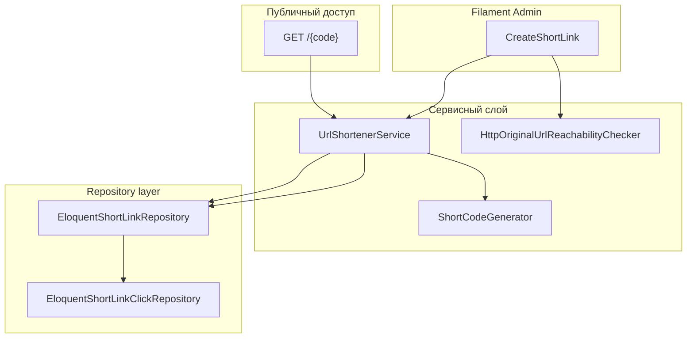
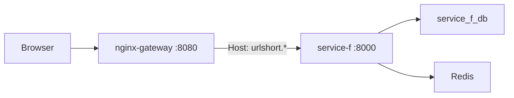

# service-f — URL shortener

Микросервис **сокращения URL** с админ-панелью на **Filament 3** и аутентификацией **Laravel Breeze**. Автономный сервис: собственная БД, сессионная авторизация, без интеграции с `main-app` и gateway Passport.

## Назначение

| Сценарий | Описание |
|---|---|
| Создание ссылки | Авторизованный пользователь создаёт короткую ссылку в Filament (`/admin/short-links`) |
| Публичный переход | `GET /{code}` → HTTP 302 на `original_url` + запись клика (IP, время) |
| Статистика | Счётчик переходов и журнал кликов с пагинацией |
| Проверка URL | Перед сохранением проверяется доступность исходного URL (HTTP 200); при ошибке — модальное подтверждение «Сохранить всё равно» |

Данные изолированы по пользователю: каждый видит только свои `short_links` (`user_id`).

## Стек

| Компонент | Версия / значение |
|---|---|
| PHP | ^8.4 |
| Laravel | ^13 |
| Filament | ^3.3 |
| Laravel Breeze | ^2.4 (dev) |
| Frontend | Filament (админка), Breeze Blade (auth/profile), Vite 8 + Tailwind CSS 4 |
| БД (prod/dev) | `service_f_db` |
| БД (тесты) | `service_f_db_testing` |
| Порт (host) | `8087` (`SERVICE_F_PORT`) |
| Публичный URL (dev) | `http://urlshort.localhost:8080` (через nginx-gateway) |

## Быстрый старт

### 1. База данных

Создайте во внешнем MySQL:

```sql
CREATE DATABASE service_f_db CHARACTER SET utf8mb4 COLLATE utf8mb4_unicode_ci;
CREATE DATABASE service_f_db_testing CHARACTER SET utf8mb4 COLLATE utf8mb4_unicode_ci;
```

### 2. Окружение

```bash
cp service-f/.env.example service-f/.env
```

Ключевые переменные:

```env
APP_URL=http://urlshort.localhost:8080
DB_DATABASE=service_f_db
DB_HOST=host.docker.internal
DB_USERNAME=root
DB_PASSWORD=<your-local-password>
```

### 3. Запуск

Из корня репозитория:

```bash
docker compose up -d service-f
docker compose exec service-f php artisan key:generate
docker compose exec service-f php artisan migrate
```

Админка: [http://urlshort.localhost:8080/admin](http://urlshort.localhost:8080/admin)

Прямой доступ (без gateway): [http://localhost:8087](http://localhost:8087)

### 4. Тесты

```bash
./scripts/test-services.sh service-f
# или
docker compose exec service-f php artisan test
```

Тестовая БД подготавливается скриптом автоматически (`prepare_service_f_database`).

## Маршруты

REST API (`routes/api.php`) **отсутствует**. Зарегистрированы только web-маршруты и health-check `/up`.

### Публичные

| HTTP | Путь | Действие |
|---|---|---|
| GET | `/` | Заглушка Laravel (`welcome`) |
| GET | `/{code}` | Редирект 302 на `original_url` (regex: `[A-Za-z0-9]{4,12}`) |
| GET | `/up` | Health check |

Маршрут `/{code}` — **последний** (catch-all), чтобы не перехватывать `/login`, `/admin`, `/up`.

### Аутентификация (Breeze)

| HTTP | Путь | Назначение |
|---|---|---|
| GET/POST | `/login`, `/register`, `/logout` | Вход / регистрация / выход |
| GET/POST | `/forgot-password`, `/reset-password/{token}` | Сброс пароля |
| GET | `/verify-email`, `/verify-email/{id}/{hash}` | Верификация email |
| GET/POST | `/confirm-password` | Подтверждение пароля |
| PUT | `/password` | Смена пароля |

После регистрации и login — редирект на `/admin`.

### Профиль и dashboard

| HTTP | Путь | Назначение |
|---|---|---|
| GET | `/dashboard` | Redirect → `/admin` (middleware `auth`) |
| GET/PATCH/DELETE | `/profile` | CRUD профиля Breeze |

### Filament (автоматически)

| Путь | Назначение |
|---|---|
| `/admin` | Dashboard |
| `/admin/short-links` | Список коротких ссылок |
| `/admin/short-links/create` | Создание |
| `/admin/short-links/{id}/edit` | Редактирование |

## Архитектура домена



### Поток создания ссылки

```
Filament CreateShortLink
  → проверка original_url (HttpOriginalUrlReachabilityChecker)
  → UrlShortenerService::createShortLink(CreateShortLinkDto)
      → ShortCodeGenerator (уникальный код [A-Za-z0-9], длина 8 по умолчанию)
      → ShortLinkRepository::create()
```

### Поток редиректа

```
GET /{code} → ShortLinkRedirectController
  → UrlShortenerService::resolveRedirect(code, ip)
      → ShortLinkRepository::findByCode()
      → ShortLinkRepository::recordVisit() [DB transaction]
          → ShortLinkClickRepository::create()
          → increment clicks_count
  → redirect()->away(original_url, 302)
```

## Слои приложения

### Контракты

| Интерфейс | Реализация |
|---|---|
| `ShortLinkRepositoryInterface` | `EloquentShortLinkRepository` |
| `ShortLinkClickRepositoryInterface` | `EloquentShortLinkClickRepository` |
| `UrlShortenerServiceInterface` | `UrlShortenerService` |
| `ShortCodeGeneratorInterface` | `ShortCodeGenerator` |
| `OriginalUrlReachabilityCheckerInterface` | `HttpOriginalUrlReachabilityChecker` |

DI регистрируется в `AppServiceProvider`. `ShortUrlBuilder` — singleton.

### DTO

| Класс | Поля |
|---|---|
| `CreateShortLinkDto` | `userId`, `originalUrl` |
| `OriginalUrlReachabilityResultDto` | `isReachable`, `httpStatusCode?` |

### Enum

| `ShortCodeLength` | Значение | Назначение |
|---|---|---|
| `Min` | 4 | Минимальная длина (regex маршрута) |
| `Default` | 8 | Длина при генерации |
| `Max` | 12 | Ограничение колонки `code` |

### Модели

| Модель | Таблица | Ключевые поля |
|---|---|---|
| `User` | `users` | Breeze + `FilamentUser` |
| `ShortLink` | `short_links` | `user_id`, `original_url`, `code`, `clicks_count` |
| `ShortLinkClick` | `short_link_clicks` | `short_link_id`, `ip_address`, `visited_at` |

### Исключения

| Класс | Когда |
|---|---|
| `ShortLinkNotFoundException` | Код не найден или удаление чужой ссылки |

## Схема БД

### `short_links`

| Колонка | Тип | Ограничения |
|---|---|---|
| `id` | bigint PK | |
| `user_id` | FK → `users` | `cascadeOnDelete` |
| `original_url` | text | |
| `code` | string(12) | **unique** |
| `clicks_count` | unsigned int | default 0 |
| `created_at`, `updated_at` | timestamps | |

### `short_link_clicks`

| Колонка | Тип | Ограничения |
|---|---|---|
| `id` | bigint PK | |
| `short_link_id` | FK → `short_links` | `cascadeOnDelete` |
| `ip_address` | string(45) | |
| `visited_at` | timestamp | index `(short_link_id, visited_at)` |

### Стандартные Laravel-таблицы

`users`, `password_reset_tokens`, `sessions`, `cache`, `cache_locks`, `jobs`, `job_batches`, `failed_jobs`.

> Миграции выполняются только после согласования. При деплое затрагивают только БД `service_f_db`.

## Интеграция с инфраструктурой



| Компонент | Связь |
|---|---|
| **nginx-gateway** | Host-based routing: `server_name urlshort.localhost ~^urlshort\.` → `service-f:8000`. **Без** `auth_request` / Passport |
| **main-app** | Нет интеграции |
| **service-a/b/c/d/e** | Нет прямой интеграции |
| **redis** | Подключён в compose (cache/queue при необходимости) |
| **MySQL** | Отдельная БД `service_f_db` / `service_f_db_testing` |
| **VPS** | Субдомен `urlshort.*` через host nginx → gateway (`scripts/vps-nginx-ssl.sh`) |

**Аутентификация:** локальная (Breeze + session), не через gateway `X-User-Id` / Bearer Passport.

## Docker

### Образ (`service-f/Dockerfile`)

- Base: `php:8.4-fpm`
- Расширения: `zip`, `pdo_mysql`, `intl`
- Node.js 22 (Vite build)
- Build context: **корень репозитория**
- CMD: `php artisan serve --host=0.0.0.0 --port=8000`

### Entrypoint (`docker-entrypoint.sh`)

1. Создание storage/bootstrap cache
2. `php artisan migrate --force` (тихий fallback)
3. `php artisan filament:upgrade`

### Compose (`docker-compose.yml`)

```yaml
service-f:
  ports: "${SERVICE_F_PORT:-8087}:8000"
  DB_DATABASE: service_f_db
  depends_on: redis
```

Production overlay (`docker-compose.prod.yml`): bind `127.0.0.1:8087`, `mem_limit: 512m`, обязателен `SERVICE_F_DB_PASSWORD`.

## Тесты

| Файл | Покрытие |
|---|---|
| `Feature/UrlShortener/ShortLinkRedirectTest` | 302 редирект, учёт IP, инкремент кликов, 404, защита зарезервированных путей |
| `Feature/UrlShortener/ShortLinkFilamentTest` | CRUD Filament, изоляция по user, валидация URL, подтверждение «битых» URL, журнал кликов |
| `Feature/UrlShortener/AuthTest` | Регистрация → `/admin`, login, guest redirect |
| `Feature/Auth/*`, `ProfileTest` | Стандартные Breeze-тесты |
| `Unit/UrlShortener/HttpOriginalUrlReachabilityCheckerTest` | HEAD 200, non-200, fallback GET, connection error |

## Структура каталогов

```
service-f/
├── app/
│   ├── Contracts/Repositories/       # ShortLinkRepositoryInterface, ShortLinkClickRepositoryInterface
│   ├── Contracts/UrlShortener/       # UrlShortenerServiceInterface, ShortCodeGeneratorInterface, ...
│   ├── DTO/UrlShortener/
│   ├── Enums/                        # ShortCodeLength
│   ├── Exceptions/UrlShortener/
│   ├── Filament/Admin/               # ShortLinkResource, Pages, RelationManagers
│   ├── Http/Controllers/             # ShortLinkRedirectController, Auth/*, ProfileController
│   ├── Livewire/                     # ShortLinkClicksTable
│   ├── Models/                       # User, ShortLink, ShortLinkClick
│   ├── Repositories/                 # EloquentShortLinkRepository, EloquentShortLinkClickRepository
│   └── Services/UrlShortener/        # UrlShortenerService, ShortCodeGenerator, ShortUrlBuilder, ...
├── database/migrations/
├── routes/web.php, auth.php
├── tests/Feature/UrlShortener/, tests/Unit/UrlShortener/
├── Dockerfile, docker-entrypoint.sh
└── .env.example, .env.testing
```

## Очереди и события

Кастомных Job-классов, Events и Listeners **нет**. Обработка переходов — **синхронная** в HTTP-запросе редиректа. `QUEUE_CONNECTION=database` в `.env`, в тестах — `sync`.

## Production (VPS)

1. DNS: A-запись `urlshort.<VPS_DOMAIN>` → IP VPS
2. SSL: `scripts/vps-nginx-ssl.sh` (расширяет сертификат для `urlshort.*`)
3. Обновить `service-f/.env`:

```env
APP_URL=https://urlshort.<VPS_DOMAIN>
APP_ENV=production
APP_DEBUG=false
```

## CI

Сервис включён в `.github/workflows/ci.yml` (matrix: `service-f`). Тесты: `./scripts/test-services.sh all`.
