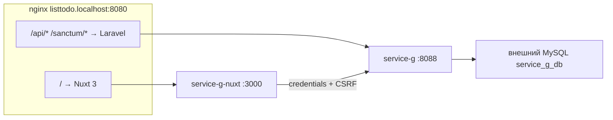

# service-g — To-Do List (тестовое задание)

Каркас для реализации **To-Do List**: **Laravel 13 API** + **Nuxt 3** (Vue 3) с авторизацией через **Laravel Sanctum** (cookie + CSRF). Отдельная MySQL-база `service_g_db`. UI и API доступны с одного origin через nginx-gateway: `http://listtodo.localhost:8080`.

| Документ | Назначение |
|---|---|
| [корневой README](../README.md) | Docker, gateway, CI/CD, общая инфраструктура |
| [service-d/README.md](../service-d/README.md) | Референс Sanctum SPA/API (похожий flow, но Vue SPA вместо Nuxt) |

Порты по умолчанию: Laravel API **8088** (`SERVICE_G_PORT`), Nuxt **3000** (`SERVICE_G_NUXT_PORT`), gateway **8080**.

---

## Задание

Реализуйте полноценное приложение **To-Do List**. **Аутентификация уже реализована в каркасе** — её можно использовать как образец слоёв (DTO, Service, Repository, Form Requests, Feature-тесты). Основная работа кандидата — **CRUD задач (listtodos)** на backend и frontend.

1. **Backend (Laravel API):** CRUD задач с валидацией и изоляцией по `user_id` (auth API уже есть).
2. **Frontend (Nuxt 3):** UI списка задач с созданием, редактированием и удалением (страницы входа/регистрации и middleware уже подключены к API).
3. **Архитектура backend:** DTO, Enum (при необходимости), Service layer, Repository layer, Form Requests, DI через контракты, PHPDoc — по образцу модуля Auth.
4. **Тесты:** Feature-тесты CRUD listtodos на базе `service_g_db_testing` (auth-тесты уже есть).
5. **Документация:** краткий README вашего решения (можно дополнить этот файл или добавить `SOLUTION.md`).

### Nuxt 3 = Vue 3

**Nuxt 3 уже построен на Vue 3** (SFC, `<script setup>`, composables, file-based routing). Отдельный Vue 3 SPA (Vite + Vue Router внутри Laravel, как в `service-d`) **не требуется** — единственный фронтенд находится в `nuxt-app/`.

### Что уже есть в каркасе

| Компонент | Статус |
|---|---|
| Docker (`service-g`, `service-g-nuxt`, nginx `listtodo.localhost`) | ✅ |
| Внешняя БД `service_g_db` / `service_g_db_testing` | ✅ конфиг |
| Laravel 13 skeleton, миграции `users`, `cache`, `jobs`, `sessions` | ✅ |
| Sanctum: `statefulApi()`, `config/sanctum.php`, `HasApiTokens` на `User` | ✅ |
| **Auth API:** register, login, logout, user + rate limit входа | ✅ |
| **Auth backend:** DTO, Form Requests, `AuthService`, `UserRepositoryInterface` → `EloquentUserRepository`, DI | ✅ |
| **Auth Nuxt:** `useApi`, `useAuth` (реальные вызовы API), middleware `auth` | ✅ |
| Nuxt-страницы `/login`, `/register` (редирект), `/listtodos` (заглушка CRUD), редирект с `/` | ✅ |
| Blade-тестовые страницы `/login`, `/register` на Laravel (`localhost:8088`) | ✅ |
| `tests/Support/MakesStatefulApiRequests.php`, `tests/Feature/AuthApiTest.php` | ✅ |
| Миграция `listtodos`, ListTodo CRUD API, Nuxt CRUD UI, Feature-тесты listtodos | ❌ **реализует кандидат** |

### Что реализует кандидат

**Backend:**

- Миграция таблицы `listtodos` (минимум: `user_id`, заголовок, статус выполнения; дополнительные поля — на ваше усмотрение).
- ListTodo CRUD через `Route::apiResource('listtodos', ListTodoController::class)` за middleware `auth:sanctum` (см. TODO в `routes/api.php`).
- Слои по образцу Auth: Form Request → Controller → Service → Repository; DTO для входа/выхода; пользователь видит и изменяет **только свои** задачи.

**Frontend (Nuxt):**

- CRUD UI на `/listtodos` (форма создания, список, редактирование, удаление).
- Composable `useListTodos` (или аналог) с вызовами `/api/listtodos`.
- Обработка ошибок валидации Laravel (422) через `useApi().extractErrorMessage`.

**Тесты:**

- Feature-тесты listtodos с trait `MakesStatefulApiRequests`.
- Только база `service_g_db_testing` (см. `.env.testing`, `./scripts/test-services.sh service-g`).

---

## Архитектура



Один origin `listtodo.localhost:8080` — Sanctum cookies работают без CORS-прокси: nginx направляет `/` в Nuxt, `/api/` и `/sanctum/` — в Laravel.

Конфигурация gateway: `nginx-gateway/nginx.conf` (server block `listtodo.localhost`).

### Sanctum flow в Nuxt

1. `GET /sanctum/csrf-cookie` (не `/api`) — через `useApi().rootFetch`.
2. `POST /api/login` или `/api/register` с заголовком `X-XSRF-TOKEN` из cookie `XSRF-TOKEN`.
3. Далее `GET /api/user`, `GET/POST/PATCH/DELETE /api/listtodos` с `credentials: 'include'`.

Реализация клиента: `nuxt-app/composables/useApi.ts`, `nuxt-app/composables/useAuth.ts`.

### Маршрутизация

| Путь | Куда | Авторизация |
|---|---|---|
| `http://listtodo.localhost:8080/` | Nuxt UI (через gateway) | Sanctum (cookie) |
| `http://listtodo.localhost:8080/api/*` | Laravel API | по эндпоинту |
| `http://listtodo.localhost:8080/sanctum/*` | Laravel Sanctum | публичный (CSRF cookie) |
| `http://localhost:8088/` | Laravel API напрямую (JSON info) | — |
| `http://localhost:8088/login` | Blade-тестовая страница входа/регистрации | — |
| `http://localhost:8088/register` | Blade-тестовая страница регистрации | — |
| `http://localhost:8088/up` | Health check | публичный |
| `http://localhost:3000/` | Nuxt напрямую (без same-origin API) | для отладки UI |

Для полного сценария auth + API используйте **gateway** (`listtodo.localhost:8080`), а не прямой порт Nuxt `:3000`.

### Nuxt-страницы

| Путь | Файл | Описание |
|---|---|---|
| `/` | `pages/index.vue` | Редирект на `/listtodos` или `/login` |
| `/login` | `pages/login.vue` | Форма входа/регистрации (подключена к API) |
| `/register` | `pages/register.vue` | Редирект на `/login?register=1` |
| `/listtodos` | `pages/listtodos/index.vue` | Список задач (заглушка CRUD — реализует кандидат) |

Middleware `middleware/auth.ts` перенаправляет неавторизованных на `/login`.

---

## Быстрый старт

### 1. База данных

Создайте во **внешнем MySQL** на хосте (контейнеры подключаются через `host.docker.internal`):

```sql
CREATE DATABASE service_g_db CHARACTER SET utf8mb4 COLLATE utf8mb4_unicode_ci;
CREATE DATABASE service_g_db_testing CHARACTER SET utf8mb4 COLLATE utf8mb4_unicode_ci;
```

### 2. Окружение

```bash
cp service-g/.env.example service-g/.env
```

Ключевые переменные:

```env
APP_NAME=service-g
APP_URL=http://listtodo.localhost:8080
FRONTEND_URL=http://listtodo.localhost:8080

DB_CONNECTION=mysql
DB_HOST=host.docker.internal
DB_PORT=3306
DB_DATABASE=service_g_db
DB_TEST_DATABASE=service_g_db_testing
DB_USERNAME=root
DB_PASSWORD=<your-local-password>

SESSION_DRIVER=database

SANCTUM_STATEFUL_DOMAINS=localhost:3000,localhost:8088,listtodo.localhost,listtodo.localhost:8080,__SANCTUM_CURRENT_REQUEST_HOST__
```

### 3. Зависимости PHP

Каталог `vendor/` не в git и монтируется с хоста в контейнер. Перед первым запуском установите зависимости (один из вариантов):

```bash
docker compose run --rm --no-deps --entrypoint composer service-g install --no-interaction --prefer-dist --no-progress
```

Либо при `docker compose up service-g` entrypoint сам выполнит `composer install`, если `vendor/autoload.php` отсутствует.

### 4. Запуск

Из корня репозитория:

```bash
docker compose up -d service-g service-g-nuxt gateway
docker compose exec -u 1000 service-g php artisan key:generate
docker compose exec service-g php artisan migrate
```

Добавьте в `/etc/hosts` (Linux/WSL):

```text
127.0.0.1 listtodo.localhost
```

Откройте UI: [http://listtodo.localhost:8080](http://listtodo.localhost:8080)

Проверка API напрямую:

```bash
curl http://localhost:8088/up
curl http://localhost:8088/
```

> **Миграции** изменяют схему БД. В рамках задания вы добавите миграцию `listtodos` — выполняйте `migrate` после её создания и согласования с локальной политикой проекта.

### 5. Frontend (разработка)

Nuxt запускается контейнером `service-g-nuxt`. Для установки зависимостей и сборки:

```bash
docker compose exec service-g-nuxt npm ci
docker compose exec service-g-nuxt npm run build
```

Исходники: `service-g/nuxt-app/`. `NUXT_PUBLIC_API_BASE` пустой — запросы идут same-origin через gateway.

### 6. Тесты

```bash
./scripts/test-services.sh service-g
```

Скрипт пересоздаёт `service_g_db_testing` и применяет миграции. Auth-тесты уже проходят; после реализации listtodos добавьте Feature-тесты CRUD и убедитесь, что весь набор зелёный.

---

## API-контракт

Базовый префикс: `/api`. Авторизация — **Sanctum stateful** (session cookie), не Bearer token.

Перед state-changing запросами (`POST`, `PUT`, `PATCH`, `DELETE`) клиент должен получить CSRF-cookie:

```http
GET /sanctum/csrf-cookie
```

### Авторизация (реализовано)

| Метод | Путь | Тело запроса | Ответ | Auth |
|---|---|---|---|---|
| `POST` | `/api/register` | `name`, `email`, `password`, `password_confirmation` | `201` + `{ "user": { "id", "name", "email" } }` | — |
| `POST` | `/api/login` | `email`, `password` | `200` + `{ "user": { "id", "name", "email" } }` | — |
| `POST` | `/api/logout` | — | `200` + `{ "message": "Logged out." }` | `auth:sanctum` |
| `GET` | `/api/user` | — | `200` + `{ "user": { "id", "name", "email" } }` | `auth:sanctum` |

**Ошибки валидации:** `422` + `{ "message": "...", "errors": { "field": ["..."] } }`.

**Неавторизованный доступ к защищённым маршрутам:** `401`.

**Rate limit входа:** после 5 неудачных попыток — `422` с сообщением throttle на поле `email`.

Пример регистрации через gateway:

```bash
curl -c cookies.txt -b cookies.txt \
  -H "Accept: application/json" \
  -H "Origin: http://listtodo.localhost:8080" \
  http://listtodo.localhost:8080/sanctum/csrf-cookie

curl -c cookies.txt -b cookies.txt \
  -H "Accept: application/json" \
  -H "Content-Type: application/json" \
  -H "Origin: http://listtodo.localhost:8080" \
  -X POST http://listtodo.localhost:8080/api/register \
  -d '{"name":"Test","email":"test@example.com","password":"password","password_confirmation":"password"}'
```

Реализация в каркасе: `app/Http/Controllers/Api/AuthController.php`, `app/Services/Auth/`, `tests/Feature/AuthApiTest.php`.

Референс (другой сервис): `service-d/app/Http/Controllers/Api/AuthController.php`.

### Задачи (ListTodos) — реализует кандидат

REST API через `Route::apiResource('listtodos', ListTodoController::class)` за middleware `auth:sanctum`.

| Метод | Путь | Описание | Auth |
|---|---|---|---|
| `GET` | `/api/listtodos` | Список задач **текущего** пользователя | `auth:sanctum` |
| `POST` | `/api/listtodos` | Создание задачи | `auth:sanctum` |
| `GET` | `/api/listtodos/{id}` | Одна задача (только своя) | `auth:sanctum` |
| `PUT` / `PATCH` | `/api/listtodos/{id}` | Обновление (только своя) | `auth:sanctum` |
| `DELETE` | `/api/listtodos/{id}` | Удаление (только своя) | `auth:sanctum` |

**Рекомендуемая схема `listtodos` (минимум):**

| Поле | Тип | Описание |
|---|---|---|
| `id` | bigint PK | |
| `user_id` | FK → `users` | владелец; `cascadeOnDelete` |
| `title` | string | заголовок задачи |
| `is_completed` | boolean | выполнена или нет |
| `created_at`, `updated_at` | timestamps | |

**Пример тела `POST /api/listtodos`:**

```json
{
  "title": "Купить молоко",
  "is_completed": false
}
```

**Пример ответа `GET /api/listtodos`:**

```json
{
  "data": [
    {
      "id": 1,
      "title": "Купить молоко",
      "is_completed": false,
      "created_at": "2026-07-12T12:00:00.000000Z",
      "updated_at": "2026-07-12T12:00:00.000000Z"
    }
  ]
}
```

Формат JSON (обёртка `data`, pagination, дополнительные поля) — на ваше усмотрение, но должен быть **согласован** между API и Nuxt UI. Чужие задачи (`user_id` другого пользователя) — `404` или `403`.

Точка подключения маршрутов: `routes/api.php` (TODO для listtodos).

---

## Структура каталогов

```
service-g/
├── app/
│   ├── Contracts/
│   │   └── UserRepositoryInterface.php
│   ├── DTO/Auth/
│   │   ├── LoginUserDto.php
│   │   └── RegisterUserDto.php
│   ├── Http/
│   │   ├── Controllers/Api/
│   │   │   └── AuthController.php
│   │   └── Requests/Auth/
│   │       ├── LoginRequest.php
│   │       └── RegisterRequest.php
│   ├── Models/
│   │   └── User.php
│   ├── Providers/
│   │   └── AppServiceProvider.php      # DI: UserRepositoryInterface
│   ├── Repositories/User/
│   │   └── EloquentUserRepository.php
│   └── Services/Auth/
│       ├── AuthService.php
│       └── LoginRateLimiter.php
├── routes/
│   ├── api.php                         # auth ✅; listtodos — TODO
│   └── web.php                         # JSON info + Blade /login, /register
├── config/
│   ├── database.php                    # service_g_db / service_g_db_testing
│   ├── sanctum.php
│   └── cors.php
├── database/migrations/                # users, cache, jobs (+ listtodos — кандидат)
├── resources/views/
│   └── test-login.blade.php            # тест auth без Nuxt (localhost:8088)
├── nuxt-app/                           # единственный фронтенд (Nuxt 3 / Vue 3)
│   ├── nuxt.config.ts
│   ├── composables/
│   │   ├── useApi.ts                   # $fetch + CSRF
│   │   └── useAuth.ts                  # Sanctum session (реализовано)
│   ├── middleware/auth.ts
│   ├── types/auth.ts
│   ├── layouts/default.vue
│   └── pages/
│       ├── index.vue
│       ├── login.vue
│       ├── register.vue                # → /login?register=1
│       └── listtodos/index.vue         # заглушка CRUD
├── tests/
│   ├── Feature/
│   │   ├── AuthApiTest.php             # auth API
│   │   └── ExampleTest.php             # /up, /, Blade-страницы
│   ├── Support/MakesStatefulApiRequests.php
│   └── TestCase.php                    # service_g_db_testing, без CSRF в тестах
├── Dockerfile
├── nuxt-app/Dockerfile
├── docker-entrypoint.sh
├── .env.example
├── .env.testing
└── README.md                           # этот файл
```

**Не используется:** `resources/js/spa-app/`, корневой `package.json` с Vue Router — фронтенд только в `nuxt-app/`.

---

## Критерии приёмки (чеклист)

- [x] Регистрация, вход, выход, `GET /api/user` работают через Sanctum cookie на `listtodo.localhost:8080`.
- [x] Backend auth: Form Requests, Service, Repository, DTO, DI.
- [x] Nuxt: рабочие `/login`, `/register`, middleware `auth`.
- [ ] CRUD listtodos с валидацией; пользователь не видит чужие задачи.
- [ ] Backend listtodos: Form Requests, Service, Repository, DTO, DI.
- [ ] Nuxt: UI CRUD на `/listtodos`.
- [ ] Миграция `listtodos`, Feature-тесты listtodos на `service_g_db_testing`.
- [ ] `./scripts/test-services.sh service-g` проходит без ошибок (включая новые тесты).

---

## Полезные ссылки

- [Laravel Sanctum SPA Authentication](https://laravel.com/docs/sanctum#spa-authentication)
- [Nuxt 3 Documentation](https://nuxt.com/docs)
- [Документация MAX (dev.max.ru)](https://dev.max.ru/docs) — для других сервисов монорепозитория; к service-g не относится
