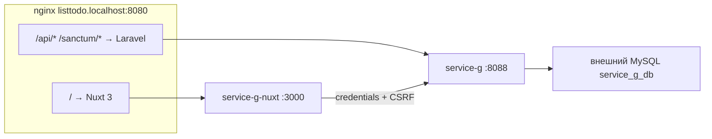

# service-g — To-Do List

Полноценное приложение **To-Do List**: **Laravel 13 API** + **Nuxt 3** (Vue 3) с авторизацией через **Laravel Sanctum** (cookie + CSRF). Отдельная MySQL-база `service_g_db`. UI и API доступны с одного origin через nginx-gateway: `http://listtodo.localhost:8080`.

| Документ | Назначение |
|---|---|
| [корневой README](../README.md) | Docker, gateway, CI/CD, общая инфраструктура |
| [OpenAPI 3.0](docs/openapi.yaml) | Контракт API (auth + tasks) |
| [service-d/README.md](../service-d/README.md) | Референс Sanctum SPA/API (похожий flow, Vue SPA вместо Nuxt) |

Порты по умолчанию: Laravel API **8088** (`SERVICE_G_PORT`), Nuxt **3000** (`SERVICE_G_NUXT_PORT`), gateway **8080**.

---

## Возможности

| Область | Реализовано |
|---|---|
| Auth API (`/api/auth/*`, `/api/user`) | Sanctum cookie session, rate limit входа |
| CRUD задач (`/api/tasks`) | Фильтр, поиск, сортировка, пагинация |
| Роли `user` / `admin` | user — только свои задачи; admin — просмотр всех, редактирование и удаление только своих |
| Backend-слои | DTO, Enum, Form Request, Service, Repository, Policy, DI |
| Nuxt UI (`/tasks`) | CRUD, debounce-поиск, sync с URL query, пагинация |
| Тесты | Feature `AuthApiTest`, `TaskApiTest`; Vitest (`TaskList`, `TaskForm`, `useTasks`, auth middleware) |
| OpenAPI | `docs/openapi.yaml`, HTTP `GET /api/docs/openapi.yaml` |

### Nuxt 3 = Vue 3

**Nuxt 3 построен на Vue 3** (SFC, `<script setup>`, composables, file-based routing). Единственный фронтенд — `nuxt-app/`.

---

## Архитектура



Один origin `listtodo.localhost:8080` — Sanctum cookies работают без CORS-прокси: nginx направляет `/` в Nuxt, `/api/` и `/sanctum/` — в Laravel.

Конфигурация gateway: `nginx-gateway/nginx.conf` (server block `listtodo.localhost`).

### Sanctum flow в Nuxt

1. `GET /sanctum/csrf-cookie` (не `/api`) — через `useApi().rootFetch`.
2. `POST /api/auth/login` или `/api/auth/register` с заголовком `X-XSRF-TOKEN` из cookie `XSRF-TOKEN`.
3. Далее `GET /api/user`, `GET/POST/PATCH/DELETE /api/tasks` с `credentials: 'include'`.

Реализация клиента: `nuxt-app/composables/useApi.ts`, `nuxt-app/composables/useAuth.ts`, `nuxt-app/composables/useUnauthorizedHandler.ts`, `nuxt-app/plugins/api-auth.client.ts` (редирект на `/login` при 401).

### Маршрутизация

| Путь | Куда | Авторизация |
|---|---|---|
| `http://listtodo.localhost:8080/` | Nuxt UI (через gateway) | Sanctum (cookie) |
| `http://listtodo.localhost:8080/tasks` | Список задач (Nuxt) | `auth` middleware |
| `http://listtodo.localhost:8080/api/*` | Laravel API | по эндпоинту |
| `http://listtodo.localhost:8080/sanctum/*` | Laravel Sanctum | публичный (CSRF cookie) |
| `http://listtodo.localhost:8080/api/docs/openapi.yaml` | OpenAPI-спецификация | публичный |
| `http://localhost:8088/` | Laravel API напрямую (JSON info) | — |
| `http://localhost:8088/login` | Тестовая HTML-форма входа (Blade, без Nuxt) | публичный |
| `http://localhost:8088/register` | Тестовая HTML-форма регистрации (Blade) | публичный |
| `http://localhost:8088/up` | Health check | публичный |
| `http://localhost:3000/` | Nuxt напрямую (без same-origin API) | для отладки UI |

Для полного сценария auth + API используйте **gateway** (`listtodo.localhost:8080`), а не прямой порт Nuxt `:3000`.

### Nuxt-страницы

| Путь | Файл | Описание |
|---|---|---|
| `/` | `pages/index.vue` + `nuxt.config.ts` (`routeRules`) | Редирект на `/login` |
| `/login` | `pages/login.vue` | Форма входа/регистрации |
| `/register` | `pages/register.vue` | Редирект на `/login?register=1` |
| `/tasks` | `pages/tasks/index.vue` | CRUD задач, фильтры, поиск, пагинация |
| `/listtodos` | `pages/listtodos/index.vue` | Редирект на `/tasks` (обратная совместимость) |

Middleware `middleware/auth.ts` перенаправляет неавторизованных на `/login`.

---

## Быстрый старт (локально)

Предварительно создайте БД `service_g_db` (см. [§1](#1-база-данных)).

```bash
cp service-g/.env.example service-g/.env
# задайте DB_PASSWORD в service-g/.env
docker compose up -d service-g service-g-nuxt gateway
docker compose exec service-g php artisan db:seed
```

Добавьте в `/etc/hosts` (Linux/WSL):

```text
127.0.0.1 listtodo.localhost
```

Откройте UI: [http://listtodo.localhost:8080](http://listtodo.localhost:8080)

Для отладки API без Nuxt (Blade-формы Sanctum): [http://localhost:8088/login](http://localhost:8088/login)

### 1. База данных

Для local / production — отдельная MySQL-база (не `sail_db`):

| Окружение | База |
|---|---|
| local / production | `service_g_db` (внешний MySQL) |
| PHPUnit / CI | SQLite `:memory:` (внешний MySQL не нужен) |

Создайте во **внешнем MySQL** на хосте (контейнеры подключаются через `host.docker.internal`):

```sql
CREATE DATABASE service_g_db CHARACTER SET utf8mb4 COLLATE utf8mb4_unicode_ci;
```

Тесты backend используют SQLite `:memory:` — настройка в `phpunit.xml` (`DB_CONNECTION=sqlite`, `DB_DATABASE=:memory:`). Trait `RefreshDatabase` применяет миграции в памяти при каждом прогоне; отдельную тестовую MySQL-базу создавать не нужно.

### 2. Окружение

Скопируйте шаблон и задайте пароль MySQL, совпадающий с вашим локальным сервером:

```bash
cp service-g/.env.example service-g/.env
```

Ключевые переменные в `service-g/.env`:

```env
APP_NAME=service-g
APP_URL=http://listtodo.localhost:8080
FRONTEND_URL=http://listtodo.localhost:8080

DB_CONNECTION=mysql
DB_HOST=host.docker.internal
DB_PORT=3306
DB_DATABASE=service_g_db
DB_USERNAME=root
DB_PASSWORD=<your-local-password>

SESSION_DRIVER=database

SANCTUM_STATEFUL_DOMAINS=localhost:3000,localhost:8088,listtodo.localhost,listtodo.localhost:8080,__SANCTUM_CURRENT_REQUEST_HOST__
CORS_ALLOWED_ORIGINS=http://localhost:3000,http://listtodo.localhost:8080,http://listtodo.localhost
```

| Переменная | Описание |
|---|---|
| `DB_PASSWORD` | Пароль root MySQL на хосте. В `docker-compose.yml` для `service-g` есть override `SERVICE_G_DB_PASSWORD` (по умолчанию `12345678AS`) — значение в `.env` должно совпадать с реальным паролем |
| `SANCTUM_STATEFUL_DOMAINS` | Домены для cookie-based API. Плейсхолдер `__SANCTUM_CURRENT_REQUEST_HOST__` подставляет `Host` запроса динамически |
| `NUXT_PUBLIC_API_BASE` | Задаётся в `docker-compose.yml` для `service-g-nuxt` как пустая строка — same-origin `/api` через gateway |

### 3. Зависимости PHP

Каталог `vendor/` не в git и монтируется с хоста (`./service-g/vendor` → `/var/www/html/vendor`).

При первом `docker compose up service-g` entrypoint (`docker-entrypoint.sh`) сам выполнит `composer install`, если нет `vendor/autoload.php`.

Опционально — установить зависимости до запуска:

```bash
docker compose run --rm --no-deps --entrypoint composer service-g install --no-interaction --prefer-dist --no-progress
```

### 4. Запуск

Из корня репозитория:

```bash
docker compose up -d service-g service-g-nuxt gateway
```

При старте контейнера `service-g` entrypoint автоматически:

1. создаёт каталоги `storage/` и `bootstrap/cache`;
2. выполняет `composer install`, если нет `vendor/autoload.php`;
3. генерирует `APP_KEY` в `.env`, если ключ ещё не задан (`php artisan key:generate --force`);
4. применяет миграции (`php artisan migrate --force`).

Контейнер `service-g-nuxt` при старте выполняет `npm ci` (если `node_modules` неполные) и запускает `npm run dev` на порту `3000`.

Порты: Laravel **8088** → внутренний `:8000`, Nuxt **3000**, gateway **8080**.

### 5. Миграции

Миграции применяются **автоматически** при каждом старте `service-g` (см. `docker-entrypoint.sh`).

Ручной запуск (после изменения миграций):

```bash
docker compose exec service-g php artisan migrate
```

Схема включает таблицы: `users` (+ колонка `role`), `tasks`, `sessions`, `personal_access_tokens`, `cache`, `jobs`.

### 6. Сиды (тестовые данные)

Сидер **не** запускается entrypoint'ом — выполните вручную после первого запуска:

```bash
docker compose exec service-g php artisan db:seed
```

`DatabaseSeeder` создаёт:

- пользователя `admin@example.com` (роль `admin`);
- пользователя `user@example.com` (роль `user`);
- по 5–10 случайных задач для каждого (через фабрики).

Повторное заполнение с очисткой БД (разрушающая операция):

```bash
docker compose exec service-g php artisan migrate:fresh --seed
```

### 7. Тестовые пользователи (после `db:seed`)

| Email | Пароль | Роль |
|---|---|---|
| `admin@example.com` | `password` | `admin` — видит все задачи, редактирует и удаляет только свои |
| `user@example.com` | `password` | `user` — только свои задачи |

Пароль `password` задаётся в `database/factories/UserFactory.php` (`Hash::make('password')`).

Регистрация через `POST /api/auth/register` или UI `/login?register=1` доступна для локальной разработки; для демо достаточно seeded users.

### 8. Frontend (разработка)

В Docker dev-сервер Nuxt поднимается автоматически (`service-g-nuxt` → `npm run dev`). Исходники: `service-g/nuxt-app/`.

Сборка production-ассетов (опционально, для проверки `nuxt build`):

```bash
docker compose exec service-g-nuxt npm ci
docker compose exec service-g-nuxt npm run build
```

`NUXT_PUBLIC_API_BASE` пустой — запросы идут same-origin через gateway.

### 9. Тесты

**Backend** (SQLite `:memory:`, миграции через `RefreshDatabase` — пароль MySQL и `TEST_DB_PASSWORD` не нужны):

```bash
./scripts/test-services.sh service-g
```

Альтернатива внутри контейнера:

```bash
docker compose exec service-g php artisan test --env=testing
```

**Frontend** (Vitest):

```bash
docker compose exec service-g-nuxt npm run test
```

В CI: `npm run test` для `service-g/nuxt-app` в job `frontend-build`; backend — `./scripts/test-services.sh all` в job `backend-tests`.

#### Laravel API — Unit-тесты

| Файл | Сценарий |
|---|---|
| `tests/Unit/ExampleTest.php` | Smoke-тест PHPUnit (`test_that_true_is_true`) |

Отдельных unit-тестов доменных классов (Service, Repository, Policy) нет — бизнес-логика покрыта feature-тестами API.

#### Laravel API — Feature-тесты

Все feature-тесты используют `RefreshDatabase` (SQLite `:memory:`), trait `MakesStatefulApiRequests` (Sanctum cookie + CSRF, как в Nuxt).

**`tests/Feature/AuthApiTest.php` — авторизация**

| Тест | Что проверяет |
|---|---|
| `test_guest_cannot_access_user_endpoint` | Гость → `GET /api/user` → `401` |
| `test_user_can_register` | `POST /api/auth/register` → `201`, запись в `users` |
| `test_user_can_login_with_valid_credentials` | Успешный вход → `200`, `assertAuthenticatedAs` |
| `test_user_cannot_login_with_invalid_password` | Неверный пароль → `422` на `email`, сессия не открыта |
| `test_authenticated_user_can_fetch_profile` | `GET /api/user` для авторизованного → профиль в JSON |
| `test_authenticated_user_can_logout` | `POST /api/auth/logout` → `200`, сессия завершена |
| `test_login_is_throttled_after_five_failed_attempts` | После 5 неудачных попыток — throttle на `email` |

**`tests/Feature/TaskApiTest.php` — CRUD, роли, фильтры**

| Группа | Тесты | Что проверяет |
|---|---|---|
| Доступ | `test_guest_cannot_access_tasks_index`, `test_guest_cannot_create_task` | Гость → `401` |
| Создание | `test_user_can_create_task` | `POST /api/tasks` → `201`, `user_id` = текущий пользователь |
| Валидация | `test_create_task_validates_title_min_length`, `test_create_task_requires_due_date`, `test_create_task_rejects_empty_due_date` | `title` ≥ 3 символов, обязательный `due_date` → `422` |
| Изоляция user | `test_user_sees_only_own_tasks_in_list`, `test_user_cannot_view_other_users_task`, `test_user_cannot_update_other_users_task`, `test_user_cannot_delete_other_users_task` | User видит и меняет только свои задачи → чужие `403` |
| CRUD владельца | `test_user_can_update_and_delete_own_task` | `PATCH` и `DELETE` своей задачи → `200` / `204` |
| Роль admin | `test_admin_sees_all_tasks_in_list`, `test_admin_cannot_update_or_delete_other_users_task`, `test_admin_list_includes_owner_name` | Admin видит все задачи + `owner_name`; чужие задачи не редактирует/не удаляет |
| Ошибки | `test_show_returns_not_found_for_missing_task` | Несуществующий id → `404` |
| Список | `test_user_can_filter_tasks_by_status`, `test_user_can_search_tasks_by_title_and_description`, `test_user_can_sort_tasks_by_due_date`, `test_user_can_paginate_tasks` | Query: `status`, `search`, `sort`/`direction`, `page`/`per_page` |

#### Nuxt — frontend-тесты (Vitest)

Каталог `nuxt-app/test/nuxt/`. Запуск через `@nuxt/test-utils` (`mountSuspended`, `mockNuxtImport`).

**`auth.middleware.nuxt.spec.ts` — защита маршрутов**

| Сценарий | Ожидание |
|---|---|
| Путь `/login`, `/register` | Сессия не проверяется, редиректа нет |
| `/tasks`, сессия не проверена | Вызывается `fetchUser` |
| `/tasks`, пользователь не авторизован | Редирект на `/login` |
| `/tasks`, пользователь авторизован | Пропуск без редиректа |

**`unauthorized-handler.nuxt.spec.ts` — обработка HTTP 401**

| Сценарий | Ожидание |
|---|---|
| 401 на `/api/auth/login`, `/sanctum/csrf-cookie`, `/api/user` | Игнорируется (без сброса сессии и редиректа) |
| 401 на `/api/tasks` | Сброс `user`, редирект на `/login` |
| 401 на `/api/tasks`, уже на `/login` | Повторный редирект не выполняется |

**`useTasks.nuxt.spec.ts` — composable списка задач**

| Сценарий | Ожидание |
|---|---|
| `buildTasksQueryString` без параметров | Пустая строка |
| Сборка query из фильтров | Корректный URL-encoding (`status`, `search`, `sort`, `page`, `per_page`) |
| `page=1`, `per_page=5` | Не попадают в query (значения по умолчанию) |
| `fetchTasks` успех | Вызов `apiFetch` с query; сохранение `data`, `meta`, сброс `loading`/`listError` |
| `fetchTasks` ошибка API | `listError` с сообщением, `tasks` = `[]` |

**`TaskList.nuxt.spec.ts` — отображение списка**

| Сценарий | Ожидание |
|---|---|
| Пустой список | Empty state «Задач пока нет» |
| Ошибка API (`listError`) | Блок ошибки + кнопка «Повторить» (emit `retry`) |
| `loading=true` | Skeleton (`aria-busy`), без empty state |
| Список с задачами | Title, description, кнопки «Изменить»/«Удалить» |
| Чужая задача (role `user`) | Кнопки управления скрыты |
| Чужая задача (role `admin`) | Кнопки видны, но `disabled` |

**`TaskForm.nuxt.spec.ts` — валидация формы создания/редактирования**

| Сценарий | Ожидание |
|---|---|
| `title` < 3 символов | Ошибка, `submit` не эмитится |
| Пустой `due_date` | «Укажите срок выполнения», `submit` не эмитится |
| Дата в прошлом | «Срок не может быть в прошлом», `submit` не эмитится |
| Режим редактирования (`requireChanges`) | Кнопка «Сохранить» disabled, пока поля не изменены |
| Возврат к исходным значениям | Кнопка снова disabled |
| Валидные данные | Emit `submit` с `title`, `description`, `due_date`, `status` |

---

## OpenAPI

Спецификация: [`docs/openapi.yaml`](docs/openapi.yaml).

**Просмотр через HTTP:**

```text
http://listtodo.localhost:8080/api/docs/openapi.yaml
```

**Swagger UI:** откройте [editor.swagger.io](https://editor.swagger.io/) или https://jdegre.github.io/editor/ , меню **File → Import URL** и укажите URL выше (или импортируйте локальный файл).

Описаны все эндпоинты auth и tasks, query-параметры списка, схемы запросов/ответов и коды ошибок `401` / `403` / `404` / `422`.

---

## API-контракт

Базовый префикс: `/api`. Авторизация — **Sanctum stateful** (session cookie), не Bearer token.

Перед state-changing запросами (`POST`, `PUT`, `PATCH`, `DELETE`) клиент должен получить CSRF-cookie:

```http
GET /sanctum/csrf-cookie
```

### Авторизация

В монорепозитории **два разных сценария** авторизации — они не взаимозаменяемы:

| Сценарий | Где | Механизм |
|---|---|---|
| Центральный вход + микросервисы | `main-app` → gateway → `service-a` / `service-b` / `service-c` | **Passport (JWT)** в заголовке `Authorization: Bearer …`; nginx делает `auth_request` к `/api/auth/verify`, сервисы получают `X-User-Id` |
| Автономное SPA на своём домене | `service-d`, **service-g** | **Sanctum** (session cookie + CSRF) на том же origin, без `auth_request` на gateway |

**service-g** — отдельное приложение со **своей** БД пользователей (`service_g_db`), фронтенд (Nuxt) и API (Laravel) отдаются с **одного origin** (`listtodo.localhost:8080`). Для такой схемы Sanctum — рекомендуемый и наименее затратный вариант в Laravel.

**Почему Sanctum**

1. **Same-origin SPA.** Nuxt и `/api/*` идут через один хост gateway — cookie-сессия работает без CORS-танцев и без хранения токена в `localStorage` / `sessionStorage` (меньше риск утечки при XSS).
2. **Встроенная защита.** Sanctum даёт CSRF (`/sanctum/csrf-cookie` + `X-XSRF-TOKEN`) и HttpOnly-cookie из коробки; для JWT клиент сам отвечает за хранение, обновление и передачу токена.
3. **Мгновенный logout.** Сессия в БД (`sessions`) — `POST /api/auth/logout` сразу инвалидирует доступ. JWT до истечения `exp` остаётся валидным, пока не вводить blacklist / короткий TTL и refresh-flow.
4. **Нет связи с `main-app`.** Пользователи To-Do List не проходят через Passport `main-app`; подключать центральный JWT-поток (отдельный login, обмен токена, синхронизация `users`) для изолированного каркаса избыточно.
5. **Gateway без `auth_request`.** Блок `listtodo.*` в `nginx-gateway/nginx.conf` проксирует `/` → Nuxt и `/api/`, `/sanctum/` → Laravel **без** проверки Bearer — сессионные cookie корректно ходят в рамках одного домена; JWT-паттерн проекта рассчитан на маршруты `/api/a/`, `/api/b/`, `/api/c/`.

**Когда JWT был бы уместен:** мобильное приложение без cookie, публичный API для сторонних клиентов, несколько несвязанных origin без общего домена, единый SSO через `main-app` с передачей Bearer в downstream-сервисы.

В этом сервисе клиент использует **Sanctum stateful** (session cookie), не Bearer token — см. также [Laravel Sanctum SPA Authentication](https://laravel.com/docs/sanctum#spa-authentication) и референс [service-d/README.md](../service-d/README.md).

| Метод | Путь | Тело запроса | Ответ | Auth |
|---|---|---|---|---|
| `POST` | `/api/auth/register` | `name`, `email`, `password`, `password_confirmation` | `201` + `{ "user": { "id", "name", "email", "role" } }` | — |
| `POST` | `/api/auth/login` | `email`, `password` | `200` + `{ "user": { "id", "name", "email", "role" } }` | — |
| `POST` | `/api/auth/logout` | — | `200` + `{ "message": "Logged out." }` | `auth:sanctum` |
| `GET` | `/api/user` | — | `200` + `{ "user": { "id", "name", "email", "role" } }` | `auth:sanctum` |

**Ошибки валидации:** `422` + `{ "message": "...", "errors": { "field": ["..."] } }`.

**Неавторизованный доступ:** `401`. **Нет прав (policy):** `403`.

**Rate limit входа:** после 5 неудачных попыток — `422` с throttle на поле `email`.

Пример входа через gateway:

```bash
curl -c cookies.txt -b cookies.txt \
  -H "Accept: application/json" \
  -H "Origin: http://listtodo.localhost:8080" \
  http://listtodo.localhost:8080/sanctum/csrf-cookie

curl -c cookies.txt -b cookies.txt \
  -H "Accept: application/json" \
  -H "Content-Type: application/json" \
  -H "Origin: http://listtodo.localhost:8080" \
  -X POST http://listtodo.localhost:8080/api/auth/login \
  -d '{"email":"user@example.com","password":"password"}'
```

### Задачи

REST: `Route::apiResource('tasks', TaskController::class)` за middleware `auth:sanctum`.

| Метод | Путь | Описание | Auth |
|---|---|---|---|
| `GET` | `/api/tasks` | Список с фильтрами и пагинацией | `auth:sanctum` |
| `POST` | `/api/tasks` | Создание (`user_id` = текущий пользователь) | `auth:sanctum` |
| `GET` | `/api/tasks/{id}` | Одна задача | `auth:sanctum` |
| `PUT` / `PATCH` | `/api/tasks/{id}` | Обновление | `auth:sanctum` |
| `DELETE` | `/api/tasks/{id}` | Удаление (`204 No Content`) | `auth:sanctum` |

**Query-параметры `GET /api/tasks`:**

| Параметр | Значения | По умолчанию |
|---|---|---|
| `status` | `pending`, `in_progress`, `completed` | — |
| `search` | строка (LIKE по title/description) | — |
| `sort` | `due_date`, `status`, `created_at` | `created_at` |
| `direction` | `asc`, `desc` | `desc` |
| `page` | integer ≥ 1 | `1` |
| `per_page` | 1–100 | `5` |

**Схема `tasks`:**

| Поле | Тип | Описание |
|---|---|---|
| `id` | bigint PK | |
| `user_id` | FK → `users` | владелец; `cascadeOnDelete` |
| `title` | string(255) | 3–255 символов |
| `description` | text | nullable |
| `due_date` | date | nullable; при создании/обновлении — не раньше сегодня |
| `status` | enum | `pending`, `in_progress`, `completed` |
| `created_at`, `updated_at` | timestamps | |

**Пример `POST /api/tasks`:**

```json
{
  "title": "Купить молоко",
  "description": "2 литра",
  "due_date": "2026-07-20",
  "status": "pending"
}
```

**Пример `GET /api/tasks`:**

```json
{
  "data": [
    {
      "id": 1,
      "title": "Купить молоко",
      "description": "2 литра",
      "due_date": "2026-07-20",
      "status": "pending",
      "user_id": 2,
      "created_at": "2026-07-12T12:00:00+00:00",
      "updated_at": "2026-07-12T12:00:00+00:00"
    }
  ],
  "meta": {
    "current_page": 1,
    "last_page": 1,
    "per_page": 5,
    "total": 1
  }
}
```

Для **admin** в списке дополнительно возвращается `owner_name`. Чужие задачи для **user** — `403` (policy). **admin** не может редактировать и удалять чужие задачи (`PATCH`/`PUT`/`DELETE` → `403`).

---

## Структура каталогов

```
service-g/
├── app/
│   ├── Contracts/              # DI-контракты (Auth, Task, Session, RateLimiter)
│   ├── DTO/
│   │   ├── Auth/
│   │   └── Task/
│   ├── Enums/
│   │   ├── TaskStatus.php
│   │   └── UserRole.php
│   ├── Http/
│   │   ├── Controllers/Api/
│   │   │   ├── AuthController.php
│   │   │   └── TaskController.php
│   │   └── Requests/
│   │       ├── Auth/
│   │       └── Task/
│   ├── Models/
│   │   ├── Task.php
│   │   └── User.php
│   ├── Policies/
│   │   └── TaskPolicy.php
│   ├── Providers/
│   │   └── AppServiceProvider.php
│   ├── Repositories/
│   │   ├── Task/EloquentTaskRepository.php
│   │   └── User/EloquentUserRepository.php
│   └── Services/
│       ├── Auth/                 # AuthService, LoginRateLimiter, SessionManager
│       └── Task/                 # TaskService, TaskAuthorizer
├── database/
│   ├── factories/
│   ├── migrations/
│   └── seeders/DatabaseSeeder.php
├── docker-entrypoint.sh          # composer / key:generate / migrate при старте
├── docs/openapi.yaml
├── nuxt-app/
│   ├── assets/css/main.css
│   ├── components/               # TaskToolbar, TaskList, TaskForm, TaskModal, AppSpinner
│   ├── composables/              # useApi, useAuth, useTasks, useUnauthorizedHandler
│   ├── layouts/default.vue
│   ├── middleware/auth.ts
│   ├── pages/                    # login, tasks, register, listtodos
│   ├── plugins/api-auth.client.ts
│   ├── types/
│   ├── utils/tasksQuery.ts
│   ├── docker-entrypoint.sh      # npm ci / npm run dev
│   └── test/nuxt/                # Vitest
├── resources/views/
│   └── test-login.blade.php      # тестовые формы /login, /register на :8088
├── routes/
│   ├── api.php
│   └── web.php
└── tests/
    ├── Feature/
    │   ├── AuthApiTest.php
    │   └── TaskApiTest.php
    ├── Unit/ExampleTest.php
    └── Support/MakesStatefulApiRequests.php
```

---

## Критерии приёмки (чеклист)

### Инфраструктура и запуск

- [x] `docker compose up -d service-g service-g-nuxt gateway` — UI на `listtodo.localhost:8080`
- [x] Entrypoint `service-g`: `composer install`, `key:generate`, `migrate --force` при старте
- [x] `php artisan db:seed` — admin/user и задачи (вручную после первого запуска)
- [x] Тестовые пользователи `admin@example.com` / `user@example.com` (пароль `password`)

### Backend

- [x] Auth API: `/api/auth/*`, `/api/user` через Sanctum cookie
- [x] CRUD `/api/tasks` с валидацией (Form Requests → DTO)
- [x] Слои: Service, Repository, Policy, DI через контракты
- [x] Роли: user — только свои задачи; admin — просмотр всех, редактирование и удаление только своих
- [x] Фильтр `status`, поиск `search`, сортировка, пагинация
- [x] Коды ошибок: `401`, `403`, `404`, `422`
- [x] Feature-тесты `TaskApiTest`, `AuthApiTest` на SQLite `:memory:`
- [x] `./scripts/test-services.sh service-g` — green

### Frontend (Nuxt)

- [x] Страница `/tasks`: create, edit, delete
- [x] Фильтр по status, сортировка, debounce-поиск 300ms + sync с URL query
- [x] Пагинация (backend meta + UI prev/next)
- [x] Edit/delete активны только для владельца; у admin на чужих задачах кнопки видны, но disabled
- [x] Ошибки 401/403/422 отображаются в UI
- [x] `npm run test` (Vitest) — green; шаг в CI для `service-g/nuxt-app`

### Документация

- [x] OpenAPI: `docs/openapi.yaml` + `GET /api/docs/openapi.yaml`
- [x] README: auth-подход, команды, тестовые пользователи, таблица API

### Ручная проверка (рекомендуется перед сдачей)

- [ ] Login → список задач → create → edit status → delete
- [ ] Вход как `user@example.com` — не видны чужие задачи, нет edit/delete на них
- [ ] Вход как `admin@example.com` — видны все задачи, `owner_name` в списке; на чужих задачах кнопки «Изменить»/«Удалить» disabled
- [ ] Поиск и фильтры отражаются в URL (`?search=&status=&sort=&page=`)
- [ ] Swagger UI импортирует `http://listtodo.localhost:8080/api/docs/openapi.yaml`

---

## Полезные ссылки

- [Laravel Sanctum SPA Authentication](https://laravel.com/docs/sanctum#spa-authentication)
- [Nuxt 3 Documentation](https://nuxt.com/docs)
- [OpenAPI Specification](https://swagger.io/specification/)
