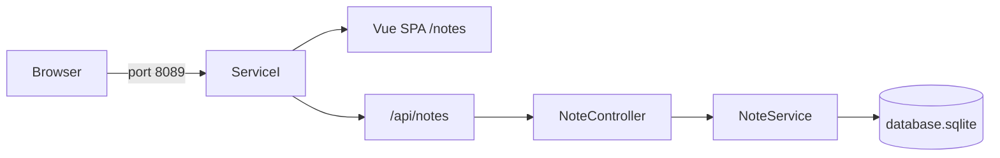
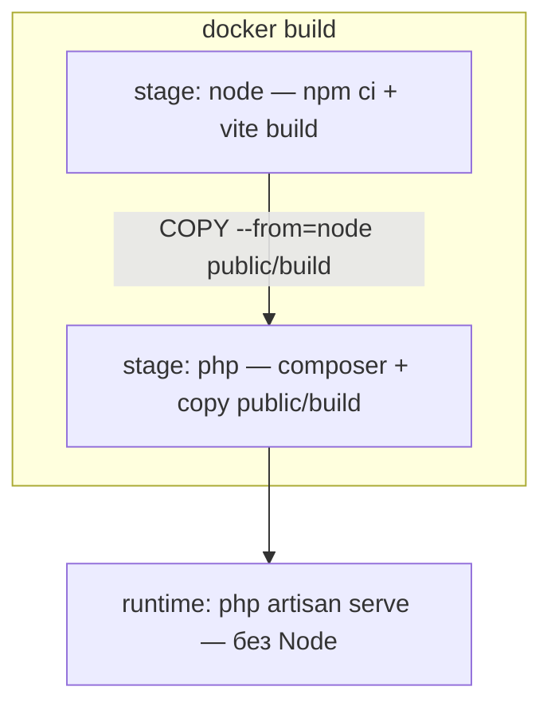

# service-i — Notes CRUD

Laravel 13 + Vue 3 SPA: публичный CRUD заметок на SQLite. Auth нет (`NotePolicy` — allow-all заглушка). Runtime-контейнер — **только PHP**; Node используется исключительно на этапе `docker build` (Vite).

| Документ | Назначение |
|---|---|
| [корневой README](../README.md) | Docker, gateway, общая инфраструктура |
| [service-d/README.md](../service-d/README.md) | Референс Vue SPA за Laravel (`Route::view` + Vite) |

Порт по умолчанию: **8089** (`SERVICE_I_PORT`). Опционально через gateway: `http://notes.localhost:8080`.

---

## Быстрый старт (канон — 2 команды)

Из корня репозитория:

```bash
cp service-i/.env.example service-i/.env
docker compose up -d --build service-i
```

Entrypoint сам: storage → `composer` при отсутствии `vendor` → `key:generate` → SQLite-файл → `migrate --force` → `db:seed --force` → `artisan serve`.

| Что | URL |
|---|---|
| UI (список) | [http://localhost:8089/notes](http://localhost:8089/notes) |
| API | [http://localhost:8089/api/notes](http://localhost:8089/api/notes) |
| Gateway (опционально) | [http://notes.localhost:8080](http://notes.localhost:8080) — запись `127.0.0.1 notes.localhost` в `/etc/hosts` |

---

## Стек

| Компонент | Значение |
|---|---|
| PHP / Laravel | 8.4 / ^13 |
| Frontend | Vue 3 SPA (vue-router, Pinia, Tailwind), не Inertia/Nuxt |
| БД | SQLite (`database/database.sqlite` в контейнере) |
| Тесты | PHPUnit, SQLite `:memory:` |
| Порт (host) | `8089` → `8000` |

---

## Архитектура





Слои Notes по ТЗ: Eloquent в `NoteService` (без Repository), без Sanctum. `NoteController` → `NoteService` → `Note` / `NoteResource`.

---

## API

Публичные маршруты в `routes/api.php` (без auth):

| Метод | Путь | Поведение |
|---|---|---|
| `GET` | `/api/notes` | Список: фильтры / sort / limit-offset → envelope |
| `POST` | `/api/notes` | Создание (`StoreNoteRequest`) |
| `GET` | `/api/notes/{note}` | Одна заметка (`NoteResource`) |
| `PUT`/`PATCH` | `/api/notes/{note}` | Обновление (`UpdateNoteRequest`) |
| `DELETE` | `/api/notes/{note}` | Удаление |

### Breaking change: `GET /api/notes`

Корень ответа больше не массив моделей. Контракт:

```json
{
  "items": [ /* NoteResource… */ ],
  "total": 42,
  "limit": 20,
  "offset": 0
}
```

Элементы — через `NoteResource` (без `meta`; `tags` всегда массив, `null` → `[]`). В контроллере обязательно `NoteResource::collection(...)->resolve()`, иначе Laravel обернёт коллекцию в `{ data: [...] }` и сломает `items`.

Слои: `IndexNoteRequest` → `NoteListFilters` → `NoteService::list` → envelope.

### Query-параметры списка

| Параметр | Описание | Default |
|---|---|---|
| `q` | поиск OR по `title` / `content` (LIKE, trim; `""` → без фильтра) | — |
| `tags` | **CSV** `?tags=a,b` **или массив** `?tags[]=a&tags[]=b` → `string[]`; AND через `whereJsonContains` | `[]` (фильтр не применяется) |
| `archived` | `false` \| `true` \| `all` (`NoteArchivedFilter` values) | `false` (только активные) |
| `sort` | whitelist: `created_at`, `-created_at`, `updated_at`, `-updated_at`, `title`, `-title` | `-updated_at` |
| `limit` | 1…100 | `20` |
| `offset` | ≥ 0 | `0` |

**Defaults только в `IndexNoteRequest::filters()`** — не в DTO, не в Controller, не в Service. Query приходит строками: `limit`/`offset` явно `(int)` в `filters()`, иначе `strict_types` + `int $limit` → TypeError.

Во Vue `archived` хранится как API-строка `'false'|'true'|'all'`, не как имя PHP Enum case.

Валидация CRUD:

- **Store:** `title` required\|string\|max:255; `content` nullable\|string; `tags` nullable\|array; `tags.*` string\|max:50; `archived` sometimes\|boolean.
- **Update:** те же поля, все `sometimes`.
- **Index:** см. таблицу выше; невалидные query → 422.

`NoteResource` отдаёт: `id`, `title`, `content`, `tags`, `archived`, timestamps. Поле `meta` (legacy) **не** отдаётся.

### Known limitations

- LIKE `%` / `_` в `q` не экранируются.
- ASCII case-insensitive для латиницы; кириллица зависит от collation SQLite:

```text
q=laravel   → найдёт "Laravel"
q=Ларавел   → не найдёт "laravel"
q=Ларавел   → НЕ найдёт "ларавел"
```

- BINARY-сортировка строк; гонки при offset-пагинации при параллельных insert/delete.

---

## Frontend (Vue 3 SPA)

Отдача через Laravel: catch-all в `web.php` → blade + собранный Vite-bundle (`public/build`).

| Путь | Страница |
|---|---|
| `/` | редирект на `/notes` |
| `/notes` | список (`pages/Notes/Index.vue`) — фильтры, URL sync, «Загрузить ещё» |
| `/notes/new` | создание |
| `/notes/:id/edit` | редактирование |

Клиент: `api/notes.js` + Pinia `stores/notes.js` (`loadFirst` / `loadMore`, AbortController). `NoteCard.vue`: title, excerpt, tags, удаление.

### URL sync и один fetch при открытии

`Index.vue`:

1. `watch` на фильтры / `q` — **без `immediate: true`** (иначе двойной `loadFirst` вместе с mount).
2. `onMounted`: прочитать `route.query` → store → **один** `loadFirst()`.
3. Дальше: смена фильтров → `router.replace` + `loadFirst()`; debounce `q` (~300 ms) только во Vue.

В URL пишутся только **недефолтные** значения; `offset` никогда. Шаринг тегов — CSV (`tags=a,b`). При чтении `route.query` value может быть `string|string[]` — нормализовать (`Array.isArray(v) ? v[0] : v`; для `tags` массив → список тегов).

### Ручной QA

1. `/notes?q=laravel` — фильтр + `q` в URL; в Network **ровно один** list-запрос при открытии (нет двойного `loadFirst`).
2. Стерли поиск — нет `q=` в URL.
3. `/notes?q=` — список грузится, поиск не применён; после взаимодействия `q=` уходит из URL.
4. `/notes?sort=foo` — banner, пустой список, total 0.
5. Load more при loading / !hasMore — no-op.
6. Два быстрых клика Load more → один запрос в Network.
7. Offline → Load more → banner; online → снова Load more → догрузка.
8. Create/Edit → Index; delete → обновлённый total.

### Разработка UI вне Docker

В runtime-контейнере **нет** Node/Vite HMR. Для правок фронта на хосте:

```bash
cd service-i
npm ci
npm run build   # или npm run dev — только на хосте
```

Канон старта сервиса остаётся двумя docker-командами выше (ассеты уже в образе после `--build`).

---

## Тесты

Только внутри контейнера `service-i` (сервис **не** в CI монорепо):

```bash
docker compose exec service-i php artisan test
```

- `tests/Feature/NoteCrudTest` — CRUD + envelope списка, tags CSV/`tags[]`, q+tags precedence, пагинация, 422 (`limit=abc`, `offset=x`, …)
- `tests/Unit/NoteServiceTest` — `list(NoteListFilters)` + create/update/delete (defaults не в Service)

---

## Конфиг

Ключевые переменные в `.env.example`:

```env
DB_CONNECTION=sqlite
DB_DATABASE=/var/www/html/database/database.sqlite
CACHE_STORE=file
APP_URL=http://localhost:8089
```

Без MySQL/Redis. Volumes в compose монтируют PHP-код; пустой `node_modules` не монтируется, порт Vite не публикуется.

---

## Вне скоупа (намеренно)

- Sanctum / users / ownership
- Repository / Contracts как в service-c
- Node/Vite HMR в runtime-контейнере
- Job/шаги CI для `service-i`
- Vitest для Vue
