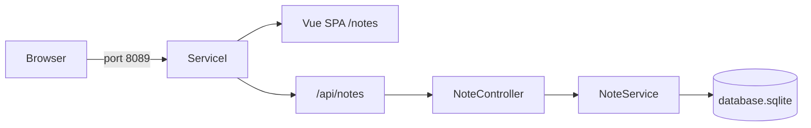
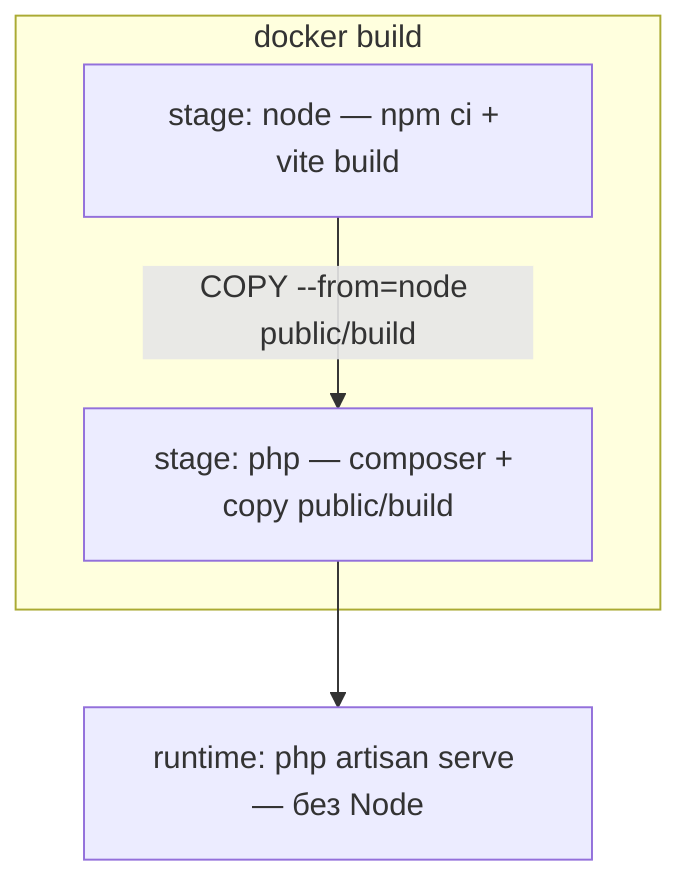

# service-i — Notes CRUD

Laravel 13 + Vue 3 SPA: публичный CRUD заметок на SQLite. Auth нет (`NotePolicy` — allow-all заглушка). Runtime-контейнер — **только PHP**; Node используется исключительно на этапе `docker build` (Vite).

| Документ | Назначение |
|---|---|
| [корневой README](../README.md) | Docker, gateway, общая инфраструктура |
| [service-d/README.md](../service-d/README.md) | Референс Vue SPA за Laravel (`Route::view` + Vite) |

Порт по умолчанию: **8089** (`SERVICE_I_PORT`). Опционально через gateway: `http://notes.localhost:8080`.

---

## Быстрый старт (канон — 2 команды)

Из корня репозитория:

```bash
cp service-i/.env.example service-i/.env
docker compose up -d --build service-i
```

Entrypoint сам: storage → `composer` при отсутствии `vendor` → `key:generate` → SQLite-файл → `migrate --force` → `db:seed --force` → `artisan serve`.

| Что | URL |
|---|---|
| UI (список) | [http://localhost:8089/notes](http://localhost:8089/notes) |
| API | [http://localhost:8089/api/notes](http://localhost:8089/api/notes) |
| Gateway (опционально) | [http://notes.localhost:8080](http://notes.localhost:8080) — запись `127.0.0.1 notes.localhost` в `/etc/hosts` |

---

## Стек

| Компонент | Значение |
|---|---|
| PHP / Laravel | 8.4 / ^13 |
| Frontend | Vue 3 SPA (vue-router, Pinia, Tailwind), не Inertia/Nuxt |
| БД | SQLite (`database/database.sqlite` в контейнере) |
| Тесты | PHPUnit, SQLite `:memory:` |
| Порт (host) | `8089` → `8000` |

---

## Архитектура





Слои Notes по ТЗ: Eloquent в `NoteService` (без Repository), без Sanctum. `NoteController` → `NoteService` → `Note` / `NoteResource`.

---

## API

Публичные маршруты в `routes/api.php` (без auth):

| Метод | Путь | Поведение |
|---|---|---|
| `GET` | `/api/notes` | Заглушка: `Note::all()` без Resource/фильтров/пагинации |
| `POST` | `/api/notes` | Создание (`StoreNoteRequest`) |
| `GET` | `/api/notes/{note}` | Одна заметка (`NoteResource`) |
| `PUT`/`PATCH` | `/api/notes/{note}` | Обновление (`UpdateNoteRequest`) |
| `DELETE` | `/api/notes/{note}` | Удаление |

Валидация:

- **Store:** `title` required\|string\|max:255; `content` nullable\|string; `tags` nullable\|array; `tags.*` string\|max:50; `archived` sometimes\|boolean.
- **Update:** те же поля, все `sometimes`.

`NoteResource` отдаёт: `id`, `title`, `content`, `tags`, `archived`, timestamps. Поле `meta` (legacy) **не** отдаётся.

---

## Frontend (Vue 3 SPA)

Отдача через Laravel: catch-all в `web.php` → blade + собранный Vite-bundle (`public/build`).

| Путь | Страница |
|---|---|
| `/` | редирект на `/notes` |
| `/notes` | список (`pages/Notes/Index.vue`) |
| `/notes/new` | создание |
| `/notes/:id/edit` | редактирование |

Компонент `NoteCard.vue`: title, excerpt, tags, удаление. Клиент: `api/notes.js` + Pinia `stores/notes.js` (query-параметры намеренно не поддержаны).

### Разработка UI вне Docker

В runtime-контейнере **нет** Node/Vite HMR. Для правок фронта на хосте:

```bash
cd service-i
npm ci
npm run build   # или npm run dev — только на хосте
```

Канон старта сервиса остаётся двумя docker-командами выше (ассеты уже в образе после `--build`).

---

## Тесты

Только внутри контейнера `service-i` (сервис **не** в CI монорепо):

```bash
docker compose exec service-i php artisan test
```

- `tests/Feature/NoteCrudTest` — CRUD + валидация `title`
- `tests/Unit/NoteServiceTest` — create/update/delete
- incomplete-заготовка на будущие фильтры `GET /api/notes` (`markTestIncomplete`) — сьют остаётся зелёным

---

## Конфиг

Ключевые переменные в `.env.example`:

```env
DB_CONNECTION=sqlite
DB_DATABASE=/var/www/html/database/database.sqlite
CACHE_STORE=file
APP_URL=http://localhost:8089
```

Без MySQL/Redis. Volumes в compose монтируют PHP-код; пустой `node_modules` не монтируется, порт Vite не публикуется.

---

## Вне скоупа (намеренно)

- Фильтры, поиск, сортировка, пагинация, sync query ↔ Pinia
- Sanctum / users / ownership
- Repository / Contracts как в service-c
- Node/Vite HMR в runtime-контейнере
- Job/шаги CI для `service-i`
